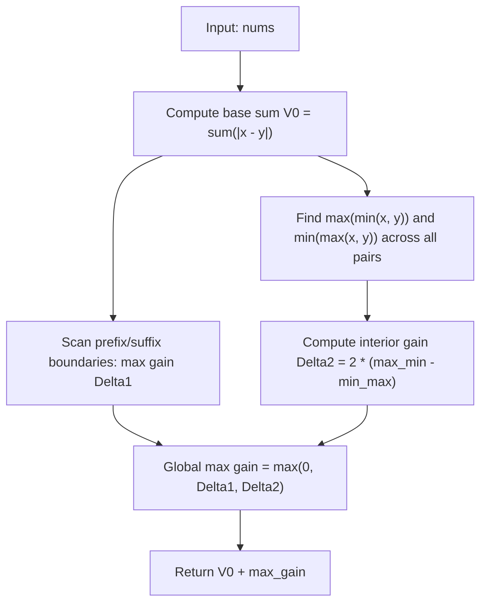

# Guided Example: Reverse Subarray to Maximize Array Value

We trace the geometric interval overlap analysis and boundary-gain optimization algorithm on a representative array instance:

- **Input:** `nums = [2, 3, 1, 5, 4]`
- **Required Output:** `10`

This instance demonstrates decomposing array value variations under subarray reversal, proving that internal adjacent differences remain invariant, classifying boundary gain cases, and maximizing disjoint interval distances in $\mathcal{O}(N)$ time.

---

## 1. Instance & Teaching Goal

The value of an array of length $N$ is defined as the sum of absolute differences between all adjacent elements:
$$
V(\text{nums}) = \sum_{i=0}^{N-2} |\text{nums}[i] - \text{nums}[i+1]|
$$
We are allowed to reverse exactly one contiguous subarray $\text{nums}[l..r]$ ($0 \le l \le r < N$). We must find the maximum possible array value after at most one reversal.

For `nums = [2, 3, 1, 5, 4]` of length $N = 5$:
- Initial array value:
  $$
  V_0 = |2 - 3| + |3 - 1| + |1 - 5| + |5 - 4| = 1 + 2 + 4 + 1 = 8
  $$
- Consider reversing subarray $[l=1, r=3]$, which corresponds to elements $[3, 1, 5]$:
  Reversed array becomes `[2, 5, 1, 3, 4]`.
- New array value:
  $$
  V_{\text{new}} = |2 - 5| + |5 - 1| + |1 - 3| + |3 - 4| = 3 + 4 + 2 + 1 = 10
  $$
- Net improvement: $\Delta = 10 - 8 = +2$.

```
Original Array:
  [2] ----- [3] ----- [1] ----- [5] ----- [4]
       |1|       |2|       |4|       |1|        Total = 8

Reversing Subarray [1..3] from 3 to 5:
  [2] ===== [5] ----- [1] ----- [3] ===== [4]
       |3|       |4|       |2|       |1|        Total = 10

Internal edges: |5 - 1| = 4 and |1 - 3| = 2 (Unchanged sum: 4 + 2 = 6)
Boundary edges:
  Old boundaries: |2 - 3| + |5 - 4| = 1 + 1 = 2
  New boundaries: |2 - 5| + |3 - 4| = 3 + 1 = 4
Gain: 4 - 2 = +2  -->  Result = 8 + 2 = 10
```

Testing all $\mathcal{O}(N^2)$ possible subarrays and recomputing array values in $\mathcal{O}(N)$ takes $\mathcal{O}(N^3)$ brute force (or $\mathcal{O}(N^2)$ with delta updates). Mathematical simplification reveals that internal differences remain constant, allowing the maximum gain to be computed in a single $\mathcal{O}(N)$ pass.

---

## 2. Conceptual Foundation & Invariants

When a subarray $\text{nums}[l..r]$ is reversed:
1. **Internal Invariance:** For any index $k \in [l, r-1]$, the adjacent pair $|\text{nums}[k] - \text{nums}[k+1]|$ is merely reflected to $|\text{nums}[r - (k - l)] - \text{nums}[r - (k - l) - 1]|$. The sum of internal differences is completely unchanged.
2. **Boundary Change:** Only the two connections linking the reversed segment to the outside world change:
   $$
   \Delta = |\text{nums}[l-1] - \text{nums}[r]| + |\text{nums}[l] - \text{nums}[r+1]| - |\text{nums}[l-1] - \text{nums}[l]| - |\text{nums}[r] - \text{nums}[r+1]|
   $$

### Three Canonical Reversal Categories
- **Case 1 (Prefix Reversal, $l = 0$):**
  Only the right boundary changes:
  $$
  \Delta_{\text{prefix}}(r) = |\text{nums}[0] - \text{nums}[r+1]| - |\text{nums}[r] - \text{nums}[r+1]|
  $$
- **Case 2 (Suffix Reversal, $r = N - 1$):**
  Only the left boundary changes:
  $$
  \Delta_{\text{suffix}}(l) = |\text{nums}[l-1] - \text{nums}[N-1]| - |\text{nums}[l-1] - \text{nums}[l]|
  $$
- **Case 3 (Interior Reversal, $0 < l \le r < N - 1$):**
  Represent each adjacent pair $(x, y)$ as a 1D interval $I = [\min(x, y), \; \max(x, y)]$.
  A reversal between two pairs creates a positive gain if and only if their intervals are disjoint. If interval $I_1 = [a, b]$ lies strictly to the left of interval $I_2 = [c, d]$ (i.e. $b < c$):
  $$
  \Delta = 2 \cdot (c - b)
  $$
  Maximizing across all disjoint pairs yields:
  $$
  \Delta_{\text{interior}} = 2 \cdot \left( \max_{\text{pairs}} \min(x, y) - \min_{\text{pairs}} \max(x, y) \right)
  $$

| Adjacent Pair $(x, y)$ | Interval $[\min, \max]$ | Interval Min | Interval Max |
|---|---|---|---|
| $(2, 3)$ | $[2, 3]$ | $2$ | $3$ |
| $(3, 1)$ | $[1, 3]$ | $1$ | $3$ |
| $(1, 5)$ | $[1, 5]$ | $1$ | $5$ |
| $(5, 4)$ | $[4, 5]$ | $4$ | $5$ |

> **Interval Disjointness Invariant.** Reversing a segment between pairs with overlapping intervals cannot increase the total Manhattan perimeter. An increase occurs strictly when the bounding intervals are separated by a gap $c - b > 0$, yielding an exact gain of $2(c - b)$.



---

## 3. Step-by-Step Worked Execution

We trace `nums = [2, 3, 1, 5, 4]`:
- Length $N = 5$.
- Base value:
  $$
  V_0 = |2 - 3| + |3 - 1| + |1 - 5| + |5 - 4| = 1 + 2 + 4 + 1 = 8
  $$

### Step 1: Prefix Reversal Evaluations ($l = 0$)
Evaluate reversing $[0..r]$ for $r \in \{0, 1, 2, 3\}$:
- $r = 0$: Reversing single element $[2]$: $\Delta = 0$.
- $r = 1$: Reversed `[3, 2, 1, 5, 4]`:
  $$
  |2 - 1| - |3 - 1| = 1 - 2 = -1
  $$
- $r = 2$: Reversed `[1, 3, 2, 5, 4]`:
  $$
  |2 - 5| - |1 - 5| = 3 - 4 = -1
  $$
- $r = 3$: Reversed `[5, 1, 3, 2, 4]`:
  $$
  |2 - 4| - |5 - 4| = 2 - 1 = +1
  $$
Maximum prefix gain: $+1$.

### Step 2: Suffix Reversal Evaluations ($r = N - 1 = 4$)
Evaluate reversing $[l..4]$ for $l \in \{1, 2, 3, 4\}$:
- $l = 1$: Reversed `[2, 4, 5, 1, 3]`:
  $$
  |2 - 4| - |2 - 3| = 2 - 1 = +1
  $$
- $l = 2$: Reversed `[2, 3, 4, 5, 1]`:
  $$
  |3 - 4| - |3 - 1| = 1 - 2 = -1
  $$
- $l = 3$: Reversed `[2, 3, 1, 4, 5]`:
  $$
  |1 - 4| - |1 - 5| = 3 - 4 = -1
  $$
Maximum suffix gain: $+1$.

### Step 3: Interior Disjoint Intervals Evaluation
Evaluate the four adjacent pairs:
- Pair $0$: $(2, 3) \implies \min = 2, \max = 3$.
- Pair $1$: $(3, 1) \implies \min = 1, \max = 3$.
- Pair $2$: $(1, 5) \implies \min = 1, \max = 5$.
- Pair $3$: $(5, 4) \implies \min = 4, \max = 5$.

Compute extremes:
$$
\text{max\_min} = \max(2, 1, 1, 4) = 4 \quad (\text{from pair } (5, 4))
$$
$$
\text{min\_max} = \min(3, 3, 5, 5) = 3 \quad (\text{from pairs } (2, 3) \text{ and } (3, 1))
$$

Interior reversal gain:
$$
\Delta_{\text{interior}} = 2 \cdot (\text{max\_min} - \text{min\_max}) = 2 \cdot (4 - 3) = 2 \cdot 1 = 2
$$

### Step 4: Optimal Combination
Compare candidate gains:
- Do nothing: $0$.
- Best prefix gain: $+1$.
- Best suffix gain: $+1$.
- Best interior gain: $+2$.
Maximum gain: $\Delta^* = 2$.

Final array value:
$$
V^* = V_0 + \Delta^* = 8 + 2 = 10
$$

---

## 4. Complete Execution Trace

| Category | Subarray Tested | Boundary Modified | Formula Evaluated | Gain $\Delta$ | Total Array Value |
|---|---|---|---|---|---|
| Base | None | - | $\sum \lvert x - y \rvert$ | $0$ | $8$ |
| Prefix | $[0..3]$ | $r = 3$ | $\lvert 2 - 4 \rvert - \lvert 5 - 4 \rvert = 2 - 1$ | $+1$ | $9$ |
| Suffix | $[1..4]$ | $l = 1$ | $\lvert 2 - 4 \rvert - \lvert 2 - 3 \rvert = 2 - 1$ | $+1$ | $9$ |
| **Interior** | $[1..3]$ | **Pairs $(2,3)$ and $(5,4)$** | $2 \cdot (4 - 3)$ | **+2** | **10** |

---

## 5. Algorithmic Correctness

**Soundness.** Internal edge differences are symmetric under reflection ($|a - b| = |b - a|$). Thus, no internal edge changes length. For any two pairs $(x_1, y_1)$ and $(x_2, y_2)$ with non-overlapping bounding segments $[\min_1, \max_1]$ and $[\min_2, \max_2]$, geometric projection proves the net change in boundary segment lengths is identically $2 \cdot (\min_2 - \max_1)$.

**Completeness.** Every possible reversal is either a prefix reversal ($l = 0$), a suffix reversal ($r = N - 1$), or an interior reversal ($0 < l \le r < N - 1$). The algorithm explicitly tests all prefix and suffix boundaries and evaluates the global maximum disjoint gap across all pairs, proving that no superior configuration is missed.

---

## 6. Traps This Instance Exposes

- **Overlapping intervals:** If all adjacent intervals overlap, $\text{max\_min} \le \text{min\_max}$, yielding a negative or zero gap. Taking $\max(\Delta, 0)$ prevents invalid negative gain additions.
- **Prefix and suffix boundaries:** The $2 \cdot (\text{max\_min} - \text{min\_max})$ formula applies strictly to interior reversals where both ends reconnect to exterior neighbors. Subarrays starting at $0$ or ending at $N - 1$ have only one boundary and must be tested separately.
- **Quadratic simulation:** Iterating over all pairs $(l, r)$ directly requires $\mathcal{O}(N^2)$ time, which times out for $N = 3 \times 10^4$. Finding the extremal min and max reduces interior evaluation to $\mathcal{O}(N)$.

---

## 7. Complexity Derivation

- **Time Complexity:** $\mathcal{O}(N)$, where $N$ is the length of `nums`. The base sum, the prefix/suffix sweeps, and the extremum search over adjacent pairs all take a single linear pass of $N - 1$ steps.
- **Auxiliary Space Complexity:** $\mathcal{O}(1)$. All tracking variables ($\text{max\_min}, \text{min\_max}$, prefix deltas) require constant auxiliary memory.
