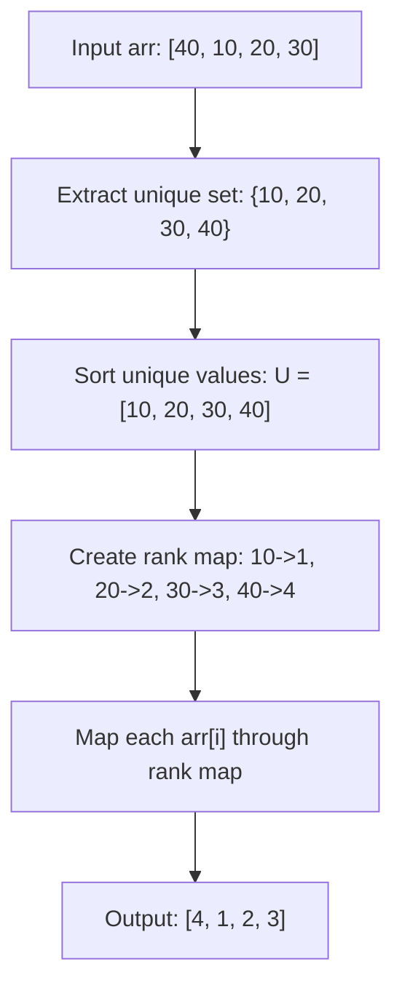

# Guided Example: Rank Transform of an Array

We trace the coordinate compression and dense rank assignment algorithm on a representative integer array containing both distinct and duplicate values:

- **Input:** `arr = [40, 10, 20, 30]`
- **Required Output:** `[4, 1, 2, 3]`

This instance demonstrates coordinate compression, deduplicating unique values, sorting the unique set to establish dense rank order, and mapping original array elements to their 1-indexed ranks in linearithmic time.

---

## 1. Instance & Teaching Goal

Given an integer array `arr`, we must replace each element with its dense rank. The rank rules state:
1. Rank is a positive integer starting at $1$.
2. The smaller the element, the smaller its rank.
3. If two elements are equal, they must share the identical rank.
4. Ranks must be compact (dense), meaning no integer rank values are skipped.

For `arr = [40, 10, 20, 30]` of length $N = 4$:
- Distinct values present: $\{10, 20, 30, 40\}$.
- Ascending sorted unique order:
  - $10 \implies \text{Rank } 1$
  - $20 \implies \text{Rank } 2$
  - $30 \implies \text{Rank } 3$
  - $40 \implies \text{Rank } 4$
- Substituting ranks back into the original positions:
  - $\text{arr}[0] = 40 \implies 4$
  - $\text{arr}[1] = 10 \implies 1$
  - $\text{arr}[2] = 20 \implies 2$
  - $\text{arr}[3] = 30 \implies 3$
- Output: `[4, 1, 2, 3]`.

```
Original Array:
Index:         0      1      2      3
Value:       [40]   [10]   [20]   [30]

Unique Sorted Values:
Position:      1      2      3      4
Value:        10     20     30     40

Rank Replacement:
arr[0] = 40  --> Rank 4
arr[1] = 10  --> Rank 1
arr[2] = 20  --> Rank 2
arr[3] = 30  --> Rank 3

Transformed Array: [4, 1, 2, 3]
```

Comparing every element against all others takes $\mathcal{O}(N^2)$ time. Deduplicating and sorting unique keys establishes an $\mathcal{O}(N \log N)$ coordinate compression mapping, followed by an $\mathcal{O}(1)$ hash map lookup or $\mathcal{O}(\log U)$ binary search per element.

---

## 2. Conceptual Foundation & Invariants

Let $U = \text{sorted}(\text{unique}(\text{arr}))$ be the strictly increasing sequence of unique values in `arr`:
$$
U = [u_1, u_2, \dots, u_K] \quad \text{where } u_1 < u_2 < \dots < u_K \text{ and } K \le N
$$

### Rank Mapping Function
The rank of any value $x \in \text{arr}$ is defined as its 1-based index in $U$:
$$
\text{rank}(x) = 1 + |\{u \in U \mid u < x\}|
$$
Because $U$ contains no duplicates and is strictly sorted:
- The minimum element $u_1$ always maps to rank $1$.
- Any element $u_k$ is assigned rank $k$.
- Duplicates in `arr` naturally receive the identical rank because they map to the same unique element in $U$.

| Array Element $x$ | Position in Sorted Unique Array $U$ | Assigned Dense Rank | Justification |
|---|---|---|---|
| $10$ | Index $0$ | $1$ | Smallest element |
| $20$ | Index $1$ | $2$ | Second smallest |
| $30$ | Index $2$ | $3$ | Third smallest |
| $40$ | Index $3$ | $4$ | Largest element |

> **Dense Order Invariant.** The assigned ranks span the contiguous integer range $[1, K]$ without gaps. For any pair of elements $x_a, x_b \in \text{arr}$, $\text{rank}(x_a) < \text{rank}(x_b) \iff x_a < x_b$, and $\text{rank}(x_a) == \text{rank}(x_b) \iff x_a == x_b$.



---

## 3. Step-by-Step Worked Execution

We trace `arr = [40, 10, 20, 30]` with $N = 4$:

### Step 1: Extract and Sort Unique Values
- Unique elements in `arr`: $\{10, 20, 30, 40\}$.
- Sort into ascending sequence:
  $$
  U = [10, 20, 30, 40]
  $$
- Cardinality of unique set: $K = 4$.

### Step 2: Construct the Rank Lookup Table
Assign 1-based ranks based on sorted position:
- $U[0] = 10 \implies \text{rank}(10) = 1$.
- $U[1] = 20 \implies \text{rank}(20) = 2$.
- $U[2] = 30 \implies \text{rank}(30) = 3$.
- $U[3] = 40 \implies \text{rank}(40) = 4$.

### Step 3: Transform Original Array Elements
Traverse the original array from left to right:
- Index $0$: $\text{arr}[0] = 40 \implies \text{rank}(40) = 4$.
- Index $1$: $\text{arr}[1] = 10 \implies \text{rank}(10) = 1$.
- Index $2$: $\text{arr}[2] = 20 \implies \text{rank}(20) = 2$.
- Index $3$: $\text{arr}[3] = 30 \implies \text{rank}(30) = 3$.

Result array: `[4, 1, 2, 3]`.

---

## 4. Complete Execution Trace

| Element Index $i$ | Original Value $\text{arr}[i]$ | Sorted Index in $U$ | Evaluated Rank $\text{rank}(x)$ | Transformed Result Prefix |
|---|---|---|---|---|
| $0$ | $40$ | $3$ | $4$ | `[4]` |
| $1$ | $10$ | $0$ | $1$ | `[4, 1]` |
| $2$ | $20$ | $1$ | $2$ | `[4, 1, 2]` |
| $3$ | $30$ | $2$ | $3$ | `[4, 1, 2, 3]` |

---

## 5. Algorithmic Correctness

**Soundness.** Sorting unique elements guarantees that if $u_a < u_b$, then index($u_a$) < index($u_b$). Assigning $1 + \text{index}$ produces strictly increasing positive integers starting at $1$. Because elements with identical values map to the same key in the rank lookup, duplicates share identical ranks, satisfying all problem constraints.

**Completeness.** Every element in `arr` is guaranteed to exist in the set of unique values. The transformation is evaluated for every index $i \in [0, N-1]$, producing an output array of identical length $N$.

---

## 6. Traps This Instance Exposes

- **Duplicate rank inflation:** Sorting the array without deduplication would assign ranks based on total element count. For example, in `[100, 100, 100]`, non-deduplicated ranks would yield `[1, 2, 3]`, which violates the rule that equal numbers must have equal ranks (`[1, 1, 1]`).
- **Dense rank vs competition rank:** Competition ranking skips ranks after ties (e.g. 1st, 2nd, 2nd, 4th). The problem specifies *dense* ranking where ranks must be as small as possible without skipping integers (1st, 2nd, 2nd, 3rd).
- **Zero-indexed vs one-indexed:** The problem specifies ranks begin at $1$, not $0$. Forgetting to add $+1$ to 0-based array indices produces an off-by-one rank error.

---

## 7. Complexity Derivation

- **Time Complexity:** $\mathcal{O}(N \log K)$, where $N$ is the length of `arr` and $K \le N$ is the count of distinct values. Deduplicating and sorting $K$ values takes $\mathcal{O}(K \log K)$ time. Querying the rank for each of the $N$ elements via a hash table takes $\mathcal{O}(1)$ time (or $\mathcal{O}(\log K)$ via binary search), yielding total $\mathcal{O}(N \log K)$ time.
- **Auxiliary Space Complexity:** $\mathcal{O}(K)$ to store the sorted unique elements and the rank mapping table.
