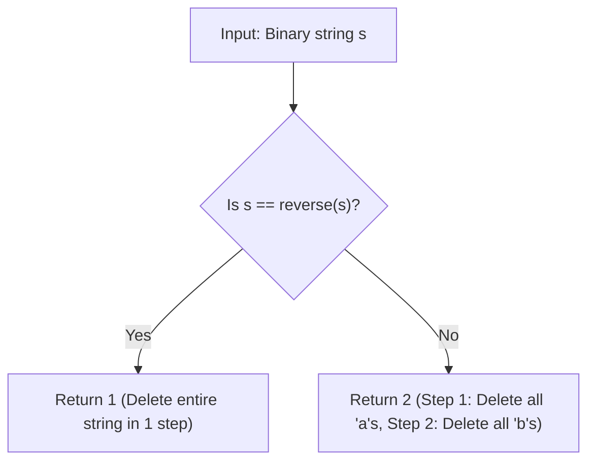

# Guided Example: Remove Palindromic Subsequences

We trace the subsequence partition theorem and symmetry testing algorithm on a representative two-character string:

- **Input:** `s = "abb"`
- **Required Output:** `2`

This instance demonstrates the crucial distinction between contiguous substrings and non-contiguous subsequences, proves that any binary string can be emptied in at most two steps, and verifies palindromic symmetry in linear time.

---

## 1. Instance & Teaching Goal

We are given a string `s` consisting *only* of letters `'a'` and `'b'`. In a single operation, we may choose any *palindromic subsequence* from `s` and delete it. We must find the minimum number of steps to reduce `s` to the empty string.

For `s = "abb"`:
- The string `s = "abb"` is not a palindrome because its reverse is `"bba"` $\ne \text{"abb"}$. Therefore, it cannot be deleted entirely in $1$ step.
- In step 1, select all occurrences of character `'a'` as a subsequence:
  - Selected subsequence: `"a"` (at index $0$).
  - Any single-character or monochromatic string is trivially a palindrome.
  - Delete `"a"`, leaving remaining string `"bb"`.
- In step 2, select the remaining characters:
  - Selected subsequence: `"bb"` (at indices $1$ and $2$).
  - The string `"bb"` consists solely of `'b'` and is a palindrome.
  - Delete `"bb"`, leaving the empty string `""`.
- Total steps: $2$.

```
String:      a   b   b
Reverse:     b   b   a  (s != reverse, so >= 2 steps needed)

Subsequence Removal Strategy:
  Step 1: Extract all 'a' characters as a subsequence --> "a" (Palindrome)
          Remaining string: "bb"
  Step 2: Extract all 'b' characters as a subsequence --> "bb" (Palindrome)
          Remaining string: ""

Total Operations: 2 (Upper bound for any non-palindromic string over {'a', 'b'})
```

If the problem asked for *substrings* (which must be contiguous), this would require complex interval dynamic programming. Because we are allowed to remove *subsequences*, the alphabet constraint $\Sigma = \{\text{'a'}, \text{'b'}\}$ guarantees the answer is strictly either $1$ (if $s$ is already a palindrome) or $2$ (if $s$ is not).

---

## 2. Conceptual Foundation & Invariants

Let $s$ be a non-empty string over the binary alphabet $\Sigma = \{\text{'a'}, \text{'b'}\}$.

### The Two-Step Subsequence Theorem
1. **Monochromatic Subsequences are Palindromes:** Any string composed of identical characters (e.g. $\text{'a'}^k$ or $\text{'b'}^m$) is symmetric under reflection and hence is always a valid palindrome.
2. **Binary Partitioning:** Any string over $\{\text{'a'}, \text{'b'}\}$ can be partitioned into:
   - Subsequence $S_a$: all positions where $s[i] == \text{'a'}$.
   - Subsequence $S_b$: all positions where $s[i] == \text{'b'}$.
   Because $S_a$ and $S_b$ are both monochromatic palindromes, deleting $S_a$ in step 1 and $S_b$ in step 2 completely consumes $s$ in at most $2$ steps.

### Decision Rule
$$
\text{minSteps}(s) = \begin{cases}
1 & \text{if } s = s^{\text{rev}} \text{ (the entire string is a palindrome)} \\
2 & \text{if } s \ne s^{\text{rev}} \text{ (not a palindrome)}
\end{cases}
$$

| Condition | String Symmetry | Minimal Palindromic Deletions | Example |
|---|---|---|---|
| $s = s^{\text{rev}}$ | Symmetric under full reversal | $1$ (Remove entire string $s$) | `"ababa"` $\implies 1$ |
| $s \ne s^{\text{rev}}$ | Asymmetric | $2$ (Remove all `'a'`s, then all `'b'`s) | `"abb"` $\implies 2$ |

> **Subsequence Cardinality Invariant.** The minimum number of palindromic subsequence removals for any non-empty binary string is bounded by $\min(1 + [s \ne s^{\text{rev}}], \; 2)$. The answer is never greater than $2$.



---

## 3. Step-by-Step Worked Execution

We trace the evaluation on `s = "abb"`:

### Step 1: Palindromic Test
- Initialize two pointers: $left = 0$, $right = \text{len}(s) - 1 = 2$.
- Compare $s[left]$ and $s[right]$:
  $$
  s[0] = \text{'a'}, \quad s[2] = \text{'b'}
  $$
- Since $s[0] \ne s[2]$, character mismatch occurs immediately.
- Conclusion: The string $s$ is not a palindrome.
- Therefore, the answer cannot be $1$.

### Step 2: Constructive 2-Step Decomposition
- Because $s$ is non-palindromic and composed only of `'a'` and `'b'`:
  - **Operation 1:** Gather all indices where $s[i] == \text{'a'}$: $\{0\}$.
    Subsequence: `"a"`.
    Symmetry check: `"a"` is a palindrome.
    Remove subsequence: Remaining characters at indices $\{1, 2\}$ form `"bb"`.
  - **Operation 2:** Gather all indices where $s[i] == \text{'b'}$: $\{1, 2\}$.
    Subsequence: `"bb"`.
    Symmetry check: `"bb"` is a palindrome.
    Remove subsequence: String becomes empty.
- Total operations required: $2$.

---

## 4. Complete Execution Trace

| Step Order | Operation | Subsequence Selected | Symmetry Verification | Resulting String | Operations Count |
|---|---|---|---|---|---|
| 0 | Initial State | - | $s = \text{"abb"} \ne \text{"bba"}$ | `"abb"` | $0$ |
| 1 | Extract all `'a'`s | `"a"` (index 0) | Single char $\implies$ Palindrome | `"bb"` | $1$ |
| 2 | Extract all `'b'`s | `"bb"` (indices 1, 2) | All identical $\implies$ Palindrome | `""` | **2** |

---

## 5. Algorithmic Correctness

**Soundness.** Every removed subsequence must be a palindrome. If $s$ is already a palindrome, removing $s$ is a single legal step. If $s$ is not a palindrome, $s$ cannot be removed in $1$ step, so the lower bound is at least $2$. Because the set of all `'a'` characters and the set of all `'b'` characters are both monochromatic palindromes that partition the entire string, $2$ operations are always sufficient.

**Completeness.** Two-pointer symmetry checking tests all character pairs $s[i]$ and $s[N - 1 - i]$ in $\mathcal{O}(N)$ time. Because the decision space is strictly $\{1, 2\}$, checking whether $s$ is a palindrome completely decides the optimal answer.

---

## 6. Traps This Instance Exposes

- **Confusing Substring with Subsequence:** If the problem required contiguous *substrings*, `"abb"` would require removing `"bb"` then `"a"` (2 steps) or `"a"` then `"bb"` (2 steps), but more complex strings like `"ababbb"` would require many more steps. Because *subsequences* can skip non-adjacent characters, the answer is capped at $2$.
- **More than two characters:** If the alphabet contained a third letter `'c'`, the upper bound would be $3$. Here, the problem guarantees characters are restricted strictly to `'a'` and `'b'`.
- **Empty string input:** Problem constraints guarantee $1 \le \text{len}(s) \le 1000$, ensuring the minimum answer is always at least $1$.

---

## 7. Complexity Derivation

- **Time Complexity:** $\mathcal{O}(N)$, where $N$ is the length of string $s$. Verifying whether $s$ is a palindrome takes a single pass of $N / 2$ character comparisons.
- **Auxiliary Space Complexity:** $\mathcal{O}(1)$ when using two pointers in-place (or $\mathcal{O}(N)$ if creating a reversed string copy).
