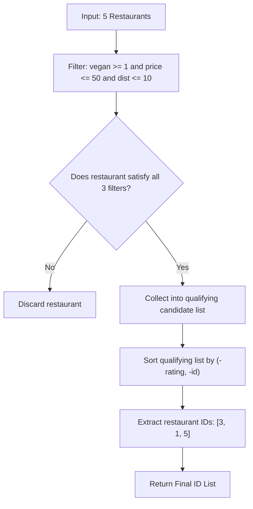

# Guided Example: Filter Restaurants by Vegan-Friendly, Price and Distance

We trace multi-attribute relational filtering and dual-key sorting on a representative restaurant directory:

- **Input:** `restaurants = [[1, 4, 1, 40, 10], [2, 8, 0, 50, 5], [3, 8, 1, 30, 4], [4, 10, 0, 10, 3], [5, 1, 1, 15, 1]]`, `veganFriendly = 1`, `maxPrice = 50`, `maxDistance = 10`
- **Required Output:** `[3, 1, 5]`

This instance demonstrates boolean and numeric threshold filtering, handling conditional constraints ($vegan \ge veganFriendly$), and sorting candidates by descending rating with descending identifier tie-breaking.

---

## 1. Instance & Teaching Goal

Each entry in the `restaurants` dataset consists of $5$ attributes:
$$
[\text{id}, \; \text{rating}, \; \text{veganFriendly}, \; \text{price}, \; \text{distance}]
$$
We are given query criteria:
- `veganFriendly`: if $1$, only vegan-friendly restaurants are permitted; if $0$, all restaurants are permitted.
- `maxPrice`: maximum acceptable price.
- `maxDistance`: maximum acceptable distance.

We must return the list of restaurant IDs that satisfy all three constraints, sorted by:
1. `rating` descending.
2. In case of tied ratings, `id` descending.

```
Input Restaurants:
  R1: [id: 1, rating:  4, vegan: 1, price: 40, dist: 10]
  R2: [id: 2, rating:  8, vegan: 0, price: 50, dist:  5]
  R3: [id: 3, rating:  8, vegan: 1, price: 30, dist:  4]
  R4: [id: 4, rating: 10, vegan: 0, price: 10, dist:  3]
  R5: [id: 5, rating:  1, vegan: 1, price: 15, dist:  1]

Filter Check (veganFriendly=1, maxPrice=50, maxDistance=10):
  - R1: vegan=1 (OK), price=40<=50 (OK), dist=10<=10 (OK)  --> Qualifies
  - R2: vegan=0 (FAILS: veganFriendly=1 required)          --> Disqualified
  - R3: vegan=1 (OK), price=30<=50 (OK), dist=4<=10 (OK)   --> Qualifies
  - R4: vegan=0 (FAILS: veganFriendly=1 required)          --> Disqualified
  - R5: vegan=1 (OK), price=15<=50 (OK), dist=1<=10 (OK)   --> Qualifies

Qualifying Set: { R3 (rating 8), R1 (rating 4), R5 (rating 1) }
Sorted Order by Rating DESC, ID DESC: [3, 1, 5]
```

Filtering first and sorting only the surviving records avoids sorting disqualified elements, running in $\mathcal{O}(N + K \log K)$ time where $K \le N$ is the number of qualifying restaurants.

---

## 2. Conceptual Foundation & Invariants

Let $r = (\text{id}, \text{rating}, \text{vegan}, \text{price}, \text{dist})$ be a restaurant record.

### Predicate Filtering Condition
A restaurant $r$ is accepted if and only if:
$$
\text{Valid}(r) \iff (\text{vegan} \ge \text{veganFriendly}) \land (\text{price} \le \text{maxPrice}) \land (\text{dist} \le \text{maxDistance})
$$
- When $\text{veganFriendly} = 1$, the condition $\text{vegan} \ge 1$ forces $\text{vegan} = 1$.
- When $\text{veganFriendly} = 0$, the condition $\text{vegan} \ge 0$ is trivially satisfied for all binary values $\text{vegan} \in \{0, 1\}$.

### Dual-Key Comparison
For any two valid restaurants $r_a$ and $r_b$, $r_a$ precedes $r_b$ ($r_a \succ r_b$) if:
$$
\text{rating}_a > \text{rating}_b \quad \lor \quad (\text{rating}_a == \text{rating}_b \land \text{id}_a > \text{id}_b)
$$

| Restaurant | Attributes $[id, \text{rate}, \text{veg}, \text{price}, \text{dist}]$ | Vegan Check ($\ge 1$) | Price Check ($\le 50$) | Distance Check ($\le 10$) | Overall Status |
|---|---|---|---|---|---|
| R1 | $[1, 4, 1, 40, 10]$ | Pass ($1 \ge 1$) | Pass ($40 \le 50$) | Pass ($10 \le 10$) | **Accepted** |
| R2 | $[2, 8, 0, 50, 5]$ | Fail ($0 < 1$) | Pass ($50 \le 50$) | Pass ($5 \le 10$) | Disqualified |
| R3 | $[3, 8, 1, 30, 4]$ | Pass ($1 \ge 1$) | Pass ($30 \le 50$) | Pass ($4 \le 10$) | **Accepted** |
| R4 | $[4, 10, 0, 10, 3]$ | Fail ($0 < 1$) | Pass ($10 \le 50$) | Pass ($3 \le 10$) | Disqualified |
| R5 | $[5, 1, 1, 15, 1]$ | Pass ($1 \ge 1$) | Pass ($15 \le 50$) | Pass ($1 \le 10$) | **Accepted** |

> **Selection and Total Order Invariant.** The selection predicate partitions the dataset into feasible and infeasible subsets. Because IDs are unique, the comparator $(-\text{rating}, -\text{id})$ forms a strict, unambiguous total order over all qualifying entities.



---

## 3. Step-by-Step Worked Execution

We trace the criteria evaluation for all $5$ restaurants:

### Step 1: Evaluate Restaurant 1 ($[1, 4, 1, 40, 10]$)
- Vegan check: $\text{vegan} = 1 \ge 1$ (Pass).
- Price check: $\text{price} = 40 \le 50$ (Pass).
- Distance check: $\text{dist} = 10 \le 10$ (Pass).
- Retained candidate: $(\text{id} = 1, \text{rating} = 4)$.

### Step 2: Evaluate Restaurant 2 ($[2, 8, 0, 50, 5]$)
- Vegan check: $\text{vegan} = 0 < 1$ (Fail).
- Disqualified immediately (non-vegan).

### Step 3: Evaluate Restaurant 3 ($[3, 8, 1, 30, 4]$)
- Vegan check: $\text{vegan} = 1 \ge 1$ (Pass).
- Price check: $\text{price} = 30 \le 50$ (Pass).
- Distance check: $\text{dist} = 4 \le 10$ (Pass).
- Retained candidate: $(\text{id} = 3, \text{rating} = 8)$.

### Step 4: Evaluate Restaurant 4 ($[4, 10, 0, 10, 3]$)
- Vegan check: $\text{vegan} = 0 < 1$ (Fail).
- Disqualified immediately (non-vegan, despite highest rating of $10$).

### Step 5: Evaluate Restaurant 5 ($[5, 1, 1, 15, 1]$)
- Vegan check: $\text{vegan} = 1 \ge 1$ (Pass).
- Price check: $\text{price} = 15 \le 50$ (Pass).
- Distance check: $\text{dist} = 1 \le 10$ (Pass).
- Retained candidate: $(\text{id} = 5, \text{rating} = 1)$.

### Step 6: Dual-Key Sorting of Candidates
Qualifying set: $\{(\text{id}: 1, \text{rating}: 4), \; (\text{id}: 3, \text{rating}: 8), \; (\text{id}: 5, \text{rating}: 1)\}$.
- Sort by $\text{rating}$ descending:
  - Highest rating: R3 ($\text{rating} = 8$).
  - Middle rating: R1 ($\text{rating} = 4$).
  - Lowest rating: R5 ($\text{rating} = 1$).
- No ties occur among the surviving records.
- Extract IDs: `[3, 1, 5]`.

---

## 4. Complete Execution Trace

| Restaurant ID | Rating | Vegan Friendly? | Price | Distance | Filter Decision | Sort Key $(-\text{rating}, -\text{id})$ | Output Order |
|---|---|---|---|---|---|---|---|
| $3$ | $8$ | $1$ | $30$ | $4$ | Accepted | $(-8, -3)$ | **1st (ID: 3)** |
| $1$ | $4$ | $1$ | $40$ | $10$ | Accepted | $(-4, -1)$ | **2nd (ID: 1)** |
| $5$ | $1$ | $1$ | $15$ | $1$ | Accepted | $(-1, -5)$ | **3rd (ID: 5)** |
| $2$ | $8$ | $0$ | $50$ | $5$ | Rejected ($vegan=0$) | - | Excluded |
| $4$ | $10$ | $0$ | $10$ | $3$ | Rejected ($vegan=0$) | - | Excluded |

---

## 5. Algorithmic Correctness

**Soundness.** Every element in the output list is verified against all three criteria ($\text{vegan} \ge \text{veganFriendly}$, $\text{price} \le \text{maxPrice}$, $\text{dist} \le \text{maxDistance}$). The sorting key enforces descending ratings and descending IDs for tie-breaking, matching the specification.

**Completeness.** Every restaurant in the input list is inspected. Because filter evaluation is decoupled from sorting, no eligible restaurant can be prematurely discarded, and all qualifiers are present in the final ranked result.

---

## 6. Traps This Instance Exposes

- **High rating on disqualified records:** Restaurant 4 has the highest rating ($10$), but fails the vegan filter. High ratings must never bypass boolean or threshold exclusions.
- **Tie-breaking orientation:** In case of tied ratings, the problem specifies *higher* IDs appear first (`-id`). Sorting IDs in ascending order would invert tie resolution.
- **Interpreting `veganFriendly = 0`:** When `veganFriendly = 0`, non-vegan restaurants are allowed, but vegan restaurants are *also* allowed (it is not a restriction against vegan food). The expression $\text{vegan} \ge \text{veganFriendly}$ handles both $0$ and $1$ query settings uniformly.

---

## 7. Complexity Derivation

- **Time Complexity:** $\mathcal{O}(N + K \log K)$, where $N$ is the number of restaurants and $K \le N$ is the number of qualifying restaurants. Inspecting $N$ entries takes $\mathcal{O}(N)$ time. Sorting $K$ filtered elements takes $\mathcal{O}(K \log K)$ time.
- **Auxiliary Space Complexity:** $\mathcal{O}(K)$ to store the filtered list of candidate restaurant tuples before returning their IDs.
