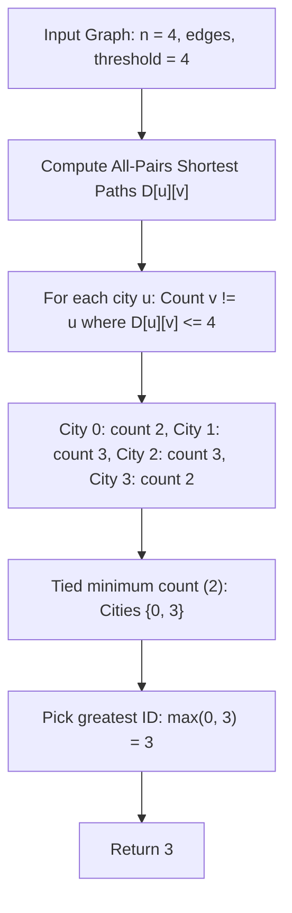

# Guided Example: Find the City With the Smallest Number of Neighbors at a Threshold Distance

We trace the all-pairs shortest path computation and threshold reachability ranking on a representative weighted graph:

- **Input:** $n = 4$, `edges = [[0, 1, 3], [1, 2, 1], [1, 3, 4], [2, 3, 1]]`, `distanceThreshold = 4`
- **Required Output:** `3`

This instance demonstrates computing all-pairs shortest path distances, counting reachable neighbors under a distance budget, and resolving ties by selecting the maximum city identifier.

---

## 1. Instance & Teaching Goal

We are given $n = 4$ cities labeled $0$ through $3$ connected by undirected, positively weighted edges. Given a `distanceThreshold = 4`, a city $v$ is reachable from city $u$ ($u \ne v$) if the shortest path distance $\text{dist}(u, v) \le 4$.
We must return the city that can reach the fewest number of other cities within the threshold distance. If multiple cities tie with the same minimum count, we must return the city with the largest numerical ID.

For $n = 4$ and threshold $4$:
- Edge weights:
  - $(0, 1)$ with weight $3$
  - $(1, 2)$ with weight $1$
  - $(1, 3)$ with weight $4$
  - $(2, 3)$ with weight $1$
- The direct edge $(1, 3)$ has weight $4$, but the indirect path $1 \to 2 \to 3$ has weight $1 + 1 = 2$, showing the importance of computing true shortest paths.

```
Graph Topology:
     (0)
      |  \ (wt 3)
      |   (1) ----- (3)  [direct wt 4]
      |    |        /
      |    |       /
      |   (wt 1)  / (wt 1)
      |    |     /
      +-- (2) --+

Shortest Path Distances from Each City:
  From City 0: to 1 (dist 3), to 2 (dist 4), to 3 (dist 5)  --> {1, 2} reachable (Count: 2)
  From City 1: to 0 (dist 3), to 2 (dist 1), to 3 (dist 2)  --> {0, 2, 3} reachable (Count: 3)
  From City 2: to 0 (dist 4), to 1 (dist 1), to 3 (dist 1)  --> {0, 1, 3} reachable (Count: 3)
  From City 3: to 0 (dist 5), to 1 (dist 2), to 2 (dist 1)  --> {1, 2} reachable (Count: 2)

Minimum reachable count: 2 (Tied between City 0 and City 3)
Tie-breaking rule: Maximize city ID --> max(0, 3) = 3
Result: 3
```

A simple breadth-first search ignores non-uniform edge weights, producing incorrect distances. Using Dijkstra from each vertex or the Floyd-Warshall algorithm evaluates true shortest distances across all city pairs in polynomial time.

---

## 2. Conceptual Foundation & Invariants

Let $D[u][v]$ denote the shortest path distance between city $u$ and city $v$.

### All-Pairs Shortest Path Recurrence (Floyd-Warshall)
Initialize:
$$
D[u][v] = \begin{cases} 0 & \text{if } u = v \\ w & \text{if } (u, v) \in E \text{ with weight } w \\ \infty & \text{otherwise} \end{cases}
$$
For each intermediate vertex $k \in \{0, 1, \dots, n-1\}$:
$$
D[i][j] \leftarrow \min\big(D[i][j], \; D[i][k] + D[k][j]\big)
$$

### Reachability and Selection Criteria
For each city $u \in [0, n-1]$, compute its reachable neighbor count:
$$
C(u) = \sum_{v \ne u} [D[u][v] \le \text{distanceThreshold}]
$$
We select the optimal city $u^*$ that minimizes $C(u)$, breaking ties by maximizing the city ID:
$$
u^* = \operatorname{argmax}_{u} \big(-C(u), \; u\big)
$$

| City $u$ | Shortest Distances $[D[u][0], D[u][1], D[u][2], D[u][3]]$ | Distances $\le 4$ (excluding $u$) | Neighbor Count $C(u)$ |
|---|---|---|---|
| $0$ | $[0, 3, 4, 5]$ | $\{1 \text{ (dist 3)}, 2 \text{ (dist 4)}\}$ | $2$ |
| $1$ | $[3, 0, 1, 2]$ | $\{0 \text{ (dist 3)}, 2 \text{ (dist 1)}, 3 \text{ (dist 2)}\}$ | $3$ |
| $2$ | $[4, 1, 0, 1]$ | $\{0 \text{ (dist 4)}, 1 \text{ (dist 1)}, 3 \text{ (dist 1)}\}$ | $3$ |
| $3$ | $[5, 2, 1, 0]$ | $\{1 \text{ (dist 2)}, 2 \text{ (dist 1)}\}$ | $2$ |

> **Metric Minimization Invariant.** Because edge weights are strictly positive, relaxation over intermediate vertices monotonically converges to true shortest path distances. Iterating cities in reverse order $n-1$ down to $0$ and tracking strictly smaller counts automatically enforces the greatest-ID tie-breaking rule.



---

## 3. Step-by-Step Worked Execution

We trace all-pairs shortest path calculations and reachability filtering:

### Step 1: Distance Matrix Construction
- Path between $0$ and $1$: Direct edge of weight $3 \implies D[0][1] = 3$.
- Path between $1$ and $2$: Direct edge of weight $1 \implies D[1][2] = 1$.
- Path between $2$ and $3$: Direct edge of weight $1 \implies D[2][3] = 1$.
- Path between $1$ and $3$:
  - Direct edge has weight $4$.
  - Indirect path $1 \to 2 \to 3$ has weight $1 + 1 = 2$.
  - Shortest distance: $D[1][3] = \min(4, 2) = 2$.
- Path between $0$ and $2$:
  - Path $0 \to 1 \to 2$ has weight $3 + 1 = 4 \implies D[0][2] = 4$.
- Path between $0$ and $3$:
  - Path $0 \to 1 \to 2 \to 3$ has weight $3 + 1 + 1 = 5 \implies D[0][3] = 5$.

Completed Distance Matrix $D$:
$$
D = \begin{bmatrix}
0 & 3 & 4 & 5 \\
3 & 0 & 1 & 2 \\
4 & 1 & 0 & 1 \\
5 & 2 & 1 & 0
\end{bmatrix}
$$

### Step 2: Threshold Filtering ($\text{threshold} = 4$)
- **City 0:**
  - $D[0][1] = 3 \le 4$ (Yes)
  - $D[0][2] = 4 \le 4$ (Yes)
  - $D[0][3] = 5 > 4$ (No)
  - Reachable neighbors: $\{1, 2\}$. Count: $C(0) = 2$.
- **City 1:**
  - $D[1][0] = 3 \le 4$ (Yes)
  - $D[1][2] = 1 \le 4$ (Yes)
  - $D[1][3] = 2 \le 4$ (Yes)
  - Reachable neighbors: $\{0, 2, 3\}$. Count: $C(1) = 3$.
- **City 2:**
  - $D[2][0] = 4 \le 4$ (Yes)
  - $D[2][1] = 1 \le 4$ (Yes)
  - $D[2][3] = 1 \le 4$ (Yes)
  - Reachable neighbors: $\{0, 1, 3\}$. Count: $C(2) = 3$.
- **City 3:**
  - $D[3][0] = 5 > 4$ (No)
  - $D[3][1] = 2 \le 4$ (Yes)
  - $D[3][2] = 1 \le 4$ (Yes)
  - Reachable neighbors: $\{1, 2\}$. Count: $C(3) = 2$.

### Step 3: Optimal City Selection
- Minimum reachable count is $\min(2, 3, 3, 2) = 2$.
- Cities achieving minimum count: $\{0, 3\}$.
- Tie-breaking: select city with greatest numerical identifier:
  $$
  u^* = \max(0, 3) = 3
  $$

---

## 4. Complete Execution Trace

| City $u$ | Distances to Neighbors | Neighbors Within Budget ($\le 4$) | Reachable Count $C(u)$ | Candidate Status |
|---|---|---|---|---|
| $0$ | $D[0][1]=3, D[0][2]=4, D[0][3]=5$ | $\{1, 2\}$ | $2$ | Tied minimum |
| $1$ | $D[1][0]=3, D[1][2]=1, D[1][3]=2$ | $\{0, 2, 3\}$ | $3$ | Suboptimal |
| $2$ | $D[2][0]=4, D[2][1]=1, D[2][3]=1$ | $\{0, 1, 3\}$ | $3$ | Suboptimal |
| $3$ | $D[3][0]=5, D[3][1]=2, D[3][2]=1$ | $\{1, 2\}$ | $2$ | **Winner: Max ID (3)** |

---

## 5. Algorithmic Correctness

**Soundness.** Floyd-Warshall and Dijkstra correctly compute true shortest path distances on weighted undirected graphs without negative cycles. Applying the distance threshold filter accurately isolates all qualifying neighbors. Comparing neighbor counts and selecting the largest ID when counts match strictly fulfills the problem contract.

**Completeness.** Every vertex $u \in [0, n-1]$ is evaluated as a potential source. Because the search examines all $n$ candidates and strictly updates the best city whenever a strictly smaller count is discovered (or equal count with higher ID), the global optimum is guaranteed.

---

## 6. Traps This Instance Exposes

- **Ignoring multi-hop shortcuts:** The direct edge between $1$ and $3$ has weight $4$, while the two-hop path $1 \to 2 \to 3$ has weight $2$. Using direct edge weights rather than shortest paths miscalculates distance.
- **Counting self-distance:** A city's distance to itself is $0 \le 4$. The problem asks for the number of *other* cities reachable ($v \ne u$). Self-loops must not be tallied.
- **Inverted tie-breaking:** In case of ties, the problem requires returning the city with the *largest* identifier, not the smallest.

---

## 7. Complexity Derivation

- **Time Complexity:** $\mathcal{O}(n^3)$ using Floyd-Warshall, or $\mathcal{O}(n \cdot (E + n \log n))$ running Dijkstra from each of the $n$ vertices. Given $n \le 100$, $n^3 = 10^6$ operations, which executes in a few milliseconds.
- **Auxiliary Space Complexity:** $\mathcal{O}(n^2)$ to store the distance matrix.