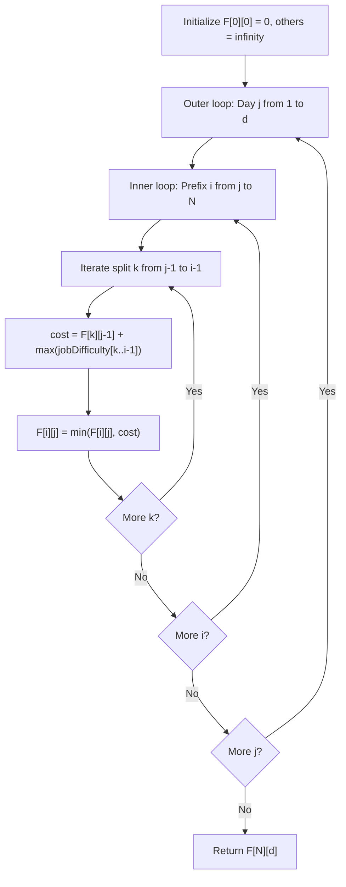

# Guided Example: Minimum Difficulty of a Job Schedule

We trace the dynamic programming partition recurrence minimizing schedule difficulty on a representative sequence of jobs:

- **Input:** `jobDifficulty = [6, 5, 4, 3, 2, 1]`, `d = 2`
- **Required Output:** `7`

This instance demonstrates partitioning an array into $d$ contiguous non-empty daily segments, evaluating daily maximum difficulties, and optimizing prefix partition boundaries using dynamic programming.

---

## 1. Instance & Teaching Goal

We must schedule $N = 6$ jobs over $d = 2$ days subject to:
1. Jobs must be completed in order from left to right.
2. At least one job must be completed each day.
3. The difficulty of each day is the maximum difficulty of the jobs finished on that day:
   $$
   \text{DayDifficulty} = \max_{j \in \text{Day}} \text{jobDifficulty}[j]
   $$
4. The total schedule difficulty is the sum of all daily difficulties.
5. If $N < d$, a valid schedule is impossible, and we must return $-1$.

For `jobDifficulty = [6, 5, 4, 3, 2, 1]` with $d = 2$:
- Because the input array is strictly decreasing, the maximum of any prefix $[0..k]$ is always its first element ($6$).
- The maximum of the second day's jobs $\text{jobDifficulty}[k+1..5]$ is its starting element $\text{jobDifficulty}[k+1]$.
- To minimize the sum $6 + \text{jobDifficulty}[k+1]$, we must choose the split point where $\text{jobDifficulty}[k+1]$ is as small as possible, which occurs at the last element: $k = 4$.
- Day 1: jobs $[6, 5, 4, 3, 2]$ with $\max = 6$.
- Day 2: job $[1]$ with $\max = 1$.
- Total difficulty: $6 + 1 = 7$.

```
Job Sequence:  [ 6,   5,   4,   3,   2,   1 ]
Index:           0    1    2    3    4    5

Candidate 2-Day Partitions:
  Split at 1: [6] | [5, 4, 3, 2, 1]       --> max(6) + max(5) = 6 + 5 = 11
  Split at 2: [6, 5] | [4, 3, 2, 1]       --> max(6) + max(4) = 6 + 4 = 10
  Split at 3: [6, 5, 4] | [3, 2, 1]       --> max(6) + max(3) = 6 + 3 =  9
  Split at 4: [6, 5, 4, 3] | [2, 1]       --> max(6) + max(2) = 6 + 2 =  8
  Split at 5: [6, 5, 4, 3, 2] | [1]       --> max(6) + max(1) = 6 + 1 =  7  (Optimal)

Minimum Schedule Difficulty: 7
```

Testing all $\binom{N-1}{d-1}$ partition points becomes intractable for large $N$ and $d$. Dynamic programming evaluates subproblems in topological order across days and job prefixes in $\mathcal{O}(d \cdot N^2)$ time.

---

## 2. Conceptual Foundation & Invariants

Let $F[i][j]$ denote the minimum total difficulty to schedule the first $i$ jobs ($i \in [1, N]$) across $j$ days ($j \in [1, d]$).

### Dynamic Programming Recurrence
1. **Base Case:**
   $$
   F[0][0] = 0, \quad F[i][j] = \infty \text{ for } i < j
   $$
2. **Transition:**
   To compute $F[i][j]$, the $j$-th day must execute jobs from index $k$ to $i - 1$ for some $k \in [j - 1, \; i - 1]$:
   $$
   F[i][j] = \min_{j - 1 \le k < i} \Big( F[k][j - 1] + \max_{m = k}^{i - 1} \text{jobDifficulty}[m] \Big)
   $$
   where $F[k][j-1]$ is the optimal cost of finishing $k$ jobs on the first $j-1$ days, and $\max_{m=k}^{i-1} \text{jobDifficulty}[m]$ is the difficulty incurred on day $j$.

| Subproblem State | Valid Job Prefix Range | Day Index $j$ | Minimum Jobs Required |
|---|---|---|---|
| $F[i][1]$ | $i \in [1, N]$ | Day 1 | $1$ job |
| $F[i][2]$ | $i \in [2, N]$ | Day 2 | At least $2$ jobs |
| $F[N][d]$ | $N$ jobs | Target day $d$ | At least $d$ jobs |

> **Prefix Partition Invariant.** At state $F[i][j]$, exactly $i$ jobs have been completed across $j$ distinct days, each day having at least one job. The value stored in $F[i][j]$ is strictly the minimum achievable sum of daily maxima for prefix $i$.



---

## 3. Step-by-Step Worked Execution

We trace `jobDifficulty = [6, 5, 4, 3, 2, 1]` with $N = 6$ and $d = 2$:

### Stage 1: Day $j = 1$ (Single-Day Prefix Baseline)
On day 1, all jobs in prefix $i$ must be completed in that single day. The difficulty is simply the running prefix maximum:
- $F[1][1] = \max([6]) = 6$.
- $F[2][1] = \max([6, 5]) = 6$.
- $F[3][1] = \max([6, 5, 4]) = 6$.
- $F[4][1] = \max([6, 5, 4, 3]) = 6$.
- $F[5][1] = \max([6, 5, 4, 3, 2]) = 6$.
- $F[6][1] = \max([6, 5, 4, 3, 2, 1]) = 6$.

### Stage 2: Day $j = 2$
Now we compute $F[i][2]$ for $i \in [2, 6]$:

- **For $i = 2$ (Jobs $[6, 5]$):**
  Only valid split is $k = 1$: Day 1 gets job $0$, Day 2 gets job $1$.
  $$
  F[2][2] = F[1][1] + \max([5]) = 6 + 5 = 11
  $$
- **For $i = 3$ (Jobs $[6, 5, 4]$):**
  - $k = 1$: $F[1][1] + \max([5, 4]) = 6 + 5 = 11$.
  - $k = 2$: $F[2][1] + \max([4]) = 6 + 4 = 10$.
  $$
  F[3][2] = \min(11, 10) = 10
  $$
- **For $i = 4$ (Jobs $[6, 5, 4, 3]$):**
  - $k = 1$: $F[1][1] + \max([5, 4, 3]) = 6 + 5 = 11$.
  - $k = 2$: $F[2][1] + \max([4, 3]) = 6 + 4 = 10$.
  - $k = 3$: $F[3][1] + \max([3]) = 6 + 3 = 9$.
  $$
  F[4][2] = \min(11, 10, 9) = 9
  $$
- **For $i = 5$ (Jobs $[6, 5, 4, 3, 2]$):**
  - $k = 1$: $6 + 5 = 11$.
  - $k = 2$: $6 + 4 = 10$.
  - $k = 3$: $6 + 3 = 9$.
  - $k = 4$: $F[4][1] + \max([2]) = 6 + 2 = 8$.
  $$
  F[5][2] = \min(11, 10, 9, 8) = 8
  $$
- **For $i = 6$ (All 6 Jobs $[6, 5, 4, 3, 2, 1]$):**
  - $k = 1$: $6 + 5 = 11$.
  - $k = 2$: $6 + 4 = 10$.
  - $k = 3$: $6 + 3 = 9$.
  - $k = 4$: $6 + 2 = 8$.
  - $k = 5$: $F[5][1] + \max([1]) = 6 + 1 = 7$.
  $$
  F[6][2] = \min(11, 10, 9, 8, 7) = 7
  $$

---

## 4. Complete Execution Trace

| Jobs Completed $i$ | Split Point $k$ | Day 1 Jobs | Day 2 Jobs | Cost Breakdown $F[k][1] + \text{Day2Max}$ | Candidate Sum | Optimal $F[i][2]$ |
|---|---|---|---|---|---|---|
| $2$ | $1$ | `[6]` | `[5]` | $6 + 5$ | $11$ | $11$ |
| $3$ | $2$ | `[6, 5]` | `[4]` | $6 + 4$ | $10$ | $10$ |
| $4$ | $3$ | `[6, 5, 4]` | `[3]` | $6 + 3$ | $9$ | $9$ |
| $5$ | $4$ | `[6, 5, 4, 3]` | `[2]` | $6 + 2$ | $8$ | $8$ |
| $6$ | $5$ | `[6, 5, 4, 3, 2]` | `[1]` | $6 + 1$ | $7$ | **7** |

---

## 5. Algorithmic Correctness

**Soundness.** A schedule is valid if and only if each day $1 \dots d$ contains a non-empty contiguous segment of jobs. The recurrence $F[i][j] = \min_k (F[k][j-1] + \max_{k..i-1})$ evaluates every valid assignment for the final day while recursively incorporating the optimal sub-schedule for the preceding days.

**Completeness.** The transition loop tests all viable split positions $k \in [j-1, i-1]$ for each prefix $i$ and day $j$. By computing days $1 \dots d$ progressively, no legal partition is omitted, guaranteeing the globally minimal difficulty is found.

---

## 6. Traps This Instance Exposes

- **Fewer jobs than days ($N < d$):** If there are fewer jobs than days, at least one day must be assigned zero jobs, violating the rule that every day must have at least one job. The algorithm must detect $N < d$ and return $-1$.
- **Non-contiguous scheduling:** Jobs cannot be cherry-picked or reordered; they must strictly follow original array sequence order.
- **Order of loops:** Outer loop must iterate over days $j$ while inner loops iterate over job counts $i$ and split points $k$ to ensure $F[k][j-1]$ is completely populated before being referenced.

---

## 7. Complexity Derivation

- **Time Complexity:** $\mathcal{O}(d \cdot N^2)$, where $N$ is the number of jobs and $d$ is the number of days. There are $d \cdot N$ states, and each state evaluates at most $N$ candidate split points $k$, maintaining the running maximum of the current segment in $\mathcal{O}(1)$ per split.
- **Auxiliary Space Complexity:** $\mathcal{O}(d \cdot N)$ to store the DP table (or $\mathcal{O}(N)$ using rolling array memory since day $j$ depends only on day $j - 1$).
