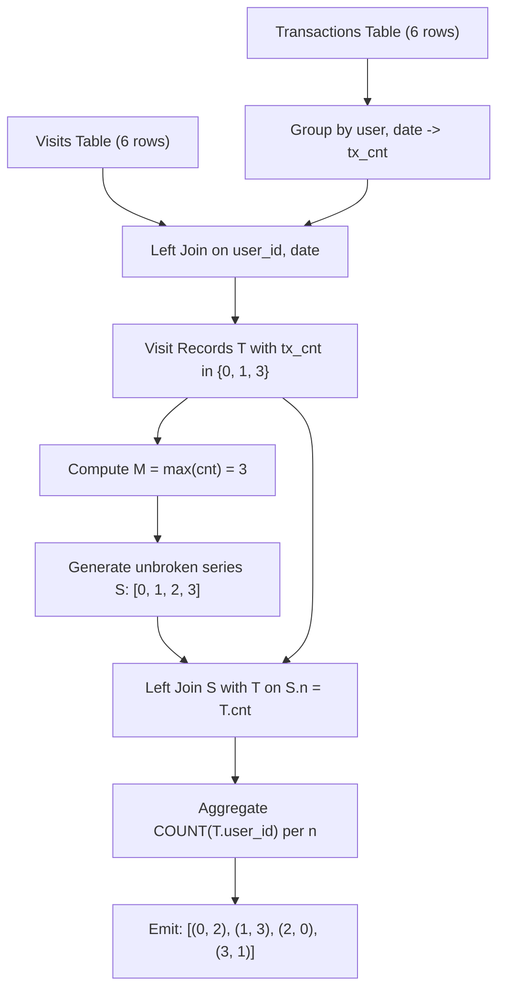

# Guided Example: Number of Transactions per Visit

We trace the relational multi-table outer join, visit transaction aggregation, and continuous integer series generation on a representative bank visit and transaction history:

- **Input:** `Visits` and `Transactions` tables:
  $$\begin{aligned}
  \text{Visits} = \{
  &(1, \text{"2020-01-01"}), \; (2, \text{"2020-01-02"}), \; (12, \text{"2020-01-01"}), \\
  &(19, \text{"2020-01-03"}), \; (1, \text{"2020-01-02"}), \; (2, \text{"2020-01-03"}) \}
  \end{aligned}$$
  $$\begin{aligned}
  \text{Transactions} = \{
  &(1, \text{"2020-01-01"}, 100), \; (2, \text{"2020-01-02"}, 200), \; (1, \text{"2020-01-02"}, 150), \\
  &(2, \text{"2020-01-03"}, 50), \; (2, \text{"2020-01-03"}, 75), \; (2, \text{"2020-01-03"}, 120) \}
  \end{aligned}$$
- **Required Output:** Full continuous histogram from $0$ to maximum transaction count:
  $$\begin{aligned}
  \text{Result} = \{
  &(0, 2), \; (1, 3), \; (2, 0), \; (3, 1) \}
  \end{aligned}$$

This instance demonstrates counting transactions per visit date via left outer join, identifying gap counts (zero occurrences for $2$ transactions), synthesizing an unbroken integer sequence $[0, M]$ through recursive relation generation, and preserving zero-count bins.

---

## 1. Instance & Teaching Goal

We are given two relations:
- `Visits`: records bank branch visits by `(user_id, visit_date)`.
- `Transactions`: records financial transactions by `(user_id, transaction_date, amount)`. Multiple transactions can occur during a single visit.

We must produce a frequency histogram showing how many visits resulted in exactly $0, 1, 2, \dots, M$ transactions, where $M$ is the maximum transaction count achieved during any visit.
Crucially:
1. Visits with zero transactions must be counted.
2. The sequence of transaction counts must be continuous from $0$ to $M$. If no visit generated $k$ transactions ($0 < k < M$), the bucket for $k$ must still appear with `visits_count = 0`.

```
Per-Visit Transaction Breakdown:
  - User 12 on 2020-01-01: 0 transactions
  - User 19 on 2020-01-03: 0 transactions
  - User 1  on 2020-01-01: 1 transaction  ($100)
  - User 2  on 2020-01-02: 1 transaction  ($200)
  - User 1  on 2020-01-02: 1 transaction  ($150)
  - User 2  on 2020-01-03: 3 transactions ($50, $75, $120)

Distribution of Visit Counts:
  0 transactions: 2 visits (User 12, User 19)
  1 transaction:  3 visits (User 1, User 2, User 1)
  2 transactions: 0 visits (Gap bucket!)
  3 transactions: 1 visit  (User 2)

Maximum Transactions in any Visit: M = 3
Required Output Domain: [0, 1, 2, 3]
Result Table: [(0, 2), (1, 3), (2, 0), (3, 1)]
```

A standard inner join would omit visits without transactions (dropping $0$), and a simple group-by would omit the gap value $2$ entirely. Using recursive series generation coupled with left outer joins ensures an unbroken domain $[0, M]$.

---

## 2. Conceptual Foundation & Invariants

Let $V$ denote the `Visits` relation and $X$ denote the `Transactions` relation.

### Relational Pipeline Stages
1. **Transaction Grouping:** Group transactions by user and date:
   $$
   X_{\text{daily}} = \gamma_{\text{user\_id}, \; \text{transaction\_date}, \; \text{COUNT}(*) \to \text{tx\_cnt}}(X)
   $$
2. **Visit Matching (Left Outer Join):** Join every visit with its transaction tally, assigning $0$ if unmatched:
   $$
   T = \Pi_{\text{user\_id}, \; \text{visit\_date}, \; \text{COALESCE}(\text{tx\_cnt}, 0) \to \text{cnt}} \big(V \ \backslash \bowtie \ X_{\text{daily}}\big)
   $$
3. **Maximum Degree Determination:**
   $$
   M = \max_{t \in T} t.\text{cnt}
   $$
4. **Domain Series Synthesis:** Synthesize the continuous domain of integers:
   $$
   S = \{n \in \mathbb{Z} \mid 0 \le n \le M\}
   $$
5. **Histogram Aggregation (Left Outer Join):** Outer join domain $S$ with visit tallies $T$ on $S.n = T.\text{cnt}$, counting matches:
   $$
   H = \gamma_{S.n, \; \text{COUNT}(T.\text{user\_id}) \to \text{visits\_count}}(S \ \backslash \bowtie_{S.n = T.\text{cnt}} \ T)
   $$

| Domain Value $n$ | Matching Visits in $T$ | Counted Visits | Emitted Tuple |
|---|---|---|---|
| $0$ | (12, Jan 1), (19, Jan 3) | $2$ | $(0, 2)$ |
| $1$ | (1, Jan 1), (2, Jan 2), (1, Jan 2) | $3$ | $(1, 3)$ |
| $2$ | None (Empty match) | $0$ | $(2, 0)$ |
| $3$ | (2, Jan 3) | $1$ | $(3, 1)$ |

> **Domain Completeness Invariant.** The synthetic series $S$ spans every consecutive integer from $0$ to $M$ without gaps. Left-joining against $T$ and aggregating with `COUNT(T.user_id)` maps empty matches strictly to $0$ rather than omitting the row.



---

## 3. Step-by-Step Worked Execution

We trace the relational operators across the dataset:

### Stage 1: Aggregate Daily Transactions
Group $X$ by `(user_id, transaction_date)`:
- User 1 on `2020-01-01`: 1 row $\implies \text{tx\_cnt} = 1$
- User 2 on `2020-01-02`: 1 row $\implies \text{tx\_cnt} = 1$
- User 1 on `2020-01-02`: 1 row $\implies \text{tx\_cnt} = 1$
- User 2 on `2020-01-03`: 3 rows $\implies \text{tx\_cnt} = 3$

### Stage 2: Left Join with Visits
Join `Visits` with daily transactions:
- $(1, \text{"2020-01-01"})$: matches $\text{tx\_cnt} = 1$.
- $(2, \text{"2020-01-02"})$: matches $\text{tx\_cnt} = 1$.
- $(12, \text{"2020-01-01"})$: no match $\implies \text{COALESCE}(\text{NULL}, 0) = 0$.
- $(19, \text{"2020-01-03"})$: no match $\implies \text{COALESCE}(\text{NULL}, 0) = 0$.
- $(1, \text{"2020-01-02"})$: matches $\text{tx\_cnt} = 1$.
- $(2, \text{"2020-01-03"})$: matches $\text{tx\_cnt} = 3$.

Summary table $T$ contains $6$ visit records:
- Count $0$: $2$ visits
- Count $1$: $3$ visits
- Count $3$: $1$ visit

### Stage 3: Maximum Count and Series Generation
- Maximum transaction count in $T$: $M = \max(0, 1, 3) = 3$.
- Generated integer series $S$:
  $$
  S = \{0, 1, 2, 3\}
  $$

### Stage 4: Outer Join and Histogram Counting
- **$n = 0$:** Matches $2$ visits $\implies \text{visits\_count} = 2$.
- **$n = 1$:** Matches $3$ visits $\implies \text{visits\_count} = 3$.
- **$n = 2$:** Matches $0$ visits (unmatched row from left join) $\implies \text{COUNT}(\text{NULL}) = 0$.
- **$n = 3$:** Matches $1$ visit $\implies \text{visits\_count} = 1$.

---

## 4. Complete Execution Trace

| Domain Integer $n$ | Matched Visits in $T$ | Aggregate Function Evaluated | Output `visits_count` | Emitted Row |
|---|---|---|---|---|
| $0$ | $(12, \text{Jan 1}), (19, \text{Jan 3})$ | $\text{COUNT}(2 \text{ rows})$ | $2$ | $(0, 2)$ |
| $1$ | $(1, \text{Jan 1}), (2, \text{Jan 2}), (1, \text{Jan 2})$ | $\text{COUNT}(3 \text{ rows})$ | $3$ | $(1, 3)$ |
| $2$ | $\emptyset$ (Null joined) | $\text{COUNT}(\text{NULL})$ | $0$ | $(2, 0)$ |
| $3$ | $(2, \text{Jan 3})$ | $\text{COUNT}(1 \text{ row})$ | $1$ | $(3, 1)$ |

---

## 5. Algorithmic Correctness

**Soundness.** Left-joining `Visits` with daily transactions assigns each visit its exact transaction count, accurately attributing non-transacting visits with $0$. Joining against the synthetic range $[0, M]$ and tallying with `COUNT(T.user_id)` returns the true mathematical frequency of visits for every possible transaction count.

**Completeness.** The recursive sequence $S$ generates every integer from $0$ to $M$ without gaps. Because $S$ is on the left side of the outer join, every integer in $[0, M]$ is guaranteed an output row, ensuring missing counts (such as $2$) are represented with count $0$.

---

## 6. Traps This Instance Exposes

- **Missing zero-frequency bins:** If group-by is run directly on $T$, transaction count $2$ produces no rows and is omitted from the output. Generating the integer sequence $0..M$ is mandatory to preserve gap bins.
- **Using `COUNT(*)` instead of `COUNT(column)`:** In an outer join, an unmatched row contains `NULL` for the right table attributes. `COUNT(*)` counts the row as $1$, whereas `COUNT(T.user_id)` correctly evaluates to $0$.
- **Omitting zero-transaction visits:** Visits where no transactions took place must be retained using `LEFT JOIN` and coalesced to $0$. An inner join would drop them, undercounting total visits.

---

## 7. Complexity Derivation

- **Time Complexity:** $\mathcal{O}(|V| + |X| + M \log M)$, where $|V|$ is the number of visits, $|X|$ is the number of transactions, and $M$ is the maximum transaction count. Daily grouping and joining take $\mathcal{O}(|V| + |X|)$ time, and generating and sorting $M + 1$ histogram rows takes $\mathcal{O}(M \log M)$ time.
- **Auxiliary Space Complexity:** $\mathcal{O}(|V| + M)$ to store the visit tally table and the synthetic domain relation.
