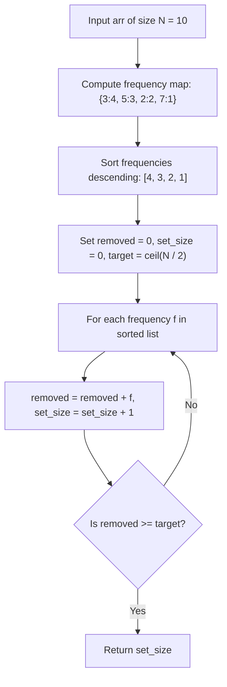

# Guided Example: Reduce Array Size to The Half

We trace the greedy frequency maximization algorithm for removing at least half of an array's elements on a representative instance:

- **Input:** `arr = [3, 3, 3, 3, 5, 5, 5, 2, 2, 7]`
- **Required Output:** `2`

This instance demonstrates frequency histogram construction, descending greedy selection of highest-multiplicity elements, and identifying the minimal unique integer set size required to eliminate at least half the array.

---

## 1. Instance & Teaching Goal

Given an integer array `arr` of size $N = 10$, we want to choose a set of distinct integers and delete all their occurrences from `arr` such that at least half the elements are removed ($N / 2 = 5$ elements). We must find the minimum possible size of this set.

For `arr = [3, 3, 3, 3, 5, 5, 5, 2, 2, 7]`:
- Total length: $N = 10$. Target elements to remove: $\lceil 10 / 2 \rceil = 5$.
- Frequency count of each distinct value:
  - $3$: appears $4$ times
  - $5$: appears $3$ times
  - $2$: appears $2$ times
  - $7$: appears $1$ time
- Sorting frequencies in descending order: $[4, 3, 2, 1]$.
- Greedy choice:
  - Select value $3$: removes $4$ elements. Cumulative removed: $4 < 5$.
  - Select value $5$: removes $3$ elements. Cumulative removed: $4 + 3 = 7 \ge 5$.
- Choosing the set $\{3, 5\}$ eliminates $7$ elements, leaving $3$ elements ($3 \le 10 / 2$).
- Set size: $2$.

```
Value Occurrences in arr:
  [3, 3, 3, 3]  --> Count: 4
  [5, 5, 5]     --> Count: 3
  [2, 2]        --> Count: 2
  [7]           --> Count: 1

Target Removal Threshold: >= 5 elements (half of 10)

Greedy Elimination Order (Highest Frequency First):
  Pick 1: Value 3 (removes 4) --> Total removed = 4  (Goal: >= 5)
  Pick 2: Value 5 (removes 3) --> Total removed = 7  (Threshold reached!)

Selected Set: {3, 5}
Minimum Set Size: 2
```

Testing all $2^K$ subsets of unique elements takes exponential time. Sorting the frequencies descending and greedily accumulating counts takes $\mathcal{O}(N + K \log K)$ time (or $\mathcal{O}(N)$ using bucket sort) and is provably optimal.

---

## 2. Conceptual Foundation & Invariants

Let $U = \{u_1, u_2, \dots, u_K\}$ be the set of $K$ distinct values in `arr`.
Let $f(u)$ be the count of occurrences of $u$ in `arr`, satisfying $\sum_{u \in U} f(u) = N$.

### Greedy Choice Property
To minimize the cardinality of chosen elements $S \subseteq U$ while satisfying $\sum_{u \in S} f(u) \ge \lceil N / 2 \rceil$:
Each selection step must choose the unpicked element with the maximum remaining frequency.
Sorting the frequencies in descending order:
$$
f_{(1)} \ge f_{(2)} \ge \dots \ge f_{(K)}
$$
The minimum set size $m^*$ is the smallest integer $m$ satisfying:
$$
\sum_{j=1}^m f_{(j)} \ge \left\lceil \frac{N}{2} \right\rceil
$$

| Distinct Integer $u$ | Occurrence Count $f(u)$ | Cumulative Removed Elements | Percentage of Array Eliminated |
|---|---|---|---|
| $3$ | $4$ | $4$ | $40\%$ |
| $5$ | $3$ | $4 + 3 = 7$ | $70\%$ ($\ge 50\%$) |
| $2$ | $2$ | $7 + 2 = 9$ | $90\%$ |
| $7$ | $1$ | $9 + 1 = 10$ | $100\%$ |

> **Exchange Property Invariant.** If an optimal set $S^*$ contains an element with frequency $f_a$ and omits an element with frequency $f_b > f_a$, replacing $a$ with $b$ strictly increases the total removed elements without increasing $|S^*|$. Thus, the greedy strategy of choosing the largest frequencies first always achieves an optimal solution.



---

## 3. Step-by-Step Worked Execution

We trace `arr = [3, 3, 3, 3, 5, 5, 5, 2, 2, 7]` with $N = 10$:
- Target removal count: $\lceil 10 / 2 \rceil = 5$.

### Step 1: Frequency Histogram Construction
- Value $3$: appears at $4$ positions.
- Value $5$: appears at $3$ positions.
- Value $2$: appears at $2$ positions.
- Value $7$: appears at $1$ position.
- Frequency list: $[4, 3, 2, 1]$.

### Step 2: Greedy Accumulation
- Initialize accumulator: $\text{removed} = 0$, $\text{size} = 0$.
- **Pick 1 (Frequency $4$, corresponding to value $3$):**
  $$
  \text{removed} \leftarrow 0 + 4 = 4
  $$
  $$
  \text{size} \leftarrow 0 + 1 = 1
  $$
  Check threshold: $4 < 5$. Threshold not yet satisfied; continue.
- **Pick 2 (Frequency $3$, corresponding to value $5$):**
  $$
  \text{removed} \leftarrow 4 + 3 = 7
  $$
  $$
  \text{size} \leftarrow 1 + 1 = 2
  $$
  Check threshold: $7 \ge 5$. Threshold satisfied!
- Terminate greedy loop immediately.
- Return set size: $2$.

---

## 4. Complete Execution Trace

| Step | Element Value Picked | Multiplicity Added | Running Total Removed | Target Needed | Condition $2 \times \text{removed} \ge N$ | Action |
|---|---|---|---|---|---|---|
| Init | - | - | $0$ | $5$ | $0 \ge 10$ (False) | Start |
| 1 | $3$ | $4$ | $4$ | $5$ | $8 \ge 10$ (False) | Continue |
| 2 | $5$ | $3$ | $7$ | $5$ | $14 \ge 10$ (True) | **Halt and Return 2** |

---

## 5. Algorithmic Correctness

**Soundness.** Removing all copies of chosen elements $\{u_1, \dots, u_m\}$ eliminates $\sum_{j=1}^m f(u_j)$ elements. When the loop halts, $\text{removed} \ge N / 2$, which directly satisfies the requirement that at least half the array is removed.

**Completeness.** By sorting frequencies in strictly non-increasing order, any prefix of length $m$ achieves the absolute maximum possible removal sum among all subsets of size $m$. Therefore, the first prefix to cross $\lceil N / 2 \rceil$ must be the minimum cardinality subset possible.

---

## 6. Traps This Instance Exposes

- **Over-removing elements:** Removing $7$ elements exceeds $N / 2 = 5$, but choosing only value $3$ removes $4 < 5$. Since we must delete *all* occurrences of each chosen integer, partial removal of a number's occurrences is disallowed.
- **Picking by integer value instead of frequency:** Sorting elements by their numeric value ($7 > 5 > 3 > 2$) rather than by their frequency causes suboptimal set selections.
- **Odd array length rounding:** For $N = 7$, at least $\lceil 7 / 2 \rceil = 4$ elements must be removed. The condition $2 \times \text{removed} \ge N$ accurately handles both even and odd parities without integer truncation errors.

---

## 7. Complexity Derivation

- **Time Complexity:** $\mathcal{O}(N \log K)$, where $N$ is the length of `arr` and $K \le N$ is the number of distinct values. Counting frequencies takes $\mathcal{O}(N)$ time. Sorting $K$ frequencies takes $\mathcal{O}(K \log K)$ time. (Alternatively, using bucket sort on frequencies takes $\mathcal{O}(N)$ time).
- **Auxiliary Space Complexity:** $\mathcal{O}(K)$ to store the frequency map and sorted frequency list.
