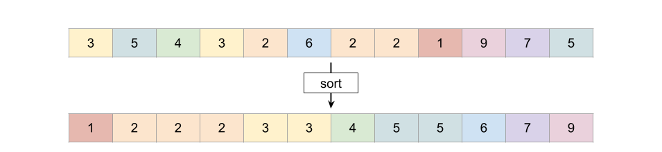
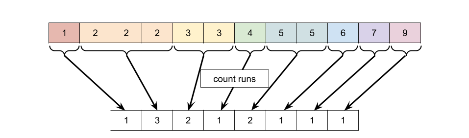
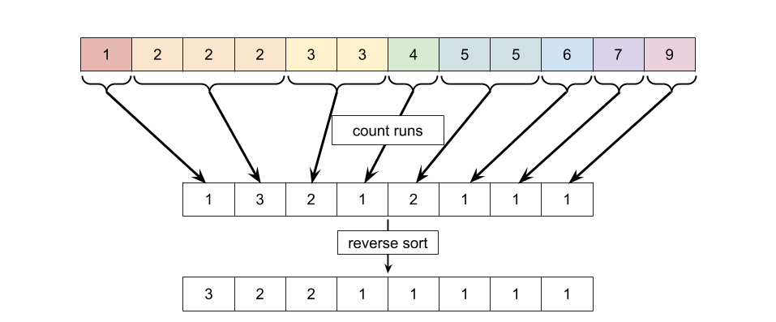
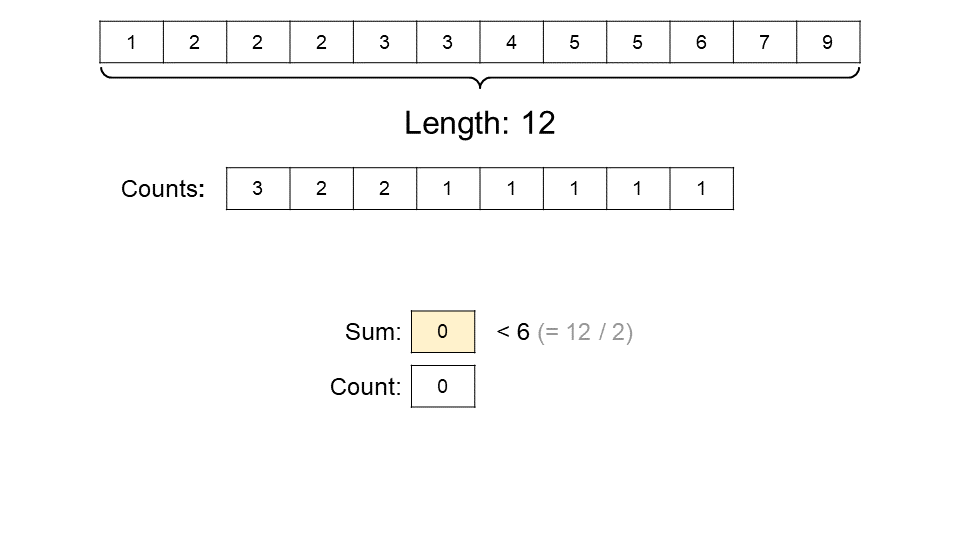
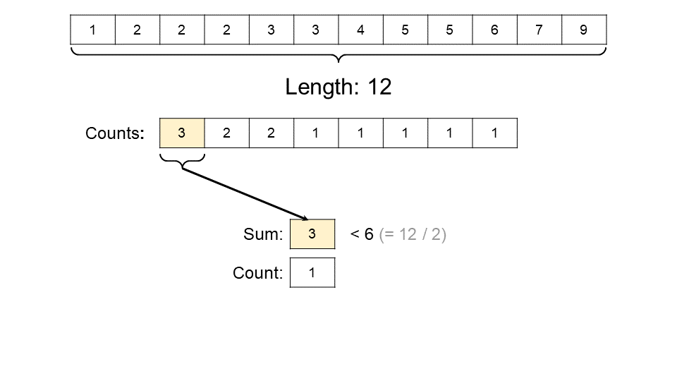
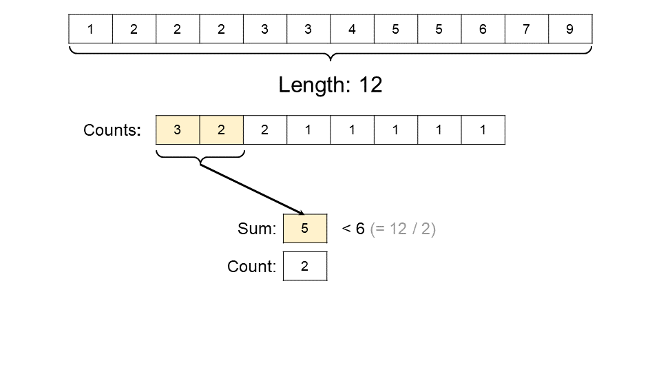
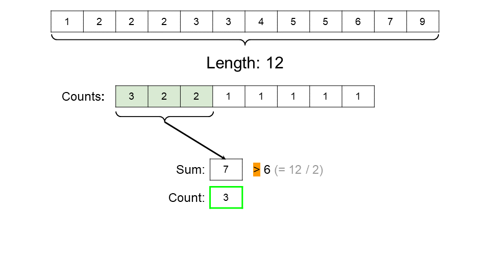
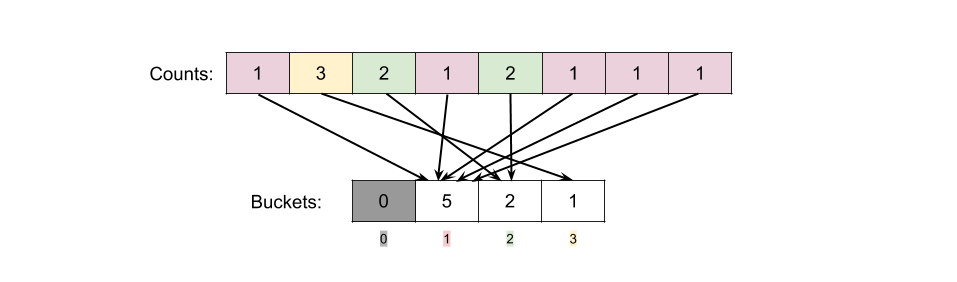

## Solution

### Overview

The problem requires us to perform "removal operations" until the array is no more than half it's original length. Each "removal operation" involves choosing a number and removing all occurrences of it. The goal is to perform the minimum possible number of these "removal operations" and return that number.

For example, consider the following array.


It makes sense to remove the numbers that *occur the most times*. i.e. it doesn't make sense to remove the `9`, because that will only shorten the array by 1. Instead, choosing `2` would shorten the array by 3 (as `2` occurs 3 times). We can repeatedly apply this **greedy** strategy until the array is of no more than half its original length.

> While the length of arr is greater than $n / 2$, find the number in arr that occurs the most times and remove all occurrences of it.

Doing this will require 2 steps:

1. Counting how many times each number occurs.
2. Removing the numbers with the highest counts until we've removed at least $n / 2$ numbers in total.

We'll now look at a couple of different algorithms that apply this greedy strategy.

<br />

---

### Approach 1: Sorting

**Intuition**

We'll use the example array from above.


As identified above, the first step is to count how many times each number occurs. This would be a lot easier to do if all identical numbers were side-by-side. The simplest way of achieving this is to sort `arr` using a built-in sort.



Next, we need to do the actual counting.



Notice that we can simply insert the counts into a new array (called `counts`). We don't need to remember what the original number associated with each count was (because the return type is simply how many unique numbers we needed to remove).

The second step is to start picking off numbers with the highest number of occurrences. To make this easier, we'll start by *reverse-sorting* (largest to smallest) the `counts` array.



Now that we've reverse-sorted `counts`, we can iterate down it, adding up the counts we want to take. Remember that each number in `counts` represent one of the unique numbers in `arr`. Therefore, of the numbers we remove from `counts`:

- Their **sum** represents how many numbers we've removed from `arr`. We want to remove at least $\text{arr.length} / 2$ of them.
- The number of counts removed represents how many *unique numbers* have been removed from `arr`. This is the "set size" we ultimately need to return.

Therefore, we need a simple loop that iterates over `counts`, and keeps track of these 2 amounts.

Here is a short animation that shows this last step.









**Algorithm**

```python
def minSetSize(self, arr: List[int]) -> int:

    # Sort the input numbers.
    arr.sort()

    # Generate the counts array.
    counts = []
    current_run = 1
    for i in range(1, len(arr)):
        if arr[i] == arr[i - 1]:
            current_run += 1
            continue
        counts.append(current_run)
        current_run = 1
    counts.append(current_run)

    # Reverse sort the counts.
    counts.sort(reverse=True)

    # Remove numbers until at least half are removed.
    numbers_removed_from_arr = 0
    set_size = 0
    for count in counts:
        numbers_removed_from_arr += count
        set_size += 1
        if (numbers_removed_from_arr >= len(arr) // 2):
            break

    return set_size
```

**Complexity Analysis**

- Time Complexity : $O(n \, \log \, n)$.

    The first step, sorting, requires $O(n \, \log \, n)$ time, assuming the use of a built-in sorting algorithm (i.e. assuming that you didn't write your own selection sort or bubble sort!).

    The second step, generating `counts`, takes $O(n)$ time, because it's a linear scan of the $n$ items in `arr`, applying an $O(1)$ operation to each.

    The third step, reverse sorting `counts`, takes $O(n \, \log \, n)$ time, because it has a length of at most $n$.

    Computing the size of the minimum set also takes $O(n)$, because it is a linear scan of the `counts` array (which has a length of at most $n$).

    This gives us $O(n \, \log \, n) +$\mathcal{O}(n)$+$\mathcal{O}(n \, \\log \, n)$+$\mathcal{O}(n)$= O(n \, \log \, n)$, because the $O(n)$ parts are insignificant compared to the $O(n \, \log \, n)$.

- Space Complexity : $O(n)$.

    In the worst case, all the numbers in `arr` will be unique, leading to a `counts` array of length $n$, and a space complexity of $O(n)$.

    Most programming languages use a *built in* sorting algorithm that requires $O(n)$ space. There are a few that only use $O(\log \,n)$ space. Most prioritize time over space.

    Regardless of what space your sorting algorithm is using, the $O(n)$ space from the first part pulls the overall space complexity to $O(n)$.

**Further Optimizations**

There are a couple of ways to optimize the space complexity of Approach 1 further. Applying these will result in an algorithm with a time complexity of $O(n \, \log \, n)$ and a space complexity of $O(1)$. This is an interesting contrast to Approach 3's $O(n)$ time complexity but $O(n)$ space.

Firstly, we can write the `counts` array values directly into `arr` (the input array) using the Two Pointer Technique. Any extra space at the end should be `0`'ed (or simply deleted if using a language like Python). This works, because we don't need to look at `arr` again. Here is some pseudocode to do this.

```text
wp = 0
rp = 1
run_length = 1
while rp <= arr.length:
    if rp == arr.length or arr[rp - 1] != arr[rp]:
        arr[wp] = run_length
        wp += 1
        run_length = 1
    else:
        run_length += 1
    rp += 1
for i = wp to arr.length:
    arr[i] = 0
```

Secondly, we could use an $O(1)$ space sorting algorithm, such as Heapsort or In-Place Merge Sort. It's likely you'd need to write this yourself.

Applying **both** optimizations will give a space complexity of $O(1)$.

</br>

---

### Approach 2: Hashing/ Counting

**Intuition**

A better way of doing the first step is to use a `Multiset` (also known as a `Counter` or `Bag`). A `Multiset` is, as the name suggests, a type of Set that allows duplicates. It is implemented using a `HashMap`, where the **key** is the set items, and the **value** is an integer stating how many times the item is in the set. In C++, it is called `multiset`. In Python, it is `Counter`. In Java and JavaScript, you will have to make your own using a `HashMap`.

For this problem, the keys will be each unique number in `arr`, and the values will be how many times each occurred. Building this up using a `HashMap` is straightforward (`Counter` and `multiset` are even easier!).

```text
multiset = new Hash Map
for number in arr:
    if number is not in multiset keys:
       add number to multiset keys with value of 0
    increment value for number by 1
```

Now we need to determine which counts to take, to minimise the final set size. The simplest way is to extract the *values*, sort them, and then proceed in the same way as Approach 1.

**Algorithm**

```python
def minSetSize(self, arr: List[int]) -> int:

    # In Python, we can use the built-in Counter class.
    counts = collections.Counter(arr)

    # Extract the counts in reverse-sorted order.
    # most_common gives (number, count) pairs, reverse sorted on count.
    counts = [count for number, count in counts.most_common()]

    # Remove numbers until at least half are removed.
    total_removed = 0
    set_size = 0
    for count in counts:
        total_removed += count
        set_size += 1
        if (total_removed >= len(arr) // 2):
            break

    return set_size
```

**Complexity Analysis**

- Time Complexity : $O(n \, \log \, n)$.

    The first step requires examining each of the $n$ numbers and then placing them into the `HashMap` (or `multiset` or `Counter`). Because inserting an item into a HashMap takes $O(1)$ time, this gives an overall time complexity of $O(n)$.

    Extracting the values from the `HashMap` is $O(n)$. The rest has a *worst case* of $O(n \, \log \, n)$, just like in Approach 1.

    In practice, this approach is always more efficient than Approach 1, often by a considerable amount. We have assumed the worst case—that `counts` is the same size as `arr`. However for most cases, `counts` will be much smaller than `arr`. The previous algorithm was performing an $O(n \, \log \, n)$ sorting operation on both `arr` and `counts`, whereas this one only performs it on the (likely) smaller `counts` array.

    Note that Python's $\text{most}_{common}(...)$ method for `Counter` is *not* $O(n)$.

- Space Complexity : $O(n)$.

    In the worst case, where all numbers in `arr` are unique, the Multiset will require $O(n)$ space.

</br>

---

### Approach 3: Hashing and Bucket Sort

**Intuition**

*This approach is probably not needed for an interview, however, it is interesting that it is possible to get the time complexity of this algorithm down to $O(n)$, and the techniques used here could potentially apply to other algorithmic problems you might face.*

In the above approach, the overall time complexity was $O(n \, \log \, n)$, because we sorted the `counts` array. Instead of using an $O(n \, \log \, n)$ sort though, we could instead use **Bucket Sort** on the counts.

**Bucket Sort** starts by identifying the *largest* number, $m$, in the array to be sorted. It then creates a new array of length $m$, initialized to zeroes. It goes through each of the $n$ numbers in the original array, putting them into the array index that corresponds to their value. An item is put into an index simply by incrementing the value at that index by 1. For example, here is how the `counts` array looks put into buckets.



After putting all the items into their respective "buckets", we usually then convert the input back into a standard array. However, we're not going to do that here. We can process the items in the "bucket" form, and in fact it's more efficient to do so for this problem.

Assuming the items to be sorted *are all positive integers* (it can be adapted to work with negatives too), Bucket Sort's time and space complexity is proportional to the number of items to be sorted, and to the size of the largest item, i.e. where $m$ is the largest item in the array, and $n$ is the number of items in the array, the time complexity is $O(\max(n, m)) = O(n + m)$, and the space complexity is $O(m)$. Therefore, bucket sort generally works well when $m$ is low and $n$ is high (i.e. lots of numbers within a small range.).

Here we know that the maximum number in `counts` couldn't possibly be higher than $n$. If it was higher than $n$, then there has to have been more items in `arr` to begin with, which would be a contradiction! We also know that the numbers are all positive integers (a negative count makes no sense in this context). Therefore, this problem is a suitable candidate for Bucket Sort, and with $m ≤ n$, the time complexity simplifies to $O(n + n) = O(n)$.

To make the algorithm a little more efficient in practice, we can identify what the largest count is while doing the first part of the algorithm. We then know that this is the largest bucket we'll need. This will mean too that when we go to get numbers out of the buckets, we won't be having to go past lots of zeroes before we hit the first meaningful data point.

**Algorithm**

```python
def minSetSize(self, arr: List[int]) -> int:

    # In Python, we can use the built-in Counter class.
    counts = collections.Counter(arr)
    max_value = max(counts.values())

    # Put the counts into buckets.
    buckets = [0] * (max_value + 1)

    for count in counts.values():
        buckets[count] += 1

    # Determine set_size.
    set_size = 0
    arr_numbers_to_remove = len(arr) // 2
    bucket = max_value
    while arr_numbers_to_remove > 0:
        max_needed_from_bucket = math.ceil(arr_numbers_to_remove / bucket)
        set_size_increase = min(buckets[bucket], max_needed_from_bucket)
        set_size += set_size_increase
        arr_numbers_to_remove -= set_size_increase * bucket
        bucket -= 1

    return set_size
```

**Complexity Analysis**

- Time Complexity : $O(n)$.

    The first step is the same as Approach 2, with a cost of $O(n)$.

    The bucket sorting, as explained above, is also $O(n)$.

    Therefore, the total time complexity of this algorithm is $O(n)$.

- Space Complexity : $O(n)$.

    We require $O(n)$ extra space for the `HashMap`, and then up to $O(n)$ extra space to do the Bucket Sort.

</br>