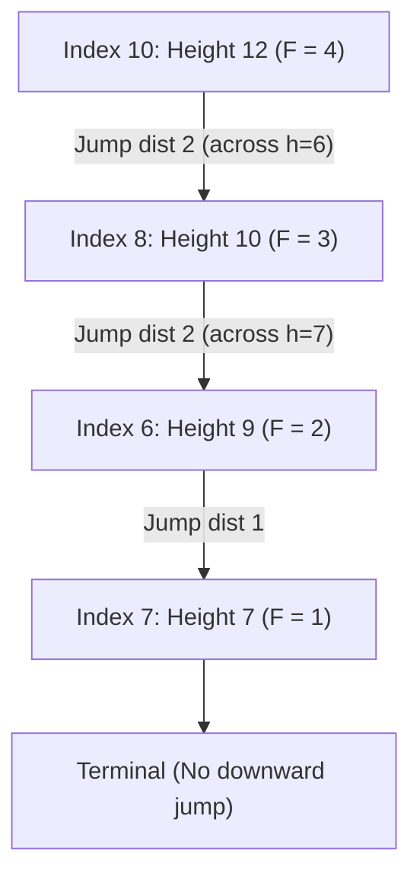

# Guided Example: Jump Game V

We trace the dynamic programming recurrence on a Directed Acyclic Graph (DAG) for maximizing strictly descending jumps on a representative obstacle array:

- **Input:** `arr = [6, 4, 14, 6, 8, 13, 9, 7, 10, 6, 12]`, `d = 2`
- **Required Output:** `4`

This instance demonstrates modeling strictly descending moves as a DAG, enforcing line-of-sight obstruction constraints (blocking when encountering an element with height $\ge \text{current}$), memoized longest-path dynamic programming, and discovering the optimal start index.

---

## 1. Instance & Teaching Goal

Given an integer array `arr` of building heights and a maximum jump distance $d = 2$, we may choose any starting index $i$. From index $i$, we can jump left or right to any index $j$ satisfying:
1. $0 < |i - j| \le d$.
2. $\text{arr}[i] > \text{arr}[j]$ (strictly descending height).
3. For all intermediate indices $k$ strictly between $i$ and $j$, $\text{arr}[i] > \text{arr}[k]$ (no intermediate building blocks line of sight).

We want to find the maximum number of indices that can be visited in a single continuous path.

For `arr = [6, 4, 14, 6, 8, 13, 9, 7, 10, 6, 12]` with $d = 2$:
- Starting at index $10$ (height $12$):
  - Can jump left to index $8$ (height $10$, distance $2$). The intermediate element is index $9$ (height $6 < 12$), so the path is clear.
- From index $8$ (height $10$):
  - Can jump left to index $6$ (height $9$, distance $2$). The intermediate element is index $7$ (height $7 < 10$), clear path.
- From index $6$ (height $9$):
  - Can jump right to index $7$ (height $7$, distance $1$).
- From index $7$ (height $7$):
  - Left neighbor index $6$ has height $9 > 7$ (blocked).
  - Right neighbor index $8$ has height $10 > 7$ (blocked).
  - Terminal node reached.
- Total indices visited: $4$ (sequence: index $10 \to 8 \to 6 \to 7$).

```
Heights and Indices:
Index:   0   1   2   3   4   5   6   7   8   9  10
Value:  [6] [4][14] [6] [8][13] [9] [7][10] [6][12]

Optimal Jump Trajectory (d = 2):
  Step 1: Start at index 10 (h = 12)
          Jump left by 2 to index 8 (h = 10, intermediate h=6 < 12)
  Step 2: From index 8 (h = 10)
          Jump left by 2 to index 6 (h = 9, intermediate h=7 < 10)
  Step 3: From index 6 (h = 9)
          Jump right by 1 to index 7 (h = 7)
  Step 4: At index 7 (h = 7), no strictly smaller reachable building exists.

Visited Sequence: 10 -> 8 -> 6 -> 7 (Length: 4)
```

Because every valid jump moves strictly from a larger height to a smaller height, the transition graph contains zero directed cycles. This structural acyclicity allows the optimal path from every index to be memoized and solved in topological height order.

---

## 2. Conceptual Foundation & Invariants

Let $G = (V, E)$ be the directed graph where vertices $V = \{0, 1, \dots, N-1\}$ and directed edge $(i \to j) \in E$ exists if and only if $j$ is legally reachable from $i$.

### Legal Transition Rules
From index $i$, we scan leftward ($j = i - 1, i - 2, \dots, \max(0, i - d)$) and rightward ($j = i + 1, i + 2, \dots, \min(N - 1, i + d)$):
- If $\text{arr}[j] \ge \text{arr}[i]$, scanning in that direction stops immediately because building $j$ obstructs all further jumps in that direction.
- If $\text{arr}[j] < \text{arr}[i]$, add directed edge $i \to j$.

### Longest Path Recurrence on DAG
Let $F[i]$ be the maximum number of buildings visitable starting at index $i$:
$$
F[i] = 1 + \max_{(i \to j) \in E} F[j] \quad (\text{with } \max_{\emptyset} = 0)
$$
The global answer is:
$$
\text{Ans} = \max_{0 \le i < N} F[i]
$$

| Index $i$ | Height $\text{arr}[i]$ | Valid Downward Transitions | Longest Path $F[i]$ |
|---|---|---|---|
| $7$ | $7$ | None ($\emptyset$) | $1$ |
| $6$ | $9$ | Jump to $7$ (dist 1) | $1 + F[7] = 2$ |
| $8$ | $10$ | Jump to $6$ (dist 2) or $7$ (dist 1) or $9$ (dist 1) | $1 + F[6] = 3$ |
| $10$ | $12$ | Jump to $8$ (dist 2) or $9$ (dist 1) | $1 + F[8] = 4$ |

> **DAG Topological Invariant.** Because every directed transition $(i \to j)$ satisfies $\text{arr}[i] > \text{arr}[j]$, the graph is strictly acyclic. Ordering subproblems by ascending height or using memoized depth-first search computes each $F[i]$ exactly once.



---

## 3. Step-by-Step Worked Execution

We trace the memoized evaluations on `arr = [6, 4, 14, 6, 8, 13, 9, 7, 10, 6, 12]` focusing on the critical optimal trajectory:

### Step 1: Evaluate Node $i = 7$ (Height $7$)
- Look left ($d = 2$):
  - $j = 6$ (height $9$): $\text{arr}[6] \ge \text{arr}[7]$ ($9 \ge 7$). Obstacle! Stop left scan.
- Look right ($d = 2$):
  - $j = 8$ (height $10$): $\text{arr}[8] \ge \text{arr}[7]$ ($10 \ge 7$). Obstacle! Stop right scan.
- No outgoing transitions available.
- Base value: $F[7] = 1$.

### Step 2: Evaluate Node $i = 6$ (Height $9$)
- Look left ($d = 2$):
  - $j = 5$ (height $13$): $\ge 9$. Stop left scan.
- Look right ($d = 2$):
  - $j = 7$ (height $7 < 9$): Valid jump to index $7$.
  - $j = 8$ (height $10 \ge 9$): Obstacle! Stop right scan.
- Recurrence:
  $$
  F[6] = 1 + F[7] = 1 + 1 = 2
  $$

### Step 3: Evaluate Node $i = 8$ (Height $10$)
- Look left ($d = 2$):
  - $j = 7$ (height $7 < 10$): Valid jump.
  - $j = 6$ (height $9 < 10$): Intermediate height $7 < 10$. Valid jump to index $6$.
- Look right ($d = 2$):
  - $j = 9$ (height $6 < 10$): Valid jump.
  - $j = 10$ (height $12 \ge 10$): Obstacle.
- Compare candidate branches:
  - Jump to $7$: $1 + F[7] = 1 + 1 = 2$.
  - Jump to $6$: $1 + F[6] = 1 + 2 = 3$.
  - Jump to $9$: $1 + F[9] = 1 + 1 = 2$.
- Optimal choice: jump to index $6$.
  $$
  F[8] = 3
  $$

### Step 4: Evaluate Node $i = 10$ (Height $12$)
- Look left ($d = 2$):
  - $j = 9$ (height $6 < 12$): Valid jump.
  - $j = 8$ (height $10 < 12$): Intermediate height at $9$ is $6 < 12$. Valid jump to index $8$.
- Compare candidate branches:
  - Jump to $9$: $1 + F[9] = 1 + 1 = 2$.
  - Jump to $8$: $1 + F[8] = 1 + 3 = 4$.
- Optimal choice: jump to index $8$.
  $$
  F[10] = 4
  $$

### Global Maximum
- Evaluating all $11$ nodes produces $\max_i F[i] = F[10] = 4$.

---

## 4. Complete Execution Trace

| Trajectory Step | Current Index | Current Height | Target Index Jumped | Target Height | Step Distance | Intermediate Heights | Path Length so Far |
|---|---|---|---|---|---|---|---|
| Start | $10$ | $12$ | - | - | - | - | $1$ |
| 1 | $10 \to 8$ | $12 \to 10$ | $8$ | $10$ | $2$ | $\text{arr}[9] = 6 < 12$ | $2$ |
| 2 | $8 \to 6$ | $10 \to 9$ | $6$ | $9$ | $2$ | $\text{arr}[7] = 7 < 10$ | $3$ |
| 3 | $6 \to 7$ | $9 \to 7$ | $7$ | $7$ | $1$ | None | **4** |
| Terminal | $7$ | $7$ | None | - | - | All neighbors $\ge 7$ | **Halt (Max = 4)** |

---

## 5. Algorithmic Correctness

**Soundness.** Every jump satisfies the strict distance bound $|i - j| \le d$, requires $\text{arr}[i] > \text{arr}[j]$, and verifies that no intermediate building equals or exceeds $\text{arr}[i]$ (enforced by terminating the scan on the first non-smaller height). The path is physically and logically valid.

**Completeness.** Because the state transition space is a finite DAG, memoized DFS explores all reachable paths without cycles. Computing the maximum across all $N$ potential start indices guarantees the true global maximum is identified.

---

## 6. Traps This Instance Exposes

- **Jumping over taller or equal buildings:** At index $8$, scanning right sees index $9$ (height 6) then index $10$ (height 12). Jumping from $8$ directly to any hypothetical lower building past $10$ is forbidden because building $10$ obstructs line of sight. Stopping the directional scan at the first obstacle is essential.
- **Strictly decreasing requirement:** Jumping between two buildings of equal height is illegal ($\text{arr}[i] > \text{arr}[j]$ is strict). If all buildings have identical heights, no jumps can be made, and the answer is $1$.
- **Starting at the tallest building assumption:** The global optimal path does not necessarily start at the highest building in the entire array ($\text{arr}[2] = 14$ yields a path of length $3$, while index $10$ with height $12$ yields length $4$). All indices must be tested.

---

## 7. Complexity Derivation

- **Time Complexity:** $\mathcal{O}(N \cdot d)$. There are $N$ vertices. From each vertex, the algorithm scans at most $d$ steps to the left and $d$ steps to the right ($2d$ operations). With memoization, each vertex is computed once, yielding $\mathcal{O}(N \cdot d)$ total time.
- **Auxiliary Space Complexity:** $\mathcal{O}(N)$ to store the memoization cache and call stack.