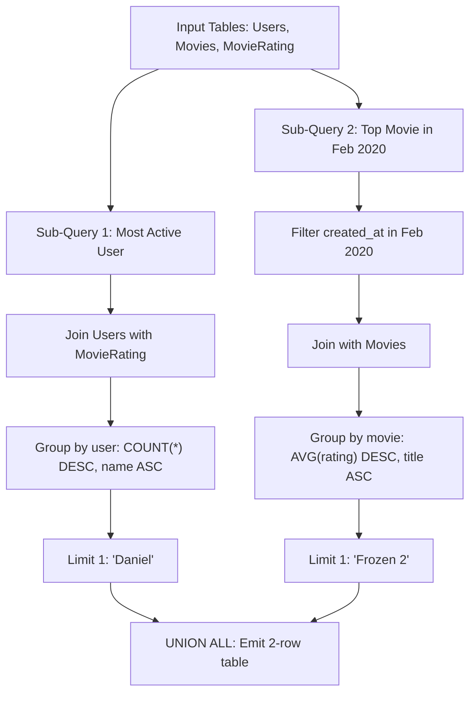

# Guided Example: Movie Rating

We trace the relational dual-query aggregation, lexicographical tie-breaking, and union combination on a representative cinema dataset:

- **Input:** `Users`, `Movies`, and `MovieRating` relations:
  $$\begin{aligned}
  \text{Users} &= \{(1, \text{"Daniel"}), \; (2, \text{"Monica"}), \; (3, \text{"Maria"}), \; (4, \text{"James"})\} \\
  \text{Movies} &= \{(1, \text{"Avengers"}), \; (2, \text{"Frozen 2"}), \; (3, \text{"Joker"})\} \\
  \text{MovieRating} &= \{
  (1, 1, 3, \text{"2020-01-12"}), \; (1, 2, 4, \text{"2020-02-11"}), \; (1, 3, 2, \text{"2020-02-12"}), \\
  &(2, 1, 5, \text{"2020-02-17"}), \; (2, 2, 2, \text{"2020-02-01"}), \; (2, 3, 2, \text{"2020-03-01"}), \\
  &(3, 1, 3, \text{"2020-02-22"}), \; (3, 2, 4, \text{"2020-02-25"}), \; (4, 1, 1, \text{"2020-01-01"}) \}
  \end{aligned}$$
- **Required Output:** A single-column relation `results` containing the top user and top movie:
  $$\begin{aligned}
  \text{Result} = \{ (\text{"Daniel"}), \; (\text{"Frozen 2"}) \}
  \end{aligned}$$

This instance demonstrates solving two distinct analytical sub-queries (most prolific reviewer and highest-rated movie in a target month), applying lexicographical string tie-breaking, and concatenating heterogeneous entity results via union.

---

## 1. Instance & Teaching Goal

We must answer two distinct questions within a unified query result:
1. **Most Prolific Reviewer:** Find the name of the user who has rated the greatest number of movies overall. If there is a tie, choose the lexicographically smaller name.
2. **Top-Rated Movie in February 2020:** Find the movie title with the highest average rating strictly within February 2020 (`created_at` in $[2020\text{-}02\text{-}01, \; 2020\text{-}02\text{-}29]$). If there is a tie, choose the lexicographically smaller title.

```
Sub-Query 1 (Most Reviews Overall):
  - Daniel: 3 reviews (Movies 1, 2, 3)
  - Monica: 3 reviews (Movies 1, 2, 3)
  - Maria:  2 reviews (Movies 1, 2)
  - James:  1 review  (Movie 1)
  Tie at max count (3): "Daniel" vs "Monica" --> "Daniel" < "Monica" (Pick "Daniel")

Sub-Query 2 (Highest Average in Feb 2020):
  - "Frozen 2": Ratings 4 (Feb 11) and 3 (Feb 22) --> Avg = (4 + 3) / 2 = 3.50
  - "Joker":    Ratings 2 (Feb 12) and 5 (Feb 17) --> Avg = (2 + 5) / 2 = 3.50
  - "Avengers": Ratings 2 (Feb 01) and 4 (Feb 25) --> Avg = (2 + 4) / 2 = 3.00
  Tie at max average (3.50): "Frozen 2" vs "Joker" --> "Frozen 2" < "Joker" (Pick "Frozen 2")

Combined Emitted Rows: ["Daniel", "Frozen 2"]
```

Because the two goals involve different entities (a user name versus a movie title) and different aggregations (total count versus monthly average), they cannot be merged into a single grouping. Evaluating two independent relational queries and concatenating their results via `UNION ALL` provides the optimal solution.

---

## 2. Conceptual Foundation & Invariants

Let $U$ be `Users`, $M$ be `Movies`, and $R$ be `MovieRating`.

### Part 1: Top User Query ($Q_1$)
1. Join $U$ and $R$ on `user_id`.
2. Group by `user_id` and `name`, counting total ratings:
   $$
   T_1 = \gamma_{\text{user\_id}, \; \text{name}, \; \text{COUNT}(*) \to \text{cnt}}(U \bowtie R)
   $$
3. Order by `cnt` descending, then `name` ascending. Select the first tuple:
   $$
   Q_1 = \Pi_{\text{name} \to \text{results}} \big(\sigma_{\text{rank}=1}(T_1)\big)
   $$

### Part 2: Top Movie in February 2020 ($Q_2$)
1. Filter $R$ to February 2020:
   $$
   R_{\text{Feb}} = \sigma_{\text{"2020-02-01"} \le \text{created\_at} \le \text{"2020-02-29"}}(R)
   $$
2. Join $R_{\text{Feb}}$ with $M$ on `movie_id`.
3. Group by `movie_id` and `title`, computing average rating:
   $$
   T_2 = \gamma_{\text{movie\_id}, \; \text{title}, \; \text{AVG}(\text{rating}) \to \text{avg\_rate}}(M \bowtie R_{\text{Feb}})
   $$
4. Order by `avg_rate` descending, then `title` ascending. Select the first tuple:
   $$
   Q_2 = \Pi_{\text{title} \to \text{results}} \big(\sigma_{\text{rank}=1}(T_2)\big)
   $$

### Final Union
$$
\text{Result} = Q_1 \cup_{\text{all}} Q_2
$$

| Metric Category | Target Entity | Aggregation Function | Time Horizon | Tie-Breaker |
|---|---|---|---|---|
| Review Activity | User Name | $\text{COUNT}(*)$ ratings | All time | `name` ASC (lexicographical) |
| Quality Score | Movie Title | $\text{AVG}(\text{rating})$ | February 2020 | `title` ASC (lexicographical) |

> **Dual-Query Orthogonality Invariant.** The two sub-queries operate over disjoint semantic domains. Evaluating each with its specific metric and tie-breaker before vertical union guarantees that each row in the final 2-row table independently satisfies its exact requirements.



---

## 3. Step-by-Step Worked Execution

We trace the detailed execution of both components:

### Execution of Sub-Query 1 (Top User)
Join `Users` with `MovieRating` and aggregate rating counts:
- Daniel (`user_id = 1`): rated Movies $1, 2, 3 \implies 3$ ratings.
- Monica (`user_id = 2`): rated Movies $1, 2, 3 \implies 3$ ratings.
- Maria (`user_id = 3`): rated Movies $1, 2 \implies 2$ ratings.
- James (`user_id = 4`): rated Movie $1 \implies 1$ rating.

Candidate sorting:
- Maximum rating count is $3$, shared by Daniel and Monica.
- Alphabetical comparison: `"Daniel" < "Monica"`.
- Top result: `"Daniel"`.

### Execution of Sub-Query 2 (Top Movie in February 2020)
Filter `MovieRating` records with dates in February 2020:
- $(1, 2, 4, \text{"2020-02-11"})$: Movie 2, rating $4$.
- $(1, 3, 2, \text{"2020-02-12"})$: Movie 3, rating $2$.
- $(2, 1, 5, \text{"2020-02-17"})$: Movie 3, rating $5$.
- $(2, 2, 2, \text{"2020-02-01"})$: Movie 1, rating $2$.
- $(3, 1, 3, \text{"2020-02-22"})$: Movie 2, rating $3$.
- $(3, 2, 4, \text{"2020-02-25"})$: Movie 1, rating $4$.
(Records from January and March are excluded).

Aggregate averages per movie:
- **Movie 1 ("Avengers"):** ratings $2$ and $4$:
  $$
  \text{Avg} = (2 + 4) / 2 = 3.00
  $$
- **Movie 2 ("Frozen 2"):** ratings $4$ and $3$:
  $$
  \text{Avg} = (4 + 3) / 2 = 3.50
  $$
- **Movie 3 ("Joker"):** ratings $2$ and $5$:
  $$
  \text{Avg} = (2 + 5) / 2 = 3.50
  $$

Candidate sorting:
- Highest average rating is $3.50$, shared by "Frozen 2" and "Joker".
- Alphabetical comparison: `"Frozen 2" < "Joker"`.
- Top result: `"Frozen 2"`.

### Combined Union
- Row 1: `"Daniel"`
- Row 2: `"Frozen 2"`

---

## 4. Complete Execution Trace

| Sub-Query Role | Candidate Entities | Evaluated Metric Value | Tie-Breaker Evaluated | Winning Value |
|---|---|---|---|---|
| Most Prolific User | Daniel (3), Monica (3), Maria (2), James (1) | $\max(\text{count}) = 3$ | `"Daniel" < "Monica"` | `"Daniel"` |
| Top February Movie | Frozen 2 (3.5), Joker (3.5), Avengers (3.0) | $\max(\text{avg}) = 3.5$ | `"Frozen 2" < "Joker"` | `"Frozen 2"` |

Combined result set:
```
+--------------+
| results      |
+--------------+
| Daniel       |
| Frozen 2     |
+--------------+
```

---

## 5. Algorithmic Correctness

**Soundness.** Sub-query 1 measures user engagement across all ratings and breaks ties by ascending alphabetical name. Sub-query 2 isolates the target month, evaluates the mean of rating values, and breaks ties by ascending alphabetical movie title. Both components strictly fulfill their respective sub-goals.

**Completeness.** `UNION ALL` preserves both winning values in a single resultant table without deduplicating or omitting either row.

---

## 6. Traps This Instance Exposes

- **Using `UNION` instead of `UNION ALL`:** If the top user and the top movie happen to share the identical name string, a standard `UNION` would deduplicate them into a single row, causing a schema validation failure. `UNION ALL` preserves both rows.
- **Ties on average rating:** When multiple movies share the identical average rating (such as $3.50$), omitting the secondary `ORDER BY title ASC` causes arbitrary or non-deterministic selection.
- **Cross-month rating contamination:** Including ratings outside February 2020 distorts the movie averages. Strict date window filtering must occur before computing averages.

---

## 7. Complexity Derivation

- **Time Complexity:** $\mathcal{O}(|R| + |U| \log |U| + |M| \log |M|)$, where $|R|$ is the number of ratings, $|U|$ is the number of users, and $|M|$ is the number of movies. Joining and grouping takes linear time in ratings, and sorting the grouped summaries takes $\mathcal{O}(|U| \log |U| + |M| \log |M|)$ time.
- **Auxiliary Space Complexity:** $\mathcal{O}(|U| + |M|)$ to store the grouped aggregation tables for users and movies.
