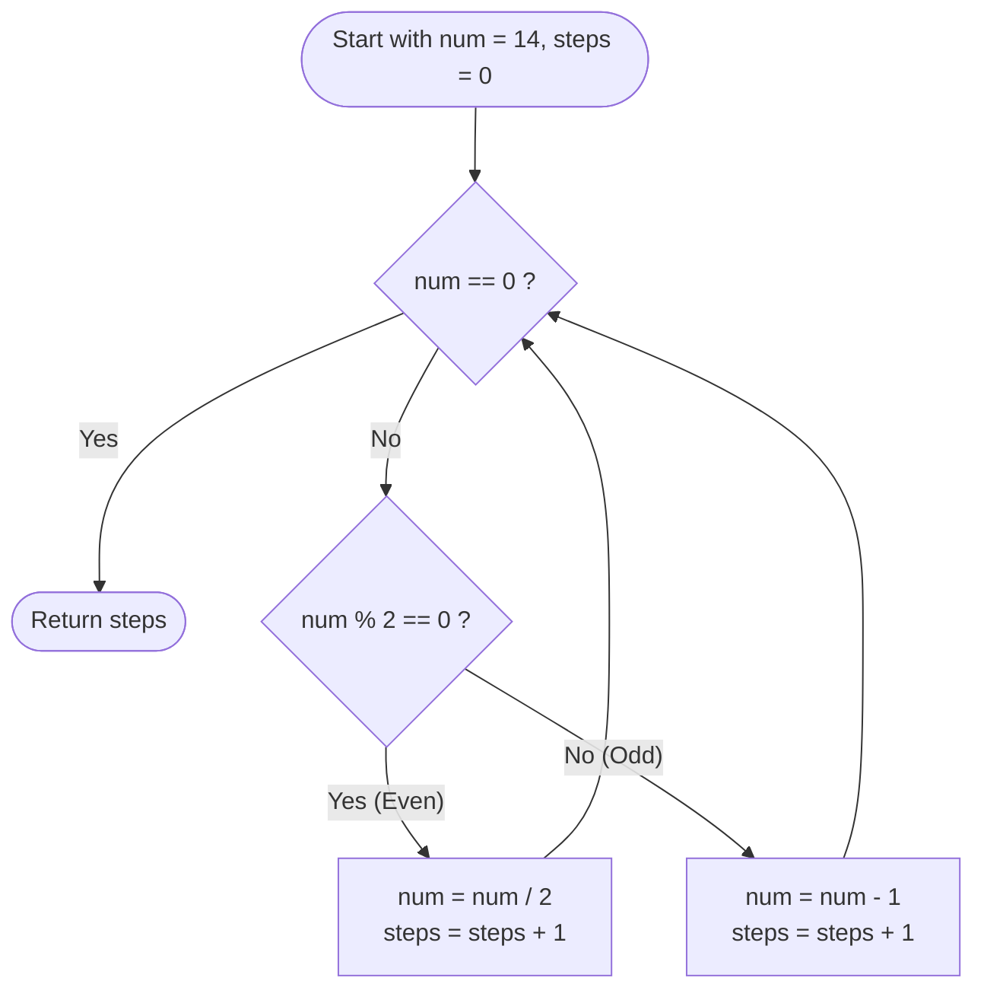

# Guided Example: Number of Steps to Reduce a Number to Zero

We trace the step-by-step execution of the optimal reduction simulation on a representative problem instance:

- **Input:** `num = 14`
- **Required output:** `6`

This instance is chosen because it exhibits an alternating sequence of even and odd values, exercising both operational branches (subtraction and halving) and illustrating the direct correspondence to binary digit elimination.

---

## 1. Instance & Teaching Goal

Given a non-negative integer `num`, we must determine the total number of operations required to reduce it to zero under the following rules:

1. If the current number is even, divide it by $2$.
2. If the current number is odd, subtract $1$ from it.

For `num = 14`:
- $14$ is even $\to 14 / 2 = 7$ (Step 1)
- $7$ is odd $\to 7 - 1 = 6$ (Step 2)
- $6$ is even $\to 6 / 2 = 3$ (Step 3)
- $3$ is odd $\to 3 - 1 = 2$ (Step 4)
- $2$ is even $\to 2 / 2 = 1$ (Step 5)
- $1$ is odd $\to 1 - 1 = 0$ (Step 6)

The primary teaching goal is to understand why this process is strictly deterministic, how each operation directly affects the binary representation of the integer, and how the total step count can be analyzed asymptotically via bitwise properties.

---

## 2. Conceptual Foundation & Invariants

At any point in the reduction, the integer $v$ has a binary representation $\sum_{i=0}^{k} b_i 2^i$ where $b_i \in \{0, 1\}$.

- Parity is determined by the least significant bit (LSB), $b_0 = v \pmod 2$.
- If $b_0 = 1$ ($v$ is odd), subtracting $1$ clears $b_0 \to 0$ without modifying higher-order bits.
- If $b_0 = 0$ ($v$ is even), dividing by $2$ shifts the entire bit sequence rightward by $1$ position ($v \gg 1$), discarding the trailing zero.

```
Initial (14):   1 1 1 0  (even -> shift right)
After Step 1:     1 1 1  (odd  -> clear LSB)
After Step 2:     1 1 0  (even -> shift right)
After Step 3:       1 1  (odd  -> clear LSB)
After Step 4:       1 0  (even -> shift right)
After Step 5:         1  (odd  -> clear LSB)
After Step 6:         0  (terminal zero reached)
```

We track state using three explicit parameters:

| State Parameter | Description | Initial Value |
|---|---|---|
| Current Value ($v$) | The positive integer remaining to be reduced | $14$ |
| Step Counter ($s$) | The number of valid reduction steps performed so far | $0$ |
| Parity Flag ($v \pmod 2$) | Indicates whether current operation is subtraction ($1$) or halving ($0$) | $14 \pmod 2 = 0$ |

> **Invariant.** At every step, the chosen operation is uniquely determined by $v \pmod 2$. An odd integer transitions to an even integer in exactly $1$ subtraction step, and an even positive integer transitions to $\lfloor v / 2 \rfloor$ in exactly $1$ division step. The step counter $s$ records strictly valid transitions, and the sequence monotonically approaches $0$.

---

## 3. Step-by-Step Worked Execution

### Step 1: Halving Even Value $14$

- **State before step:** $v = 14$, $s = 0$. Binary: $1110_2$.
- **Condition evaluation:** $v \pmod 2 = 14 \pmod 2 = 0$. The number is even.
- **Action:** Divide by $2$ (shift right: $14 \gg 1$).
- **State after step:** $v = 7$, $s = 1$. Binary: $111_2$.

| Parameter | Before Step | Applied Operation | After Step |
|---|---|---|---|
| Integer Value ($v$) | $14$ | Halve: $14 / 2$ | $7$ |
| Binary Form | $1110_2$ | Right shift by $1$ bit | $111_2$ |
| Step Counter ($s$) | $0$ | Increment by $1$ | $1$ |

---

### Step 2: Decrementing Odd Value $7$

- **State before step:** $v = 7$, $s = 1$. Binary: $111_2$.
- **Condition evaluation:** $v \pmod 2 = 7 \pmod 2 = 1$. The number is odd.
- **Action:** Subtract $1$ ($7 - 1 = 6$).
- **State after step:** $v = 6$, $s = 2$. Binary: $110_2$.

| Parameter | Before Step | Applied Operation | After Step |
|---|---|---|---|
| Integer Value ($v$) | $7$ | Decrement: $7 - 1$ | $6$ |
| Binary Form | $111_2$ | Clear least significant bit | $110_2$ |
| Step Counter ($s$) | $1$ | Increment by $1$ | $2$ |

---

### Step 3: Halving Even Value $6$

- **State before step:** $v = 6$, $s = 2$. Binary: $110_2$.
- **Condition evaluation:** $v \pmod 2 = 6 \pmod 2 = 0$. The number is even.
- **Action:** Divide by $2$ ($6 / 2 = 3$).
- **State after step:** $v = 3$, $s = 3$. Binary: $11_2$.

| Parameter | Before Step | Applied Operation | After Step |
|---|---|---|---|
| Integer Value ($v$) | $6$ | Halve: $6 / 2$ | $3$ |
| Binary Form | $110_2$ | Right shift by $1$ bit | $11_2$ |
| Step Counter ($s$) | $2$ | Increment by $1$ | $3$ |

---

### Step 4: Decrementing Odd Value $3$

- **State before step:** $v = 3$, $s = 3$. Binary: $11_2$.
- **Condition evaluation:** $v \pmod 2 = 3 \pmod 2 = 1$. The number is odd.
- **Action:** Subtract $1$ ($3 - 1 = 2$).
- **State after step:** $v = 2$, $s = 4$. Binary: $10_2$.

| Parameter | Before Step | Applied Operation | After Step |
|---|---|---|---|
| Integer Value ($v$) | $3$ | Decrement: $3 - 1$ | $2$ |
| Binary Form | $11_2$ | Clear least significant bit | $10_2$ |
| Step Counter ($s$) | $3$ | Increment by $1$ | $4$ |

---

### Step 5: Halving Even Value $2$

- **State before step:** $v = 2$, $s = 4$. Binary: $10_2$.
- **Condition evaluation:** $v \pmod 2 = 2 \pmod 2 = 0$. The number is even.
- **Action:** Divide by $2$ ($2 / 2 = 1$).
- **State after step:** $v = 1$, $s = 5$. Binary: $1_2$.

| Parameter | Before Step | Applied Operation | After Step |
|---|---|---|---|
| Integer Value ($v$) | $2$ | Halve: $2 / 2$ | $1$ |
| Binary Form | $10_2$ | Right shift by $1$ bit | $1_2$ |
| Step Counter ($s$) | $4$ | Increment by $1$ | $5$ |

---

### Step 6: Decrementing Final Odd Value $1$ to Zero

- **State before step:** $v = 1$, $s = 5$. Binary: $1_2$.
- **Condition evaluation:** $v \pmod 2 = 1 \pmod 2 = 1$. The number is odd.
- **Action:** Subtract $1$ ($1 - 1 = 0$).
- **State after step:** $v = 0$, $s = 6$. Terminal state reached.

| Parameter | Before Step | Applied Operation | After Step |
|---|---|---|---|
| Integer Value ($v$) | $1$ | Decrement: $1 - 1$ | $0$ |
| Binary Form | $1_2$ | Clear final bit | $0_2$ |
| Step Counter ($s$) | $5$ | Increment by $1$ | $6$ |

---

## 4. Complete Execution Trace

The full sequence of operations is summarized below:

| Step ($s$) | Current Value ($v$) | Binary Representation | Parity ($v \pmod 2$) | Operation Applied | Next Value | Cumulative Steps |
|---|---|---|---|---|---|---|
| 0 (Initial) | $14$ | $1110_2$ | $0$ (Even) | Divide by $2$ | $7$ | $1$ |
| 1 | $7$ | $111_2$ | $1$ (Odd) | Subtract $1$ | $6$ | $2$ |
| 2 | $6$ | $110_2$ | $0$ (Even) | Divide by $2$ | $3$ | $3$ |
| 3 | $3$ | $11_2$ | $1$ (Odd) | Subtract $1$ | $2$ | $4$ |
| 4 | $2$ | $10_2$ | $0$ (Even) | Divide by $2$ | $1$ | $5$ |
| 5 | $1$ | $1_2$ | $1$ (Odd) | Subtract $1$ | $0$ | $6$ |
| 6 (Final) | $0$ | $0_2$ | — | Loop terminates | — | **$6$** |

---

## 5. Algorithmic Correctness & Complexity Derivation

### Soundness and Completeness

At each iteration, if $v > 0$:
1. If $v$ is even, $v = 2k$ for some positive integer $k \ge 1$. The unique legal move is $v \to k$. Since $k < 2k$, $v$ strictly decreases.
2. If $v$ is odd, $v = 2k + 1$ for some integer $k \ge 0$. The unique legal move is $v \to 2k$. Since $2k < 2k + 1$, $v$ strictly decreases.

Because $v$ is a non-negative integer and strictly decreases on every move, by the well-ordering principle of natural numbers, the sequence must reach the lower bound $v = 0$ in finitely many steps.

### Closed-Form Binary Equivalence

Let $L(num)$ be the bit length of $num$, i.e., $L(num) = \lfloor \log_2(num) \rfloor + 1$ for $num > 0$. Let $P(num)$ be the population count (number of $1$ bits) of $num$.

- Each $1$ bit must eventually be shifted to the least significant bit position and decremented to $0$, incurring $1$ subtraction step.
- Each bit position from position $1$ up to $L(num) - 1$ must be shifted rightward past the least significant position, incurring $L(num) - 1$ division steps.
- The highest bit (most significant $1$) is decremented to $0$ at the final step without requiring an extra shift.

Thus, for any $num > 0$:
$$
\text{Total Steps} = (L(num) - 1) + P(num)
$$

For $num = 14$:
- $L(14) = 4$ ($1110_2$ has $4$ bits).
- $P(14) = 3$ (three $1$ bits).
- Total steps: $(4 - 1) + 3 = 3 + 3 = 6$.

### Asymptotic Complexity

- **Time Complexity:** $\mathcal{O}(\log(num))$. Each division halves the number, and each subtraction is immediately followed by a division (unless the value is $1$). Hence, at most $2 \lfloor \log_2(num) \rfloor + 1$ steps are executed, requiring $\mathcal{O}(\log(num))$ operations.
- **Auxiliary Space Complexity:** $\mathcal{O}(1)$. The algorithm requires only a constant number of scalar registers to hold the current value and step counter.

---

## 6. Traps & Edge Cases

- **Zero Input ($num = 0$):** If the input is $0$, the loop termination condition $v = 0$ is satisfied immediately before executing any steps. The algorithm correctly returns $0$ without negative underflow.
- **Input $num = 1$:** A single subtraction immediately brings $1 \to 0$. The step count is $1$. The formula $(1 - 1) + 1 = 1$ confirms this.
- **Powers of Two ($num = 2^k$):** For $num = 2^k$, the binary representation is $10\dots0_2$ with $k$ zeros and a single $1$. It requires exactly $k$ halving steps followed by $1$ subtraction step, yielding $k + 1$ steps.
- **Repetitive Subtractions Fallacy:** A common pitfall is expecting consecutive odd numbers. For any odd integer $v = 2k + 1$, subtracting $1$ yields $2k$, which is guaranteed to be even. Therefore, two subtractions can never occur consecutively.

---

## 7. Accessible Mermaid Diagram


