## Video Solution

---

<div>
  <div class="video-container">
    <iframe src="https://player.vimeo.com/video/725871856?texttrack=en-x-autogenerated" frameborder="0"
      allow="autoplay; fullscreen"></iframe>
  </div>
</div>

> At 4:57, the power of two labels are missing. From left to right, the labels should say: $2^7, \;$2^{6}$, \;$2^{5}$, \;$2^{4}$, \;$2^{3}$, \;$2^{2}$, \;$2^{1}$, \; 2^0$

## Solution

---

### Approach 1: Simulation

**Intuition**

The most intuitive, and easiest, solution is to simply simulate the rules and count how many steps are carried out in order to reach zero.

As an example, assume our starting value is `43`. The steps we need to take will be:

```
43 # Odd, subtract 1
42 # Even, divide by 2
21 # Odd, subtract 1
20 # Even, divide by 2
10 # Even, divide by 2
 5 # Odd, subtract 1
 4 # Even divide by 2
 2 # Even, divide by 2
 1 # Odd, subtract 1
 0
```

This is a total of `9` steps.

Here's an animation of this same algorithm being used with a starting value of `211`.

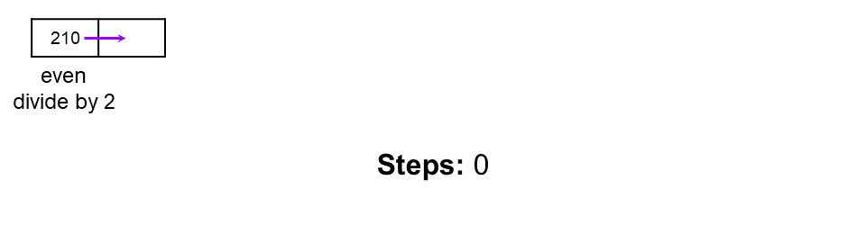

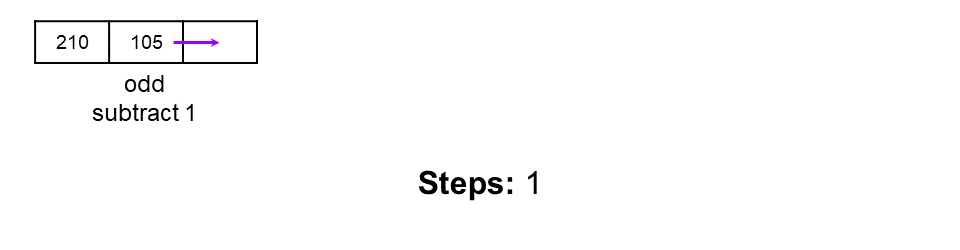

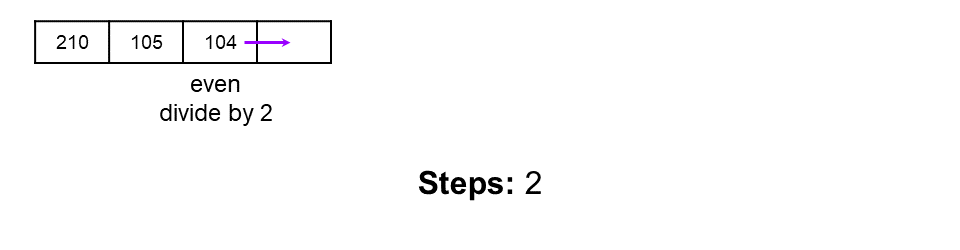

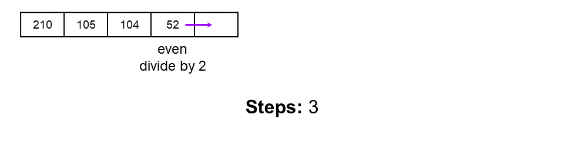

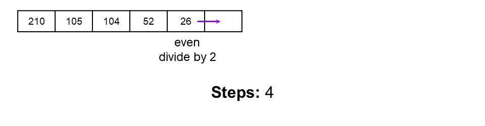

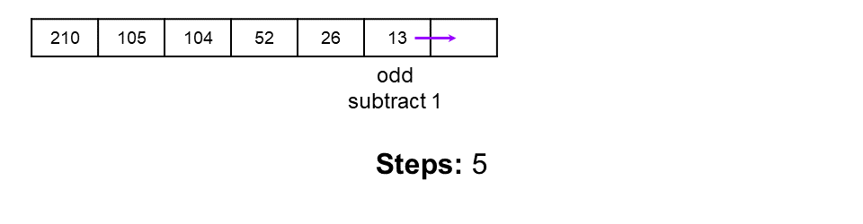

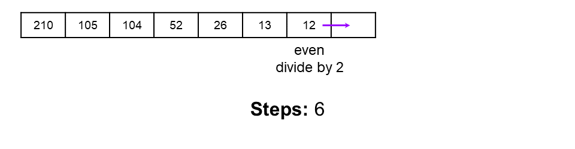

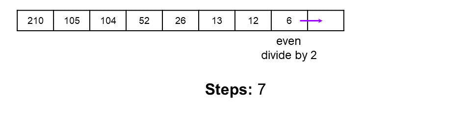

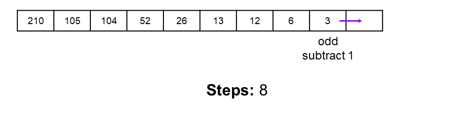

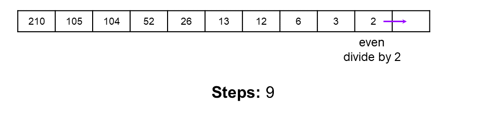

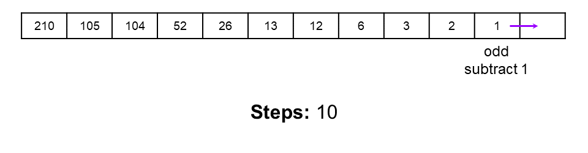

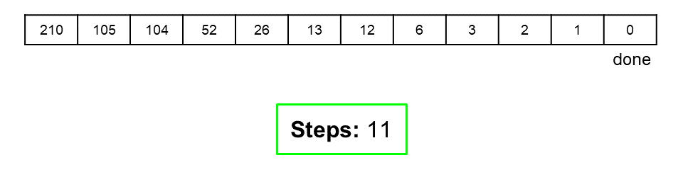

**Algorithm**

The algorithm works by simulating each step of the rules; if the current number is even then divide it by `2`. Else if it's odd, subtract `1` from it. Each time we perform one of these actions, we increment the steps we've taken by `1` so that we can return it at the end.

To check if a number is even or odd, we can use the *modulus* (`%`) operator. Recall that the *modulus* operator gives us the *remainder* when we divide two numbers. If `number % 2` is `1`, then we know `number` must be **odd**. Otherwise, the only other value it could be is `0`, which means `number` must be **even**.

```python
class Solution:
    def numberOfSteps(self, num: int) -> int:
        count = 0
        while num != 0:
            if num % 2 == 0:
                num /= 2
            else:
                num -= 1
            count += 1
        return count
```

**Complexity Analysis**

Let $n = num$.

- Time Complexity : $O(\log \, n)$.

    At each step, what we did depended on whether the remaining $num$ was odd or even. If $num$ was even, we *halved* what was left. If it was odd, we only subtracted $1$. *However*, by subtracting $1$, we were making it *even*, and so on the next step we were *guaranteed* to halve it.

    What this means is that in the worst case, we're halving it on every *second* step. We treat the $\frac{1}{2}$ of the time as a constant though, so in essence, we say that at each step, $num$ is being halved.

    When something is halved at every step, it has a $O(\log \, n)$ time complexity.

- Space Complexity : $O(1)$.

    We only use a constant number of integer variables, and so the space complexity is $O(1)$.

It's impossible for us to do better than a time complexity of $O(\log \, n)$—unless we were willing to hardcode all 1 million possible cases we could be given (the problem statement says $0 \le num \le 10^{6}$). But we really don't want to do that! By the end of this article, you'll be able to see why it's *impossible* for an algorithm to do better.

</br>

---

### Approach 2: Counting Bits

*Note: Approach 2 and 3 don't change the time complexity, but they offer a different way of thinking about the problem that studying will hopefully help you expand your problem solving skills! A prerequisite for these last 2 approaches is knowing how numbers are represented in binary.*

At each step, we either subtract `1` from `num`, or we divide `num` by `2`. In binary, these two operations do something very simple, but very interesting, to a number!

Recall that odd numbers always have a last bit of `1`. Subtracting `1`, *from an odd number*, **changes the last bit** from `1` to `0`.

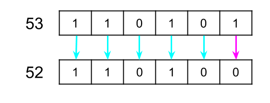

Dividing by `2` **removes the last bit** from the number.

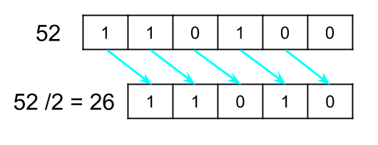

For example, have a look at the binary representation of `210` as it's reduced to zero.

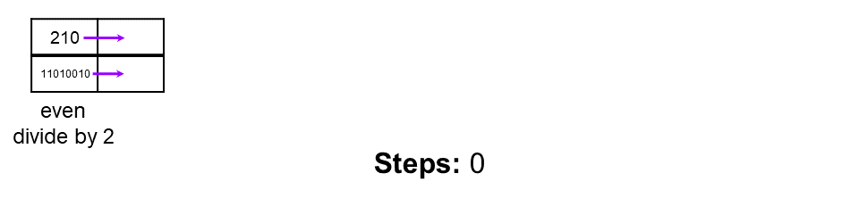

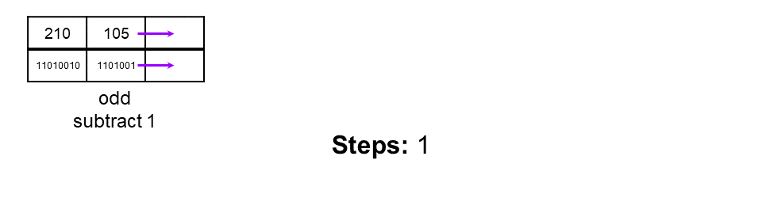

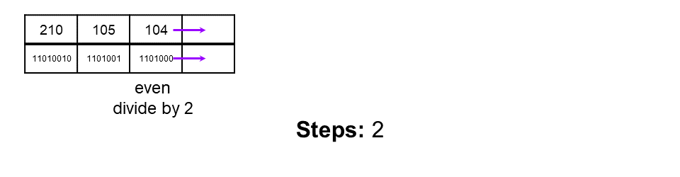

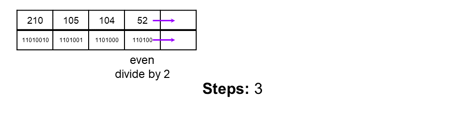

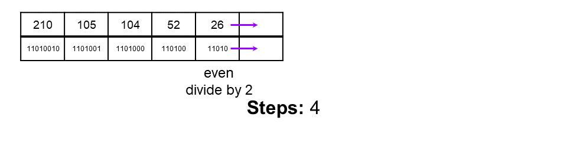

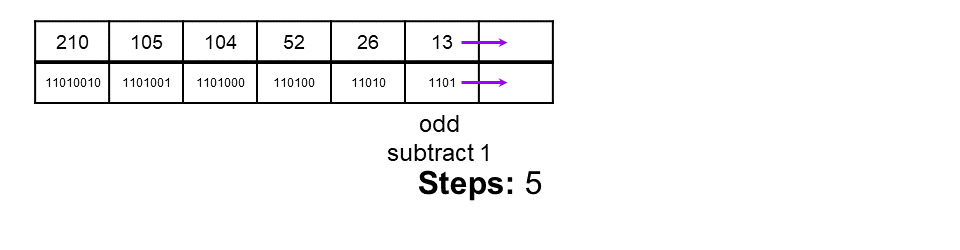

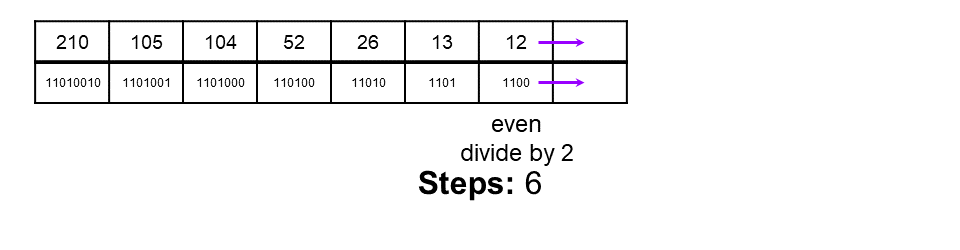

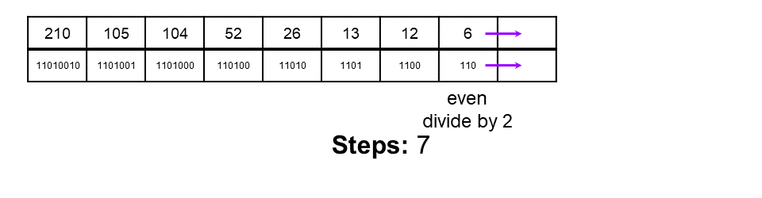

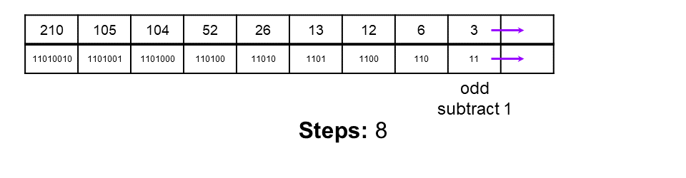

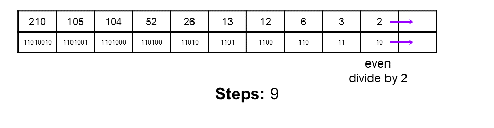

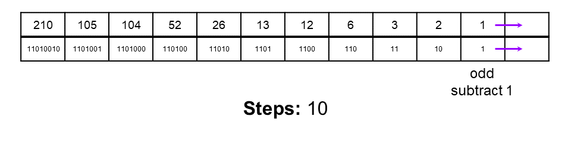

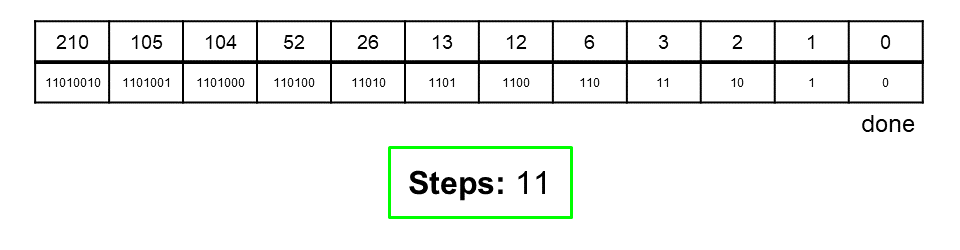

The bits slid along, and each became the "last" bit. Notice how the `0`s took **one** step to remove, and the `1`s took **two** steps to remove.

This means that we could simply analyze the binary representation of the starting `num` to determine the number of steps needed to reduce it.

So, to get our answer, we can just add two steps for every `1`, and add one step for every `0`, for each bit in the binary representation.

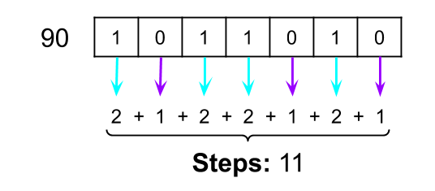

There's one thing to be careful of, and that is not inadvertently counting the last bit as two steps. The last bit to remove will *always* be a `1`—it was the most significant bit in the original `num`. The algorithm above would add *2* for removing this final `1`. But actually, when we subtract `1` from it, it goes to zero. So we don't need add two steps for this bit. The simplest way of handling this case is to subtract `1` from our *final* `steps` count, as we know this "off-by-one-error" will always happen (except when the initial `num` is `0`, we need to be careful of that edge case too!).

Let's look at another example. The number we'll use is `78`; this can be written in binary as `1001110`. The binary contains four `1`s and three `0`s, so our total number of steps must be $(4 * 2) + (3 * 1) - 1 = 10$. This the correct result!

**Algorithm**

To count the bits we'll convert our number into a binary string, for each character if it's a `"1"` we'll add two steps, else if it's `"0"` we'll add one step.

In **Java**, we can use `Integer.toBinaryString(...)` to convert an int to binary. The binary number is represented as `String`.

In **Python**, we can use `bin(...)` to convert an int to binary. Like in Java, the binary number is represented as a `str`. However, it also contains `0b` on the start—this is simply a code to say the `str` is a binary number. The "pythonic" thing to do is chop these two characters off with a list splice. i.e., to get the binary for `num`, you would do `bin(num)[2:]`.

```java
public int numberOfSteps(int num) {
    // Get the binary for num, as a String.
    String binaryString = Integer.toBinaryString(num);

    int steps = 0;
    // Iterate over all the bits in the binary string.
    for (char bit : binaryString.toCharArray()) {
        if (bit == '1') { // If the bit is a 1
            steps = steps + 2; // Then it'll take 2 to remove.
        } else { // bit == '0'
            steps = steps + 1; // Then it'll take 1 to remove.
        }
    }

    // We need to subtract 1, because the last bit was over-counted.
    return steps - 1;
}
```

In Python, we can do this really elegantly using the `string.count(...)` and `len(...)` functions.

```python
class Solution:
    def numberOfSteps(self, num: int) -> int:
        # Handle the edge case where num = 0
        if num == 0:
            return 0

        # Convert num to binary and remove the "0b" prefix
        binary = bin(num)[2:]

        # Each '1' contributes 2 steps, each '0' contributes 1 step
        steps = binary.count('1') * 2 + binary.count('0') * 1

        # Subtract 1 because the last '1' is overcounted
        return steps - 1
```

**Complexity Analysis**

Let $n = num$.

- Time Complexity : $O(\log \, n)$.

    Converting a number into string can be done in $\log \, n$ time.

    We then loop over each bit, doing a single operation each time. The number of bits in a number is $\log_2 \, number$, so the time complexity is $O(\log \, n)$.

- Space Complexity : $O(\log \, n)$.

    Because we convert the number into a string, we'll have $\log_2 \, number$ characters in our string. This gives us a space complexity of $O(\log \, n)$.

</br>

---

### Approach 3: Counting Bits with Bitwise Operators

In Approach 2, we needed to convert the number into a string representation. Strings are considerably larger than the integer they represent though. Another way of inspecting bits, to check if they're `1` or `0`, is to use the bitwise-and (`&`) operator.

The result of `a & b` (`a` bitwise-and `b`) looks at each bit in both `a` and `b` at the same time. If both bits are `1` then bitwise-and sets the same bit of the result to `1`, but if either are `0` it sets the bit to `0`.

For example, `109` and `57` can be written as `1101101` and `111001` respectively. This image shows what happens when we bitwise-and them.

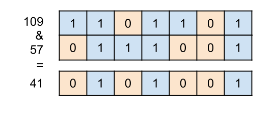

So, to actually inspect a specific bit, we can use a number that has a `1` followed by enough `0`s to put the `1` at the position we want it (we commonly call this a "bitmask"). With this number, we bitwise-and (`&`) it with the input number. If the input number has a `1` at the same position, it'll output `1` at that position, and because all other numbers are `0` they will be `0` in the output as well.

These numbers of the form `1`, followed by some number of `0`s, are actually just the powers of two, where the power is the number of `0`s after the one. As such, we can check if a bit is a `1` in a number by doing `num & (1 << bit)` where `bit` is the bit we want to check (0-indexed from the right).

For example, let's check if the *sixth* bit of `109` is a `1`.

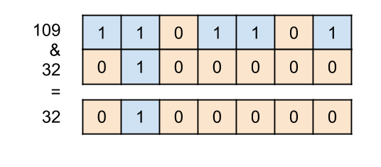

The output is `100000`, which *is not* zero. Therefore, we know that the sixth bit has to be a `1`.

Let's also check if the the fifth bit of `109` is a `1`.

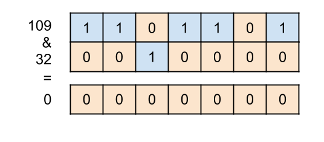

The output is `0000000`, which *is* zero. Therefore, we know that the fifth bit must be a `0`.

Just like Approach 2, we look at each bit, and if it's a `1` we add `2` to `steps`, otherwise if it's a `0`, we add `1` to `steps`.

**Algorithm**

Unlike the previous approach, this approach won't work correctly when $num = 0$ is the input. The previous approach did an iteration for the lone `0` bit as it was in the string, but for this approach the loop won't run at all. `-1` will then be returned because of the $steps - 1$. The solution is to check for $num = 0$ at the start and `return 0` if it is detected.

```python
class Solution:
    def numberOfSteps(self, num: int) -> int:
        if num == 0:
            return 0

        steps = 0
        powerOfTwo = 1
        while powerOfTwo <= num:
            if (powerOfTwo & num) != 0:
                steps = steps + 2
            else:
                steps = steps + 1
            powerOfTwo = powerOfTwo * 2

        return steps - 1
```

**Complexity Analysis**

Let $n = num$.

- Time Complexity : $O(\log \, n)$.

    We're pulling out each of the $\log \, n$ bits from `num` and performing an $O(1)$ operation on each one. Therefore, the total time complexity is, again, $O(\log \, n)$.

- Space Complexity : $O(1)$.

    We only use a constant number of integer variables, and so the space complexity is $O(1)$.

</br>