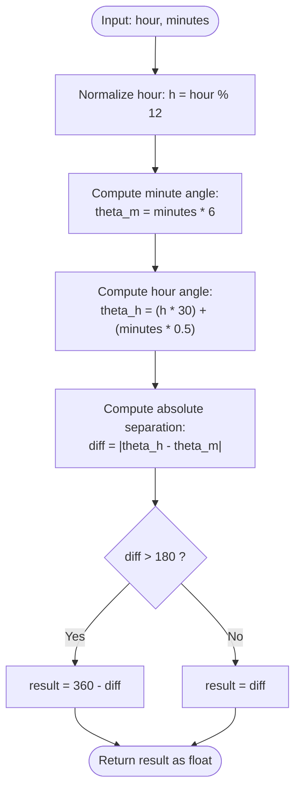

# Guided Example: Angle Between Hands of a Clock

We trace the step-by-step execution of the optimal geometric calculation on a representative problem instance:

- **Input:** `hour = 12`, `minutes = 30`
- **Required output:** `165.0`

This instance is chosen because it demonstrates non-trivial continuous hour-hand movement (the hour hand advances halfway between $12$ and $1$ as minutes reach $30$), clock-face modular arithmetic around the $12$ o'clock boundary, and minimal interior angle selection.

---

## 1. Instance & Teaching Goal

A traditional analog clock is divided into $12$ hours and $60$ minutes over a full circular dial of $360^\circ$. Given `hour` and `minutes`, we must compute the smaller of the two angles formed between the hour hand and the minute hand.

For `hour = 12, minutes = 30`:
1. The minute hand points directly downwards at the $6$ o'clock tick, representing $180^\circ$ from the $12$ o'clock reference.
2. The hour hand does not sit statically on $12$; during the $30$ elapsed minutes, it has continuously moved halfway toward $1$, positioning itself at $15^\circ$.
3. The absolute difference between hands is $|15^\circ - 180^\circ| = 165^\circ$.
4. Since $165^\circ \le 180^\circ$, the smaller angle is $165.0^\circ$.

The primary learning goal is to master continuous angular velocity equations on circular domains, proper modulo handling for the $12$ o'clock reference line, and circular interior angle selection.

---

## 2. Conceptual Foundation & Invariants

A complete rotation comprises $360^\circ$. Angular velocities are derived as follows:

- **Minute Hand:** Traverses $360^\circ$ in $60$ minutes:
  $$
  \omega_{\text{min}} = \frac{360^\circ}{60} = 6^\circ \text{ per minute}
  $$
- **Hour Hand:** Traverses $360^\circ$ in $12$ hours ($720$ minutes):
  $$
  \omega_{\text{hr, base}} = \frac{360^\circ}{12} = 30^\circ \text{ per hour}
  $$
  Additionally, for every minute that elapses, the hour hand advances:
  $$
  \omega_{\text{hr, min}} = \frac{30^\circ}{60} = 0.5^\circ \text{ per minute}
  $$

```
               12 (0° / 360°)
            11       1  -> Hour hand at 15° (halfway to 1)
         10             2
        9        ·        3
         8             4
            7        5
                6 (180°) -> Minute hand at 180°
```

We track state using the following geometric parameters:

| State Parameter | Description | Metric Formula | Initial Value |
|---|---|---|---|
| Normalized Hour ($h'$) | Hour mapped to the interval $[0, 11]$ | $h' = \text{hour} \pmod{12}$ | $12 \pmod{12} = 0$ |
| Minute Angle ($\theta_m$) | Angular position of minute hand from 12 o'clock | $\theta_m = 6 \times \text{minutes}$ | $6 \times 30 = 180^\circ$ |
| Hour Angle ($\theta_h$) | Angular position of hour hand from 12 o'clock | $\theta_h = 30 \times h' + 0.5 \times \text{minutes}$ | $30 \times 0 + 15 = 15^\circ$ |
| Angular Difference ($\Delta$) | Absolute angular gap between both hands | $\Delta = \lvert \theta_h - \theta_m \rvert$ | $\lvert 15 - 180 \rvert = 165^\circ$ |

> **Invariant.** The angular positions $\theta_m$ and $\theta_h$ represent exact continuous orientations on the circle measured clockwise from the vertical $12$ o'clock axis ($0^\circ$). The smaller angle between two vectors on a $360^\circ$ circle is always given by $\min(\Delta, 360^\circ - \Delta)$, which is strictly bounded in $[0^\circ, 180^\circ]$.

---

## 3. Step-by-Step Worked Execution

### Step 1: Compute Minute Hand Angle $\theta_m$

The minute hand starts at the $12$ mark ($0^\circ$) at minute $0$ and travels clockwise at $6^\circ/\text{min}$.
- Given $\text{minutes} = 30$:
  $$
  \theta_m = 30 \times 6^\circ = 180^\circ
  $$

| Parameter | Value | Operation | Result |
|---|---|---|---|
| Minute Hand Rate | $6^\circ / \text{min}$ | Base rotation rate | Constant |
| Elapsed Minutes | $30$ | Scalar multiplication by $6^\circ$ | $180^\circ$ |
| Resulting Angle ($\theta_m$) | $0^\circ \to 180^\circ$ | Clockwise rotation from vertical axis | $180^\circ$ |

---

### Step 2: Compute Hour Hand Angle $\theta_h$

The hour hand angle depends on both the hour index and the fraction of the current hour elapsed:
1. Normalize the hour: $\text{hour} = 12 \implies h' = 12 \pmod{12} = 0$.
2. Base hour contribution: $h' \times 30^\circ = 0 \times 30^\circ = 0^\circ$.
3. Fractional minute contribution: $\text{minutes} \times 0.5^\circ = 30 \times 0.5^\circ = 15^\circ$.
4. Total hour hand position:
   $$
   \theta_h = 0^\circ + 15^\circ = 15^\circ
   $$

| Parameter | Value | Operation | Result |
|---|---|---|---|
| Normalized Hour ($h'$) | $12 \to 0$ | $12 \pmod{12}$ | $0$ |
| Hourly Component | $0 \times 30^\circ$ | Base hour ticks | $0^\circ$ |
| Minute Shift Component | $30 \times 0.5^\circ$ | Continuous advancement | $15^\circ$ |
| Total Angle ($\theta_h$) | $0^\circ + 15^\circ$ | Summation of components | $15^\circ$ |

---

### Step 3: Compute Absolute Angular Separation $\Delta$

Compute the unsigned circular arc between the two hands:
$$
\Delta = |\theta_h - \theta_m| = |15^\circ - 180^\circ| = |-165^\circ| = 165^\circ
$$

| Parameter | Before Step | Applied Operation | After Step |
|---|---|---|---|
| $\theta_h$ | $15^\circ$ | Subtract $\theta_m$ | $-165^\circ$ |
| $\theta_m$ | $180^\circ$ | Absolute value: $\lvert -165^\circ \rvert$ | $165^\circ$ |
| Separation ($\Delta$) | Uncomputed | Verified positive difference | $165^\circ$ |

---

### Step 4: Minimal Arc Selection

Any two rays from the center partition the clock circle into two interior angles summing to $360^\circ$:
- Interior Arc $1$: $\Delta = 165^\circ$
- Complementary Arc $2$: $360^\circ - \Delta = 360^\circ - 165^\circ = 195^\circ$

Select the minimum:
$$
\text{result} = \min(165^\circ, 195^\circ) = 165.0^\circ
$$

| Parameter | Arc 1 ($\Delta$) | Arc 2 ($360^\circ - \Delta$) | Selected Minimum |
|---|---|---|---|
| Angle Values | $165.0^\circ$ | $195.0^\circ$ | **$165.0^\circ$** |

---

## 4. Complete Execution Trace

We contrast the target instance against several key reference times to verify consistency across quadrant transitions:

| Time (`hour:min`) | $h' = \text{hour} \pmod{12}$ | $\theta_h = 30h' + 0.5m$ | $\theta_m = 6m$ | Difference $\Delta$ | $360^\circ - \Delta$ | Smaller Angle ($\min$) |
|---|---|---|---|---|---|---|
| **12:30 (Target)** | $0$ | $15.0^\circ$ | $180.0^\circ$ | $165.0^\circ$ | $195.0^\circ$ | **$165.0^\circ$** |
| 12:00 | $0$ | $0.0^\circ$ | $0.0^\circ$ | $0.0^\circ$ | $360.0^\circ$ | $0.0^\circ$ |
| 3:30 | $3$ | $105.0^\circ$ | $180.0^\circ$ | $75.0^\circ$ | $285.0^\circ$ | $75.0^\circ$ |
| 3:15 | $3$ | $97.5^\circ$ | $90.0^\circ$ | $7.5^\circ$ | $352.5^\circ$ | $7.5^\circ$ |
| 4:50 | $4$ | $145.0^\circ$ | $300.0^\circ$ | $155.0^\circ$ | $205.0^\circ$ | $155.0^\circ$ |
| 1:55 | $1$ | $57.5^\circ$ | $330.0^\circ$ | $272.5^\circ$ | $87.5^\circ$ | $87.5^\circ$ |

---

## 5. Algorithmic Correctness & Complexity Derivation

### Algebraic Soundness

Let the position of the hands be continuous functions of time $t \in [0, 720)$ minutes from 12:00:
$$
\theta_m(t) = (6 t) \pmod{360}
$$
$$
\theta_h(t) = (0.5 t) \pmod{360}
$$

The angular distance between two points on the circle $\mathbb{R} / 360\mathbb{Z}$ is defined as:
$$
d(\theta_1, \theta_2) = \min(|\theta_1 - \theta_2|, 360^\circ - |\theta_1 - \theta_2|)
$$
Because $|\theta_1 - \theta_2| \in [0^\circ, 360^\circ]$, the smaller arc is uniquely identified by the minimum function and satisfies $0^\circ \le d(\theta_1, \theta_2) \le 180^\circ$.

### Complexity

- **Time Complexity:** $\mathcal{O}(1)$. The calculation involves only a fixed sequence of basic arithmetic operations (multiplication, modulo, subtraction, minimum).
- **Auxiliary Space Complexity:** $\mathcal{O}(1)$. The computation requires no dynamic structures, storing only scalar floating-point values.

---

## 6. Traps & Edge Cases

- **Neglecting Hour Modulo ($12 \to 0$):** If $12$ is not normalized to $0$, the hour angle at 12:30 would be calculated as $12 \times 30 + 15 = 375^\circ$. While a subsequent modulo $360$ fixes this, failing to normalize causes incorrect differences.
- **Ignoring Minute Drift of Hour Hand:** Assuming the hour hand stays fixed at $12$ (giving $0^\circ$) yields an angle of $180^\circ$ instead of the true $165^\circ$.
- **Returning the Reflex Angle ($> 180^\circ$):** When the direct difference $\Delta > 180^\circ$ (e.g., at 1:55 where $\Delta = 272.5^\circ$), one must return the supplementary interior angle $360^\circ - 272.5^\circ = 87.5^\circ$.
- **Precision and Typing:** Calculations must use floating-point division or multiplication by $0.5$ rather than integer truncation to preserve fractional degree increments (such as $.5^\circ$).

---

## 7. Accessible Mermaid Diagram


