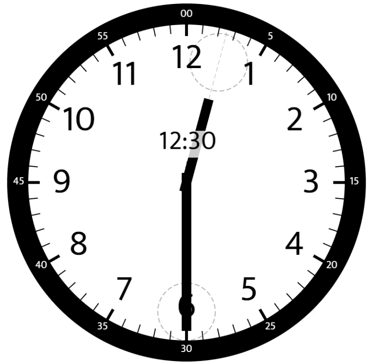
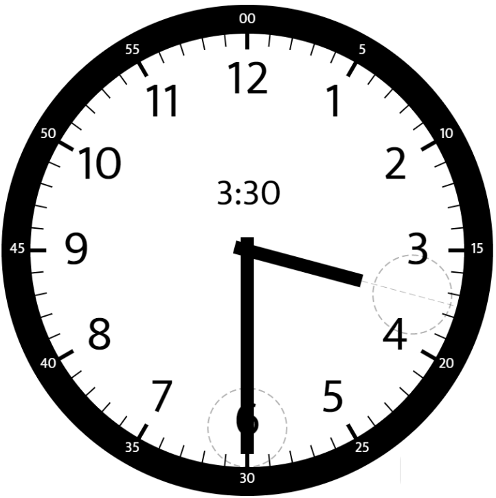
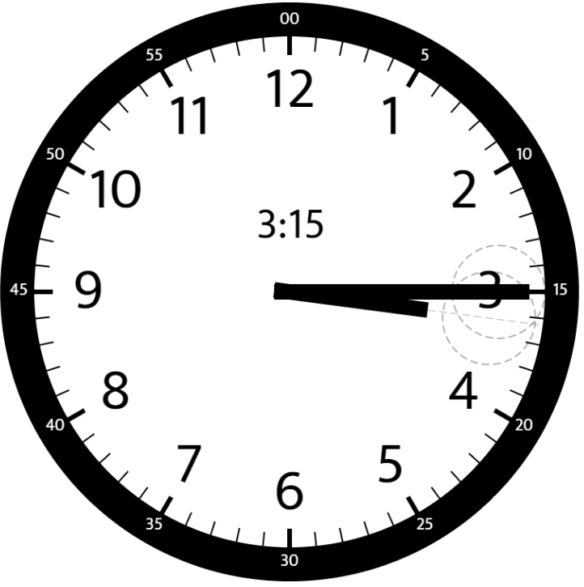

### 1. Description

Given two numbers, `hour` and `minutes`, return *the smaller angle (in degrees) formed between the *`hour`* and the *`minute`* hand*.

Answers within $10^{-5}$ of the actual value will be accepted as correct.

### 2. Function Contract

- `n`: Input parameter.
- Returns expected result.

### 3. Examples

#### Example 1

- **Input:** $hour = 12, minutes = 30$
- **Output:** `165`
#### Example 2

- **Input:** $hour = 3, minutes = 30$
- **Output:** `75`
#### Example 3

- **Input:** $hour = 3, minutes = 15$
- **Output:** `7.5`

### 4. Constraints

- $1 \le hour \le 12$

- $0 \le minutes \le 59$