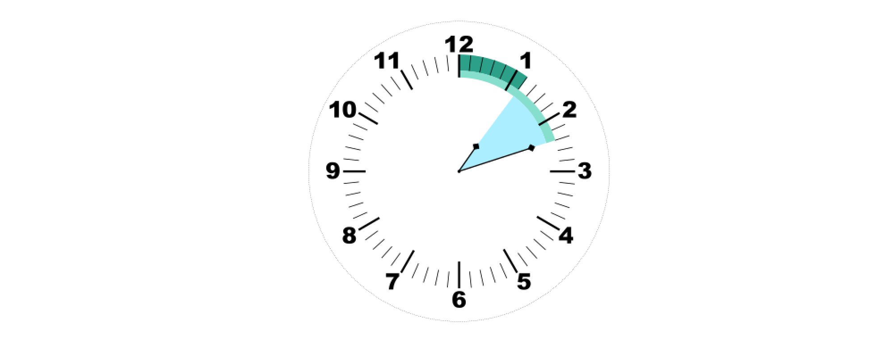
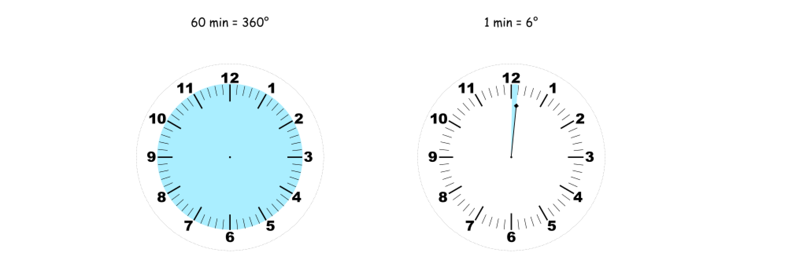
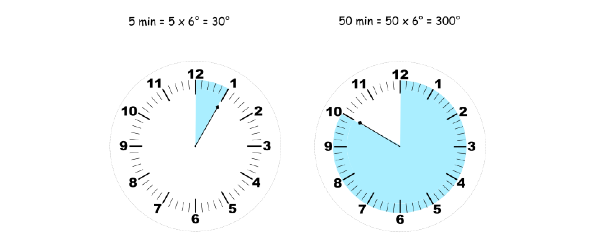
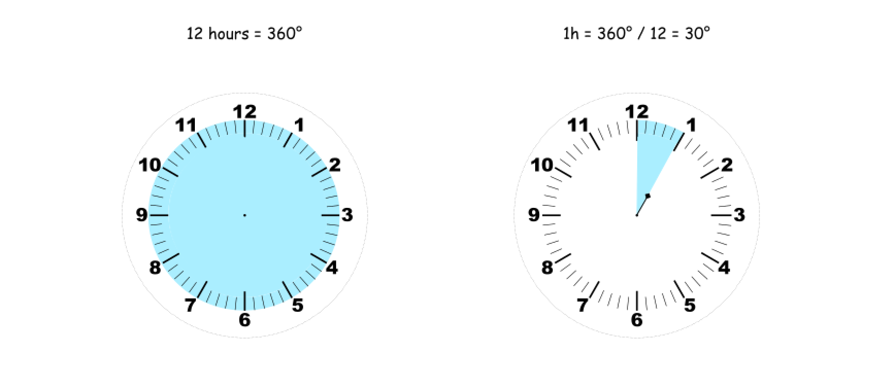
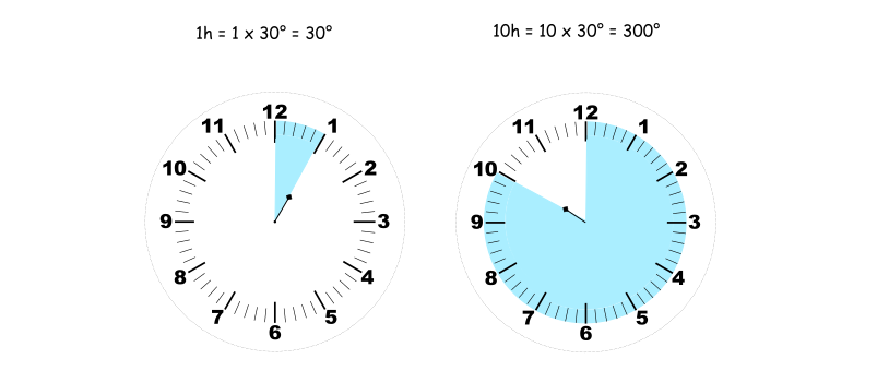
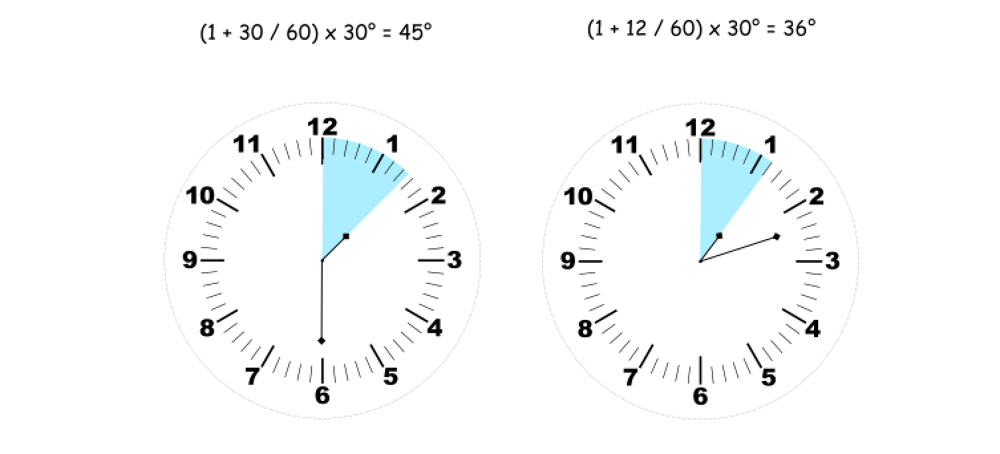

## Solution

---

### Approach 1: Math

**Intuition**

The idea is to calculate separately the angles between a 0-minutes vertical line and each hand. The answer is the difference between these two angles.



**Minute Hand Angle**

Let's start from the minute hand. The whole circle is equal to $360°$ or 60 minutes, _i.e._ minute hand moves $1 \text{ min} = 360° / 60 = 6°$ degree at each minute.



Now one could easily find an angle between the 0-minute vertical line and a minute hand: $\text{minutes\\_angle} = \text{minutes} \times 6°$.



**Hour Hand Angle**

Similarly, with the minute hand angle, the whole circle is equal to $360°$ or 12 hours, hence for each hour, the hour hand moves $1 \text{h} = 360° / 12 = 30°$ degree.



Now for the "minutes = 0" case, one could easily find an angle between the 12-hour vertical line and an hour hand: $\text{hour\\_angle} = \text{hour} \times 30°$.



Note that for 12 hours, the actual angle is zero, therefore the expression has to be corrected $\text{hour\\_angle} = (\text{hour mod } 12) \ \times 30°$.

In a more general case where "minutes > 0", one has to take into account an additional movement of hour hand: it doesn't jump between the integer values but follows the movement of the minute hand as well

$\text{hour\\_angle} = \left(\text{hour mod } 12 + \text{minutes} / 60 \right)\times 30°$



**Algorithm**

- Initialize the constants: $one_min_angle = 6$, $one_hour_angle = 30$.

- The angle between the minute hand and the 0-minute vertical line is $\text{minutes}_{angle} = one_min_angle * minutes$.

- The angle between the hour hand and the 12-hour vertical line is $\text{hour}_{angle} = (hour \% 12 + minutes / 60) * one_hour_angle$.

- Find the difference: $diff = abs(\text{hour}_{angle} - \text{minutes}_{angle})$.

- Return the smallest angle: $min(diff, 360 - diff)$.

**Implementation**

```python
class Solution:
    def angleClock(self, hour: int, minutes: int) -> float:
        one_min_angle = 6
        one_hour_angle = 30

        minutes_angle = one_min_angle * minutes
        hour_angle = (hour % 12 + minutes / 60) * one_hour_angle

        diff = abs(hour_angle - minutes_angle)
        return min(diff, 360 - diff)
```

**Complexity Analysis**

* Time complexity : $\mathcal{O}(1)$.

* Space complexity : $\mathcal{O}(1)$.
<br />
<br />