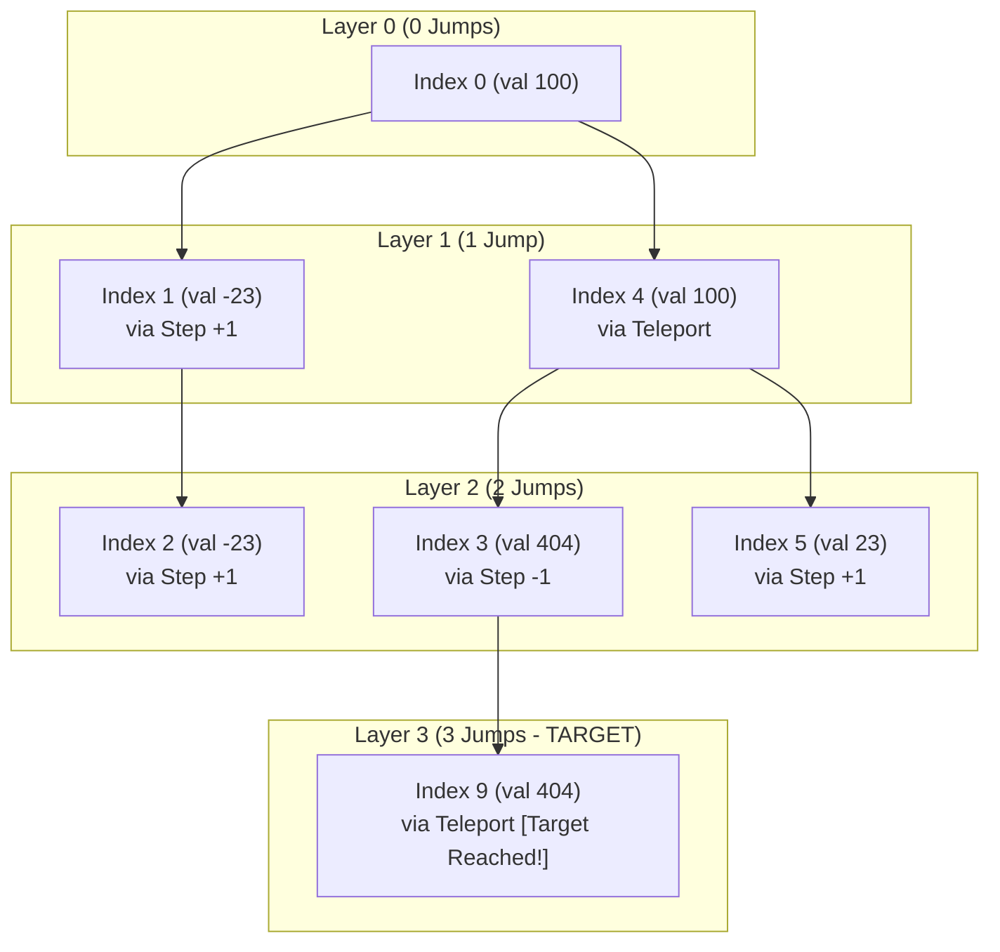

# Guided Example: Jump Game IV

We trace the step-by-step execution of the optimal breadth-first search (BFS) strategy on a representative problem instance:

- **Input:** `arr = [100, -23, -23, 404, 100, 23, 23, 23, 3, 404]`
- **Required output:** `3`

This instance is chosen because it contains multiple duplicate clusters (`-23`, `100`, `23`, `404`), demonstrating how equal-value teleportation interacts with adjacent neighbor stepping, and why immediate bucket clearance is essential to avoid quadratic time complexity.

---

## 1. Instance & Teaching Goal

Given an integer array `arr`, we begin at index $0$ and wish to reach the final index $N - 1$ in the minimum number of jumps. From index $i$, three types of transitions are permitted:
1. **Forward step:** $i + 1$ (if $i + 1 < N$).
2. **Backward step:** $i - 1$ (if $i - 1 \ge 0$).
3. **Value teleportation:** $j$ such that $arr[i] = arr[j]$ and $i \ne j$.

For `arr` of length $N = 10$:
```
Index:  0    1    2    3    4    5   6   7   8   9
Value: 100 -23  -23  404  100  23  23  23   3  404
```

The optimal 3-jump trajectory is:
$$\text{Index } 0 \; (100) \xrightarrow{\text{teleport}} \text{Index } 4 \; (100) \xrightarrow{\text{step } -1} \text{Index } 3 \; (404) \xrightarrow{\text{teleport}} \text{Index } 9 \; (404)$$

The primary teaching goal is to model the search as an unweighted shortest-path problem on a graph, understand why standard BFS guarantees minimal jump count, and apply the crucial optimization that clears equal-value neighbor lists once visited.

---

## 2. Conceptual Foundation & Invariants

Let $G = (V, E)$ be a graph where vertices $V = \{0, 1, \dots, N-1\}$. An unweighted directed edge exists between $u$ and $v$ if $v \in \{u-1, u+1\}$ or $arr[u] = arr[v]$.

Because edge weights are uniformly $1$, Breadth-First Search (BFS) explores vertices in strictly non-decreasing order of distance from the source $0$.

```
Index 0 (100)
   |-- Teleport --> Index 4 (100)
   |                   |-- Step -1 --> Index 3 (404)
   |                                      |-- Teleport --> Index 9 (404) [TARGET REACHED: 3 Jumps]
   |-- Step +1  --> Index 1 (-23)
                       |-- Teleport --> Index 2 (-23)
```

Without pruning, an array where many elements share identical values can cause a single value clique of size $K$ to generate $\mathcal{O}(K^2)$ edge explorations. To maintain linear complexity, once a value bucket is traversed, its entry is purged from the adjacency lookup map.

| State Parameter | Description | Initial Value |
|---|---|---|
| Frontier Queue ($Q$) | FIFO queue of indices to process at current distance layer | `[0]` |
| Visited Array ($\text{vis}$) | Boolean array indicating whether an index has entered $Q$ | `vis[0] = true`, others `false` |
| Jump Distance ($d$) | Number of edges traversed from source | $0$ |
| Value Buckets ($M$) | Hash map mapping each unique value to all its array indices | Grouped occurrences |

> **Invariant.** At the start of layer $d$, the queue $Q$ contains only unvisited indices reachable from index $0$ in exactly $d$ steps. Once the indices associated with value $v = arr[i]$ are enqueued, the list $M[v]$ is cleared so that duplicate jumps across identical values are evaluated at most once throughout the entire search.

---

## 3. Step-by-Step Worked Execution

### Step 0: Preprocessing Adjacency Buckets

We group all indices by value into a hash map $M$:
- $M[100] = [0, 4]$
- $M[-23] = [1, 2]$
- $M[404] = [3, 9]$
- $M[23] = [5, 6, 7]$
- $M[3] = [8]$

Queue initialized to `[0]`, `vis = {0}`, distance `d = 0`.

| Parameter | Initial State |
|---|---|
| Queue ($Q$) | `[0]` |
| Visited Set | `{0}` |
| Current Distance | $0$ |

---

### Step 1: Processing Layer $d = 0$

Current layer size is $1$. Pop index $0$ ($arr[0] = 100$).

1. **Adjacent Transitions:**
   - $0 - 1 = -1$ (out of bounds).
   - $0 + 1 = 1$ (valid, unvisited). Enqueue $1$, mark `vis[1] = true`.
2. **Teleport Transitions for Value $100$:**
   - Indices in $M[100]$: $[0, 4]$.
   - Index $0$ already visited.
   - Index $4$ unvisited: enqueue $4$, mark `vis[4] = true`.
3. **Pruning:** Clear $M[100] = []$ to prevent re-scanning.

Layer complete. Queue for next layer: `[1, 4]`. Increment distance $d \to 1$.

| Index Popped | Value | Neighbors Added | Updated Queue | Action on Bucket |
|---|---|---|---|---|
| $0$ | $100$ | $1$ (step), $4$ (teleport) | `[1, 4]` | Cleared $M[100]$ |

---

### Step 2: Processing Layer $d = 1$

Current layer size is $2$.

#### Sub-step 2a: Pop Index $1$ ($arr[1] = -23$)
- Backward: $1 - 1 = 0$ (already visited).
- Forward: $1 + 1 = 2$ (unvisited). Enqueue $2$, mark `vis[2] = true`.
- Teleport from $M[-23] = [1, 2]$:
  - Index $1$ visited.
  - Index $2$ just marked visited.
- Clear $M[-23] = []$.

#### Sub-step 2b: Pop Index $4$ ($arr[4] = 100$)
- Backward: $4 - 1 = 3$ (unvisited). Enqueue $3$, mark `vis[3] = true`.
- Forward: $4 + 1 = 5$ (unvisited). Enqueue $5$, mark `vis[5] = true`.
- Teleport from $M[100]$: already empty, $0$ operations.

Layer complete. Queue for next layer: `[2, 3, 5]`. Increment distance $d \to 2$.

| Index Popped | Value | Neighbors Added | Updated Queue | Action on Bucket |
|---|---|---|---|---|
| $1$ | $-23$ | $2$ (step) | `[4, 2]` | Cleared $M[-23]$ |
| $4$ | $100$ | $3$ (step), $5$ (step) | `[2, 3, 5]` | $M[100]$ already empty |

---

### Step 3: Processing Layer $d = 2$

Current layer size is $3$.

#### Sub-step 3a: Pop Index $2$ ($arr[2] = -23$)
- Neighbors: $1$ (visited), $3$ (already visited), $M[-23]$ empty. No new nodes added.

#### Sub-step 3b: Pop Index $3$ ($arr[3] = 404$)
- Backward: $3 - 1 = 2$ (visited).
- Forward: $3 + 1 = 4$ (visited).
- Teleport from $M[404] = [3, 9]$:
  - Index $3$ visited.
  - Index $9$ is unvisited.
  - Check target condition: $9 = N - 1$ (the last index).
  - Target index reached at distance $d + 1 = 2 + 1 = 3$.

The search terminates immediately and returns $3$.

| Index Popped | Value | Neighbors Added | Target Detected | Final Distance |
|---|---|---|---|---|
| $2$ | $-23$ | None | No | — |
| $3$ | $404$ | $9$ (teleport) | **Yes ($9 = N-1$)** | **$3$** |

---

## 4. Complete Execution Trace

| Distance ($d$) | Popped Index | Value | Edge Type Explored | Enqueued Neighbors | Visited Set Size | Target Reached? |
|---|---|---|---|---|---|---|
| $0$ | $0$ | $100$ | Forward step ($+1$) | $1$ | $2$ | No |
| $0$ | $0$ | $100$ | Teleport ($M[100]$) | $4$ | $3$ | No |
| $1$ | $1$ | $-23$ | Forward step ($+1$) | $2$ | $4$ | No |
| $1$ | $4$ | $100$ | Backward step ($-1$) | $3$ | $5$ | No |
| $1$ | $4$ | $100$ | Forward step ($+1$) | $5$ | $6$ | No |
| $2$ | $2$ | $-23$ | Backward / Forward | None | $6$ | No |
| $2$ | $3$ | $404$ | Teleport ($M[404]$) | **$9$** | $7$ | **Yes (Return 3)** |

---

## 5. Algorithmic Correctness & Complexity Derivation

### Shortest-Path Property of BFS

On any graph where all edges have non-negative unit weight ($w(e) = 1$), BFS is guaranteed to discover every reachable vertex via its minimum-edge path. Because layer $d$ is completely exhausted before layer $d+1$ is initiated, the first time the target vertex $N-1$ is encountered, the current layer index $d+1$ is provably optimal.

### Linear Time Guarantee through Bucket Clearing

Without clearing $M[arr[i]]$, consider an adversarial input such as $[7, 7, 7, \dots, 7]$ of length $N$.
- Popping index $0$ checks all $N$ indices.
- Popping index $1$ would re-check all $N$ indices.
- Across $N$ vertices, total checks would reach $\sum_{i=1}^N N = \mathcal{O}(N^2)$, exceeding runtime limits.

By setting $M[v] = []$ immediately after iterating through it:
- Each vertex index $i \in [0, N-1]$ enters the queue at most once.
- The adjacency list $M[v]$ for each distinct value $v$ is iterated over exactly once across the entire algorithm run.
- The adjacent steps ($i-1, i+1$) perform at most $2$ checks per popped vertex.

Consequently:
- **Time Complexity:** $\mathcal{O}(N)$. Precomputing $M$ requires $\mathcal{O}(N)$ time. The BFS visits each index at most once and inspects each edge at most twice.
- **Auxiliary Space Complexity:** $\mathcal{O}(N)$. The queue, visited set, and adjacency list store at most $N$ elements combined.

---

## 6. Traps & Edge Cases

- **Missing Bucket Deletion:** Failing to delete or clear $M[arr[i]]$ leads to a severe Time Limit Exceeded (TLE) error on inputs with long runs of repeated values.
- **Single Element Input ($N = 1$):** When $arr = [7]$, index $0$ is already the destination ($N-1 = 0$). BFS must detect this at initialization and return $0$ without making unnecessary transitions.
- **Two Identical Elements at Boundaries ($arr[0] = arr[N-1]$):** The algorithm jumps directly from index $0$ to $N-1$ in $1$ step via the value teleportation edge.
- **Boundary Checks:** Always ensure $i - 1 \ge 0$ and $i + 1 < N$ before indexing into `vis` or `arr`.

---

## 7. Accessible Mermaid Diagram


