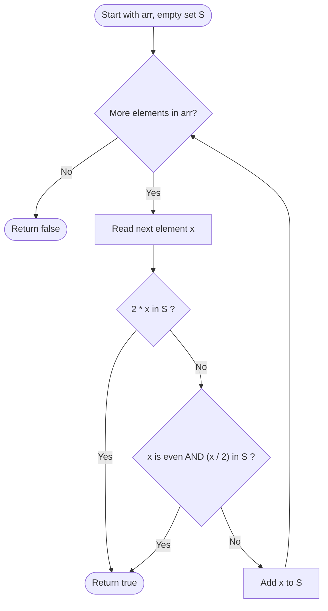

# Guided Example: Check If N and Its Double Exist

We trace the step-by-step execution of the optimal hash-lookup algorithm on a representative problem instance:

- **Input:** `arr = [10, 2, 5, 3]`
- **Required output:** `true`

This instance is chosen because the doubled value appears before its base half ($10$ appears at index $0$, while $5$ appears at index $2$), demonstrating that the membership test must dynamically inspect both prospective multipliers ($2x$) and prospective divisors ($x / 2$).

---

## 1. Instance & Teaching Goal

Given an integer array `arr`, we must determine whether there exist two distinct indices $i \ne j$ such that $arr[i] = 2 \times arr[j]$.

For `arr = [10, 2, 5, 3]`:
- At index $0$, value is $10$. Seen set is empty.
- At index $1$, value is $2$. Neither $4$ nor $1$ is in seen set.
- At index $2$, value is $5$. Its double $2 \times 5 = 10$ is present in the seen set.
- The pair $(10, 5)$ satisfies the condition with distinct indices $i = 0$ and $j = 2$. Output is `true`.

The primary teaching goal is to structure a single-pass hash-table search that tests bidirectional relationships ($2x$ and $x/2$ when even), avoiding quadratic pairwise iteration and properly isolating duplicate zero hazards.

---

## 2. Conceptual Foundation & Invariants

A naive approach examines all pairs $(i, j)$ with $i \ne j$, requiring $\frac{N(N-1)}{2}$ comparisons ($\mathcal{O}(N^2)$ time).

To achieve linear time $\mathcal{O}(N)$, we maintain a hash set $S$ containing all values visited so far. For each current element $x$:
1. If $2x \in S$, then an earlier element equals the double of $x$.
2. If $x \pmod 2 = 0$ and $x / 2 \in S$, then an earlier element is the half of $x$ (meaning $x$ is the double of that earlier element).
3. If neither condition holds, insert $x$ into $S$ and continue.

```
Index 0: val = 10 -> check 20 and 5   -> not in S -> insert 10 -> S = {10}
Index 1: val = 2  -> check 4 and 1    -> not in S -> insert 2  -> S = {10, 2}
Index 2: val = 5  -> check 10 and 5/2 -> 10 in S! -> RETURN TRUE
```

We track state with the following operational variables:

| State Parameter | Description | Initial Value |
|---|---|---|
| Scan Index ($k$) | Current element index in the array | $0$ |
| Target Value ($x$) | Numeric value located at $arr[k]$ | $arr[0] = 10$ |
| Visited Set ($S$) | Hash set storing previously inspected values | $\emptyset$ |
| Query Targets | Pair $\{2x, x/2 \text{ if even}\}$ checked against $S$ | $\{20, 5\}$ |

> **Invariant.** Before processing index $k$, the set $S$ contains precisely the prefix elements $\{arr[0], \dots, arr[k-1]\}$. If any prefix pair satisfies the doubling relation, the algorithm terminates immediately. Otherwise, checking $2x \in S$ and $(x \pmod 2 = 0 \land x/2 \in S)$ guarantees detection of any valid pair involving $arr[k]$ and some earlier element.

---

## 3. Step-by-Step Worked Execution

### Step 1: Processing Index $0$ ($x = 10$)

- Current element: $x = 10$.
- Check doubling target: $2 \times 10 = 20$. Is $20 \in S$? No ($S = \emptyset$).
- Check half target: $10 \pmod 2 = 0$, target $10 / 2 = 5$. Is $5 \in S$? No.
- Decision: No match found. Insert $10$ into $S$.
- Updated state: $S = \{10\}$.

| Parameter | Before Step | Evaluation | After Step |
|---|---|---|---|
| Current Element | $10$ | Index $0$ | Processed |
| Set Query | Is $20 \in S$ or $5 \in S$? | False (set empty) | Negative |
| Visited Set ($S$) | $\emptyset$ | Add element $10$ | $\{10\}$ |

---

### Step 2: Processing Index $1$ ($x = 2$)

- Current element: $x = 2$.
- Check doubling target: $2 \times 2 = 4$. Is $4 \in S$? No ($S = \{10\}$).
- Check half target: $2 \pmod 2 = 0$, target $2 / 2 = 1$. Is $1 \in S$? No.
- Decision: No match found. Insert $2$ into $S$.
- Updated state: $S = \{10, 2\}$.

| Parameter | Before Step | Evaluation | After Step |
|---|---|---|---|
| Current Element | $2$ | Index $1$ | Processed |
| Set Query | Is $4 \in S$ or $1 \in S$? | False ($S = \{10\}$) | Negative |
| Visited Set ($S$) | $\{10\}$ | Add element $2$ | $\{10, 2\}$ |

---

### Step 3: Processing Index $2$ ($x = 5$)

- Current element: $x = 5$.
- Check doubling target: $2 \times 5 = 10$. Is $10 \in S$?
- Set membership: $10 \in \{10, 2\}$ evaluates to **True**!
- Decision: Valid pair found where $arr[0] = 10$ and $arr[2] = 5$, satisfying $10 = 2 \times 5$ with $i \ne j$.
- Action: Return `true` immediately without processing remaining indices.

| Parameter | Before Step | Evaluation | After Step |
|---|---|---|---|
| Current Element | $5$ | Index $2$ | Match Found |
| Set Query | Is $10 \in S$? | **True** ($10 \in \{10, 2\}$) | Target matched |
| Termination | In progress | Trigger early return | **Output `true`** |

---

## 4. Complete Execution Trace

| Step Index ($k$) | Element ($arr[k]$) | Doubled ($2x$) | Halved ($x/2$) | Match in $S$? | Set Before Step ($S$) | Action Taken |
|---|---|---|---|---|---|---|
| $0$ | $10$ | $20$ | $5$ | None | $\emptyset$ | Insert $10$ into $S$ |
| $1$ | $2$ | $4$ | $1$ | None | $\{10\}$ | Insert $2$ into $S$ |
| $2$ | $5$ | $10$ | Not integer | **$10 \in S$** | $\{10, 2\}$ | **Return `true`** |
| $3$ | $3$ | — | — | — | — | Unreached (pruned) |

---

## 5. Algorithmic Correctness & Complexity Derivation

### Correctness and Distinct-Index Guarantee

Any valid solution requires two distinct indices $i \ne j$ with $arr[i] = 2 \times arr[j]$. Without loss of generality, let $j$ appear after $i$ in the array ($i < j$).
- Case A: $arr[j] = 2 \times arr[i]$. When the algorithm reaches index $j$, $arr[i]$ is already present in $S$. The test $x / 2 = arr[j] / 2 = arr[i] \in S$ succeeds.
- Case B: $arr[i] = 2 \times arr[j]$. When the algorithm reaches index $j$, $arr[i]$ is already present in $S$. The test $2x = 2 \times arr[j] = arr[i] \in S$ succeeds.

In either case, because $x$ is checked against $S$ *before* $x$ is inserted into $S$, an element can never match itself. This strictly enforces the requirement $i \ne j$.

### Asymptotic Complexity

- **Time Complexity:** $\mathcal{O}(N)$. In the worst case where no pair exists, the array is scanned once. At each of the $N$ steps, hash-table lookups and insertions take $\mathcal{O}(1)$ average time, resulting in total time $\mathcal{O}(N)$.
- **Auxiliary Space Complexity:** $\mathcal{O}(N)$. The hash set stores at most $N$ distinct integers.

---

## 6. Traps & Edge Cases

- **Self-Matching on Zero ($x = 0$):** Since $2 \times 0 = 0$, an algorithm that inserts $x$ into the set *before* checking queries would find $2 \times 0 = 0$ in the set and falsely report `true` for an array with a single zero like `[0]`. Querying before insertion guarantees that $0$ only matches if a second, distinct zero has already been recorded.
- **Odd Numbers Halving:** When checking half values, integer division truncation must not convert an odd number to a false half. For example, $5 // 2 = 2$ in integer division, but $5 \ne 2 \times 2$. Hence, the half check must only trigger if $x \pmod 2 = 0$.
- **Negative Numbers:** The rule holds identically for negative values: for example, $-4 = 2 \times (-2)$. At $x = -2$, $2x = -4$; at $x = -4$, $x / 2 = -2$. The algebraic relationship is invariant under sign.

---

## 7. Accessible Mermaid Diagram


