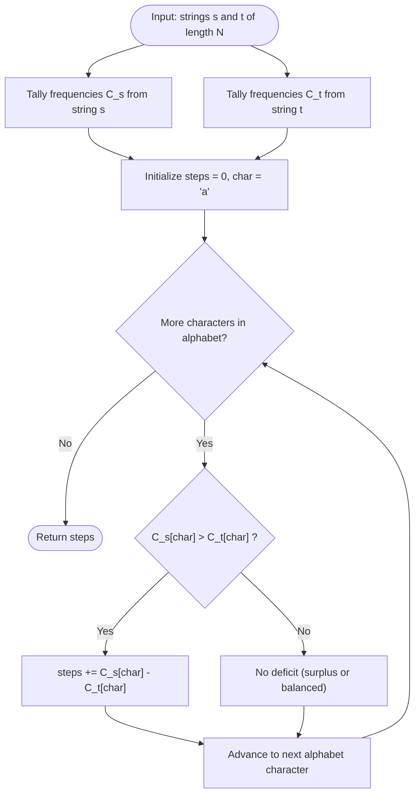

# Guided Example: Minimum Number of Steps to Make Two Strings Anagram

We trace the step-by-step execution of the optimal frequency-counting method on a representative problem instance:

- **Input:** `s = "bab"`, `t = "aba"`
- **Required output:** `1`

This instance is chosen because both strings are permutations of the same two letters with inverted counts, illustrating how character surplus in one position precisely matches character deficit in another.

---

## 1. Instance & Teaching Goal

Given two strings `s` and `t` of equal length $N$, we may choose any character in `t` and replace it with any other lowercase English letter. We seek the minimum number of replacements to transform `t` into an anagram of `s`.

For `s = "bab"` and `t = "aba"`:
- Character counts in `s`: two `'b'`s, one `'a'`.
- Character counts in `t`: one `'b'`, two `'a'`s.
- `s` requires one more `'b'` than `t` possesses (deficit $= 1$).
- `t` possesses one extra `'a'` compared to `s` (surplus $= 1$).
- Replacing the surplus `'a'` with `'b'` produces `"bba"`, which has two `'b'`s and one `'a'`, matching `s`.
- Minimum operations required: $1$.

The primary learning goal is to model anagram equivalence as matching frequency vectors, proving that each replacement simultaneously repairs one unit of deficit and one unit of surplus.

---

## 2. Conceptual Foundation & Invariants

Let $\Sigma$ denote the English alphabet ($\{ \text{'a'}, \dots, \text{'z'} \}$). We represent strings $s$ and $t$ by their frequency vectors $C_s, C_t \in \mathbb{N}^{26}$.

Because $|s| = |t| = N$:
$$
\sum_{c \in \Sigma} C_s(c) = \sum_{c \in \Sigma} C_t(c) = N
$$
A single replacement changes one character in $t$ from $u$ to $v$. This decreases $C_t(u)$ by $1$ and increases $C_t(v)$ by $1$.

```
String s ("bab"):   [ a: 1,  b: 2 ]
String t ("aba"):   [ a: 2,  b: 1 ]
                     ------  ------
Difference (s - t): [ a: -1, b: +1 ]  -> Deficit of b (+1), Surplus of a (-1)

Replacement: Change one surplus 'a' into 'b'
New t ("bba"):      [ a: 1,  b: 2 ]  -> Matches s exactly!
```

To transform $C_t$ into $C_s$, any character $c$ where $C_s(c) > C_t(c)$ represents a deficit of $C_s(c) - C_t(c)$ characters that must be added to $t$. By conservation of string length, the total deficit exactly equals the total surplus:
$$
\sum_{c: C_s(c) > C_t(c)} (C_s(c) - C_t(c)) = \sum_{c: C_t(c) > C_s(c)} (C_t(c) - C_s(c)) = \frac{1}{2} \sum_{c \in \Sigma} |C_s(c) - C_t(c)|
$$

We track state using the following parameters:

| State Parameter | Description | Initial Value |
|---|---|---|
| Target Frequencies ($C_s$) | Required count of each character from string $s$ | $C_s(\text{'a'}) = 1, C_s(\text{'b'}) = 2$ |
| Source Frequencies ($C_t$) | Available count of each character in string $t$ | $C_t(\text{'a'}) = 2, C_t(\text{'b'}) = 1$ |
| Deficit Accumulator ($\text{steps}$) | Sum of positive differences where $s$ has more occurrences | $0$ |

> **Invariant.** The minimal number of replacements needed to transform $t$ into an anagram of $s$ is strictly equal to the sum of missing character quotas $\sum_{c \in \Sigma} \max(0, C_s(c) - C_t(c))$. Every replacement can convert exactly one surplus character into one deficit character.

---

## 3. Step-by-Step Worked Execution

### Step 1: Frequency Vector Construction

Tally the character frequencies for both strings across the $26$-letter alphabet:

- For string `s = "bab"`:
  - $C_s[\text{'a'}] = 1$
  - $C_s[\text{'b'}] = 2$
  - All other characters: $0$
- For string `t = "aba"`:
  - $C_t[\text{'a'}] = 2$
  - $C_t[\text{'b'}] = 1$
  - All other characters: $0$

| Character ($c$) | Target Count $C_s(c)$ | Source Count $C_t(c)$ | Difference $C_s(c) - C_t(c)$ | Status |
|---|---|---|---|---|
| `'a'` | $1$ | $2$ | $-1$ | Surplus in $t$ |
| `'b'` | $2$ | $1$ | $+1$ | Deficit in $t$ |
| Other $24$ letters | $0$ | $0$ | $0$ | Balanced |

---

### Step 2: Evaluating Character `'a'`

- Target count in $s$: $C_s[\text{'a'}] = 1$.
- Source count in $t$: $C_t[\text{'a'}] = 2$.
- Deficit calculation: $\max(0, C_s[\text{'a'}] - C_t[\text{'a'}]) = \max(0, 1 - 2) = 0$.
- Contribution to steps: $0$.
- Accumulator: $\text{steps} = 0$.

| Parameter | Current Value | Evaluation | Updated State |
|---|---|---|---|
| Evaluated Character | `'a'` | $C_s(a) = 1, C_t(a) = 2$ | Surplus of $1$ |
| Added Deficit | $\max(0, -1)$ | $0$ | No deficit |
| Total Steps | $0$ | Add $0$ | $0$ |

---

### Step 3: Evaluating Character `'b'`

- Target count in $s$: $C_s[\text{'b'}] = 2$.
- Source count in $t$: $C_t[\text{'b'}] = 1$.
- Deficit calculation: $\max(0, C_s[\text{'b'}] - C_t[\text{'b'}]) = \max(0, 2 - 1) = 1$.
- Contribution to steps: $+1$.
- Accumulator: $\text{steps} = 0 + 1 = 1$.

| Parameter | Current Value | Evaluation | Updated State |
|---|---|---|---|
| Evaluated Character | `'b'` | $C_s(b) = 2, C_t(b) = 1$ | Deficit of $1$ |
| Added Deficit | $\max(0, 1)$ | $+1$ | $1$ deficit |
| Total Steps | $0$ | Add $1$ | $1$ |

---

### Step 4: Finalizing Remaining Alphabet

All other characters from `'c'` to `'z'` have $C_s(c) = 0$ and $C_t(c) = 0$.
- Deficit: $\max(0, 0 - 0) = 0$.
- Final answer: $1$.

| Alphabet Range | Target Quotas | Available Counts | Deficit Contribution |
|---|---|---|---|
| `'c'` through `'z'` | $0$ for all | $0$ for all | $0$ |
| Final Output | Total Deficit | Sum of positive deltas | **$1$** |

---

## 4. Complete Execution Trace

We contrast the target instance against several representative cases to illustrate the generalized formula:

| String $s$ | String $t$ | Length ($N$) | Deficits by Character | Total Positive Deficit | Formula: $\frac{1}{2} \sum \lvert C_s - C_t \rvert$ | Result |
|---|---|---|---|---|---|---|
| **`"bab"`** | **`"aba"`** | $3$ | `'b'`: $+1$ | $1$ | $\frac{1}{2} (\lvert -1 \rvert + \lvert +1 \rvert) = 1$ | **$1$** |
| `"leetcode"` | `"practice"` | $8$ | `'d'`: $+1$, `'e'`: $+2$, `'l'`: $+1$, `'o'`: $+1$ | $5$ | $\frac{1}{2} (1+2+1+1 + 1+1+1+1+1) = 5$ | **$5$** |
| `"anagram"` | `"mangaar"` | $7$ | None | $0$ | $\frac{1}{2} (0) = 0$ | **$0$** |
| `"xxyyzz"` | `"aabbcc"` | $6$ | `'x'`: $+2$, `'y'`: $+2$, `'z'`: $+2$ | $6$ | $\frac{1}{2} (2+2+2 + 2+2+2) = 6$ | **$6$** |
| `"friend"` | `"family"` | $6$ | `'r'`: $+1$, `'e'`: $+1$, `'n'`: $+1$, `'d'`: $+1$ | $4$ | $\frac{1}{2} (4 + 4) = 4$ | **$4$** |

---

## 5. Algorithmic Correctness & Complexity Derivation

### Lower Bound and Achievability

1. **Lower Bound:** Let $D = \sum_{c \in \Sigma} \max(0, C_s(c) - C_t(c))$. Each substitution alters exactly one letter of $t$, increasing the count of at most one deficit character by at most $1$. Thus, no single operation can reduce the total deficit by more than $1$. Therefore, at least $D$ operations are required.
2. **Upper Bound / Achievability:** Since $\sum C_s(c) = \sum C_t(c) = N$, whenever $D > 0$, there exists at least one character $u$ with $C_t(u) > C_s(u)$ (surplus) and at least one character $v$ with $C_s(v) > C_t(v)$ (deficit). Choosing to replace an occurrence of $u$ with $v$ simultaneously decreases the surplus of $u$ by $1$ and decreases the deficit of $v$ by $1$.
Repeating this greedy substitution exactly $D$ times reduces all deficits and surpluses to zero, transforming $t$ into an anagram of $s$.

Hence, $D$ operations are both necessary and sufficient.

### Asymptotic Complexity

- **Time Complexity:** $\mathcal{O}(N + |\Sigma|)$. Counting frequencies across $s$ and $t$ requires scanning each character of length $N$ once. Summing differences over the fixed alphabet $\Sigma$ takes $\mathcal{O}(26) = \mathcal{O}(1)$ time. Overall time is $\mathcal{O}(N)$.
- **Auxiliary Space Complexity:** $\mathcal{O}(|\Sigma|) = \mathcal{O}(1)$. A fixed-size array of $26$ integer counters is sufficient to store the character frequency discrepancies.

---

## 6. Traps & Edge Cases

- **Double Counting:** Summing the absolute differences $|C_s(c) - C_t(c)|$ over all characters without dividing by $2$ counts both the deficit and the surplus, giving $2 \times \text{steps}$. Either sum only positive differences $\max(0, C_s - C_t)$ or divide the total absolute difference by $2$.
- **Disjoint Character Sets:** If $s$ and $t$ share no common characters (e.g., `"abc"` and `"def"`), every character in $s$ has deficit $1$, so all $N$ characters in $t$ must be replaced. Output is $N$.
- **Identical Strings / Existing Anagrams:** When $t$ is already an anagram of $s$ (e.g., `"anagram"` and `"mangaar"`), every difference is $0$, correctly returning $0$.
- **Positional Order Irrelevance:** Because an anagram can reorder characters arbitrarily, character indices and relative positions inside $s$ and $t$ are irrelevant; only aggregate frequency matters.

---

## 7. Accessible Mermaid Diagram


