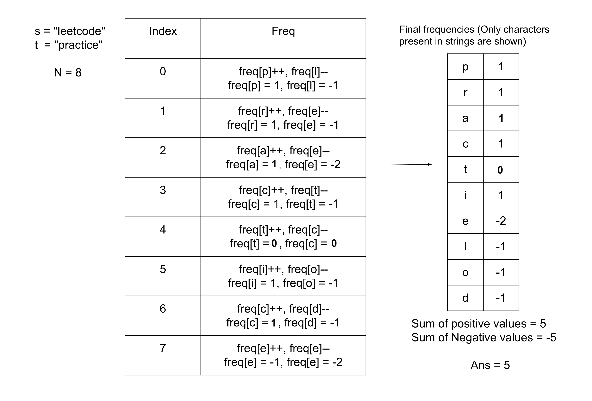

## Solution

---

### Approach: HashMap

#### Intuition

The two strings `s` and `t` have the same length, we need to find the minimum characters that need to be replaced in `t` to make it an anagram of `s`. One thing to observe here is that we do not need to touch the instances of a character that are present in both strings. For example, if the two strings are $s = ba$ and $t = aa$, we do not need to change one of the `a` characters in both strings.

The character instance which is in `t` but not in `s` can be replaced with a character that is present in `s`. To find the minimum characters required to make `t` and `s` anagrams, we can find the count of characters in `t` which are not present in `s`.

To find this, we can record the frequency of each character in both strings `s` and `t`, and calculate the frequency difference of each character ($freq in t - freq in s$). One important thing to note is that this difference can be positive or negative, for example, if $s = bba$ and $t = baa$, the frequency difference of `a` is 1 (`t` has 2 occurrences of `a` while `s` has 1, 2 - 1 = 1) and the frequency difference of `b` is -1 (`t` has 1 occurrence of `b` while `s` has 2, 1 - 2 = -1). However, we only need to focus on the positive value which implies that there are more instances of this character in `t`, why?

This is because the two values (the sum of the positive and negative differences) are equal in absolute value! The positive value comes from the character in `t` that needs to be replaced, the negative value comes from the character in `s` that waits for the corresponding replacement in `t`.

Since `t` and `s` are of equal length, and both remain the same after modifying `t` to make it an anagram of `s`, the absolute values of the two positive and negative values must be equal. Therefore, we can either sum only the negative differences or only the positive differences, and the result is the same for both.

One way to find the frequencies of characters in both strings is to use two different maps and then find the difference. Instead of storing the frequencies for both strings separately and then calculating the difference, we can simply add the frequencies for string `t`, and subtract the frequencies for string `s` on the fly. This way we will only have to keep one map to store the final difference in frequencies. We can then add up all the positive values and return the sum.



#### Algorithm

1. Initialize an array `count` of size `26`, all indices point to `0` initially to denote the frequency of each character.
2. Iterate over the integer from `0` to the last index in `s` or `t`, for each index `i`:

1. Increment the frequency of character $t[i]$ in the array `count`.
2. Decrement the frequency of character $s[i]$ in the array `count`.
3. Initialize the variable `ans` to `0`
4. Iterate over the integers from `0` to `25`, and for each positive frequency difference, add it to the variable `ans`.
5. Return `ans`.

#### Implementation

```cpp
class Solution {
public:
    int minSteps(string s, string t) {
        int count[26] = {0};
        // Storing the difference of frequencies of characters in t and s.
        for (int i = 0; i < s.size(); i++) {
            count[t[i] - 'a']++;
            count[s[i] - 'a']--;
        }

        int ans = 0;
        // Adding the difference where string t has more instances than s.
        // Ignoring where t has fewer instances as they are redundant and
        // can be covered by the first case.
        for (int i = 0; i < 26; i++) {
            ans += max(0, count[i]);
        }

        return ans;
    }
};
```

#### Complexity Analysis

Here, $N$ is the size of the string `s` and `t`.

* Time complexity: $O(N)$

  We are iterating over the indices of string `s` or `t` to find the frequencies in the array `freq`. Then we iterate over the integers from `0` to `26` to find the final answer. Hence, the total time complexity is equal to $O(N)$.

* Space complexity: $O(1)$

  The only space required is the array `count` which has the constant size of `26`. Therefore, the total space complexity is constant.
  <br/>

---