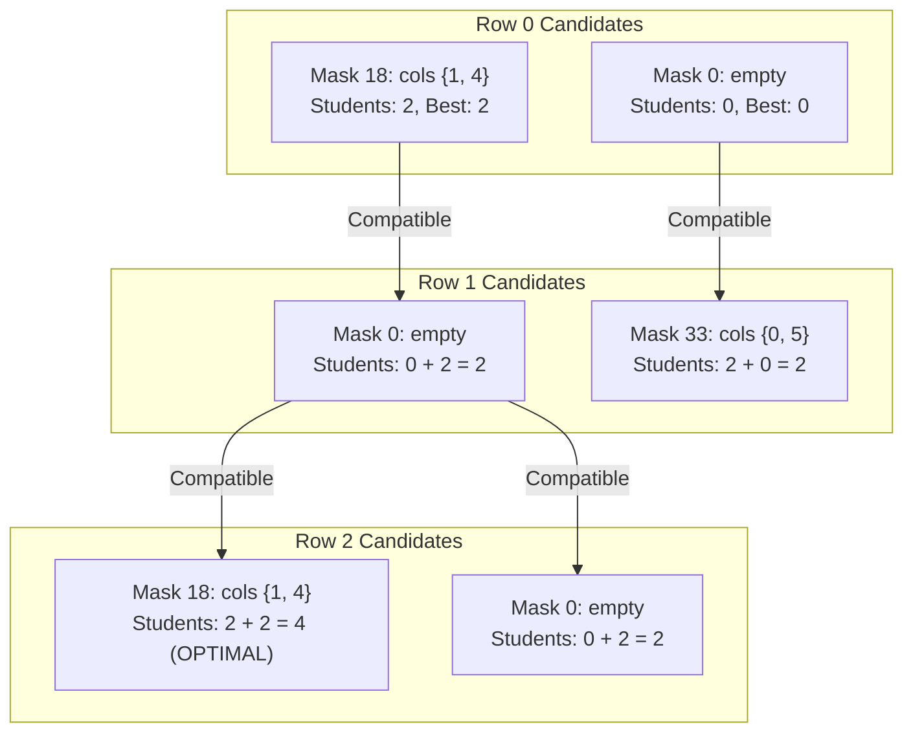

# Guided Example: Maximum Students Taking Exam

We trace the step-by-step execution of the optimal row-by-row profile bitmask dynamic programming algorithm on a representative problem instance:

- **Input:** `seats = [["#", ".", "#", "#", ".", "#"], [".", "#", "#", "#", "#", "."], ["#", ".", "#", "#", ".", "#"]]`
- **Required output:** `4`

This instance is chosen because it features an alternating classroom geometry where seating students in row $1$ directly blocks valid seats in both row $0$ and row $2$ via diagonal sightlines, forcing a global trade-off between dense alternating rows versus intermediate row placement.

---

## 1. Instance & Teaching Goal

We are given an $m \times n$ classroom matrix where `'.'` denotes an intact seat and `'#'` denotes a broken desk. A student sitting at position $(r, c)$ can view answers from students sitting in:
1. The same row directly adjacent: $(r, c - 1)$ and $(r, c + 1)$.
2. The row directly in front diagonally: upper-left $(r - 1, c - 1)$ and upper-right $(r - 1, c + 1)$.

Crucially, a student **cannot** see the student sitting directly ahead at $(r - 1, c)$.

For the $3 \times 6$ grid:
```
Row 0:  [ #   .   #   #   .   # ]  -> Intact seats at columns 1 and 4
Row 1:  [ .   #   #   #   #   . ]  -> Intact seats at columns 0 and 5
Row 2:  [ #   .   #   #   .   # ]  -> Intact seats at columns 1 and 4
```

- If we seat $2$ students in Row $1$ at columns $(0, 5)$, their diagonal sightlines block columns $(1, 4)$ in both Row $0$ and Row $2$, yielding only $2$ total students.
- Alternatively, if we leave Row $1$ empty, we can seat $2$ students in Row $0$ (cols $1, 4$) and $2$ students in Row $2$ (cols $1, 4$), achieving $2 + 0 + 2 = 4$ total students.

The primary teaching goal is to formulate a bitmask DP recurrence where row states are represented as bit vectors, filter invalid intra-row masks using bitwise shifts, and enforce inter-row sightline compatibility.

---

## 2. Conceptual Foundation & Invariants

Let $n$ be the number of columns ($n = 6$). A placement of students in a single row is represented by an integer bitmask $M \in [0, 2^n - 1]$, where the $c$-th bit is $1$ if column $c$ is occupied.

```
Sightline Rules from (r, c):
      (r-1, c-1)     (r-1, c)     (r-1, c+1)
        [BLOCKED]    [ALLOWED]     [BLOCKED]
            \           |            /
             \          |           /
   (r, c-1) -- [STUDENT (r, c)] -- (r, c+1)
  [BLOCKED]                       [BLOCKED]
```

A mask $M$ is valid for row $r$ if and only if:
1. **Intact Seat Constraint:** $M \subseteq \text{valid\_seats}[r]$. If column $c$ is broken (`'#'`), bit $c$ must be $0$.
2. **Horizontal Non-Adjacency:** $M \ \& \ (M \gg 1) = 0$. No two adjacent bits are both $1$.

Between row $r$ with mask $M$ and row $r - 1$ with mask $M_{\text{prev}}$, diagonal sightlines impose:
3. **Upper-Left Sightline:** $(M \ \& \ (M_{\text{prev}} \gg 1)) = 0$.
4. **Upper-Right Sightline:** $((M \gg 1) \ \& \ M_{\text{prev}}) = 0$.

We define $DP[r][M]$ as the maximum number of students seated in rows $0 \dots r$ such that row $r$ has configuration $M$:
$$
DP[r][M] = \operatorname{popcount}(M) + \max_{\substack{M_{\text{prev}} \text{ compatible} \\ \text{with } M}} DP[r - 1][M_{\text{prev}}]
$$

| State Parameter | Description | Initial Value |
|---|---|---|
| Row Index ($r$) | Current row being assigned seating | $0$ |
| Candidate Mask ($M$) | Bitmask of chosen student seats in row $r$ | Feasible submasks |
| Previous Mask ($M_{\text{prev}}$) | Seating mask in row $r - 1$ | Base boundary state |
| Table Cell ($DP[r][M]$) | Maximum cumulative students up to row $r$ | $-\infty$ (unreachable) |

> **Invariant.** For every row $r$ and valid mask $M$, $DP[r][M]$ stores the exact maximum number of students that can be seated in rows $0 \dots r$ without any cheating sightlines, given that row $r$ uses mask $M$.

---

## 3. Step-by-Step Worked Execution

### Step 1: Row 0 Evaluations ($r = 0$)

Available seats in row $0$: Column $1$ and Column $4$.
Broken seats: Columns $0, 2, 3, 5$.

Valid submasks with no adjacent bits:
- Mask $0$ (`000000_2`): $0$ students $\implies DP[0][0] = 0$.
- Mask $2$ (`000010_2`, col $1$ only): $1$ student $\implies DP[0][2] = 1$.
- Mask $16$ (`010000_2`, col $4$ only): $1$ student $\implies DP[0][16] = 1$.
- Mask $18$ (`010010_2`, cols $1$ and $4$):
  - Adjacent check: $18 \ \& \ (18 \gg 1) = 0010010_2 \ \& \ 0001001_2 = 0$ (Valid).
  - Popcount: $2$ students $\implies DP[0][18] = 2$.

| Candidate Mask $M$ | Columns Selected | Intra-Row Valid? | Popcount | $DP[0][M]$ |
|---|---|---|---|---|
| $0$ (`000000_2`) | None | Yes | $0$ | $0$ |
| $2$ (`000010_2`) | Col $1$ | Yes | $1$ | $1$ |
| $16$ (`010000_2`) | Col $4$ | Yes | $1$ | $1$ |
| $18$ (`010010_2`) | Cols $1, 4$ | Yes | $2$ | **$2$** |

---

### Step 2: Row 1 Transitions ($r = 1$)

Available seats in row $1$: Column $0$ and Column $5$.
Broken seats: Columns $1, 2, 3, 4$.

Valid candidate masks for row $1$:
- $M = 0$ (`000000_2`): Empty row. Compatible with all masks of row $0$.
  - Best transition from row $0$: $\max(DP[0][0], DP[0][2], DP[0][16], DP[0][18]) = 2$.
  - $DP[1][0] = 0 + 2 = 2$.
- $M = 1$ (`000001_2`, col $0$ only):
  - Diagonal check with row $0$: Col $0$ can see col $1$.
  - Any row $0$ mask containing col $1$ (masks $2$ and $18$) is incompatible!
  - Compatible row $0$ masks: $0$ and $16$.
  - Best transition: $\max(DP[0][0], DP[0][16]) = 1$.
  - $DP[1][1] = 1 + 1 = 2$.
- $M = 32$ (`100000_2`, col $5$ only):
  - Diagonal check with row $0$: Col $5$ can see col $4$.
  - Incompatible with row $0$ masks containing col $4$ (masks $16$ and $18$).
  - Compatible row $0$ masks: $0$ and $2$.
  - Best transition: $\max(DP[0][0], DP[0][2]) = 1$.
  - $DP[1][32] = 1 + 1 = 2$.
- $M = 33$ (`100001_2`, cols $0$ and $5$):
  - Blocks both col $1$ and col $4$ in row $0$.
  - Only compatible row $0$ mask is $0$.
  - Best transition: $DP[0][0] = 0$.
  - $DP[1][33] = 2 + 0 = 2$.

| Row 1 Mask ($M$) | Occupied Cols | Compatible Row 0 Masks | Best Prior $DP[0]$ | Popcount | $DP[1][M]$ |
|---|---|---|---|---|---|
| $0$ | None | $0, 2, 16, 18$ | $2$ (from $M_0=18$) | $0$ | **$2$** |
| $1$ | Col $0$ | $0, 16$ | $1$ (from $M_0=16$) | $1$ | $2$ |
| $32$ | Col $5$ | $0, 2$ | $1$ (from $M_0=2$) | $1$ | $2$ |
| $33$ | Cols $0, 5$ | $0$ | $0$ (from $M_0=0$) | $2$ | $2$ |

---

### Step 3: Row 2 Transitions ($r = 2$)

Available seats in row $2$: Column $1$ and Column $4$ (identical to row $0$).
Consider candidate mask $M = 18$ (`010010_2`, cols $1$ and $4$):
- Diagonal sightlines into row $1$:
  - Col $1$ sees upper-left $(1, 0)$ and upper-right $(1, 2)$.
  - Col $4$ sees upper-left $(1, 3)$ and upper-right $(1, 5)$.
  - Thus, row $2$ mask $18$ is incompatible with row $1$ masks having col $0$ or col $5$.
  - Incompatible row $1$ masks: $1, 32, 33$.
  - Compatible row $1$ mask: $M_{\text{prev}} = 0$!
- Evaluation:
  $$DP[2][18] = \operatorname{popcount}(18) + DP[1][0] = 2 + 2 = 4$$

All other mask selections yield $\le 3$ students. Global maximum is $4$.

| Row 2 Mask ($M$) | Occupied Cols | Compatible Row 1 Masks | Best Prior $DP[1]$ | Popcount | $DP[2][M]$ |
|---|---|---|---|---|---|
| $0$ | None | $0, 1, 32, 33$ | $2$ | $0$ | $2$ |
| $2$ | Col $1$ | $0, 32$ | $2$ | $1$ | $3$ |
| $16$ | Col $4$ | $0, 1$ | $2$ | $1$ | $3$ |
| $18$ | Cols $1, 4$ | **$0$** | **$2$** | **$2$** | **$4$** |

---

## 4. Complete Execution Trace

Summary of optimal state values across all three rows:

| Row ($r$) | Active Mask $M$ | Binary Form | Seated Students in Row | Optimal Cumulative Score | Key Invariant / State Decision |
|---|---|---|---|---|---|
| $0$ | $18$ | `010010_2` | $2$ (cols $1, 4$) | $2$ | Maximize Row 0 independently |
| $1$ | $0$ | `000000_2` | $0$ | $2$ | Leave Row 1 empty to avoid blocking Row 2 |
| $2$ | $18$ | `010010_2` | $2$ (cols $1, 4$) | **$4$** | Re-seat cols $1, 4$ without sightline conflicts |

---

## 5. Algorithmic Correctness & Complexity Derivation

### Markovian Row Property

Because a student at row $r$ can only see students in row $r$ and row $r - 1$, row $r$ is conditionally independent of all rows $0 \dots r - 2$ given the exact placement mask of row $r - 1$. This satisfies the Markovian property required for dynamic programming.

By exhaustively checking all valid mask transitions between row $r - 1$ and row $r$, no feasible seating configuration is omitted, guaranteeing global optimality.

### Asymptotic Complexity

- Let $m$ be the number of rows and $n$ be the number of columns ($m, n \le 8$).
- The maximum number of masks in $\{0, 1\}^n$ with no adjacent ones is given by the Fibonacci number $F_{n+2}$. For $n = 6$, $F_8 = 21$. For $n = 8$, $F_{10} = 55$.
- At each row transition, we compare pairs of valid masks: at most $F_{n+2}^2$ transitions.
- **Time Complexity:** $\mathcal{O}(m \cdot F_{n+2}^2)$. For $m, n \le 8$, $8 \times 55^2 = 24{,}200$ operations, which executes in a few milliseconds.
- **Auxiliary Space Complexity:** $\mathcal{O}(m \cdot 2^n)$ or $\mathcal{O}(2^n)$ when space-optimized using rolling arrays.

---

## 6. Traps & Edge Cases

- **Directly Ahead Sightline:** Students **cannot** see the student sitting directly ahead at $(r - 1, c)$. Forbidding vertical adjacency would incorrectly reject valid solutions.
- **Cheating in Both Directions:** A student at $(r, c)$ sees $(r - 1, c - 1)$ and $(r - 1, c + 1)$. Symmetrically, a student at $(r - 1, c)$ would be seen by $(r, c - 1)$ and $(r, c + 1)$. Checking both $((M \ \& \ (M_{\text{prev}} \gg 1)) = 0)$ and $(((M \gg 1) \ \& \ M_{\text{prev}}) = 0)$ handles both diagonal orientations.
- **All Broken Seats:** If all seats are `'#'`, only the zero mask is valid for all rows, correctly returning $0$.
- **Single Row ($m = 1$):** Reduces to finding the maximum independent set on a 1D grid with broken seats, resolved in the base case step.

---

## 7. Accessible Mermaid Diagram

