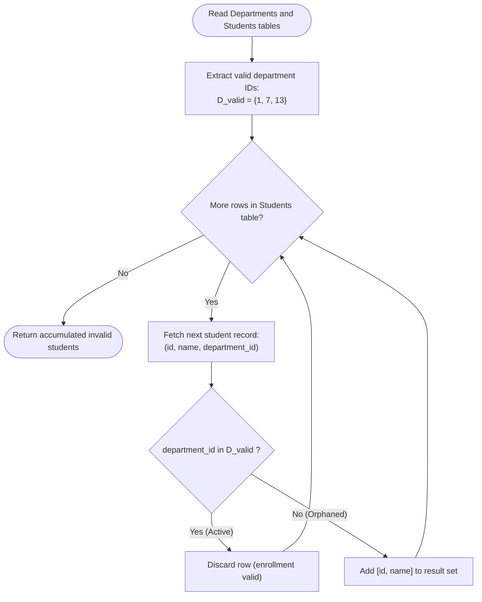

# Guided Example: Students With Invalid Departments

We trace the step-by-step execution of the relational anti-join filtering strategy on a representative database instance:

- **Input Tables:**
  - `Departments`: `[{"id": 1, "name": "Electrical Engineering"}, {"id": 7, "name": "Computer Engineering"}, {"id": 13, "name": "Bussiness Administration"}]`
  - `Students`: $10$ student enrollment records
- **Required Output:** `{"columns": ["id", "name"], "rows": [[2, "John"], [7, "Daiana"], [4, "Jasmine"], [3, "Steve"]]}`

This instance is chosen because it features an active department directory alongside student enrollments referencing both active and abolished department keys, illustrating the exact mechanics of relational anti-join filtering.

---

## 1. Instance & Teaching Goal

We are given two relational entities:
1. `Departments` with columns `id` (primary key) and `name`.
2. `Students` with columns `id` (primary key), `name`, and `department_id`.

Our objective is to find the `id` and `name` of all students who are enrolled in departments that do not exist in the `Departments` table.

For the active departments:
$$
\text{ActiveDeptIDs} = \{1, 7, 13\}
$$

Among the $10$ enrolled students:
- Alice ($23$), Bob ($1$), Jennifer ($5$), Luis ($6$), Jonathan ($8$), and Madelynn ($11$) are assigned to department IDs $1, 7$, or $13$, which are valid and active.
- John ($2$, dept $14$), Jasmine ($4$, dept $77$), Steve ($3$, dept $74$), and Daiana ($7$, dept $33$) are assigned to department IDs absent from `Departments`.
- The result must return precisely these $4$ invalidly assigned students.

The primary teaching goal is to model foreign-key reference integrity checks as a relational anti-join or set difference, avoiding quadratic row comparisons and guaranteeing proper null handling.

---

## 2. Conceptual Foundation & Invariants

In relational algebra, finding tuples in relation $R$ that have no matching counterpart in relation $S$ on join condition $\theta$ is formalized by the anti-join operator ($\mathbin{\triangleright}_\theta$):
$$
\text{InvalidStudents} = \Pi_{\text{id}, \text{name}} \left( \text{Students} \mathbin{\triangleright}_{\text{Students.department\_id} = \text{Departments.id}} \text{Departments} \right)
$$

Equivalently, this operation can be framed as an outer join with a null check, or as set-membership exclusion:
$$
D_{\text{valid}} = \Pi_{\text{id}}(\text{Departments})
$$
$$
\text{InvalidStudents} = \Pi_{\text{id}, \text{name}} \left( \sigma_{\text{department\_id} \notin D_{\text{valid}}}(\text{Students}) \right)
$$

```
Departments: { 1, 7, 13 }
                   |
Students:          v
(23, Alice,    1)  -> 1 in {1, 7, 13}? YES -> Exclude
(1,  Bob,      7)  -> 7 in {1, 7, 13}? YES -> Exclude
(5,  Jennifer, 13) -> 13 in {1, 7, 13}? YES -> Exclude
(2,  John,     14) -> 14 in {1, 7, 13}? NO  -> MATCH: [2, "John"]
(4,  Jasmine,  77) -> 77 in {1, 7, 13}? NO  -> MATCH: [4, "Jasmine"]
(3,  Steve,    74) -> 74 in {1, 7, 13}? NO  -> MATCH: [3, "Steve"]
(6,  Luis,     1)  -> 1 in {1, 7, 13}? YES -> Exclude
(8,  Jonathan, 7)  -> 7 in {1, 7, 13}? YES -> Exclude
(7,  Daiana,   33) -> 33 in {1, 7, 13}? NO  -> MATCH: [7, "Daiana"]
(11, Madelynn, 1)  -> 1 in {1, 7, 13}? YES -> Exclude
```

We define relational state tracking parameters:

| State Parameter | Relational Representation | Value on Instance |
|---|---|---|
| Reference Domain ($D_{\text{valid}}$) | Distinct active department keys | $\{1, 7, 13\}$ |
| Current Candidate Tuple ($t$) | Student record `(id, name, department_id)` | Scanned sequentially |
| Filter Predicate | Boolean condition $t[\text{department\_id}] \notin D_{\text{valid}}$ | Evaluated per row |
| Output Projection ($\mathcal{R}$) | Accumulated set of unmatched student attributes | Initialized to $\emptyset$ |

> **Invariant.** For every examined student record $t$, $t$ is projected into the result relation $\mathcal{R}$ if and only if no tuple in `Departments` satisfies $t[\text{department\_id}] = \text{Departments.id}$.

---

## 3. Step-by-Step Worked Execution

### Step 1: Active Department Key Extraction

Project the set of valid department identifiers from the `Departments` table:
$$
D_{\text{valid}} = \Pi_{\text{id}}(\text{Departments}) = \{1, 7, 13\}
$$
Because `id` is a primary key of `Departments`, every element in $D_{\text{valid}}$ is unique and non-null.

| Department ID | Department Name | Key Registered |
|---|---|---|
| $1$ | Electrical Engineering | $1 \in D_{\text{valid}}$ |
| $7$ | Computer Engineering | $7 \in D_{\text{valid}}$ |
| $13$ | Business Administration | $13 \in D_{\text{valid}}$ |

---

### Step 2: Evaluating Active Enrollments

Scan the student relation and test foreign key membership:

1. **Alice (ID 23, Dept 1):** $1 \in D_{\text{valid}}$. Active department. Discard from result.
2. **Bob (ID 1, Dept 7):** $7 \in D_{\text{valid}}$. Active department. Discard.
3. **Jennifer (ID 5, Dept 13):** $13 \in D_{\text{valid}}$. Active department. Discard.
4. **Luis (ID 6, Dept 1):** $1 \in D_{\text{valid}}$. Active department. Discard.
5. **Jonathan (ID 8, Dept 7):** $7 \in D_{\text{valid}}$. Active department. Discard.
6. **Madelynn (ID 11, Dept 1):** $1 \in D_{\text{valid}}$. Active department. Discard.

| Student Record | Evaluated Dept ID | Membership in $D_{\text{valid}}$ | Retained in Output? |
|---|---|---|---|
| `(23, "Alice", 1)` | $1$ | $1 \in \{1, 7, 13\}$ (True) | No |
| `(1, "Bob", 7)` | $7$ | $7 \in \{1, 7, 13\}$ (True) | No |
| `(5, "Jennifer", 13)` | $13$ | $13 \in \{1, 7, 13\}$ (True) | No |
| `(6, "Luis", 1)` | $1$ | $1 \in \{1, 7, 13\}$ (True) | No |
| `(8, "Jonathan", 7)` | $7$ | $7 \in \{1, 7, 13\}$ (True) | No |
| `(11, "Madelynn", 1)` | $1$ | $1 \in \{1, 7, 13\}$ (True) | No |

---

### Step 3: Isolating Invalid Enrollments

Continue scanning students whose assigned department key has no match in $D_{\text{valid}}$:

1. **John (ID 2, Dept 14):** $14 \notin \{1, 7, 13\}$. Retain `[2, "John"]`.
2. **Jasmine (ID 4, Dept 77):** $77 \notin \{1, 7, 13\}$. Retain `[4, "Jasmine"]`.
3. **Steve (ID 3, Dept 74):** $74 \notin \{1, 7, 13\}$. Retain `[3, "Steve"]`.
4. **Daiana (ID 7, Dept 33):** $33 \notin \{1, 7, 13\}$. Retain `[7, "Daiana"]`.

| Student Record | Evaluated Dept ID | Membership in $D_{\text{valid}}$ | Retained in Output? |
|---|---|---|---|
| `(2, "John", 14)` | $14$ | $14 \notin \{1, 7, 13\}$ (False) | **Yes: `[2, "John"]`** |
| `(4, "Jasmine", 77)` | $77$ | $77 \notin \{1, 7, 13\}$ (False) | **Yes: `[4, "Jasmine"]`** |
| `(3, "Steve", 74)` | $74$ | $74 \notin \{1, 7, 13\}$ (False) | **Yes: `[3, "Steve"]`** |
| `(7, "Daiana", 33)` | $33$ | $33 \notin \{1, 7, 13\}$ (False) | **Yes: `[7, "Daiana"]`** |

---

## 4. Complete Execution Trace

Summary of all student evaluations against the reference set $D_{\text{valid}} = \{1, 7, 13\}$:

| Student ID | Student Name | `department_id` | Foreign Key Status | Joined Department Row | Projected to Result? |
|---|---|---|---|---|---|
| $23$ | Alice | $1$ | Valid | `(1, "Electrical Engineering")` | Excluded |
| $1$ | Bob | $7$ | Valid | `(7, "Computer Engineering")` | Excluded |
| $5$ | Jennifer | $13$ | Valid | `(13, "Business Administration")` | Excluded |
| **$2$** | **John** | **$14$** | **Orphaned** | `NULL` | **Included: `[2, "John"]`** |
| **$4$** | **Jasmine** | **$77$** | **Orphaned** | `NULL` | **Included: `[4, "Jasmine"]`** |
| **$3$** | **Steve** | **$74$** | **Orphaned** | `NULL` | **Included: `[3, "Steve"]`** |
| $6$ | Luis | $1$ | Valid | `(1, "Electrical Engineering")` | Excluded |
| $8$ | Jonathan | $7$ | Valid | `(7, "Computer Engineering")` | Excluded |
| **$7$** | **Daiana** | **$33$** | **Orphaned** | `NULL` | **Included: `[7, "Daiana"]`** |
| $11$ | Madelynn | $1$ | Valid | `(1, "Electrical Engineering")` | Excluded |

---

## 5. Algorithmic Correctness & Complexity Derivation

### Relational Equivalence

Let $R$ denote `Students` and $S$ denote `Departments`.
The anti-join $\mathbin{\triangleright}$ can be executed via three standard algebraic plans:
1. **Hash Anti-Join:** Construct an in-memory hash set of $S.\text{id}$. For each tuple in $R$, probe the hash set. If the key is absent, emit $(R.\text{id}, R.\text{name})$.
2. **Left Outer Join with Null Filter:** Compute $R \mathbin{\bowtie_{\text{left}, \text{dept\_id} = \text{id}}} S$, and filter for tuples where $S.\text{id}$ is null.
3. **Correlated Subquery:** Test for non-existence of matching department keys per student tuple.

Because `Departments.id` is non-null and unique, all three representations yield identical result sets.

### Asymptotic Complexity

- **Time Complexity:** $\mathcal{O}(|S| + |R|)$ using a hash anti-join. Building the hash set of active department keys requires $\mathcal{O}(|S|)$ operations. Scanning the students table and probing the hash set requires $\mathcal{O}(1)$ average time per row, totaling $\mathcal{O}(|R|)$. Total runtime is linear: $\mathcal{O}(|S| + |R|)$.
- **Auxiliary Space Complexity:** $\mathcal{O}(|S|)$. The hash structure stores $|S|$ active department identifiers.

---

## 6. Traps & Edge Cases

- **Null Values in Subqueries:** In general three-valued logic, if an subquery contains a `NULL` value, set-exclusion predicates can evaluate to `UNKNOWN` and produce empty results. Here, `Departments.id` is a primary key and guaranteed non-null, ensuring deterministic evaluation.
- **Empty Result Case:** If all enrolled students belong to active departments, the filter removes every tuple, correctly returning an empty relation with header `[id, name]`.
- **Entirely Abolished School:** If `Departments` is completely empty, every student's department key is absent, so all students are retained in the result.
- **Unordered Output Guarantee:** The problem specification permits returning rows in any order. Forcing a sort on `id` would add an unnecessary $\mathcal{O}(|R| \log |R|)$ overhead without semantic benefit.

---

## 7. Accessible Mermaid Diagram


