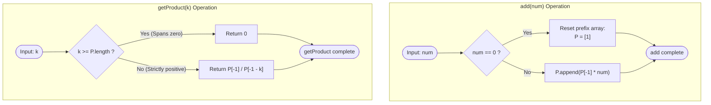

# Guided Example: Product of the Last K Numbers

We trace the step-by-step execution of the optimal prefix-product stream algorithm with zero-invalidation on a representative problem instance:

- **Operations:** `add(3)`, `add(0)`, `add(2)`, `add(5)`, `add(4)`, `getProduct(2)`, `getProduct(3)`, `getProduct(4)`, `add(8)`, `getProduct(2)`
- **Required outputs:** `[null, null, null, null, null, 20, 40, 0, null, 32]`

This instance is chosen because it introduces an intermediate zero that resets the prefix-product sequence, testing queries that lie strictly after the zero, queries that span across the zero, and subsequent additions extending the active post-zero chain.

---

## 1. Instance & Teaching Goal

We must design a data structure that supports two stream operations:
1. `add(num)`: Appends integer `num` to the end of the stream.
2. `getProduct(k)`: Computes the product of the last $k$ integers in the current stream in $\mathcal{O}(1)$ time.

For our trace sequence:
- After `add(3)` and `add(0)`, the stream contains `[3, 0]`.
- Adding `2, 5, 4` produces `[3, 0, 2, 5, 4]`.
- `getProduct(2)` targets the last $2$ numbers: $5 \times 4 = 20$.
- `getProduct(3)` targets the last $3$ numbers: $2 \times 5 \times 4 = 40$.
- `getProduct(4)` targets the last $4$ numbers: $0 \times 2 \times 5 \times 4 = 0$ (spans across the zero).
- After `add(8)`, stream is `[3, 0, 2, 5, 4, 8]`. `getProduct(2)` yields $4 \times 8 = 32$.

The primary learning goal is to maintain a running prefix-product array that achieves constant-time range quotient queries, and to use array reset logic to handle zeros cleanly without numeric overflow or division-by-zero errors.

---

## 2. Conceptual Foundation & Invariants

Let the stream of non-zero elements since the most recent zero be $[x_1, x_2, \dots, x_m]$. We maintain a prefix product array $P$ of length $m + 1$, initialized with sentinel $P[0] = 1$:
$$
P[i] = \prod_{j=1}^i x_j = P[i-1] \times x_i
$$

For any query of size $k$:
1. If $k > m$ (or $k \ge |P|$), the query window necessarily encompasses the most recent zero (or precedes the start of the stream). Since any product multiplied by $0$ is $0$, the answer is strictly $0$.
2. If $k \le m$ (or $k < |P|$), the last $k$ numbers are entirely positive and lie in the current prefix array. By telescoping division:
   $$
   \prod_{j=m-k+1}^m x_j = \frac{P[m]}{P[m-k]}
   $$

```
Stream:        ... [0]    2     5     4     8
Prefix P:          [1]    2    10    40   320
Indices:            0     1     2     3     4

k = 2 -> P[4] / P[4-2] = 320 / 10 = 32
k = 4 -> (k <= 4 non-zero elements) -> P[4] / P[0] = 320 / 1 = 320
k = 5 -> (k > 4, spans over [0])    -> Result = 0
```

We track state using the following parameters:

| State Parameter | Description | Initial Value |
|---|---|---|
| Prefix Array ($P$) | Cumulative products since latest zero, seeded with sentinel $1$ | `[1]` |
| Available Non-Zeros ($m$) | Number of positive elements appended since latest zero | $0$ ($\lvert P \rvert - 1$) |
| Query Size ($k$) | Number of trailing integers whose product is requested | Evaluated per query |

> **Invariant.** At any moment, $P$ contains $m + 1$ entries where $P[0] = 1$ and $P[i]$ ($1 \le i \le m$) is the exact cumulative product of the last $i$ non-zero numbers. If a zero arrives, $P$ is immediately reset to `[1]`. For any query $k$, if $k \ge |P|$, the window spans an absorbing zero and yields $0$; otherwise, $P[m] / P[m-k]$ yields the exact product in $\mathcal{O}(1)$ time.

---

## 3. Step-by-Step Worked Execution

### Step 1: Initial Operations and Zero Reset

- Initialize: $P = [1]$.
- `add(3)`: Non-zero. Append $P[-1] \times 3 = 1 \times 3 = 3 \implies P = [1, 3]$.
- `add(0)`: Zero detected. Absorbs all prior products. Reset $P = [1]$.

| Operation | Input | State Evaluation | Prefix Array ($P$) | Output |
|---|---|---|---|---|
| Initialize | — | Seed sentinel $1$ | `[1]` | — |
| `add(3)` | $3$ | Non-zero: append $1 \times 3$ | `[1, 3]` | `null` |
| `add(0)` | $0$ | Zero: clear prior history | `[1]` | `null` |

---

### Step 2: Accumulating Post-Zero Non-Zero Elements

- `add(2)`: Non-zero. Append $1 \times 2 = 2 \implies P = [1, 2]$.
- `add(5)`: Non-zero. Append $2 \times 5 = 10 \implies P = [1, 2, 10]$.
- `add(4)`: Non-zero. Append $10 \times 4 = 40 \implies P = [1, 2, 10, 40]$.

Length of $P$ is now $4$ ($m = 3$ available non-zero numbers: $2, 5, 4$).

| Operation | Input | Calculation | Prefix Array ($P$) | Output |
|---|---|---|---|---|
| `add(2)` | $2$ | $P[-1] \times 2 = 2$ | `[1, 2]` | `null` |
| `add(5)` | $5$ | $P[-1] \times 5 = 10$ | `[1, 2, 10]` | `null` |
| `add(4)` | $4$ | $P[-1] \times 4 = 40$ | `[1, 2, 10, 40]` | `null` |

---

### Step 3: Executing Range Product Queries

At this stage, $P = [1, 2, 10, 40]$, so $|P| = 4$ and $m = 3$.

1. `getProduct(2)`:
   - Check condition: Is $k \ge |P|$? Here $2 < 4$.
   - Calculation: $P[3] / P[3 - 2] = P[3] / P[1] = 40 / 2 = 20$.
   - Result: $20$.
2. `getProduct(3)`:
   - Check condition: Is $k \ge |P|$? Here $3 < 4$.
   - Calculation: $P[3] / P[3 - 3] = P[3] / P[0] = 40 / 1 = 40$.
   - Result: $40$.
3. `getProduct(4)`:
   - Check condition: Is $k \ge |P|$? Here $4 \ge 4$.
   - The query window spans back into the pre-reset stream, encompassing the zero added in Step 1.
   - Result: $0$.

| Operation | $k$ | Boundary Check | Quotient Formula | Result |
|---|---|---|---|---|
| `getProduct(2)` | $2$ | $2 < 4$ (Valid suffix) | $P[3] / P[1] = 40 / 2$ | **$20$** |
| `getProduct(3)` | $3$ | $3 < 4$ (Valid suffix) | $P[3] / P[0] = 40 / 1$ | **$40$** |
| `getProduct(4)` | $4$ | $4 \ge 4$ (Encompasses zero) | Direct zero-return | **$0$** |

---

### Step 4: Subsequent Stream Extension

- `add(8)`: Append $P[-1] \times 8 = 40 \times 8 = 320 \implies P = [1, 2, 10, 40, 320]$.
- `getProduct(2)`:
  - $|P| = 5$, $k = 2 < 5$.
  - Quotient: $P[4] / P[4 - 2] = P[4] / P[2] = 320 / 10 = 32$.
  - Result: $32$ ($4 \times 8 = 32$).

| Operation | Input / $k$ | Calculation | Prefix Array ($P$) | Result |
|---|---|---|---|---|
| `add(8)` | $8$ | $40 \times 8 = 320$ | `[1, 2, 10, 40, 320]` | `null` |
| `getProduct(2)` | $2$ | $P[4] / P[2] = 320 / 10$ | `[1, 2, 10, 40, 320]` | **$32$** |

---

## 4. Complete Execution Trace

Summary of all operations in the trace:

| Step | Operation | Argument | Array $P$ After Step | Condition Evaluated | Returned Output |
|---|---|---|---|---|---|
| 0 | Constructor | — | `[1]` | Sentinel initialized | — |
| 1 | `add` | $3$ | `[1, 3]` | Non-zero append | `null` |
| 2 | `add` | $0$ | `[1]` | Zero encountered $\to$ reset | `null` |
| 3 | `add` | $2$ | `[1, 2]` | Non-zero append | `null` |
| 4 | `add` | $5$ | `[1, 2, 10]` | Non-zero append | `null` |
| 5 | `add` | $4$ | `[1, 2, 10, 40]` | Non-zero append | `null` |
| 6 | `getProduct` | $2$ | `[1, 2, 10, 40]` | $2 < 4 \implies 40 / 2$ | **$20$** |
| 7 | `getProduct` | $3$ | `[1, 2, 10, 40]` | $3 < 4 \implies 40 / 1$ | **$40$** |
| 8 | `getProduct` | $4$ | `[1, 2, 10, 40]` | $4 \ge 4 \implies$ zero hit | **$0$** |
| 9 | `add` | $8$ | `[1, 2, 10, 40, 320]` | Non-zero append | `null` |
| 10 | `getProduct` | $2$ | `[1, 2, 10, 40, 320]` | $2 < 5 \implies 320 / 10$ | **$32$** |

---

## 5. Algorithmic Correctness & Complexity Derivation

### Constant-Time Correctness

For any consecutive sequence of positive integers $x_{m-k+1}, \dots, x_m$:
$$
\frac{P[m]}{P[m-k]} = \frac{\prod_{i=1}^m x_i}{\prod_{i=1}^{m-k} x_i} = \prod_{i=m-k+1}^m x_i
$$
Since all elements added since the last reset are positive integers $\ge 1$, $P[m-k] \ge 1$, so division is strictly well-defined with no risk of division by zero.

When $k \ge |P|$, at most $|P| - 1$ positive elements have been added since the most recent zero, meaning that any window of size $k$ must include that zero (or extend beyond the entire stream). Since $0 \times X = 0$, the mathematical product is guaranteed to be $0$.

### Asymptotic Complexity

- **`add(num)` Time Complexity:** $\mathcal{O}(1)$. Appending a scalar multiplication or clearing the array to `[1]` is a constant-time amortized operation.
- **`getProduct(k)` Time Complexity:** $\mathcal{O}(1)$. Involves one array length comparison, two array index lookups, and one integer division.
- **Auxiliary Space Complexity:** $\mathcal{O}(N)$ where $N$ is the total number of elements added to the stream.

---

## 6. Traps & Edge Cases

- **Zero Resets:** Storing zeros in the prefix array would turn all subsequent prefix products into $0$, making division impossible ($0 / 0$). Reinitializing the array to `[1]` on each zero completely solves this issue.
- **Sentinel $1$ Necessity:** Initializing with $P[0] = 1$ ensures that when $k$ equals the total number of non-zero elements available ($k = m$), the divisor is $P[m - m] = P[0] = 1$, correctly returning the full product without special branching.
- **Consecutive Zeros:** If multiple zeros are added in succession, each zero simply resets $P$ to `[1]`. Any subsequent query with $k \ge 1$ returns $0$.
- **Window Exactly Covering Zero:** When $k = |P|$, the window ends exactly on the zero. The condition $k \ge |P|$ correctly evaluates to true and yields $0$.

---

## 7. Accessible Mermaid Diagram


