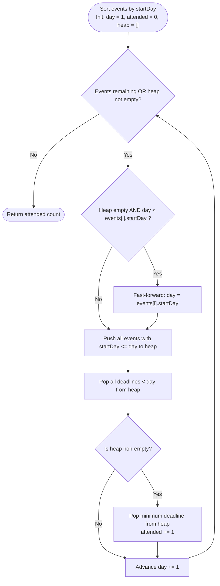

# Guided Example: Maximum Number of Events That Can Be Attended

We trace the step-by-step execution of the optimal greedy sweep-line algorithm with a min-heap on a representative problem instance:

- **Input:** `events = [[1, 2], [2, 3], [3, 4], [1, 2]]`
- **Required output:** `4`

This instance is chosen because two events share the exact same start day and duration ($[1, 2]$ and $[1, 2]$), competing for day $1$ and cascading forward into subsequent days, illustrating how the min-heap resolves contention via the Earliest Deadline First (EDF) principle.

---

## 1. Instance & Teaching Goal

We are given an array of events where each event is defined by an inclusive active interval $[\text{startDay}, \text{endDay}]$. On any given day, we may attend at most one active event. We seek the maximum number of events that can be attended.

For `events = [[1, 2], [2, 3], [3, 4], [1, 2]]`:
- Four events are scheduled: Event $A [1, 2]$, Event $B [1, 2]$, Event $C [2, 3]$, and Event $D [3, 4]$.
- On Day $1$: Events $A$ and $B$ are active. Attend Event $A$.
- On Day $2$: Event $B$ remains active, and Event $C$ becomes active. Attend Event $B$ (deadline is Day $2$, whereas Event $C$ lasts until Day $3$).
- On Day $3$: Event $C$ remains active, and Event $D$ becomes active. Attend Event $C$.
- On Day $4$: Event $D$ remains active. Attend Event $D$.
- Total events attended: $4$ (all events successfully attended).

The primary teaching goal is to formulate event scheduling as an Earliest Deadline First (EDF) greedy strategy, proving why prioritizing the event that expires soonest maximizes remaining flexibility.

---

## 2. Conceptual Foundation & Invariants

Let time advance along a discrete sweep-line day $d = 1, 2, 3, \dots$.
At any day $d$:
1. Any event with $\text{startDay} = d$ becomes available for attendance.
2. Any previously available event with $\text{endDay} < d$ has expired and can never be attended.
3. Among all currently available, non-expired events, choosing the one with the smallest $\text{endDay}$ leaves the maximum possible calendar availability for future events with later deadlines.

```
Timeline:
Day 1: [Event A: 1..2]  [Event B: 1..2]  -> Attend A (leaves B for Day 2)
Day 2:                  [Event B: 1..2]  [Event C: 2..3] -> Attend B (expires today!)
Day 3:                                   [Event C: 2..3] [Event D: 3..4] -> Attend C
Day 4:                                                   [Event D: 3..4] -> Attend D
```

We maintain active events using a min-heap ordered by $\text{endDay}$:

| State Parameter | Description | Initial Value |
|---|---|---|
| Current Day ($d$) | Sweep-line calendar day | Earliest start day ($1$) |
| Event Pointer ($i$) | Index into events sorted by start day | $0$ |
| Active Heap ($H$) | Min-heap of deadlines (`endDay`) for opened events | $\emptyset$ |
| Attended Counter | Total number of attended events | $0$ |

> **Invariant.** On any day $d$, after discarding all expired deadlines ($< d$), every element in min-heap $H$ represents a valid event that can be attended on day $d$. Extracting the minimum element from $H$ attends an event with the earliest expiration date, preserving all events with later expiration dates for subsequent days.

---

## 3. Step-by-Step Worked Execution

### Step 0: Pre-Sorting Events

Sort events primarily by $\text{startDay}$:
- Event $0$: $[1, 2]$
- Event $1$: $[1, 2]$
- Event $2$: $[2, 3]$
- Event $3$: $[3, 4]$

Initialize calendar day $d = 1$, attended count $= 0$, min-heap $H = \emptyset$.

| Sorted Event | Start Day | End Day | State |
|---|---|---|---|
| Event $0$ | $1$ | $2$ | Pending |
| Event $1$ | $1$ | $2$ | Pending |
| Event $2$ | $2$ | $3$ | Pending |
| Event $3$ | $3$ | $4$ | Pending |

---

### Step 1: Processing Day $1$ ($d = 1$)

1. **Activate Starting Events:** Events with $\text{startDay} \le 1$ are Event $0$ ($[1, 2]$) and Event $1$ ($[1, 2]$).
   - Push deadlines into heap: $H = \{2, 2\}$. Event pointer advances $i \to 2$.
2. **Prune Expired:** Smallest deadline in $H$ is $2 \ge 1$. No events expired.
3. **Attend Earliest Deadline:** Pop $2$ from $H$.
   - Attended count increments: $0 \to 1$.
   - Heap remaining: $H = \{2\}$.
4. Advance day: $d = 1 \to 2$.

| Action on Day 1 | Detail | State After Action |
|---|---|---|
| Add starting events | Push deadlines for $[1, 2], [1, 2]$ | Heap: $\{2, 2\}$ |
| Attend earliest deadline | Pop minimum deadline ($2$) | Attended: $1$, Heap: $\{2\}$ |
| Advance sweep-line | Increment day to $2$ | $d = 2$ |

---

### Step 2: Processing Day $2$ ($d = 2$)

1. **Activate Starting Events:** Events starting on Day $2$: Event $2$ ($[2, 3]$).
   - Push deadline $3$ into heap: $H = \{2, 3\}$. Event pointer advances $i \to 3$.
2. **Prune Expired:** Smallest deadline in $H$ is $2 \ge 2$. No events expired.
3. **Attend Earliest Deadline:** Pop $2$ from $H$ (the remaining $[1, 2]$ event).
   - Attended count increments: $1 \to 2$.
   - Heap remaining: $H = \{3\}$.
4. Advance day: $d = 2 \to 3$.

| Action on Day 2 | Detail | State After Action |
|---|---|---|
| Add starting events | Push deadline for $[2, 3]$ | Heap: $\{2, 3\}$ |
| Attend earliest deadline | Pop minimum deadline ($2$) | Attended: $2$, Heap: $\{3\}$ |
| Advance sweep-line | Increment day to $3$ | $d = 3$ |

---

### Step 3: Processing Day $3$ ($d = 3$)

1. **Activate Starting Events:** Events starting on Day $3$: Event $3$ ($[3, 4]$).
   - Push deadline $4$ into heap: $H = \{3, 4\}$. Event pointer advances $i \to 4$.
2. **Prune Expired:** Smallest deadline in $H$ is $3 \ge 3$. No events expired.
3. **Attend Earliest Deadline:** Pop $3$ from $H$ (Event $2$ ending on Day $3$).
   - Attended count increments: $2 \to 3$.
   - Heap remaining: $H = \{4\}$.
4. Advance day: $d = 3 \to 4$.

| Action on Day 3 | Detail | State After Action |
|---|---|---|
| Add starting events | Push deadline for $[3, 4]$ | Heap: $\{3, 4\}$ |
| Attend earliest deadline | Pop minimum deadline ($3$) | Attended: $3$, Heap: $\{4\}$ |
| Advance sweep-line | Increment day to $4$ | $d = 4$ |

---

### Step 4: Processing Day $4$ ($d = 4$)

1. **Activate Starting Events:** No remaining events ($i = 4$).
2. **Prune Expired:** Heap contains $\{4\}$. Smallest deadline is $4 \ge 4$.
3. **Attend Earliest Deadline:** Pop $4$ from $H$ (Event $3$ ending on Day $4$).
   - Attended count increments: $3 \to 4$.
   - Heap remaining: $H = \emptyset$.
4. All events processed and heap is empty. Termination condition met.
5. Final result: $4$.

| Action on Day 4 | Detail | State After Action |
|---|---|---|
| Add starting events | None ($i = 4$) | Heap: $\{4\}$ |
| Attend earliest deadline | Pop minimum deadline ($4$) | Attended: $4$, Heap: $\emptyset$ |
| Terminate loop | Heap empty and all events processed | **Final Count: $4$** |

---

## 4. Complete Execution Trace

Summary of the daily sweep-line progression:

| Day ($d$) | Incoming Events Added | Heap Contents Before Pop | Expired Pruned | Attended Deadline | Heap After Pop | Total Attended |
|---|---|---|---|---|---|---|
| $1$ | $[1, 2], [1, 2]$ | $\{2, 2\}$ | None | $2$ (Event $0$) | $\{2\}$ | $1$ |
| $2$ | $[2, 3]$ | $\{2, 3\}$ | None | $2$ (Event $1$) | $\{3\}$ | $2$ |
| $3$ | $[3, 4]$ | $\{3, 4\}$ | None | $3$ (Event $2$) | $\{4\}$ | $3$ |
| $4$ | None | $\{4\}$ | None | $4$ (Event $3$) | $\emptyset$ | **$4$** |

---

## 5. Algorithmic Correctness & Complexity Derivation

### Optimality via Exchange Argument

Suppose an optimal schedule $\mathcal{O}$ attends event $E_1$ on day $d$, where another available active event $E_2$ has an earlier deadline ($\text{endDay}(E_2) < \text{endDay}(E_1)$).
- If $\mathcal{O}$ does not attend $E_2$ on any day, we can replace $E_1$ with $E_2$ on day $d$. Since $\text{endDay}(E_2) \ge d$, this replacement is valid, and the total count of attended events is unchanged.
- If $\mathcal{O}$ attends $E_2$ on a later day $d' > d$, then $d < d' \le \text{endDay}(E_2) < \text{endDay}(E_1)$. Swapping the scheduled days of $E_1$ and $E_2$ (attending $E_2$ on day $d$ and $E_1$ on day $d'$) remains fully valid because $E_1$ is valid until $\text{endDay}(E_1) > d'$.

Thus, prioritizing the event with the earliest expiration date never restricts future choices more than any alternative, proving that the greedy choice is strictly optimal.

### Asymptotic Complexity

- **Sorting Events:** Sorting $N$ intervals by start day requires $\mathcal{O}(N \log N)$ time.
- **Heap Operations:** Each event is pushed into the min-heap at most once and popped at most once. With at most $N$ elements in the heap, heap operations take $\mathcal{O}(N \log N)$ total time.
- **Day Advancement:** Day increments at each step. If the heap becomes empty, the calendar can jump directly to $\text{events}[i].\text{startDay}$, bounding day increments to $\mathcal{O}(N + D_{\max})$.
- **Total Time Complexity:** $\mathcal{O}(N \log N)$.
- **Auxiliary Space Complexity:** $\mathcal{O}(N)$ to store the min-heap of active deadlines.

---

## 6. Traps & Edge Cases

- **Sorting by End Day Alone:** Sorting solely by $\text{endDay}$ fails because events cannot be attended before their $\text{startDay}$. A sweep-line synchronized with an active heap is required.
- **Lazy Expiration Pruning:** Events whose deadlines have passed ($< d$) must be discarded from the top of the heap before attending the current day's event.
- **Sparse Schedules (Day Skipping):** When the heap is empty, incrementing $d$ day-by-day can cause unnecessary loops if consecutive events are separated by large gaps (e.g., Day $1$ followed by Day $10^9$). In that case, jump $d$ directly to $\text{events}[i].\text{startDay}$.
- **Simultaneous Multiple Events:** When multiple events share the exact same start day, all of them must be pushed to the heap before selecting the minimum.

---

## 7. Accessible Mermaid Diagram


