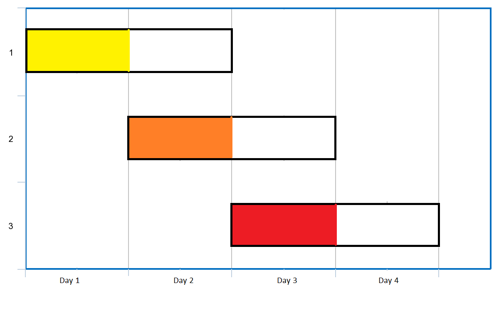

### 1. Description

You are given an array of `events` where $\text{events}[i] = [\text{startDay}_{i}, \text{endDay}_{i}]$. Every event `i` starts at $\text{startDay}_{i}$_ and ends at $\text{endDay}_{i}$.

You can attend an event `i` at any day `d` where $\text{startDay}_{i} \le d \le \text{endDay}_{i}$. You can only attend one event at any time `d`.

Return *the maximum number of events you can attend*.

### 2. Function Contract

- `n`: Input parameter.
- Returns expected result.

### 3. Examples

#### Example 1

- **Input:** $events = [[1,2],[2,3],[3,4]]$
- **Output:** `3`
- **Explanation:** You can attend all the three events.
One way to attend them all is as shown.
Attend the first event on day 1.
Attend the second event on day 2.
Attend the third event on day 3.
#### Example 2

- **Input:** $events= [[1,2],[2,3],[3,4],[1,2]]$
- **Output:** `4`

### 4. Constraints

- $1 \le \text{events.length} \le 10^{5}$

- $\text{events}[i].length = 2$

- $1 \le \text{startDay}_{i} \le \text{endDay}_{i} \le 10^{5}$