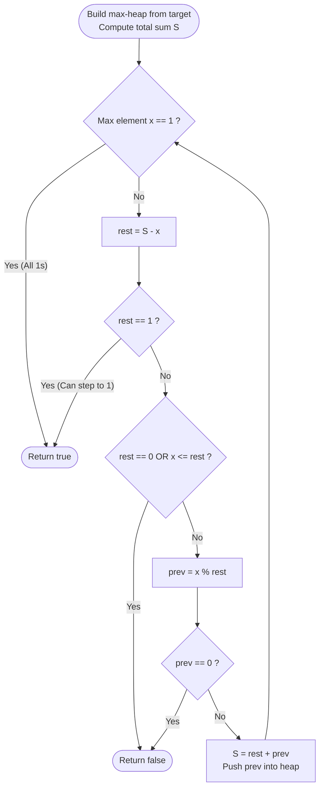

# Guided Example: Construct Target Array With Multiple Sums

We trace the step-by-step execution of the optimal reverse Euclidean heap simulation on a representative problem instance:

- **Input:** `target = [9, 3, 5]`
- **Required output:** `true`

This instance is chosen because each reduction step strictly updates a different array element ($9 \to 1$, $5 \to 1$, $3 \to 1$), demonstrating the deterministic backward reconstruction of the base configuration `[1, 1, 1]`.

---

## 1. Instance & Teaching Goal

We begin with an array of $n$ ones (`[1, 1, ..., 1]`). In each forward step, we may choose any element and replace it with the sum of all elements in the current array. Given a `target` array, we must determine if `target` can be reached through any sequence of valid operations.

Simulating forward is intractable because branching choices explode exponentially. However, the reverse direction is completely deterministic:
- In any forward step replacing an element with the sum of all elements (which are all positive $\ge 1$), the replaced element becomes strictly larger than every other element in the array.
- Therefore, in the reverse direction, the element that was last replaced **must** be the current maximum element of the array.

For `target = [9, 3, 5]`:
- Step 1: Maximum is $9$. The other elements sum to $3 + 5 = 8$. Prior value was $9 - 8 = 1$. Array becomes `[1, 3, 5]`.
- Step 2: Maximum is $5$. The other elements sum to $1 + 3 = 4$. Prior value was $5 - 4 = 1$. Array becomes `[1, 3, 1]`.
- Step 3: Maximum is $3$. The other elements sum to $1 + 1 = 2$. Prior value was $3 - 2 = 1$. Array becomes `[1, 1, 1]`.
- Terminal state: All elements equal $1$. Output is `true`.

The primary teaching goal is to model the problem backwards as an inverted Euclidean division algorithm, using a max-heap to repeatedly locate and reduce the maximal value.

---

## 2. Conceptual Foundation & Invariants

Let $S = \sum_{i=1}^n A[i]$ be the total sum of the array, and let $x = \max(A)$ be the largest element.
The sum of all other elements is:
$$
\text{rest} = S - x
$$
In the forward step that created $x$, some previous value $x_{\text{prev}} \ge 1$ was replaced by the total array sum $(x_{\text{prev}} + \text{rest})$. Therefore:
$$
x = x_{\text{prev}} + \text{rest} \implies x_{\text{prev}} = x - \text{rest}
$$

If $x \gg \text{rest}$, subtracting $\text{rest}$ one time leaves $x_{\text{prev}}$ as the largest element again. We accelerate multiple subtractions using the modulo operator:
$$
x_{\text{prev}} = x \pmod{\text{rest}}
$$

```
Forward:   [1, 1, 1] -> (sum=3, replace 1) -> [1, 3, 1] -> (sum=5, replace 1) -> [1, 3, 5] -> (sum=9, replace 1) -> [9, 3, 5]
Reverse:   [9, 3, 5] --(9 % 8 = 1)--> [1, 3, 5] --(5 % 4 = 1)--> [1, 3, 1] --(3 % 2 = 1)--> [1, 1, 1] (SUCCESS)
```

We track state using the following parameters:

| State Parameter | Description | Initial Value |
|---|---|---|
| Total Sum ($S$) | Sum of all elements currently in the array | $9 + 3 + 5 = 17$ |
| Maximum Element ($x$) | The largest integer extracted from the max-heap | $9$ |
| Complementary Sum ($\text{rest}$) | Sum of all other elements ($S - x$) | $17 - 9 = 8$ |
| Reduced Element ($x_{\text{prev}}$) | Inverted prior value: $x \pmod{\text{rest}}$ | $9 \pmod 8 = 1$ |

> **Invariant.** At every reverse step, the largest element $x$ is the unique value that could have been modified in the preceding forward transition. If $x \le \text{rest}$ or $x \pmod{\text{rest}} = 0$ (with $\text{rest} > 1$), no valid positive predecessor exists, proving constructibility impossible. If $x = 1$ or $\text{rest} = 1$, the array is provably reducible to all ones.

---

## 3. Step-by-Step Worked Execution

### Step 1: Inverting Maximum Element $9$

- Initial state: `target = [9, 3, 5]`.
- Total sum: $S = 9 + 3 + 5 = 17$.
- Extract maximum: $x = 9$.
- Compute remainder sum: $\text{rest} = S - x = 17 - 9 = 8$.
- Boundary checks:
  - Is $x = 1$? No ($9 \ne 1$).
  - Is $\text{rest} = 1$? No ($8 \ne 1$).
  - Is $\text{rest} = 0$ or $x \le \text{rest}$? No ($8 > 0$ and $9 > 8$).
- Compute predecessor:
  $$
  x_{\text{prev}} = 9 \pmod 8 = 1
  $$
- Update total sum: $S_{\text{new}} = \text{rest} + x_{\text{prev}} = 8 + 1 = 9$.
- Array after step: `[1, 3, 5]`.

| Parameter | State Before Step | Applied Rule | State After Step |
|---|---|---|---|
| Max Value ($x$) | $9$ | Invert via $x \pmod{\text{rest}}$ | $1$ |
| Remainder ($\text{rest}$) | $8$ | Unchanged components | $8$ |
| Total Sum ($S$) | $17$ | $S \gets \text{rest} + x_{\text{prev}}$ | $9$ |
| Heap Elements | $\{9, 5, 3\}$ | Push predecessor $1$ | $\{5, 3, 1\}$ |

---

### Step 2: Inverting Maximum Element $5$

- Current state: `target = [1, 3, 5]`.
- Total sum: $S = 9$.
- Extract maximum: $x = 5$.
- Compute remainder sum: $\text{rest} = S - x = 9 - 5 = 4$.
- Boundary checks:
  - $x \ne 1$ and $\text{rest} \ne 1$.
  - $\text{rest} = 4 > 0$ and $x = 5 > 4$. Valid.
- Compute predecessor:
  $$
  x_{\text{prev}} = 5 \pmod 4 = 1
  $$
- Update total sum: $S_{\text{new}} = \text{rest} + x_{\text{prev}} = 4 + 1 = 5$.
- Array after step: `[1, 3, 1]`.

| Parameter | State Before Step | Applied Rule | State After Step |
|---|---|---|---|
| Max Value ($x$) | $5$ | Invert via $x \pmod{\text{rest}}$ | $1$ |
| Remainder ($\text{rest}$) | $4$ | Unchanged components | $4$ |
| Total Sum ($S$) | $9$ | $S \gets \text{rest} + x_{\text{prev}}$ | $5$ |
| Heap Elements | $\{5, 3, 1\}$ | Push predecessor $1$ | $\{3, 1, 1\}$ |

---

### Step 3: Inverting Maximum Element $3$

- Current state: `target = [1, 3, 1]`.
- Total sum: $S = 5$.
- Extract maximum: $x = 3$.
- Compute remainder sum: $\text{rest} = S - x = 5 - 3 = 2$.
- Boundary checks:
  - $x \ne 1$ and $\text{rest} \ne 1$.
  - $\text{rest} = 2 > 0$ and $x = 3 > 2$. Valid.
- Compute predecessor:
  $$
  x_{\text{prev}} = 3 \pmod 2 = 1
  $$
- Update total sum: $S_{\text{new}} = \text{rest} + x_{\text{prev}} = 2 + 1 = 3$.
- Array after step: `[1, 1, 1]`.

| Parameter | State Before Step | Applied Rule | State After Step |
|---|---|---|---|
| Max Value ($x$) | $3$ | Invert via $x \pmod{\text{rest}}$ | $1$ |
| Remainder ($\text{rest}$) | $2$ | Unchanged components | $2$ |
| Total Sum ($S$) | $5$ | $S \gets \text{rest} + x_{\text{prev}}$ | $3$ |
| Heap Elements | $\{3, 1, 1\}$ | Push predecessor $1$ | $\{1, 1, 1\}$ |

---

### Step 4: Terminal Evaluation

- Current heap maximum: $x = 1$.
- Since the maximum element in the heap is $1$, all elements in the array must be $\le 1$.
- Given all elements started $\ge 1$, the array has completely converged to `[1, 1, 1]`.
- Return `true`.

| Parameter | Observed State | Termination Trigger | Output |
|---|---|---|---|
| Heap Maximum | $x = 1$ | All elements reduced to $1$ | **`true`** |

---

## 4. Complete Execution Trace

Summary of the reverse reduction sequence:

| Step | Array State | Total Sum ($S$) | Extracted Max ($x$) | Remainder ($\text{rest}$) | Modular Op: $x \pmod{\text{rest}}$ | New Predecessor | Next State |
|---|---|---|---|---|---|---|---|
| $1$ | `[9, 3, 5]` | $17$ | $9$ | $8$ | $9 \pmod 8$ | $1$ | `[1, 3, 5]` |
| $2$ | `[1, 3, 5]` | $9$ | $5$ | $4$ | $5 \pmod 4$ | $1$ | `[1, 3, 1]` |
| $3$ | `[1, 3, 1]` | $5$ | $3$ | $2$ | $3 \pmod 2$ | $1$ | `[1, 1, 1]` |
| $4$ | `[1, 1, 1]` | $3$ | $1$ | — | Max is $1$ | Terminal | **`true`** |

---

## 5. Algorithmic Correctness & Complexity Derivation

### Determinism of Reverse Transitions

In the forward process, replacing any element with the sum of all elements results in a new value strictly greater than the sum of all other elements:
$$
S_{\text{new}} = x_{\text{new}} + \text{rest} \quad \text{where } x_{\text{new}} = x_{\text{old}} + \text{rest} > \text{rest}
$$
Since all other elements remain unchanged and strictly positive, $x_{\text{new}}$ is strictly the unique maximum element in the new array. Thus, moving backwards, there is never an ambiguous choice: only the current maximum element could have been altered in the immediately preceding step.

### Logarithmic Euclidean Convergence

Instead of repeatedly subtracting $\text{rest}$ from $x$ (which would take $\mathcal{O}(x / \text{rest})$ steps), computing $x \pmod{\text{rest}}$ collapses all consecutive subtractions into a single step. Analogous to the Euclidean greatest common divisor algorithm, the value drops by at least a factor of $2$ every two steps, bounding total modular divisions by $\mathcal{O}(\log(\max(\text{target})))$.

### Asymptotic Complexity

- **Time Complexity:** $\mathcal{O}(N + K \log N)$ where $N$ is array length and $K = \mathcal{O}(\log(\max(\text{target})))$ is the number of Euclidean modulo reduction steps. Initial heap construction takes $\mathcal{O}(N)$. Each heap extraction and re-insertion takes $\mathcal{O}(\log N)$.
- **Auxiliary Space Complexity:** $\mathcal{O}(N)$ to store elements in the max-heap.

---

## 6. Traps & Edge Cases

- **Special Case $\text{rest} = 1$:** For inputs like `[1, 1000000000]`, $\text{rest} = 1$. The maximum can always be reduced down to $1$ by repeatedly subtracting $1$. Testing if $\text{rest} = 1$ and immediately returning `true` prevents invalid $x \pmod 1 = 0$ division results.
- **Remainder Equal to Zero ($\text{rest} = 0$):** Occurs for single-element arrays (e.g. `[2]`). If $N = 1$ and `target[0] != 1`, it can never be produced from `[1]`, correctly failing with $\text{rest} = 0$.
- **Exact Multiple ($x \pmod{\text{rest}} = 0$):** If $x$ is an exact multiple of $\text{rest}$ (e.g. `[2, 4]`, $x = 4, \text{rest} = 2$), $4 \pmod 2 = 0$. A value of $0$ is illegal because starting values are $1$. Hence, when $\text{rest} > 1$ and $x \pmod{\text{rest}} = 0$, the algorithm must immediately return `false`.
- **Integer Overflow in Sum:** The sum of array elements can exceed $2^{31} - 1$. Accumulators must use 64-bit integer types to prevent arithmetic overflow.

---

## 7. Accessible Mermaid Diagram


