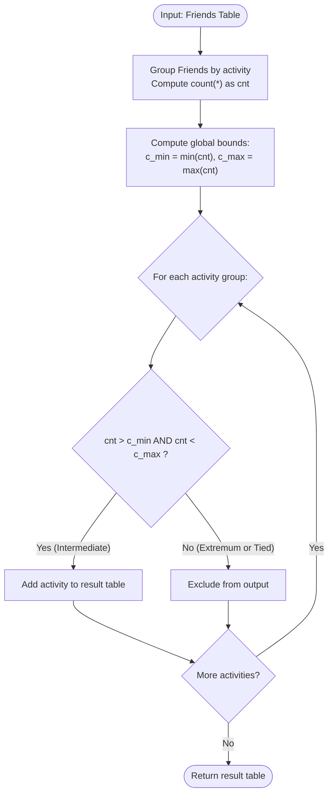

# Guided Example: Activity Participants

We trace the step-by-step execution of the relational aggregation and strict extrema-filtering algorithm on a representative database instance:

- **Input Tables:**
  - `Friends`: $6$ participant records across $3$ distinct activities
  - `Activities`: `[{"id": 1, "name": "Eating"}, {"id": 2, "name": "Singing"}, {"id": 3, "name": "Horse Riding"}]`
- **Required Output:** `{"columns": ["activity"], "rows": [["Singing"]]}`

This instance is chosen because each of the three activities receives a strictly distinct participant count ($3, 2, 1$), clearly distinguishing the unique maximum, the unique minimum, and the strictly intermediate activity.

---

## 1. Instance & Teaching Goal

We are given two database tables:
1. `Friends` with columns `id`, `name`, and `activity`.
2. `Activities` with columns `id` and `name`.

Our goal is to find the names of all activities that have neither the maximum nor the minimum number of participants.

For the input dataset:
- Eating has $3$ participants: Jonathan D., Elvis Q., and Daniel A.
- Singing has $2$ participants: Jade W. and Victor J.
- Horse Riding has $1$ participant: Bob B.

The global maximum participant count is $3$ (Eating).
The global minimum participant count is $1$ (Horse Riding).
The only activity with a participant count strictly between the minimum and maximum ($1 < \text{count} < 3$) is Singing with $2$ participants.

The primary teaching goal is to model intermediate group selection through relational grouping, global scalar aggregation of minimum and maximum boundaries, and strict range filtering.

---

## 2. Conceptual Foundation & Invariants

Let $R$ denote the `Friends` relation. We first compute the participant count for every active group using the relational aggregation operator:
$$
G = \gamma_{\text{activity}, \text{count}(*) \to \text{cnt}}(R)
$$

Next, we determine the global scalar bounds over the projected counts:
$$
c_{\min} = \min(\Pi_{\text{cnt}}(G))
$$
$$
c_{\max} = \max(\Pi_{\text{cnt}}(G))
$$

Finally, we apply a strict conjunction filter requiring a count to be strictly greater than $c_{\min}$ and strictly less than $c_{\max}$:
$$
\text{IntermediateActivities} = \Pi_{\text{activity}} \left( \sigma_{c_{\min} < \text{cnt} < c_{\max}}(G) \right)
$$

```
Friends Table:
  Eating:       [Jonathan D., Elvis Q., Daniel A.] -> count = 3 (MAXIMUM -> Exclude)
  Singing:      [Jade W., Victor J.]               -> count = 2 (INTERMEDIATE -> Keep)
  Horse Riding: [Bob B.]                           -> count = 1 (MINIMUM -> Exclude)

Extrema: c_min = 1, c_max = 3
Filter Condition: 1 < count < 3  ==> Only "Singing" satisfies condition.
```

We track state with the following parameters:

| State Parameter | Description | Initial Value |
|---|---|---|
| Grouped Relation ($G$) | Unique activities paired with their participant tallies | Evaluated from `Friends` |
| Lower Bound ($c_{\min}$) | Smallest participant count among all activities | Computed across $G$ |
| Upper Bound ($c_{\max}$) | Largest participant count among all activities | Computed across $G$ |
| Filtered Projection | Set of activity names satisfying $c_{\min} < \text{cnt} < c_{\max}$ | Projected output |

> **Invariant.** An activity is admitted to the final result if and only if its participant count is strictly interior to the range $[c_{\min}, c_{\max}]$. If all activities tie for the same participant count ($c_{\min} = c_{\max}$), the strict inequalities eliminate all rows, correctly returning an empty result.

---

## 3. Step-by-Step Worked Execution

### Step 1: Relational Grouping and Cardinality Aggregation

Group rows of `Friends` by `activity` and count the number of member records in each bucket:
- Group `'Eating'`: IDs $\{1, 4, 5\} \implies \text{cnt} = 3$.
- Group `'Singing'`: IDs $\{2, 3\} \implies \text{cnt} = 2$.
- Group `'Horse Riding'`: ID $\{6\} \implies \text{cnt} = 1$.

| Activity Name | Participant IDs | Group Cardinality ($\text{cnt}$) |
|---|---|---|
| Eating | $\{1, 4, 5\}$ | $3$ |
| Singing | $\{2, 3\}$ | $2$ |
| Horse Riding | $\{6\}$ | $1$ |

---

### Step 2: Extracting Global Extrema Bounds

Scan the cardinality column $\Pi_{\text{cnt}}(G) = \{3, 2, 1\}$ to identify the extreme thresholds:
- Minimum cardinality:
  $$
  c_{\min} = \min(3, 2, 1) = 1
  $$
- Maximum cardinality:
  $$
  c_{\max} = \max(3, 2, 1) = 3
  $$

| Bound Name | Expression | Evaluated Value | Boundary Role |
|---|---|---|---|
| Global Minimum ($c_{\min}$) | $\min(\{3, 2, 1\})$ | $1$ | Excludes all lowest-ranked activities |
| Global Maximum ($c_{\max}$) | $\max(\{3, 2, 1\})$ | $3$ | Excludes all highest-ranked activities |

---

### Step 3: Applying Strict Range Filtering

Evaluate the strict inequality predicate $c_{\min} < \text{cnt} < c_{\max}$ ($1 < \text{cnt} < 3$) for every grouped activity:

1. **Eating ($\text{cnt} = 3$):**
   - Test: $1 < 3 < 3$.
   - Fails upper inequality ($3 < 3$ is False). Excluded.
2. **Singing ($\text{cnt} = 2$):**
   - Test: $1 < 2 < 3$.
   - Satisfies both inequalities ($1 < 2$ and $2 < 3$ are True). **Retained: `["Singing"]`**.
3. **Horse Riding ($\text{cnt} = 1$):**
   - Test: $1 < 1 < 3$.
   - Fails lower inequality ($1 < 1$ is False). Excluded.

| Activity | Cardinality | Lower Test: $\text{cnt} > 1$ | Upper Test: $\text{cnt} < 3$ | Retained in Output? |
|---|---|---|---|---|
| Eating | $3$ | True | False ($3 = 3$) | No (Maximum) |
| Singing | $2$ | True | True | **Yes: `["Singing"]`** |
| Horse Riding | $1$ | False ($1 = 1$) | True | No (Minimum) |

---

## 4. Complete Execution Trace

Summary of all activity evaluations against the global participant boundaries:

| Activity | Participant Count | Relationship to $c_{\min} = 1$ | Relationship to $c_{\max} = 3$ | Status | Final Action |
|---|---|---|---|---|---|
| Eating | $3$ | Strictly Greater | Equal to Maximum | Discarded | Excluded |
| **Singing** | **$2$** | **Strictly Greater** | **Strictly Less** | **Interior** | **Project `["Singing"]`** |
| Horse Riding | $1$ | Equal to Minimum | Strictly Less | Discarded | Excluded |

---

## 5. Algorithmic Correctness & Complexity Derivation

### Boundary Semantics and Ties

The specification demands activities with *neither* the maximum nor the minimum participant count:
- If multiple distinct activities tie for the maximum count, all of them have $\text{cnt} = c_{\max}$, and the strict condition $\text{cnt} < c_{\max}$ filters out every one of them.
- Symmetrically, if multiple activities tie for the minimum count, the strict condition $\text{cnt} > c_{\min}$ filters out every one of them.
- If all activities have the same count (e.g. all equal $k$), then $c_{\min} = c_{\max} = k$. The condition $k < \text{cnt} < k$ is unsatisfiable, correctly yielding zero output rows.

### Asymptotic Complexity

- **Time Complexity:** $\mathcal{O}(|F| + |A| \log |A|)$. Scanning `Friends` and computing counts using hash-based grouping takes $\mathcal{O}(|F|)$ time where $|F|$ is the number of rows in `Friends`. Finding the scalar minimum and maximum across the $|A|$ distinct activities requires $\mathcal{O}(|A|)$ time. The final filter pass takes $\mathcal{O}(|A|)$ time. Total execution time is linear with respect to the input size.
- **Auxiliary Space Complexity:** $\mathcal{O}(|A|)$ to store the grouped participant counts for the distinct activities.

---

## 6. Traps & Edge Cases

- **Tied Extrema:** Multiple activities tying for the top or bottom spot must all be eliminated. The strict inequalities $\text{cnt} > c_{\min}$ and $\text{cnt} < c_{\max}$ naturally handle ties without requiring ranking window functions.
- **Only Two Activities Present:** If there are only two activities (e.g. counts $5$ and $2$), then $c_{\max} = 5$ and $c_{\min} = 2$. No integer lies strictly between them, so both are excluded, returning an empty set.
- **All Activities Equal:** When all activities have identical participant counts, $c_{\min} = c_{\max}$. The result must be empty rather than including all activities.
- **Catalog Independence:** The problem states that every activity in `Activities` is performed by at least one person, ensuring that grouping `Friends` directly captures the entire active domain.

---

## 7. Accessible Mermaid Diagram


