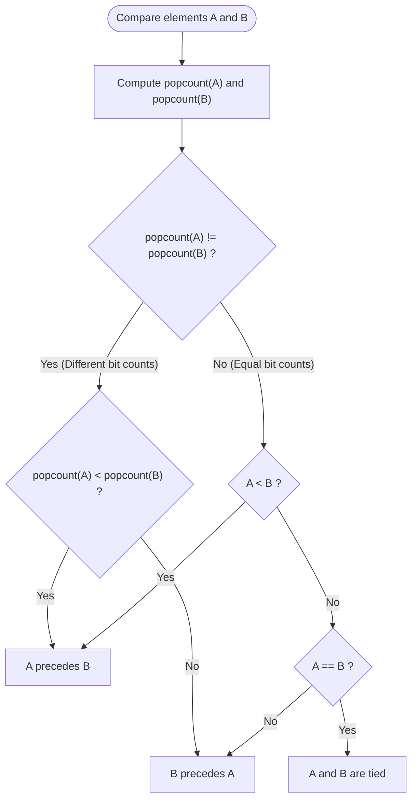

# Guided Example: Sort Integers by The Number of 1 Bits

We trace the step-by-step execution of the optimal dual-key sorting algorithm on a representative problem instance:

- **Input:** `arr = [0, 1, 2, 3, 4, 5, 6, 7, 8]`
- **Required output:** `[0, 1, 2, 4, 8, 3, 5, 6, 7]`

This instance is chosen because it spans numbers with $0, 1, 2,$ and $3$ set bits, and includes multiple numbers sharing identical bit counts ($1, 2, 4, 8$ all have one set bit; $3, 5, 6$ all have two set bits), demonstrating both the primary bit-count partitioning and the secondary numeric tie-breaking.

---

## 1. Instance & Teaching Goal

Given an integer array `arr`, we must sort the array in ascending order according to two hierarchical rules:
1. **Primary Key:** The number of set bits ($1$'s) in the binary representation of each integer.
2. **Secondary Key (Tie-breaker):** If two integers have the same number of set bits, sort them in ordinary numerical ascending order.

For `arr = [0, 1, 2, 3, 4, 5, 6, 7, 8]`:
- $0$ has $0$ set bits $\implies [0]$
- $1, 2, 4, 8$ each have $1$ set bit $\implies$ sorted numerically: $[1, 2, 4, 8]$
- $3, 5, 6$ each have $2$ set bits $\implies$ sorted numerically: $[3, 5, 6]$
- $7$ has $3$ set bits $\implies [7]$
- Combined result: $[0, 1, 2, 4, 8, 3, 5, 6, 7]$.

The primary learning goal is to master composite-key ordering where domain-specific bitwise metrics supersede standard numeric magnitude, using stable multi-pass sorting or lexicographic comparison keys.

---

## 2. Conceptual Foundation & Invariants

For each integer $x$, we compute its population count:
$$
\operatorname{popcount}(x) = \sum_{k=0}^{31} (x \gg k) \ \& \ 1
$$

We associate each integer $x$ with an ordered pair:
$$
\kappa(x) = (\operatorname{popcount}(x), x)
$$

The total ordering relation $\prec$ between two integers $u$ and $v$ is defined lexicographically:
$$
u \prec v \iff \begin{cases}
\operatorname{popcount}(u) < \operatorname{popcount}(v), & \text{or} \\
\operatorname{popcount}(u) = \operatorname{popcount}(v) \land u < v
\end{cases}
$$

```
Bucket 0 (0 bits): [0] (0)
Bucket 1 (1 bit):  [1] (1), [2] (10), [4] (100), [8] (1000)
Bucket 2 (2 bits): [3] (11), [5] (101), [6] (110)
Bucket 3 (3 bits): [7] (111)

Concatenated Order:
0 -> 1 -> 2 -> 4 -> 8 -> 3 -> 5 -> 6 -> 7
```

We track state using the following parameters:

| State Parameter | Description | Initial Value |
|---|---|---|
| Input Integer ($x$) | Number currently being analyzed | Elements in `arr` |
| Binary Representation | Unsigned base-2 bit string | Evaluated per number |
| Bit Count ($\operatorname{popcount}$) | Primary sorting key | Computed via bit manipulation |
| Composite Sort Key | Pair $(\operatorname{popcount}(x), x)$ | Formed for each element |

> **Invariant.** The final array is sorted such that for any two indices $i < j$, the composite keys satisfy $\kappa(arr[i]) \le \kappa(arr[j])$. If two elements have differing bit counts, the one with fewer set bits strictly precedes the other regardless of decimal magnitude.

---

## 3. Step-by-Step Worked Execution

### Step 1: Extract Binary Features and Bit Counts

For each integer in `arr = [0, 1, 2, 3, 4, 5, 6, 7, 8]`, evaluate its binary expansion and total ones:

- $0 = 0_2 \implies \text{popcount} = 0$, key: $(0, 0)$
- $1 = 1_2 \implies \text{popcount} = 1$, key: $(1, 1)$
- $2 = 10_2 \implies \text{popcount} = 1$, key: $(1, 2)$
- $3 = 11_2 \implies \text{popcount} = 2$, key: $(2, 3)$
- $4 = 100_2 \implies \text{popcount} = 1$, key: $(1, 4)$
- $5 = 101_2 \implies \text{popcount} = 2$, key: $(2, 5)$
- $6 = 110_2 \implies \text{popcount} = 2$, key: $(2, 6)$
- $7 = 111_2 \implies \text{popcount} = 3$, key: $(3, 7)$
- $8 = 1000_2 \implies \text{popcount} = 1$, key: $(1, 8)$

| Integer ($x$) | Binary Form | Set Bits ($\operatorname{popcount}$) | Composite Key $\kappa(x)$ |
|---|---|---|---|
| $0$ | $0_2$ | $0$ | $(0, 0)$ |
| $1$ | $1_2$ | $1$ | $(1, 1)$ |
| $2$ | $10_2$ | $1$ | $(1, 2)$ |
| $3$ | $11_2$ | $2$ | $(2, 3)$ |
| $4$ | $100_2$ | $1$ | $(1, 4)$ |
| $5$ | $101_2$ | $2$ | $(2, 5)$ |
| $6$ | $110_2$ | $2$ | $(2, 6)$ |
| $7$ | $111_2$ | $3$ | $(3, 7)$ |
| $8$ | $1000_2$ | $1$ | $(1, 8)$ |

---

### Step 2: Bucket Partitioning by Popcount

Group elements by their primary key ($\operatorname{popcount}$):
- **Group 0 (0 bits):** `[0]`
- **Group 1 (1 bit):** `[1, 2, 4, 8]`
- **Group 2 (2 bits):** `[3, 5, 6]`
- **Group 3 (3 bits):** `[7]`

| Group ($\operatorname{popcount}$) | Member Integers | Internal Order Check |
|---|---|---|
| $0$ | `[0]` | Single element |
| $1$ | `[1, 2, 4, 8]` | $1 < 2 < 4 < 8$ (Already sorted) |
| $2$ | `[3, 5, 6]` | $3 < 5 < 6$ (Already sorted) |
| $3$ | `[7]` | Single element |

---

### Step 3: Resolving Relative Ordering Between Groups

Compare elements across differing groups:
- Consider $8$ vs $3$:
  - Numerical magnitude: $8 > 3$.
  - Bit counts: $\operatorname{popcount}(8) = 1$, while $\operatorname{popcount}(3) = 2$.
  - Because $1 < 2$, composite key $(1, 8) < (2, 3)$.
  - Thus, $8$ strictly precedes $3$ in the final sequence.
- Consider $6$ vs $7$:
  - $\operatorname{popcount}(6) = 2 < \operatorname{popcount}(7) = 3$.
  - $(2, 6) < (3, 7) \implies 6$ precedes $7$.

| Comparison Pair | Popcount Test | Secondary Test | Ordering Decision |
|---|---|---|---|
| $8$ vs $3$ | $1 < 2$ (Decisive) | Skipped | $8 \prec 3$ |
| $4$ vs $8$ | $1 = 1$ (Tie) | $4 < 8$ | $4 \prec 8$ |
| $5$ vs $6$ | $2 = 2$ (Tie) | $5 < 6$ | $5 \prec 6$ |
| $6$ vs $7$ | $2 < 3$ (Decisive) | Skipped | $6 \prec 7$ |

---

### Step 4: Final Array Assembly

Concatenate the ordered groups:
$$
[0] + [1, 2, 4, 8] + [3, 5, 6] + [7] = [0, 1, 2, 4, 8, 3, 5, 6, 7]
$$

| Final Rank | Integer Value | Popcount | Tie-Break Value |
|---|---|---|---|
| 1st | $0$ | $0$ | $0$ |
| 2nd | $1$ | $1$ | $1$ |
| 3rd | $2$ | $1$ | $2$ |
| 4th | $4$ | $1$ | $4$ |
| 5th | $8$ | $1$ | $8$ |
| 6th | $3$ | $2$ | $3$ |
| 7th | $5$ | $2$ | $5$ |
| 8th | $6$ | $2$ | $6$ |
| 9th | $7$ | $3$ | $7$ |

---

## 4. Complete Execution Trace

Summary of all elements in their final sorted sequence:

| Sorted Index | Value ($x$) | Binary Form | $\operatorname{popcount}(x)$ | Comparison Key | Preceding Element Reason |
|---|---|---|---|---|---|
| $0$ | $0$ | $0_2$ | $0$ | $(0, 0)$ | Smallest popcount ($0$) |
| $1$ | $1$ | $1_2$ | $1$ | $(1, 1)$ | Popcount $1$, smallest magnitude |
| $2$ | $2$ | $10_2$ | $1$ | $(1, 2)$ | Popcount $1$, $2 > 1$ |
| $3$ | $4$ | $100_2$ | $1$ | $(1, 4)$ | Popcount $1$, $4 > 2$ |
| $4$ | $8$ | $1000_2$ | $1$ | $(1, 8)$ | Popcount $1$, $8 > 4$ |
| $5$ | $3$ | $11_2$ | $2$ | $(2, 3)$ | Popcount $2$, smallest magnitude |
| $6$ | $5$ | $101_2$ | $2$ | $(2, 5)$ | Popcount $2$, $5 > 3$ |
| $7$ | $6$ | $110_2$ | $2$ | $(2, 6)$ | Popcount $2$, $6 > 5$ |
| $8$ | $7$ | $111_2$ | $3$ | $(3, 7)$ | Popcount $3$, highest set bits |

---

## 5. Algorithmic Correctness & Complexity Derivation

### Total Ordering Verification

The relation $\prec$ is a strict weak ordering:
1. **Irreflexivity:** $\kappa(x) \not< \kappa(x)$ holds trivially.
2. **Asymmetry:** If $\kappa(u) < \kappa(v)$, then either $\operatorname{popcount}(u) < \operatorname{popcount}(v)$ or $(\operatorname{popcount}(u) = \operatorname{popcount}(v) \land u < v)$. In both cases, $\kappa(v) \not< \kappa(u)$.
3. **Transitivity:** Inherited directly from the transitivity of integer comparison on the primary and secondary fields.

Because standard comparison sorting algorithms require only a strict weak ordering, any standard sorting routine with custom comparator $\kappa(x)$ will produce a unique, globally consistent sorted array.

### Asymptotic Complexity

- **Bit Count Computation:** For an array of length $N$ with values $\le 10^4$, computing $\operatorname{popcount}(x)$ uses built-in CPU instructions or Brian Kernighan's algorithm taking $\mathcal{O}(1)$ time per integer.
- **Sorting Time:** A comparison sort (such as Timsort or Quicksort) executes in $\mathcal{O}(N \log N)$ time. Alternatively, because popcounts for numbers $\le 10^4$ are bounded by $\lfloor \log_2 10^4 \rfloor + 1 \le 14$, bucket sort can partition elements into $15$ buckets and sort buckets individually in $\mathcal{O}(N \log(N/15)) \approx \mathcal{O}(N \log N)$ time.
- **Auxiliary Space Complexity:** $\mathcal{O}(N)$ or $\mathcal{O}(1)$ depending on whether sorting is performed in-place.

---

## 6. Traps & Edge Cases

- **Large Powers of Two:** $1024$ has only one set bit ($10000000000_2$). It must sort before small numbers with two set bits, such as $3$ ($11_2$). Never compare decimal magnitudes before verifying equal bit counts.
- **Zero Input:** $0$ has zero set bits. It is the only non-negative integer with popcount $0$ and must always be the first element.
- **Duplicate Values in Input:** If the input contains duplicate values (e.g. two $4$'s), their composite keys are identical: $(1, 4) = (1, 4)$. Stable sorting preserves their relative input ordering.

---

## 7. Accessible Mermaid Diagram


