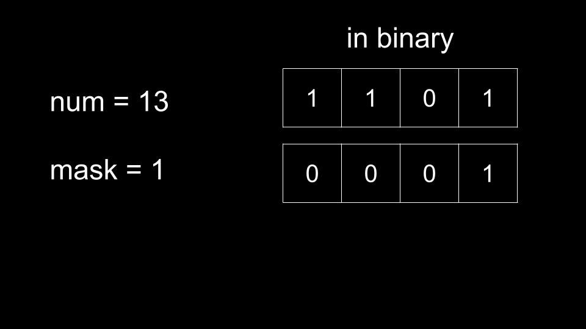
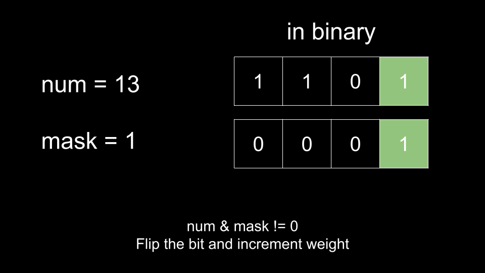
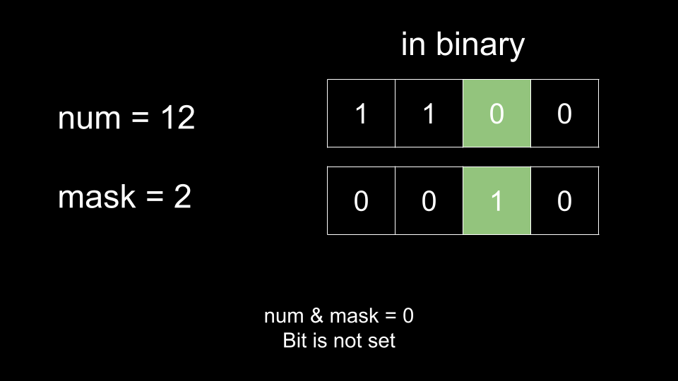
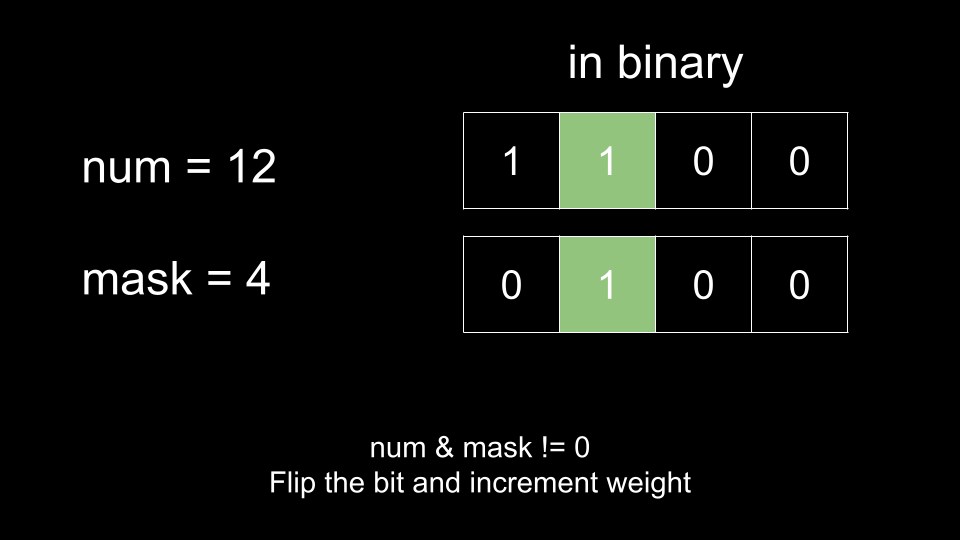
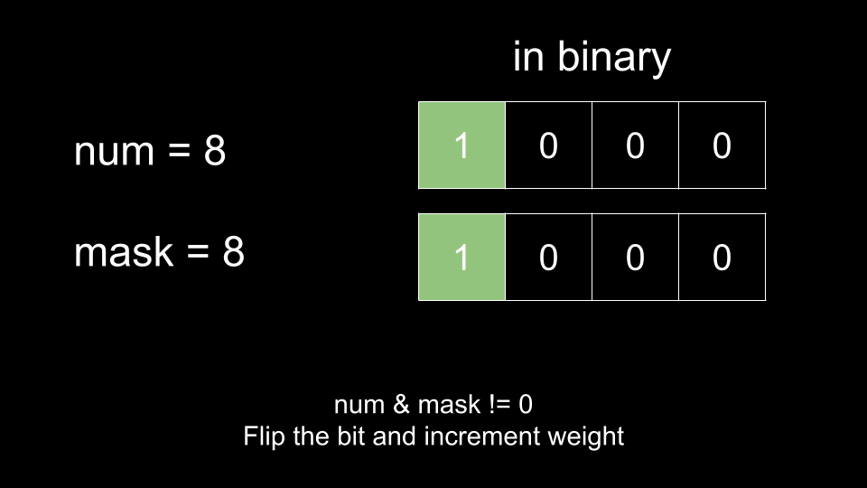
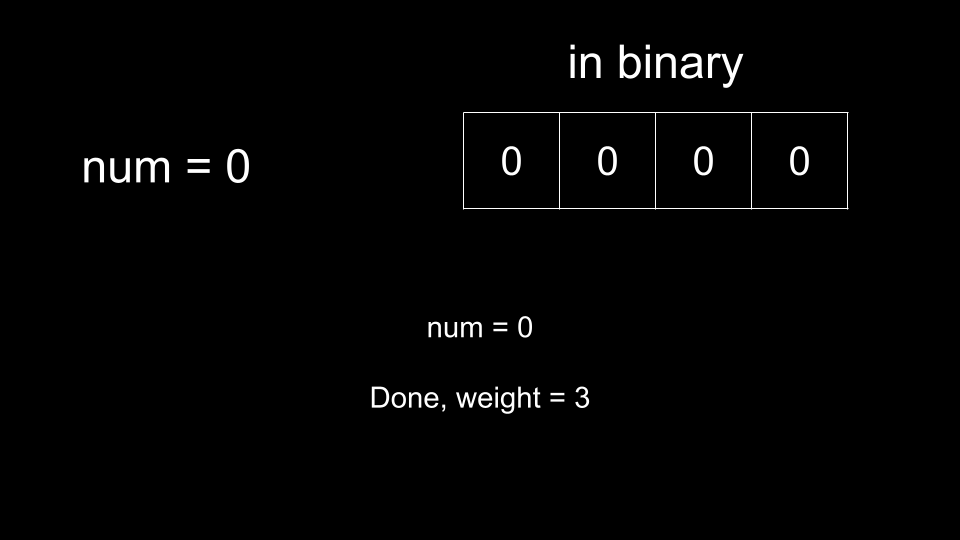
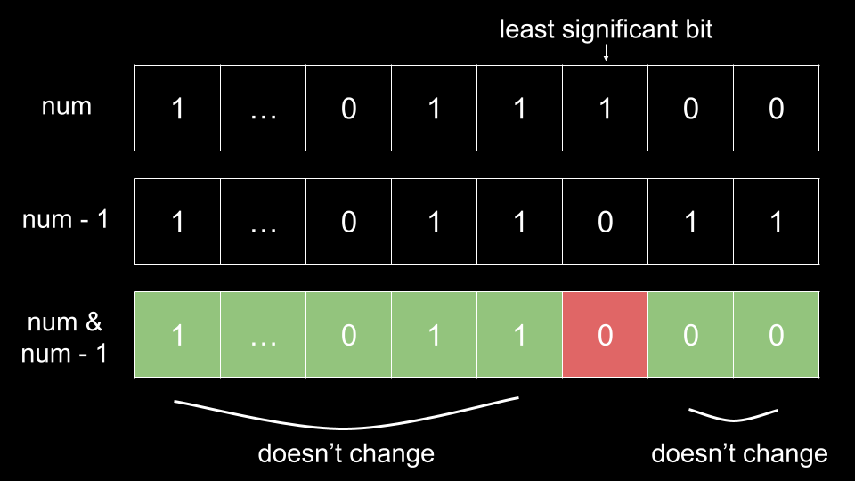

## Solution

---

### Approach 1: Sort By Custom Comparator: Built-in

**Intuition**

The number of `1's` in a number's binary representation is also known as the number of **set** bits, or the [hamming weight](https://en.wikipedia.org/wiki/Hamming_weight) of the number.

In this problem, we need to sort the numbers according to their hamming weight. We can sort arrays by any criteria using a custom comparator, which is a function that we pass into a language's sort function to specify how elements should be sorted.

There are a number of ways to find the hamming weight of a number, but the easiest way is by using built-in methods.

> Note: we have included this approach for completeness. It is likely that in an interview, you will be expected to use bit manipulation to find the hamming weight, and simply using built-in methods may be considered "cheating".

Most major programming languages have a built-in method for finding the hamming weight of a number. We simply define a custom comparator using these methods, then sort the input with it, and return the answer. Remember to handle the tiebreak: when two numbers have equal hamming weight, the one with a lower value should come first.

**Algorithm**

1. Use built-in methods to define a custom comparator that uses the hamming weight of a number.
2. Sort `arr` with the custom comparator.
3. Return `arr`.

**Implementation**

```python
class Solution:
    def sortByBits(self, arr: List[int]) -> List[int]:
        arr.sort(key = lambda num: (num.bit_count(), num))
        return arr
```

**Complexity Analysis**

Given $n$ as the length of `arr`,

* Time complexity: $O(n \cdot \log{n})$

    Finding the hamming weight of a number is dependent on the size of a number, but as we are dealing with integers that have a fixed size (31 bits), we can consider it as an $O(1)$ operation. Sorting `arr` costs $O(n \cdot \log{n})$.

* Space Complexity: $O(\log n)$ or $O(n)$

    The space complexity of the sorting algorithm depends on the implementation of each programming language:
* In Java, Arrays.sort() for primitives is implemented using a variant of the Quick Sort algorithm, which has a space complexity of $O(\log n)$
* In C++, the sort() function provided by STL uses a hybrid of Quick Sort, Heap Sort and Insertion Sort, with a worst case space complexity of $O(\log n)$
* In Python, the sort() function is implemented using the Timsort algorithm, which has a worst-case space complexity of $O(n)$

<br/>

---

### Approach 2: Bit Manipulation

**Intuition**

This approach is the same as the previous one, except we will now obtain the hamming weight of each number using bit manipulation instead of built-in methods, which is what most interviewers will be expecting.

<details>
    <summary>
        <b>   If you aren't familiar with bit manipulation and the operations used in bit manipulation, please click to expand. </b>
    </summary>

<br />

Bit manipulation is the act of manipulating bits, like changing bits of an integer.
At the heart of bit manipulation are the bit-wise operators:

**NOT (~):** Bitwise NOT is a unary operator that flips the bits of the number i.e., if the current bit is $0$, it will change it to $1$ and vice versa.
```text
N = 5 = 101 (in binary)
~N = ~(101) = 010 = 2 (in decimal)
```

**AND (&):** In bitwise AND if both bits in the compared position of the bit patterns are $1$, the bit in the resulting bit pattern is $1$, otherwise $0$.
```text
A = 5 = 101 (in binary)
B = 1 = 001 (in binary)
A & B = 101 & 001 = 001 = 1 (in decimal)
```

**OR ( | ):** Bitwise OR is also similar to bitwise AND. If both bits in the compared position of the bit patterns are $0$, the bit in the resulting bit pattern is $0$, otherwise $1$.
```text
A = 5 = 101 (in binary)
B = 1 = 001 (in binary)
A | B = 101 | 001 = 101 = 5 (in decimal)
```

**XOR (^):** In bitwise XOR if both bits are $0$ or $1$, the result will be $0$, otherwise $1$.
```text
A = 5 = 101 (in binary)
B = 1 = 001 (in binary)
A ^ B = 101 ^ 001 = 100 = 4 (in decimal)
```

**Left Shift (<<):** Left shift operator is a binary operator which shifts some number of bits to the left and appends $0$ at the end. One left shift is equivalent to multiplying the bit pattern with $2$.
```text
A = 1 = 001 (in binary)
A << 1 = 001 << 1 = 010 = 2 (in decimal)
A << 2 = 001 << 2 = 100 = 4 (in decimal)

B = 5 = 00101 (in binary)
B << 1 = 00101 << 1 = 01010 = 10 (in decimal)
B << 2 = 00101 << 2 = 10100 = 20 (in decimal)
```

**Right Shift (>>):** Right shift operator is a binary operator which shifts some number of bits to the right and appends $0$ at the left side. One right shift is equivalent to dividing the bit pattern with $2$.
```text
A = 4 = 100 (in binary)
A >> 1 = 100 >> 1 = 010 = 2 (in decimal)
A >> 2 = 100 >> 2 = 001 = 1 (in decimal)
A >> 3 = 100 >> 3 = 000 = 0 (in decimal)

B = 5 = 00101 (in binary)
B >> 1 = 00101 >> 1 = 00010 = 2 (in decimal)
```
</details>

<br />

To find the hamming weight of a number, we can use what is called a **mask**. This mask will have a single set bit, initially the least significant one (representing the number `1`, at position `0`). We will AND this mask with the number, and if the result is non-zero, it means the bit is set in the number. We can thus increment the hamming weight by 1 and then continue to the next position by left-shifting the mask, which moves the single bit over to the next position (this is the same as multiplying it by two).

There are two ways we can end this process.

1. Iterate 31 times (since this is the maximum size of an integer)
2. When we find a set bit in the number, flip it to a 0 (with XOR). When the number becomes 0, then we know there are no more set bits and can end.

The second option is better since we will terminate as soon as possible, whereas the first option will always iterate 31 times, regardless of the size of the number. We will proceed with the second option. The following animation illustrates this process:













<br>
<br>

**Algorithm**

1. Define a function `findWeight` that takes an integer `num` and returns its hamming weight.
- Initialize $mask = 1$ and $weight = 0$
- While `num > 0`:
- Check if `num & mask` is non-zero. If so, increment `weight` and XOR `num` with `mask`
- Left shift `mask`
- Return `weight`
2. Create a custom comparator with `findWeight`. Sort `arr` with the custom comparator.
3. Return `arr`.

**Implementation**

```python
class Solution:
    def sortByBits(self, arr: List[int]) -> List[int]:
        def find_weight(num):
            mask = 1
            weight = 0

            while num:
                if num & mask:
                    weight += 1
                    num ^= mask

                mask <<= 1

            return weight

        arr.sort(key = lambda num: (find_weight(num), num))
        return arr
```

**Complexity Analysis**

Given $n$ as the length of `arr`,

* Time complexity: $O(n \cdot \log{}n)$

    Finding the hamming weight of a number is dependent on the size of a number, but as we are dealing with integers that have a fixed size (31 bits), we can consider it as an $O(1)$ operation. Sorting `arr` costs $O(n \cdot \log{n})$.

* Space Complexity: $O(\log n)$ or $O(n)$

    The space complexity of the sorting algorithm depends on the implementation of each programming language:
* In Java, Arrays.sort() for primitives is implemented using a variant of the Quick Sort algorithm, which has a space complexity of $O(\log n)$
* In C++, the sort() function provided by STL uses a hybrid of Quick Sort, Heap Sort and Insertion Sort, with a worst case space complexity of $O(\log n)$
* In Python, the sort() function is implemented using the Timsort algorithm, which has a worst-case space complexity of $O(n)$

<br/>

---

### Approach 3: Brian Kerninghan's Algorithm

**Intuition**

There is a better way to find the hamming weight of a number. Brian Kerninghan's algorithm is an elegant and efficient way to find the number of set bits in a number.

For a given `num`, we run the algorithm until $num = 0$, that is the algorithm runs until there are no more set bits. At each iteration, we remove the least significant bit in `num`. Once all the bits are removed, $num = 0$ and the algorithm terminates. The number of iterations is the number of set bits since we remove one bit per iteration.

So how do we remove the least significant bit (LSB)? All we need to do is AND `num` with $num - 1$. That is, $num \&= (num - 1)$.

Why does this work? Take a look at the following image.


<br>

Logically, every bit to the right of the LSB will be 0. That means when we subtract `1` from `num`, the LSB becomes `0` and every bit to the right of it becomes `1`.

> In the image, the first 3 positions go from `100` to `011`. If the LSB was in position `5`, it would go from `10000` to `01111`.

In `num`, every bit to the right of the LSB is `0`. In $num - 1$, every bit to the right of the LSB is `1`. Thus, after an AND operation, every bit to the right of the LSB will remain `0`, since $0 \& 1 = 0$.

The LSB itself will also become `0` since it's `1` in `num` and `0` in $num - 1$.

Finally, everything to the left of the LSB is completely unchanged when subtracting by `1`. Thus, performing $num \& (num - 1)$ will not change any of these bits, and the only net change is that the LSB was set to `0`.

**Algorithm**

1. Define a function `findWeight` that takes an integer `num` and returns its hamming weight using Brian Kerninghan's algorithm.
- Initialize $weight = 0$
- While `num > 0`:
- Increment `weight`
- Set `num` to $num \& (num - 1)$
- Return `weight`
2. Create a custom comparator with `findWeight`. Sort `arr` with the custom comparator.
3. Return `arr`.

**Implementation**

```python
class Solution:
    def sortByBits(self, arr: List[int]) -> List[int]:
        def find_weight(num):
            weight = 0

            while num:
                weight += 1
                num &= (num - 1)

            return weight

        arr.sort(key = lambda num: (find_weight(num), num))
        return arr
```

**Complexity Analysis**

Given $n$ as the length of `arr`,

* Time complexity: $O(n \cdot \log{}n)$

    Finding the hamming weight of a number is dependent on the size of a number, but as we are dealing with integers that have a fixed size (31 bits), we can consider it as an $O(1)$ operation. Sorting `arr` costs $O(n \cdot \log{n})$.

* Space Complexity: $O(\log n)$ or $O(n)$

    The space complexity of the sorting algorithm depends on the implementation of each programming language:
* In Java, Arrays.sort() for primitives is implemented using a variant of the Quick Sort algorithm, which has a space complexity of $O(\log n)$
* In C++, the sort() function provided by STL uses a hybrid of Quick Sort, Heap Sort and Insertion Sort, with a worst case space complexity of $O(\log n)$
* In Python, the sort() function is implemented using the Timsort algorithm, which has a worst-case space complexity of $O(n)$

<br/>

---