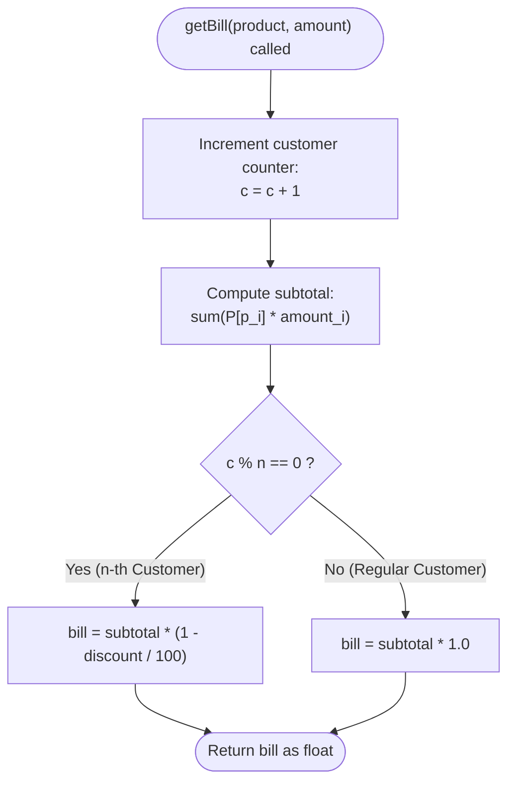

# Guided Example: Apply Discount Every n Orders

We trace the step-by-step execution of the supermarket cashier checkout system on a representative problem instance:

- **Cashier Initialization:** $n = 3$, $\text{discount} = 50\%$
- **Catalog:** Products `[1, 2, 3, 4]`, Prices `[100, 200, 300, 400]`
- **Customer Stream:**
  - Customer 1: `product = [1, 2]`, `amount = [1, 2]` $\implies$ bill $= 500.0$
  - Customer 2: `product = [3]`, `amount = [1]` $\implies$ bill $= 300.0$
  - Customer 3: `product = [2, 4]`, `amount = [2, 1]` $\implies$ bill $= 400.0$ (Discounted!)
- **Required Outputs:** `[500.0, 300.0, 400.0]`

This instance is chosen because it traces a complete cycle through the modular counter ($1 \to 2 \to 3$), demonstrating standard price accumulation for non-qualifying customers and the exact application of the percentage discount on the third customer.

---

## 1. Instance & Teaching Goal

A supermarket offers a percentage discount to every $n$-th customer. We must design a data structure that:
1. Precomputes a fast catalog lookup from product IDs to unit prices.
2. Maintains a running customer counter $c$ incremented on every transaction.
3. If $c \pmod n = 0$, applies a discount of $\text{discount}\%$ to the total bill:
   $$
   \text{final\_bill} = \text{subtotal} \times \left(1 - \frac{\text{discount}}{100}\right)
   $$
   Otherwise, charges the full subtotal.

For our trace with $n = 3, \text{discount} = 50$:
- Customer 1: Counter $c = 1$. Subtotal: $1 \times 100 + 2 \times 200 = 500$. Pays full $500.0$.
- Customer 2: Counter $c = 2$. Subtotal: $1 \times 300 = 300$. Pays full $300.0$.
- Customer 3: Counter $c = 3$. Subtotal: $2 \times 200 + 1 \times 400 = 800$. Since $3 \pmod 3 = 0$, receives $50\%$ discount: $800 \times (1 - 0.50) = 400.0$.

The primary teaching goal is to maintain stateful customer transaction counters, perform constant-time hash lookups for order basket evaluation, and apply floating-point discount calculations accurately.

---

## 2. Conceptual Foundation & Invariants

Let the catalog be a mapping $P: \text{ProductID} \to \text{UnitPrice}$.
The subtotal for an order containing items $[p_1, \dots, p_k]$ in quantities $[a_1, \dots, a_k]$ is given by:
$$
\text{subtotal} = \sum_{j=1}^k P[p_j] \times a_j
$$

The cashier maintains a customer counter $c$ starting at $0$. On each checkout:
$$
c \gets c + 1
$$
The bill charged to customer $c$ is:
$$
\text{Bill}(c) = \begin{cases}
\text{subtotal} \times \left(1 - \frac{\text{discount}}{100}\right) & \text{if } c \equiv 0 \pmod n \\
\text{subtotal} & \text{if } c \not\equiv 0 \pmod n
\end{cases}
$$

```
Customer 1: c = 1 -> 1 % 3 != 0 -> Full Price:       500.0
Customer 2: c = 2 -> 2 % 3 != 0 -> Full Price:       300.0
Customer 3: c = 3 -> 3 % 3 == 0 -> 50% DISCOUNT:     800 * 0.5 = 400.0
Customer 4: c = 4 -> 4 % 3 != 0 -> Full Price
```

We track state using the following parameters:

| State Parameter | Description | Initial Value |
|---|---|---|
| Price Map ($P$) | Hash table mapping product ID to unit price | Built from constructor |
| Customer Counter ($c$) | Total number of customer transactions served | $0$ |
| Target Interval ($n$) | Frequency of discount qualification | $3$ |
| Discount Rate | Percentage reduction applied to qualified bills | $50\%$ |

> **Invariant.** The counter $c$ monotonically counts the total number of customers served. Customer $c$ receives the discount if and only if $c$ is an exact positive multiple of $n$ ($c \equiv 0 \pmod n$). Product prices are retrieved in $\mathcal{O}(1)$ time from hash map $P$.

---

## 3. Step-by-Step Worked Execution

### Step 0: Catalog Initialization

The constructor receives $n = 3, \text{discount} = 50$, and parallel arrays:
- `products = [1, 2, 3, 4]`
- `prices   = [100, 200, 300, 400]`

Build hash map $P$:
- $P[1] = 100$
- $P[2] = 200$
- $P[3] = 300$
- $P[4] = 400$
- Initialize counter: $c = 0$.

| Product ID | Unit Price | Registered in Map ($P$) |
|---|---|---|
| $1$ | $100$ | $P[1] = 100$ |
| $2$ | $200$ | $P[2] = 200$ |
| $3$ | $300$ | $P[3] = 300$ |
| $4$ | $400$ | $P[4] = 400$ |

---

### Step 1: Customer 1 Checkout

- Increment transaction counter: $c = 0 + 1 = 1$.
- Order: `product = [1, 2]`, `amount = [1, 2]`.
- Compute subtotal:
  $$
  \text{subtotal} = (1 \times P[1]) + (2 \times P[2]) = (1 \times 100) + (2 \times 200) = 100 + 400 = 500
  $$
- Test discount condition: $c \pmod n = 1 \pmod 3 = 1 \ne 0$.
- Result: Customer pays full subtotal $= 500.0$.

| Item | Quantity ($a_j$) | Unit Price ($P[p_j]$) | Line Total |
|---|---|---|---|
| Product 1 | $1$ | $100$ | $100$ |
| Product 2 | $2$ | $200$ | $400$ |
| **Subtotal** | — | — | **$500$** |
| Discount Applied? | $1 \pmod 3 \ne 0$ | Full Price | **$500.0$** |

---

### Step 2: Customer 2 Checkout

- Increment transaction counter: $c = 1 + 1 = 2$.
- Order: `product = [3]`, `amount = [1]`.
- Compute subtotal:
  $$
  \text{subtotal} = 1 \times P[3] = 1 \times 300 = 300
  $$
- Test discount condition: $c \pmod n = 2 \pmod 3 = 2 \ne 0$.
- Result: Customer pays full subtotal $= 300.0$.

| Item | Quantity ($a_j$) | Unit Price ($P[p_j]$) | Line Total |
|---|---|---|---|
| Product 3 | $1$ | $300$ | $300$ |
| **Subtotal** | — | — | **$300$** |
| Discount Applied? | $2 \pmod 3 \ne 0$ | Full Price | **$300.0$** |

---

### Step 3: Customer 3 Checkout (Discount Qualified)

- Increment transaction counter: $c = 2 + 1 = 3$.
- Order: `product = [2, 4]`, `amount = [2, 1]`.
- Compute subtotal:
  $$
  \text{subtotal} = (2 \times P[2]) + (1 \times P[4]) = (2 \times 200) + (1 \times 400) = 400 + 400 = 800
  $$
- Test discount condition: $c \pmod n = 3 \pmod 3 = 0$.
  - Condition satisfied: Customer qualifies for $50\%$ discount!
- Apply discount formula:
  $$
  \text{final\_bill} = 800 \times \left(1 - \frac{50}{100}\right) = 800 \times 0.5 = 400.0
  $$
- Result: Customer pays $400.0$.

| Item | Quantity ($a_j$) | Unit Price ($P[p_j]$) | Line Total |
|---|---|---|---|
| Product 2 | $2$ | $200$ | $400$ |
| Product 4 | $1$ | $400$ | $400$ |
| **Subtotal** | — | — | **$800$** |
| Discount Applied? | $3 \pmod 3 = 0$ | $50\%$ Discount: $800 \times 0.5$ | **$400.0$** |

---

## 4. Complete Execution Trace

Summary of all three customer transactions:

| Customer | Counter ($c$) | Basket Items | Subtotal ($S$) | $c \pmod 3 == 0$? | Discount Multiplier | Final Charged Amount |
|---|---|---|---|---|---|---|
| 1 | $1$ | $1 \times 100 + 2 \times 200$ | $500$ | False ($1$) | $1.0$ | **$500.0$** |
| 2 | $2$ | $1 \times 300$ | $300$ | False ($2$) | $1.0$ | **$300.0$** |
| 3 | $3$ | $2 \times 200 + 1 \times 400$ | $800$ | **True ($0$)** | $1 - 0.50 = 0.5$ | **$400.0$** |

---

## 5. Algorithmic Correctness & Complexity Derivation

### Mathematical Soundness

The requirement that every $n$-th customer receives the discount is formally represented by the arithmetic progression $\{k \cdot n \mid k \in \mathbb{Z}^+\}$.
Testing $c \pmod n = 0$ after each increment $c \gets c + 1$ guarantees that the discount is awarded if and only if $c$ is a member of this progression.

The discount formula $\text{subtotal} - (\text{discount} \times \text{subtotal}) / 100$ is algebraically equivalent to $\text{subtotal} \times (1 - \text{discount}/100)$, guaranteeing numerical stability.

### Asymptotic Complexity

- **Constructor Initialization:** Storing $M$ product prices into a hash map requires $\mathcal{O}(M)$ time and $\mathcal{O}(M)$ auxiliary space.
- **`getBill` Execution:** For an order with $K$ distinct products, each price is retrieved in $\mathcal{O}(1)$ average time. Computing the sum requires $\mathcal{O}(K)$ arithmetic operations. Total time per customer is $\mathcal{O}(K)$.
- **Auxiliary Space Complexity:** $\mathcal{O}(M)$ to maintain the product catalog lookup map.

---

## 6. Traps & Edge Cases

- **Counter Increment Timing:** The counter must be incremented before checking the modulo condition so that Customer $1$ evaluates to $1 \pmod n$, and Customer $n$ evaluates to $0 \pmod n$.
- **Integer Division Truncation:** When computing the discount, evaluating `discount / 100` with integer division would truncate $50 / 100 \to 0$, causing no discount to be deducted. The calculation must use floating-point arithmetic.
- **Large Volume Counter Overflow:** If $c$ exceeds typical 32-bit limits after millions of orders, using $c \gets (c + 1) \pmod n$ maintains bounded state within $[0, n - 1]$ without integer overflow.
- **Customer with Zero Quantity:** Constraints guarantee non-zero item counts, but subtotal accumulation naturally scales with quantity $a_j$.

---

## 7. Accessible Mermaid Diagram


