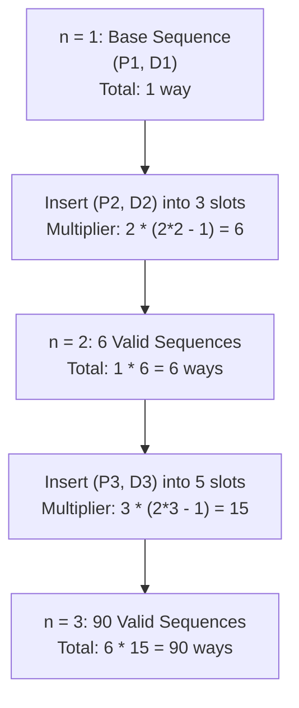

# Guided Example: Count All Valid Pickup and Delivery Options

We trace the step-by-step execution of the optimal combinatorial insertion recurrence on a representative problem instance:

- **Input:** `n = 2`
- **Required output:** `6`

This instance is chosen because it is the smallest non-trivial order count that demonstrates slot insertion dynamics, allowing exhaustive enumeration of all $6$ valid delivery sequences and illustrating the transition multiplier from $n = 1$.

---

## 1. Instance & Teaching Goal

Given $n$ orders, each order $i$ consists of a pickup service $P_i$ and a delivery service $D_i$. We must count all valid sequences of $2n$ events such that for every order $i \in \{1, \dots, n\}$, pickup $P_i$ occurs strictly before delivery $D_i$ ($P_i \prec D_i$). Since the result grows rapidly, it must be returned modulo $10^9 + 7$.

For $n = 2$:
- We have two orders: $(P_1, D_1)$ and $(P_2, D_2)$.
- The $6$ valid sequences are:
  1. $(P_1, P_2, D_1, D_2)$
  2. $(P_1, P_2, D_2, D_1)$
  3. $(P_1, D_1, P_2, D_2)$
  4. $(P_2, P_1, D_1, D_2)$
  5. $(P_2, P_1, D_2, D_1)$
  6. $(P_2, D_2, P_1, D_1)$

The primary teaching goal is to model sequential permutations through slot insertion, proving that adding the $k$-th order to an existing sequence of $k - 1$ orders provides exactly $k(2k - 1)$ valid placement configurations.

---

## 2. Conceptual Foundation & Invariants

Suppose we have already placed $k - 1$ orders, forming a valid sequence of $2(k - 1)$ events. These $2k - 2$ events create $2k - 1$ insertion spaces (including the ends and between each pair of adjacent events):

```
Slot positions for k - 1 = 1 order (P1, D1):
  _  P1  _  D1  _
 (1)    (2)    (3)   -> 3 available insertion slots
```

When inserting the $k$-th pair $(P_k, D_k)$ with the restriction $P_k \prec D_k$:
1. **Both in the same slot:** There are $2k - 1$ slots. In any chosen slot, the order must be $P_k$ followed by $D_k$. Total ways: $2k - 1$.
2. **In two distinct slots:** We choose $2$ distinct slots out of the $2k - 1$ available. The earlier slot must receive $P_k$ and the later slot must receive $D_k$. Total ways:
   $$
   \binom{2k - 1}{2} = \frac{(2k - 1)(2k - 2)}{2} = (2k - 1)(k - 1)
   $$

Summing both disjoint choices yields the total multiplier for order $k$:
$$
M_k = (2k - 1) + (2k - 1)(k - 1) = (2k - 1)(1 + k - 1) = k(2k - 1) = \binom{2k}{2}
$$

Thus, the total count satisfies the recurrence:
$$
\text{ways}(k) = \text{ways}(k - 1) \times k(2k - 1) \pmod{10^9 + 7}
$$

We track state using the following parameters:

| State Parameter | Description | Initial Value |
|---|---|---|
| Placed Orders ($k$) | Number of order pairs incorporated so far | $1$ |
| Sequence Length | Total events present ($2k$) | $2$ |
| Available Slots | Number of insertion gaps ($2k - 1$) | $3$ |
| Cumulative Count | Valid sequences modulo $10^9 + 7$ | $1$ |

> **Invariant.** At step $k$, $\text{ways}(k)$ equals the exact number of valid pickup-and-delivery sequences of length $2k$ containing orders $1 \dots k$. Each valid sequence of $k - 1$ orders branches into exactly $k(2k - 1)$ valid sequences upon inserting order $k$.

---

## 3. Step-by-Step Worked Execution

### Step 1: Base Case ($k = 1$)

For $n = 1$, only order $1$ exists:
- Events: $\{P_1, D_1\}$.
- Precedence requirement: $P_1$ must precede $D_1$.
- Only $1$ valid arrangement exists:
  $$
  (P_1, D_1)
  $$
- $\text{ways}(1) = 1$.

| Order Count ($k$) | Active Events | Permutations Evaluated | Valid Sequences ($\text{ways}$) |
|---|---|---|---|
| $1$ | $\{P_1, D_1\}$ | $(P_1, D_1)$ [Valid], $(D_1, P_1)$ [Invalid] | $1$ |

---

### Step 2: Incorporating Order 2 ($k = 2$)

Starting sequence from $k = 1$: $(P_1, D_1)$.
Length is $2$, creating $2(2) - 1 = 3$ insertion slots:
- Slot 1: Before $P_1$
- Slot 2: Between $P_1$ and $D_1$
- Slot 3: After $D_1$

Calculate multiplier for $k = 2$:
$$
M_2 = k(2k - 1) = 2 \times (2 \times 2 - 1) = 2 \times 3 = 6
$$

Enumeration of all $6$ placements of $(P_2, D_2)$ into `_ P1 _ D1 _`:
1. **Both in Slot 1:** $(P_2, D_2, P_1, D_1)$
2. **Both in Slot 2:** $(P_1, P_2, D_2, D_1)$
3. **Both in Slot 3:** $(P_1, D_1, P_2, D_2)$
4. **Slots 1 and 2:** $(P_2, P_1, D_2, D_1)$
5. **Slots 1 and 3:** $(P_2, P_1, D_1, D_2)$
6. **Slots 2 and 3:** $(P_1, P_2, D_1, D_2)$

Cumulative count:
$$
\text{ways}(2) = \text{ways}(1) \times 6 = 1 \times 6 = 6
$$

| Slot Selection | Assigned Slots | Resulting Sequence |
|---|---|---|
| Same Slot | Slot 1 | $(P_2, D_2, P_1, D_1)$ |
| Same Slot | Slot 2 | $(P_1, P_2, D_2, D_1)$ |
| Same Slot | Slot 3 | $(P_1, D_1, P_2, D_2)$ |
| Distinct Slots | Slots 1 & 2 | $(P_2, P_1, D_2, D_1)$ |
| Distinct Slots | Slots 1 & 3 | $(P_2, P_1, D_1, D_2)$ |
| Distinct Slots | Slots 2 & 3 | $(P_1, P_2, D_1, D_2)$ |

---

### Step 3: Generalization to $k = 3$ (Verification)

With $2$ orders placed, there are $4$ events, creating $2(3) - 1 = 5$ slots.
Multiplier for $k = 3$:
$$
M_3 = 3 \times (2 \times 3 - 1) = 3 \times 5 = 15
$$
Cumulative count:
$$
\text{ways}(3) = \text{ways}(2) \times 15 = 6 \times 15 = 90
$$

| Step Index ($k$) | Prior Ways | Step Multiplier $k(2k - 1)$ | New Cumulative Ways |
|---|---|---|---|
| $1$ | — | $1 \times 1 = 1$ | $1$ |
| $2$ | $1$ | $2 \times 3 = 6$ | **$6$** |
| $3$ | $6$ | $3 \times 5 = 15$ | $90$ |

---

## 4. Complete Execution Trace

Progression of cumulative valid options from $k = 1$ to $k = 5$:

| Orders ($k$) | Total Events ($2k$) | Insertion Slots ($2k - 1$) | Step Multiplier $\binom{2k}{2}$ | Cumulative Ways | Value Modulo $10^9 + 7$ |
|---|---|---|---|---|---|
| $1$ | $2$ | $1$ | $1$ | $1$ | $1$ |
| **$2$** | **$4$** | **$3$** | **$6$** | **$6$** | **$6$** |
| $3$ | $6$ | $5$ | $15$ | $90$ | $90$ |
| $4$ | $8$ | $7$ | $28$ | $2{,}520$ | $2{,}520$ |
| $5$ | $10$ | $9$ | $45$ | $113{,}400$ | $113{,}400$ |

---

## 5. Algorithmic Correctness & Complexity Derivation

### Closed-Form Product Derivation

Consider the total permutations of $2n$ distinct events without precedence constraints, which is $(2n)!$.
For each order $i$, by symmetry, exactly half of the permutations place $P_i$ before $D_i$.
Because the relative ordering constraint for order $i$ is mutually independent of order $j$, the fraction of all permutations satisfying all $n$ constraints is $(1/2)^n$.
Therefore:
$$
\text{ways}(n) = \frac{(2n)!}{2^n} = \frac{\prod_{k=1}^n (2k - 1)(2k)}{2^n} = \prod_{k=1}^n \frac{(2k - 1)(2k)}{2} = \prod_{k=1}^n k(2k - 1)
$$
This directly matches our inductive slot-insertion recurrence.

### Asymptotic Complexity

- **Time Complexity:** $\mathcal{O}(n)$. The iterative loop performs $n$ constant-time integer multiplications and modulo operations.
- **Auxiliary Space Complexity:** $\mathcal{O}(1)$. Requires only a single scalar accumulator storing the running product modulo $10^9 + 7$.

---

## 6. Traps & Edge Cases

- **Integer Overflow:** In 32-bit arithmetic, the product `ways * k * (2 * k - 1)` can exceed $2^{31} - 1$ before the modulo operation. Calculations must use 64-bit integers.
- **Modulo Application:** The modulo $10^9 + 7$ must be applied at every multiplication step:
  $$
  \text{ways} \gets (\text{ways} \times k \times (2k - 1)) \pmod{10^9 + 7}
  $$
- **Base Input $n = 1$:** When $n = 1$, the loop runs once, correctly returning $1$.
- **Combinatorial Distinction:** Orders are distinct (labeled $1 \dots n$). Permuting identical anonymous orders would require dividing by $n!$, but here each order is uniquely identified.

---

## 7. Accessible Mermaid Diagram


