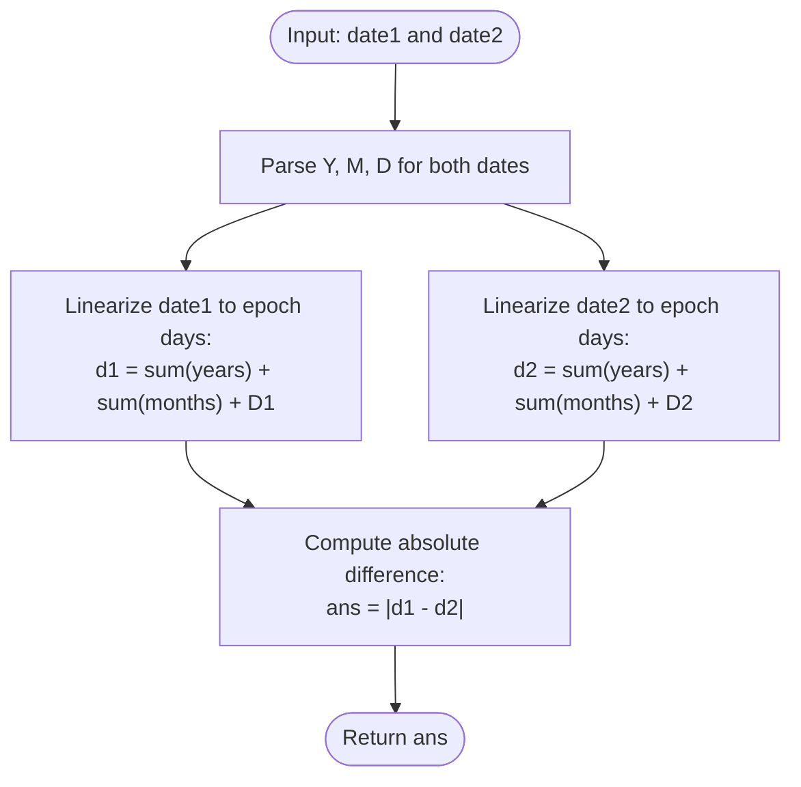

# Guided Example: Number of Days Between Two Dates

We trace the step-by-step execution of the optimal calendar epoch-linearization algorithm on a representative problem instance:

- **Input:** `date1 = "2020-01-15"`, `date2 = "2019-12-31"`
- **Required output:** `15`

This instance is chosen because it spans a calendar year boundary ($2019 \to 2020$), provides dates in reverse chronological order ($\text{date1} > \text{date2}$), and tests the Gregorian leap-year rule for the incoming leap year $2020$.

---

## 1. Instance & Teaching Goal

Given two dates formatted as strings `"YYYY-MM-DD"`, we must compute the exact number of calendar days between them.

For `date1 = "2020-01-15"` and `date2 = "2019-12-31"`:
- `date2` is the final day of $2019$.
- `date1` is the $15$-th day of $2020$.
- Passing from December $31$, $2019$ to January $15$, $2020$ spans exactly $15$ days.
- The absolute separation is $|15| = 15$.

The primary teaching goal is to reduce interval date subtraction to scalar arithmetic by mapping any Gregorian calendar date $(Y, M, D)$ to an absolute integer count of days elapsed from a fixed epoch, rigorously applying the $4/100/400$ leap-year rule.

---

## 2. Conceptual Foundation & Invariants

Let $d(Y, M, D)$ denote the total number of days elapsed from a reference epoch ($\text{1971-01-01}$) to date $(Y, M, D)$. The number of days between any two dates is:
$$
\Delta = |d(Y_1, M_1, D_1) - d(Y_2, M_2, D_2)|
$$

Under the Gregorian calendar, year $Y$ is a leap year if and only if:
$$
\text{isLeap}(Y) = (Y \pmod 4 = 0 \land Y \pmod{100} \ne 0) \lor (Y \pmod{400} = 0)
$$

A leap year contains $366$ days; an ordinary year contains $365$ days.
Month lengths in days are:
- Non-leap: $[31, 28, 31, 30, 31, 30, 31, 31, 30, 31, 30, 31]$
- Leap year: $[31, 29, 31, 30, 31, 30, 31, 31, 30, 31, 30, 31]$

```
Date 1: "2020-01-15" -> Year 2020, Month 1, Day 15 -> Epoch Days: 17,912
Date 2: "2019-12-31" -> Year 2019, Month 12, Day 31 -> Epoch Days: 17,897
                                                       -------------------
Difference: |17,912 - 17,897| = 15 days
```

We compute $d(Y, M, D)$ in three additive components:
$$
d(Y, M, D) = \sum_{y=1971}^{Y-1} \text{daysInYear}(y) + \sum_{m=1}^{M-1} \text{daysInMonth}(Y, m) + D
$$

| State Parameter | Description | Initial Value |
|---|---|---|
| Epoch Reference | Base anchor date | $\text{1971-01-01}$ |
| Date Components | Parsed integer tuple $(Y, M, D)$ | Extracted from string |
| Year Contribution | Days from complete years in $[1971, Y - 1]$ | Summed across prior years |
| Month Contribution | Days from complete months in $[1, M - 1]$ of year $Y$ | Summed with leap adjustment |
| Day Contribution | Days in current month | Direct day value $D$ |

> **Invariant.** For any valid Gregorian date $(Y, M, D)$, $d(Y, M, D)$ strictly and monotonically maps the date to its unique sequential ordinal day number. Absolute difference $|d(date1) - d(date2)|$ is commutative and invariant to argument ordering.

---

## 3. Step-by-Step Worked Execution

### Step 1: Evaluating `date2` ("2019-12-31")

Parse components: $Y = 2019, M = 12, D = 31$.

1. **Complete Years ($1971 \le y < 2019$):**
   - Total years: $2019 - 1971 = 48$ years.
   - Leap years in range: $1972, 1976, 1980, 1984, 1988, 1992, 1996, 2000, 2004, 2008, 2012, 2016$ ($12$ leap years).
   - Ordinary years: $48 - 12 = 36$ years.
   - Total year days:
     $$
     (36 \times 365) + (12 \times 366) = 13{,}140 + 4{,}392 = 17{,}532 \text{ days}
     $$
2. **Complete Months ($1 \le m < 12$) in $2019$:**
   - $2019$ is not a leap year (February has $28$ days).
   - Sum: $31 + 28 + 31 + 30 + 31 + 30 + 31 + 31 + 30 + 31 + 30 = 334 \text{ days}$.
3. **Current Month Days:**
   - $D = 31$.
4. **Total Epoch Days:**
   $$
   d(\text{"2019-12-31"}) = 17{,}532 + 334 + 31 = 17{,}897
   $$

| Component | Span | Days Added | Running Total |
|---|---|---|---|
| Complete Years | $1971 \dots 2018$ ($48$ yrs, $12$ leap) | $17{,}532$ | $17{,}532$ |
| Complete Months | Jan through Nov $2019$ | $334$ | $17{,}866$ |
| Remaining Days | $31$ days of Dec $2019$ | $31$ | **$17{,}897$** |

---

### Step 2: Evaluating `date1` ("2020-01-15")

Parse components: $Y = 2020, M = 1, D = 15$.

1. **Complete Years ($1971 \le y < 2020$):**
   - Adds year $2019$ ($365$ days) to prior total:
     $$
     17{,}532 + 365 = 17{,}897 \text{ days}
     $$
2. **Complete Months ($1 \le m < 1$) in $2020$:**
   - January is month $1$; zero complete prior months in $2020$: $0 \text{ days}$.
3. **Current Month Days:**
   - $D = 15$.
4. **Total Epoch Days:**
   $$
   d(\text{"2020-01-15"}) = 17{,}897 + 0 + 15 = 17{,}912
   $$

| Component | Span | Days Added | Running Total |
|---|---|---|---|
| Complete Years | $1971 \dots 2019$ ($49$ yrs, $12$ leap) | $17{,}897$ | $17{,}897$ |
| Complete Months | None (January) | $0$ | $17{,}897$ |
| Remaining Days | $15$ days of Jan $2020$ | $15$ | **$17{,}912$** |

---

### Step 3: Absolute Difference Calculation

Compute absolute difference between linearized epoch positions:
$$
\Delta = |d(\text{"2020-01-15"}) - d(\text{"2019-12-31"})| = |17{,}912 - 17{,}897| = 15
$$

| Metric | Date 1 | Date 2 | Delta Formula | Result |
|---|---|---|---|---|
| Epoch Day Count | $17{,}912$ | $17{,}897$ | $|17{,}912 - 17{,}897|$ | **$15$** |

---

## 4. Complete Execution Trace

Verification of representative date pairs spanning leap days, month transitions, and year boundaries:

| Date 1 | Date 2 | Epoch Days 1 | Epoch Days 2 | Boundary Characteristic | Expected Gap |
|---|---|---|---|---|---|
| **"2020-01-15"** | **"2019-12-31"** | **$17{,}912$** | **$17{,}897$** | **Year boundary (Reverse order)** | **$15$** |
| "2019-06-29" | "2019-06-30" | $17{,}712$ | $17{,}713$ | Consecutive summer days | $1$ |
| "2020-02-28" | "2020-03-01" | $17{,}956$ | $17{,}958$ | Spans leap day (Feb 29, 2020) | $2$ |
| "2019-02-28" | "2019-03-01" | $17{,}590$ | $17{,}591$ | Non-leap year transition | $1$ |
| "2000-02-01" | "2000-03-01" | $10{,}624$ | $10{,}653$ | Full leap month (2000 is divisible by 400) | $29$ |

---

## 5. Algorithmic Correctness & Complexity Derivation

### Bijective Metric Mapping

Because every calendar day has a unique predecessor and successor in the Gregorian system, mapping each date to its linear day index $d(Y, M, D)$ forms an order-preserving bijection to $\mathbb{Z}$.
Consequently, the distance between any two dates $D_1$ and $D_2$ is simply the metric distance on $\mathbb{Z}$:
$$
\text{dist}(D_1, D_2) = |d(D_1) - d(D_2)|
$$
This avoids manual day-by-day increments across months with variable lengths, eliminating subtle edge cases.

### Asymptotic Complexity

- **Time Complexity:** $\mathcal{O}(1)$. The year loop runs at most $2100 - 1971 = 129$ iterations. The month loop runs at most $11$ iterations. The number of operations is strictly bounded by a small constant.
- **Auxiliary Space Complexity:** $\mathcal{O}(1)$. Only a fixed array of $12$ month lengths and scalar accumulators are required.

---

## 6. Traps & Edge Cases

- **Centurial Leap Year Rules:** A century year is a leap year if and only if divisible by $400$. Year $2000$ was a leap year ($2000 \pmod{400} = 0$), whereas $1900$ and $2100$ are not leap years ($1900 \pmod{400} = 300 \ne 0$).
- **Reverse Input Chronology:** The problem does not guarantee `date1 <= date2`. Wrapping the final difference in an absolute value function $|d_1 - d_2|$ ensures correct positive results.
- **Leap Day Boundary:** If a date falls on February $29$, the year's leap flag must correctly expand February to $29$ days so that February $29$ is not collapsed into March $1$.
- **One-Based Month Indexing:** Months in `"YYYY-MM-DD"` are $1$-indexed ($01$ to $12$). When summing prior months, only months $1 \dots M - 1$ must be accumulated.

---

## 7. Accessible Mermaid Diagram


