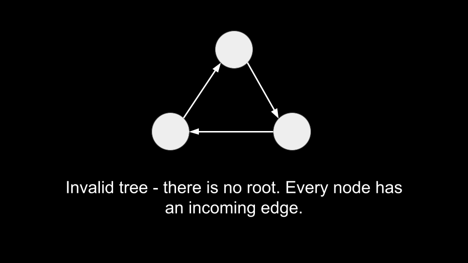
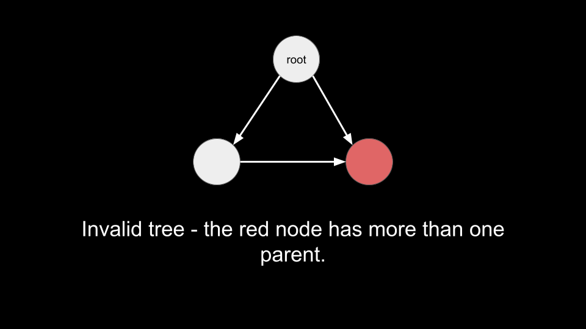
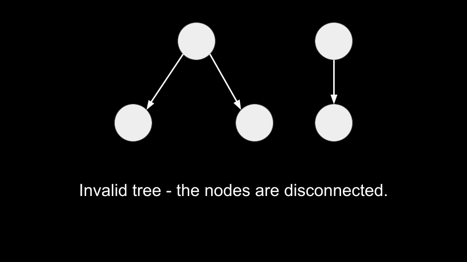
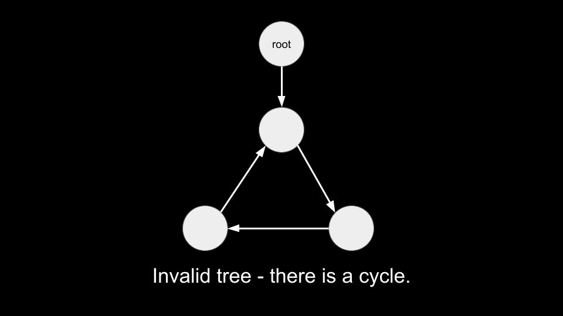

[TOC]

## Solution

---

### Overview

Before we go into the approaches, let's first talk about what makes a binary tree valid.

> Note that while this is not a formal definition of a binary tree, these rules are sufficient for solving the problem.

**A binary tree must have a root. This is a node with no incoming edges - that is, the root has no parent.**


<br>
<br>

**Every node other than the root must have exactly one parent.**


<br>
<br>

**The tree must be connected - every node must be reachable from one node (the root).**


<br>
<br>

**There cannot be a cycle.**


<br>
<br>

To solve this problem, we can check the nodes given to us against these rules.

> You may notice that some of these rules imply each other. For example, if a binary tree had a root, it would have a cycle only if it was not connected, or there was a node with more than one parent.

---

### Approach 1: Depth First Search (DFS)

**Intuition**

> If you are new to Depth First Search, please see our [LeetCode Explore Card](https://leetcode.com/explore/featured/card/graph/619/depth-first-search-in-graph/3882/) for more information on it!

One way to solve this problem would be to perform a DFS on the tree and check that all the rules are followed. Before we can start a DFS, we need to locate the root. Let's define a function `findRoot` that helps us find the root.

As mentioned above, the root has no parent - this also means that the root is not the child of any nodes. The input arrays `leftChild` and `rightChild` describe all children, so the root would not appear in these arrays. We can simply use a for loop from `0` to $n - 1$ and for each number, check if it is present in `leftChild` or `rightChild`. If it's not present in either, then we can return it as the root. If we don't find any root, we can return `-1`.

To improve efficiency, we will convert `leftChild` and `rightChild` to a set for $O(1)$ checks.

```python
def find_root():
    children = set(leftChild) | set(rightChild)

    for i in range(n):
        if i not in children:
            return i

    return -1
```

We will start by obtaining $root = findRoot()$. If $root = -1$, there is no node without a parent, and we can immediately return false as the tree is invalid.

Once we have the root, we can start a DFS from it. We will implement the DFS iteratively with a stack. How can we validate the tree? First of all, if we see a node multiple times during the DFS, it means a node has multiple parents (and there could be a cycle). We will use a set `seen` that keeps track of all the nodes we have seen so far during the traversal. When we move to a `child`, if `child` is already in `seen`, we can immediately return false since we would be visiting `child` for the second time.

Once the DFS finishes, every node we visited will be in `seen`. If the tree is connected, then the length of `seen` will be equal to `n`. If $\text{seen.length} \neq n$, it means that some nodes were not visited, and thus the tree must be disconnected. Thus, we can return $\text{seen.length} = n$ at the end of the algorithm.

This process is sufficient in validating a binary tree:

1. If a binary tree does not have a root, then `findRoot` will return `-1`.
2. If there is a node with more than one parent, then we will detect it with `seen`.
3. If the tree is disconnected, then `seen` will hold less than `n` nodes at the end.
4. If there is a cycle, then we will detect it with `seen`.

Any other scenario we don't explicitly check for will be caught by some other rule. For example, the second rule we stated was:

**Every node other than the root must have exactly one parent.**

You may be thinking: we are explicitly checking the case when a node has multiple parents with `seen`, but what if there is a node with no parent other than the `root`? That is, what if there are multiple roots? In that scenario, `findRoot` would give us the root with the lowest value. We would perform a DFS from there, and never reach any of the other roots. Then at the end, `seen` would have less than `n` nodes.

**Algorithm**

1. Define a function `findRoot` that gives us the root, as described above.
2. Obtain $root = findRoot()$. If $root = -1$, then `return false`.
3. Initialize a `stack` and set `seen` with `root` in them.
4. While the `stack` is not empty:
- Pop the top of the stack as `node`.
- Iterate over the children of `node`, given in $\text{leftChild}[node]$ and $\text{rightChild}[node]$. For each `child`:
- If $child = -1$, then ignore it as it means there is no child.
- If `child` is in `seen`, `return false`.
- Push `child` to the stack and add it to `seen`.
5. After the DFS, $return \text{seen.length} = n$.

**Implementation**

```python
class Solution:
    def validateBinaryTreeNodes(self, n: int, leftChild: List[int], rightChild: List[int]) -> bool:
        def find_root():
            children = set(leftChild) | set(rightChild)

            for i in range(n):
                if i not in children:
                    return i

            return -1

        root = find_root()
        if root == -1:
            return False

        seen = {root}
        stack = [root]
        while stack:
            node = stack.pop()
            for child in [leftChild[node], rightChild[node]]:
                if child != -1:
                    if child in seen:
                        return False

                    stack.append(child)
                    seen.add(child)

        return len(seen) == n
```

**Complexity Analysis**

* Time complexity: $O(n)$

    To find the root, we convert `leftChild` and `rightChild` to a set, which costs $O(n)$. Then, we iterate over all nodes, which also costs $O(n)$.

    Once we have the root, we perform a DFS that costs $O(n)$ as we never visit a node more than once.

* Space complexity: $O(n)$

    We require $O(n)$ space when converting `leftChild` and `rightChild` to a set to find the root. We also require $O(n)$ space for `stack` and `seen` during the DFS.

<br/>

---

### Approach 2: Breadth First Search (BFS)

**Intuition**

Sometimes an interviewer may ask you to implement both BFS and DFS. This approach is the same as the previous one, except we will use BFS to perform the traversal instead of DFS.

BFS uses a queue instead of a stack. If you are not familiar with BFS traversal, we suggest you read our relevant [LeetCode Explore Card](https://leetcode.com/explore/learn/card/queue-stack/231/practical-application-queue/1376/).

**Algorithm**

1. Define a function `findRoot` that gives us the root, as described above.
2. Obtain $root = findRoot()$. If $root = -1$, then `return false`.
3. Initialize a `queue` and set `seen` with `root` in them.
4. While the `queue` is not empty:
- Pop the front of the queue as `node`.
- Iterate over the children of `node`, given in $\text{leftChild}[node]$ and $\text{rightChild}[node]$. For each `child`:
- If $child = -1$, then ignore it as it means there is no child.
- If `child` is in `seen`, `return false`.
- Push `child` to the queue and add it to `seen`.
5. After the BFS, $return \text{seen.length} = n$.

**Implementation**

```python
class Solution:
    def validateBinaryTreeNodes(self, n: int, leftChild: List[int], rightChild: List[int]) -> bool:
        def find_root():
            children = set(leftChild) | set(rightChild)

            for i in range(n):
                if i not in children:
                    return i

            return -1

        root = find_root()
        if root == -1:
            return False

        seen = {root}
        queue = deque([root])
        while queue:
            node = queue.popleft()
            for child in [leftChild[node], rightChild[node]]:
                if child != -1:
                    if child in seen:
                        return False

                    queue.append(child)
                    seen.add(child)

        return len(seen) == n
```

**Complexity Analysis**

* Time complexity: $O(n)$

    To find the root, we convert `leftChild` and `rightChild` to a set, which costs $O(n)$. Then, we iterate over all nodes, which also costs $O(n)$.

    Once we have the root, we perform a BFS that costs $O(n)$ as we never visit a node more than once. Note that an efficient queue implementation with $O(1)$ operations is required to achieve this complexity.

* Space complexity: $O(n)$

    We require $O(n)$ space when converting `leftChild` and `rightChild` to a set to find the root. We also require $O(n)$ space for `queue` and `seen` during the BFS.

<br/>

---

### Approach 3: Union Find

**Intuition**

> This is a more advanced, but interesting way to approach this problem. We have included it for the sake of completeness. It is unlikely you will be expected to implement this approach in an interview if you have already used one of the previous approaches, so we will not delve into great detail in this approach.

A disjoint-set data structure (also called a union–find), is a data structure that stores a collection of disjoint (non-overlapping) sets. Union-find provides us with the following methods:

1. `find`: Determine which subset a particular element is in. This can be used to determine if two elements are in the same subset.
2. `union`: Join two subsets into a single subset.

If you are new to Union-Find, we suggest you read our [Leetcode Explore Card](https://leetcode.com/explore/learn/card/graph/618/disjoint-set/3881/). We will not talk about implementation details in this article, but only about the interface to the data structure.

Initially, all nodes belong to their own subset. We will iterate over all `(parent, child)` pairs given in `leftChild` and `rightChild` and attempt a `union`. We want to assign the subset of `child` to the subset of `parent`. For each call to `union(parent, child)`, we can see if the tree is invalid with the following checks:

1. If $find(child) \neq child$, then `child` must have been assigned a parent earlier, and thus `child` has multiple parents.
2. If `parent` and `child` already belong to the same subset, then there must be a directed path from `child` to `parent` as `parent` must have been assigned to the subset of `child` earlier, and thus there exists a cycle.

After performing all `union` operations successfully between parents and their children, there should only be one component in the union-find data structure. We can track the number of components by subtracting one from the count on each successful `union` operation, and then check whether the final count of components is equal to 1.

**Algorithm**

1. Create a union-find data structure `uf` that implements `find(node)` and `union(parent, child)`. It should also track the number of `components`.
- In `union`, we return a boolean indicating if the union was successful. A union is unsuccessful if the parent of `child` is not `child`, or the parent of `parent` is `child`.
- If `union` is successful, we assign the subset of `child` to the subset of `parent` and decrement the number of `components`.
2. Iterate `node` from `0` until `n`:
- Iterate over the children of `node` as `child`:
- If $child = - 1$, ignore it.
- Otherwise, perform a `union(node, child)`. If it returns false, then `return false`.
3. Return $\text{uf.components} = 1$.

**Implementation**

> Note: In C++, `union` is a reserved keyword and cannot be redefined. Therefore, we need to rename the `union` method, and we call it `join` here.

```python
class UnionFind:
    def __init__(self, n):
        self.components = n
        self.parents = list(range(n))

    def union(self, parent, child):
        parent_parent = self.find(parent)
        child_parent = self.find(child)

        if child_parent != child or parent_parent == child_parent:
            return False

        self.components -= 1
        self.parents[child_parent] = parent_parent

        return True

    def find(self, node):
        if self.parents[node] != node:
            self.parents[node] = self.find(self.parents[node])

        return self.parents[node]

class Solution:
    def validateBinaryTreeNodes(self, n: int, leftChild: List[int], rightChild: List[int]) -> bool:
        uf = UnionFind(n)
        for node in range(n):
            for child in [leftChild[node], rightChild[node]]:
                if child == -1:
                    continue

                if not uf.union(node, child):
                    return False

        return uf.components == 1
```

**Complexity Analysis**

* Time complexity: $O(n)$

    For $T$ operations, the amortized time complexity of the union-find algorithm with path compression and union-by rank is $O(\alpha(T))$. Here, $\alpha(T)$ is the inverse Ackermann function that grows so slowly, that it doesn't exceed $4$ for all reasonable $T$ (approximately $T < 10^{600}$). You can read more about the complexity of union-find [here](https://en.wikipedia.org/wiki/Disjoint-set_data_structure#Time_complexity). Because the function grows so slowly, we consider it to be $O(1)$.

    You may have noticed that we didn't use union-by-rank optimization as in other DSU problems. The reason for this is that the structure of this problem is not like a regular graph. More specifically, if a pair of nodes `(parent, child)` is considered valid for union, only the eligible tree root node is considered as the new child, and it will always have a rank of 0. Therefore, during the union process, the rank of all nodes will not exceed 1. As for the possibility of nodes having a rank greater than 1, it would be filtered out as required by the problem statement and won't occur. Therefore, we don't need to use union-by-rank in this problem. We encourage readers to build test cases and try them out.

    Initializing the `UnionFind` data structure costs $O(n)$. Then, we simply iterate over each node once and perform some union-find operations at each iteration.

* Space complexity: $O(n)$

    The `UnionFind` data structure keeps a `parents` array that takes $O(n)$ space.

<br/>

---