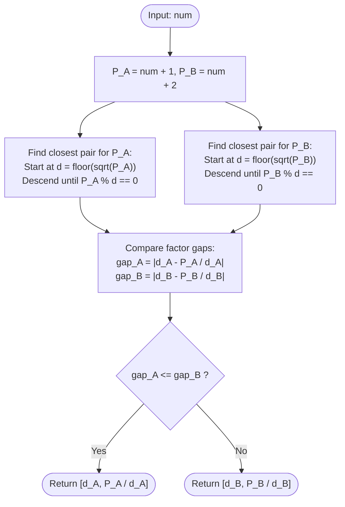

# Guided Example: Closest Divisors

We trace the step-by-step execution of the optimal square-root descent factorization algorithm on a representative problem instance:

- **Input:** `num = 123`
- **Required output:** `[5, 25]`

This instance is chosen because neither $num + 1 = 124$ nor $num + 2 = 125$ is a perfect square, requiring trial division downwards from $\lfloor \sqrt{P} \rfloor$ and illustrating how candidate $num + 2$ yields a strictly closer factor pair ($25 - 5 = 20$) than candidate $num + 1$ ($31 - 4 = 27$).

---

## 1. Instance & Teaching Goal

Given an integer `num`, we seek two integers $x$ and $y$ such that:
1. Their product equals either $num + 1$ or $num + 2$ ($x \times y \in \{num + 1, num + 2\}$).
2. The absolute difference $|x - y|$ is minimized across both options.

For `num = 123`:
- Candidate $A$: $num + 1 = 124$. Its closest factor pair is $(4, 31)$ with absolute difference $|31 - 4| = 27$.
- Candidate $B$: $num + 2 = 125$. Its closest factor pair is $(5, 25)$ with absolute difference $|25 - 5| = 20$.
- Comparing differences: $20 < 27$.
- Output: `[5, 25]`.

The primary teaching goal is to exploit the strict monotonicity of the factor-gap function $g(x) = \frac{P}{x} - x$, proving that searching downwards from $\lfloor \sqrt{P} \rfloor$ terminates at the globally optimal divisor for each candidate in at most $\mathcal{O}(\sqrt{P})$ checks.

---

## 2. Conceptual Foundation & Invariants

Let $P$ be a positive integer. Any factor pair $(x, y)$ satisfying $x \times y = P$ with $x \le y$ has:
$$
1 \le x \le \sqrt{P} \le y
$$
The separation between factors is defined by the gap function:
$$
g(x) = y - x = \frac{P}{x} - x \quad \text{for } x \in (0, \sqrt{P}]
$$

Taking the derivative with respect to $x$:
$$
g'(x) = -\frac{P}{x^2} - 1 < 0
$$
Because the derivative is strictly negative everywhere on $(0, \sqrt{P}]$, $g(x)$ is strictly decreasing. Therefore:
- The larger the divisor $x \le \sqrt{P}$ is, the smaller the gap $g(x)$ becomes.
- The global minimum of $g(x)$ over integer divisors of $P$ occurs at the **largest integer divisor** $d \le \sqrt{P}$.

```
Gap Function g(x) = P/x - x:
  Gap
   ^
   |  *
   |   *
   |     *
   |       *
   |         * (Largest divisor d <= sqrt(P) minimizes gap!)
   +---------------------> x (Divisor candidate)
   0                   sqrt(P)
```

We evaluate both $P_A = num + 1$ and $P_B = num + 2$, finding the largest divisor $\le \sqrt{P}$ for each, and select the pair with the minimum gap.

| State Parameter | Description | Initial Value |
|---|---|---|
| Candidate Products | Values $num + 1$ and $num + 2$ | $P_A = 124, P_B = 125$ |
| Descent Ceiling | Starting divisor $\lfloor \sqrt{P} \rfloor$ | $\lfloor \sqrt{124} \rfloor = 11, \lfloor \sqrt{125} \rfloor = 11$ |
| Optimal Pair $A$ | Best factorization for $num + 1$ | Computed via descent |
| Optimal Pair $B$ | Best factorization for $num + 2$ | Computed via descent |

> **Invariant.** For any candidate product $P$, scanning integers $d = \lfloor \sqrt{P} \rfloor, \lfloor \sqrt{P} \rfloor - 1, \dots, 1$ guarantees that the first integer satisfying $P \pmod d = 0$ is strictly the largest divisor of $P$ in $[1, \lfloor \sqrt{P} \rfloor]$, thereby minimizing $|P/d - d|$.

---

## 3. Step-by-Step Worked Execution

### Step 1: Factorizing Candidate $A$ ($P_A = 124$)

Start at $d = \lfloor \sqrt{124} \rfloor = 11$.
Test divisors sequentially downwards:
- $d = 11$: $124 \pmod{11} = 3 \ne 0$.
- $d = 10$: $124 \pmod{10} = 4 \ne 0$.
- $d = 9$: $124 \pmod 9 = 7 \ne 0$.
- $d = 8$: $124 \pmod 8 = 4 \ne 0$.
- $d = 7$: $124 \pmod 7 = 5 \ne 0$.
- $d = 6$: $124 \pmod 6 = 4 \ne 0$.
- $d = 5$: $124 \pmod 5 = 4 \ne 0$.
- $d = 4$: $124 \pmod 4 = 0$. Divisor found!

Paired factor: $y = 124 / 4 = 31$.
Factor pair: $(4, 31)$.
Difference gap: $|31 - 4| = 27$.

| Tested Divisor ($d$) | Modulo Test: $124 \pmod d$ | Divisibility | Resulting Action |
|---|---|---|---|
| $11$ | $124 \pmod{11} = 3$ | Not Divisible | Decrement $d \to 10$ |
| $10$ | $124 \pmod{10} = 4$ | Not Divisible | Decrement $d \to 9$ |
| $9 \dots 5$ | Non-zero remainders | Not Divisible | Decrement $d \to 4$ |
| **$4$** | **$124 \pmod 4 = 0$** | **Divisible** | **Select pair $(4, 31)$, gap $= 27$** |

---

### Step 2: Factorizing Candidate $B$ ($P_B = 125$)

Start at $d = \lfloor \sqrt{125} \rfloor = 11$.
Test divisors sequentially downwards:
- $d = 11$: $125 \pmod{11} = 4 \ne 0$.
- $d = 10$: $125 \pmod{10} = 5 \ne 0$.
- $d = 9$: $125 \pmod 9 = 8 \ne 0$.
- $d = 8$: $125 \pmod 8 = 5 \ne 0$.
- $d = 7$: $125 \pmod 7 = 6 \ne 0$.
- $d = 6$: $125 \pmod 6 = 5 \ne 0$.
- $d = 5$: $125 \pmod 5 = 0$. Divisor found!

Paired factor: $y = 125 / 5 = 25$.
Factor pair: $(5, 25)$.
Difference gap: $|25 - 5| = 20$.

| Tested Divisor ($d$) | Modulo Test: $125 \pmod d$ | Divisibility | Resulting Action |
|---|---|---|---|
| $11$ | $125 \pmod{11} = 4$ | Not Divisible | Decrement $d \to 10$ |
| $10$ | $125 \pmod{10} = 5$ | Not Divisible | Decrement $d \to 9$ |
| $9 \dots 6$ | Non-zero remainders | Not Divisible | Decrement $d \to 5$ |
| **$5$** | **$125 \pmod 5 = 0$** | **Divisible** | **Select pair $(5, 25)$, gap $= 20$** |

---

### Step 3: Comparative Selection Between Candidates

Compare the minimal factor gaps from Candidate $A$ and Candidate $B$:
- Pair $A$: $(4, 31)$ with $\Delta_A = |31 - 4| = 27$.
- Pair $B$: $(5, 25)$ with $\Delta_B = |25 - 5| = 20$.

Since $\Delta_B < \Delta_A$ ($20 < 27$), Pair $B$ is strictly closer.
Final returned pair: `[5, 25]`.

| Candidate | Product | Selected Pair | Absolute Difference | Decision |
|---|---|---|---|---|
| Candidate $A$ | $124$ | $(4, 31)$ | $27$ | Suboptimal |
| Candidate $B$ | $125$ | $(5, 25)$ | $20$ | **Optimal (Smaller Gap)** |

---

## 4. Complete Execution Trace

Summary of trial divisions and comparison across candidates:

| Candidate | Target Value | Starting Floor $\lfloor \sqrt{P} \rfloor$ | First Valid Divisor | Paired Quotient | Factor Gap | Winner |
|---|---|---|---|---|---|---|
| $num + 1$ | $124$ | $11$ | $4$ | $31$ | $27$ | — |
| **$num + 2$** | **$125$** | **$11$** | **$5$** | **$25$** | **$20$** | **`[5, 25]`** |

---

## 5. Algorithmic Correctness & Complexity Derivation

### Monotonicity of Factor Gaps

Let $P$ be a fixed product. For any divisor $d \le \sqrt{P}$, its paired factor is $P / d \ge \sqrt{P}$.
The difference is:
$$
\text{gap}(d) = \frac{P}{d} - d
$$
Let $d_1 < d_2 \le \sqrt{P}$ be two divisors of $P$. Then:
$$
\text{gap}(d_1) - \text{gap}(d_2) = \left(\frac{P}{d_1} - d_1\right) - \left(\frac{P}{d_2} - d_2\right) = P\left(\frac{1}{d_1} - \frac{1}{d_2}\right) + (d_2 - d_1) > 0
$$
Since both terms are strictly positive, $\text{gap}(d_1) > \text{gap}(d_2)$.
Hence, the first divisor encountered when searching downward from $\lfloor \sqrt{P} \rfloor$ is guaranteed to produce the minimal possible gap for that product $P$.

### Asymptotic Complexity

- **Time Complexity:** $\mathcal{O}(\sqrt{num})$. In the worst case where $P$ is prime, the loop tests numbers from $\lfloor \sqrt{P} \rfloor$ down to $1$, performing at most $\mathcal{O}(\sqrt{P})$ modulo operations. For $num \le 10^9$, $\sqrt{10^9} \approx 31{,}622$ iterations, executing in under $1$ millisecond.
- **Auxiliary Space Complexity:** $\mathcal{O}(1)$. Requires only a constant number of scalar variables for divisor testing.

---

## 6. Traps & Edge Cases

- **Perfect Squares ($P = k^2$):** When $P$ is a square (e.g. $num = 8 \implies num + 1 = 9$), $\lfloor \sqrt{9} \rfloor = 3$. The loop terminates immediately on the first iteration with $d = 3, y = 3$, giving gap $0$ (the theoretical minimum).
- **Prime Numbers:** If a candidate product is prime, the descent reaches $d = 1$ and pairs it with $P$ (gap $P - 1$). The other candidate product ($P + 1$ or $P - 1$) is often composite and will yield a much smaller gap.
- **Order of Returned Elements:** The specification allows returning `[x, y]` in any order (`[5, 25]` or `[25, 5]`).
- **Initial Floor Rounding:** Ensure integer square root is computed using integer truncation $\lfloor \sqrt{P} \rfloor$ rather than rounded floats to avoid out-of-bounds start values.

---

## 7. Accessible Mermaid Diagram


