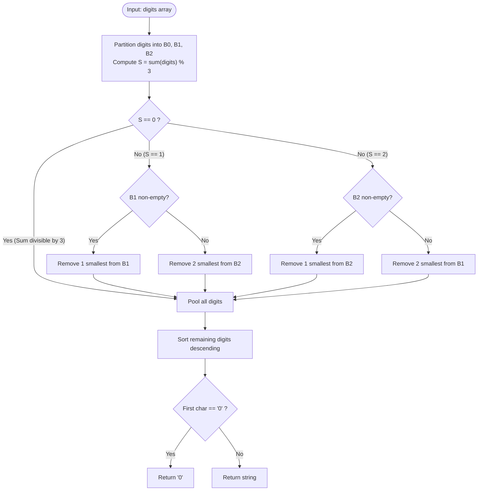

# Guided Example: Largest Multiple of Three

We trace the step-by-step execution of the optimal modulo-3 greedy digit removal algorithm on a representative problem instance:

- **Input:** `digits = [8, 6, 7, 1, 0]`
- **Required output:** `"8760"`

This instance is chosen because the sum of all digits yields a non-zero remainder ($22 \equiv 1 \pmod 3$), requiring selective elimination of the smallest available digit with remainder $1$ and sorting the remaining digits descending to maximize decimal place value.

---

## 1. Instance & Teaching Goal

Given an array of decimal digits `digits`, we seek the largest possible multiple of three formed by concatenating a subset of these digits in any order. The result must be returned as a string without redundant leading zeros (except for `"0"` itself).

For `digits = [8, 6, 7, 1, 0]`:
- Total digit sum: $8 + 6 + 7 + 1 + 0 = 22$.
- Modulo 3: $22 \equiv 1 \pmod 3$.
- To make the sum a multiple of $3$, we must remove digits whose sum has remainder $1 \pmod 3$.
- Option A: Remove $1$ digit with remainder $1$. Candidates: $\{1, 7\}$. The smallest is $1$. Removing $1$ leaves $4$ digits: `[8, 7, 6, 0]`.
- Option B: Remove $2$ digits with remainder $2$. Candidates: only $\{8\}$ exists (cannot remove two).
- Option A preserves the maximum count of digits ($4$ digits).
- Arranging `[8, 7, 6, 0]` in descending order produces `"8760"`.

The primary teaching goal is to recognize that integer length strictly dominates decimal magnitude ($10^k > 10^{k-1}$), proving that minimizing the number of deleted digits followed by greedy place-value sorting is globally optimal.

---

## 2. Conceptual Foundation & Invariants

An integer $N$ is divisible by $3$ if and only if the sum of its decimal digits is divisible by $3$:
$$
N \equiv \sum_{i} d_i \pmod 3
$$

We partition the given digits into three buckets based on $d \pmod 3$:
- **Bucket 0 ($d \equiv 0$):** $\{0, 3, 6, 9\}$
- **Bucket 1 ($d \equiv 1$):** $\{1, 4, 7\}$
- **Bucket 2 ($d \equiv 2$):** $\{2, 5, 8\}$

Let $S = \sum d_i \pmod 3$.
1. **If $S = 0$:** No digits need to be removed. All digits can be used.
2. **If $S = 1$:** We must eliminate a net remainder of $1$.
   - Primary: Remove the single smallest digit from Bucket 1 (removes $1$ digit).
   - Fallback: If Bucket 1 has no elements, remove the two smallest digits from Bucket 2 (removes $2$ digits).
3. **If $S = 2$:** We must eliminate a net remainder of $2$.
   - Primary: Remove the single smallest digit from Bucket 2 (removes $1$ digit).
   - Fallback: If Bucket 2 has no elements, remove the two smallest digits from Bucket 1 (removes $2$ digits).

```
Digits: [8, 6, 7, 1, 0] -> Total sum = 22 (22 % 3 = 1)
Bucket 0: [0, 6]
Bucket 1: [1, 7]  -> Smallest is 1. REMOVE 1!
Bucket 2: [8]

Remaining: [8, 7, 6, 0] -> Sort descending -> "8760"
```

We track state using the following parameters:

| State Parameter | Description | Initial Value |
|---|---|---|
| Total Sum ($S_{\text{total}}$) | Sum of all elements in `digits` | $8 + 6 + 7 + 1 + 0 = 22$ |
| Global Remainder ($R$) | $S_{\text{total}} \pmod 3$ | $22 \pmod 3 = 1$ |
| Modulo Buckets | Digits grouped by $d \pmod 3$ | $B_0=\{0, 6\}, B_1=\{1, 7\}, B_2=\{8\}$ |
| Deletion Plan | Minimal subset of digits to discard | Discard $\{1\}$ |

> **Invariant.** Discarding the minimum possible number of digits to achieve $\sum d_i \equiv 0 \pmod 3$ maximizes the number of digits in the output. Among choices with the same count of deleted digits, removing the smallest digit values preserves larger digits for higher place values.

---

## 3. Step-by-Step Worked Execution

### Step 1: Bucket Partitioning and Summation

Tally digits and sort each bucket in ascending order:
- Total Sum: $8 + 6 + 7 + 1 + 0 = 22$.
- Overall remainder: $R = 22 \pmod 3 = 1$.
- Sorted Buckets:
  - $B_0$: `[0, 6]` (Remainders $0$)
  - $B_1$: `[1, 7]` (Remainders $1$)
  - $B_2$: `[8]` (Remainders $2$)

| Bucket | Elements | Count |
|---|---|---|
| $B_0$ ($d \equiv 0$) | `[0, 6]` | $2$ |
| $B_1$ ($d \equiv 1$) | `[1, 7]` | $2$ |
| $B_2$ ($d \equiv 2$) | `[8]` | $1$ |
| **Sum Modulo 3** | $22 \pmod 3 = 1$ | **Deficit Remainder: $1$** |

---

### Step 2: Evaluating Deletion Strategies for Remainder $1$

We need to remove a total sum of $1 \pmod 3$:
- **Strategy A (Remove 1 digit from $B_1$):**
  - $B_1$ has $2$ elements: `[1, 7]`.
  - The smallest element is $1$.
  - Discarding $1$ leaves $5 - 1 = 4$ digits.
- **Strategy B (Remove 2 digits from $B_2$):**
  - $B_2$ only contains `[8]` (length $1 < 2$).
  - Strategy B is impossible.

Strategy A is selected. Digit $1$ is deleted.

| Strategy | Discard Target | Candidate Digits | Resulting Length | Feasibility |
|---|---|---|---|---|
| Strategy A | $1$ element from $B_1$ | Smallest: $1$ | $4$ digits | **Selected (Minimal loss)** |
| Strategy B | $2$ elements from $B_2$ | Only one available | $3$ digits | Infeasible |

---

### Step 3: Remaining Digits Assembly and Descending Sort

Pool the remaining digits from all buckets:
- From $B_0$: `[0, 6]`
- From $B_1$: `[7]` (after removing $1$)
- From $B_2$: `[8]`

Combined list: `[0, 6, 7, 8]`.
Sort in descending order to place the largest digits at the highest powers of ten:
$$
\text{sorted} = [8, 7, 6, 0]
$$
Concatenated string: `"8760"`.

| Position | Power of Ten | Assigned Digit | Contribution |
|---|---|---|---|
| Thousands ($10^3$) | $1000$ | $8$ | $8000$ |
| Hundreds ($10^2$) | $100$ | $7$ | $700$ |
| Tens ($10^1$) | $10$ | $6$ | $60$ |
| Units ($10^0$) | $1$ | $0$ | $0$ |
| **Total** | — | — | **$8760$** |

---

### Step 4: Leading Zero Sanity Check

Inspect the most significant digit (first character):
- First character is `'8'` $\ne$ `'0'`.
- No redundant leading zeros exist.
- Final output: `"8760"`.

| Check | Value | Rule | Result |
|---|---|---|---|
| Leading Character | `'8'` | Non-zero | Valid number format |
| Divisibility | $8760 = 3 \times 2920$ | Exactly divisible | **`"8760"`** |

---

## 4. Complete Execution Trace

Verification across diverse modulo repair patterns:

| Input `digits` | Total Sum | Sum $\pmod 3$ | Digits Removed | Remaining Digits | Sorted Output |
|---|---|---|---|---|---|
| **`[8, 6, 7, 1, 0]`** | **$22$** | **$1$** | **Remove `1` from $B_1$** | **`[8, 7, 6, 0]`** | **`"8760"`** |
| `[8, 1, 9]` | $18$ | $0$ | None | `[9, 8, 1]` | `"981"` |
| `[1]` | $1$ | $1$ | Remove `1` from $B_1$ | `[]` | `""` (Empty) |
| `[0, 0, 0, 0]` | $0$ | $0$ | None | `[0, 0, 0, 0]` | `"0"` (Trimmed) |
| `[2, 2, 8, 3]` | $15$ | $0$ | None | `[8, 3, 2, 2]` | `"8322"` |
| `[5, 8]` | $13$ | $1$ | Remove `5, 8` from $B_2$ | `[]` | `""` |

---

## 5. Algorithmic Correctness & Complexity Derivation

### Length Maximization and Place-Value Optimality

1. **Length Dominance:** For any base-$10$ integers $A$ and $B$, if $\text{length}(A) > \text{length}(B)$, then $A > B$ regardless of individual digits. Thus, retaining $K$ digits is strictly superior to retaining $K - 1$ digits.
2. **Minimal Deletions:** Since the remainder $R \in \{1, 2\}$, removing a single digit of remainder $R$ achieves sum $\equiv 0 \pmod 3$ with only $1$ deletion. If no such digit exists, removing two digits of remainder $3 - R$ achieves the same sum with $2$ deletions. At most $2$ deletions are ever needed.
3. **Lexicographic Greediness:** Once the optimal multiset of digits is determined, arranging them in non-increasing order maximizes the coefficient of every power of $10$, which is provably optimal by rearrangement inequality.

### Asymptotic Complexity

- **Time Complexity:** $\mathcal{O}(N \log N)$ or $\mathcal{O}(N)$ using a counting array for digits $0 \dots 9$. Bucket extraction, sum calculation, and up to $2$ removals take $\mathcal{O}(N)$ time.
- **Auxiliary Space Complexity:** $\mathcal{O}(N)$ to construct the final string of length at most $N$.

---

## 6. Traps & Edge Cases

- **All Zeros Input:** When input is `[0, 0, 0]`, the sorted result is `"000"`. The problem requires removing leading zeros, so `"000"` must be simplified to `"0"`. Checking if the first character is `'0'` allows returning `"0"` immediately.
- **Empty Output:** If all digits are removed (e.g. `[1]` where $1$ is deleted), the remaining list is empty, which must return `""`.
- **Fallback to Two Deletions:** For `digits = [2, 2, 3]`, total sum is $7 \equiv 1 \pmod 3$. Bucket $1$ is empty. We must fall back to deleting two elements from Bucket $2$ (deleting both $2$'s), leaving `[3]`, returning `"3"`.
- **Digit Multiplicity:** Digits are non-unique; frequency buckets must maintain duplicate occurrences.

---

## 7. Accessible Mermaid Diagram


