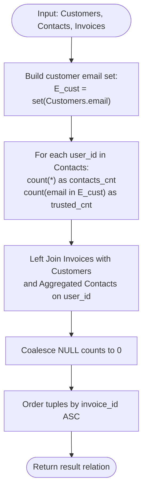

# Guided Example: Number of Trusted Contacts of a Customer

We trace the step-by-step execution of the multi-way relational join and conditional aggregation algorithm on a representative database instance:

- **Input Tables:**
  - `Customers`: $4$ registered customers (`Alice`, `Bob`, `John`, `Alex`)
  - `Contacts`: $6$ contact entries
  - `Invoices`: $6$ invoice records across $4$ customers
- **Required Output:**
  ```
  invoice_id | customer_name | price | contacts_cnt | trusted_contacts_cnt
  44         | Alex          | 60    | 1            | 1
  55         | John          | 500   | 0            | 0
  66         | Bob           | 400   | 2            | 0
  77         | Alice         | 100   | 3            | 2
  88         | Alice         | 200   | 3            | 2
  99         | Bob           | 300   | 2            | 0
  ```

This instance is chosen because it exercises zero-contact customers (`John`), contacts with no customer account (`Omar`, `Meir`, `Jal`), trusted contacts that match existing customer emails (`Bob`, `John`, `Alice`), and customers possessing multiple invoices (`Alice`, `Bob`).

---

## 1. Instance & Teaching Goal

We are given three relational tables:
1. `Customers`: Columns `customer_id`, `customer_name`, and `email`.
2. `Contacts`: Columns `user_id`, `contact_name`, and `contact_email`.
3. `Invoices`: Columns `invoice_id`, `price`, and `user_id`.

For each invoice, we must output:
- `invoice_id`: Identifier of the invoice.
- `customer_name`: Name of the customer who received the invoice.
- `price`: Price of the invoice.
- `contacts_cnt`: Total number of contacts belonging to that customer.
- `trusted_contacts_cnt`: Number of those contacts whose `contact_email` is registered in `Customers`.

The result must be ordered by `invoice_id` in ascending order.

The primary learning goal is to coordinate multi-relation outer joins with conditional aggregations, avoiding Cartesian row duplication when customers have multiple invoices and preserving invoices for customers with zero contacts.

---

## 2. Conceptual Foundation & Invariants

Let $E_{\text{cust}} = \Pi_{\text{email}}(\text{Customers})$ be the set of valid customer email addresses:
$$
E_{\text{cust}} = \{\text{"alice@leetcode.com"}, \text{"bob@leetcode.com"}, \text{"john@leetcode.com"}, \text{"alex@leetcode.com"}\}
$$

A contact record $t \in \text{Contacts}$ is defined as a trusted contact if and only if $t[\text{contact\_email}] \in E_{\text{cust}}$.

For each customer $u$, contact counts are derived via group aggregation:
$$
\text{contacts\_cnt}(u) = \sum_{t \in \text{Contacts}, t[\text{user\_id}] = u} 1
$$
$$
\text{trusted\_contacts\_cnt}(u) = \sum_{t \in \text{Contacts}, t[\text{user\_id}] = u} \mathbb{I}(t[\text{contact\_email}] \in E_{\text{cust}})
$$

```
Customer Directory:
  ID 1: Alice (alice@leetcode.com) -> Contacts: Bob (trusted), John (trusted), Jal (untrusted) -> [cnt=3, trusted=2]
  ID 2: Bob   (bob@leetcode.com)   -> Contacts: Omar (untrusted), Meir (untrusted)            -> [cnt=2, trusted=0]
  ID 6: Alex  (alex@leetcode.com)  -> Contacts: Alice (trusted)                               -> [cnt=1, trusted=1]
  ID 13: John (john@leetcode.com)  -> Contacts: None                                          -> [cnt=0, trusted=0]

Invoices attach these pre-aggregated customer stats and order by invoice_id:
  44 (Alex)  -> price: 60,  cnt: 1, trusted: 1
  55 (John)  -> price: 500, cnt: 0, trusted: 0
  66 (Bob)   -> price: 400, cnt: 2, trusted: 0
  77 (Alice) -> price: 100, cnt: 3, trusted: 2
  88 (Alice) -> price: 200, cnt: 3, trusted: 2
  99 (Bob)   -> price: 300, cnt: 2, trusted: 0
```

We track state using the following parameters:

| State Parameter | Description | Initial Value |
|---|---|---|
| Customer Email Set ($E_{\text{cust}}$) | Set of registered customer emails | Extracted from `Customers` |
| Contact Aggregation | Per-customer contact and trusted contact counts | Grouped by `user_id` |
| Invoice Relation | Source driving the output row cardinality | Scanned from `Invoices` |
| Output Sort Key | Primary sort attribute | Ascending `invoice_id` |

> **Invariant.** Every invoice in `Invoices` produces exactly one output tuple. Customers with zero contacts produce $\text{contacts\_cnt} = 0$ and $\text{trusted\_contacts\_cnt} = 0$. The final relation is strictly ordered by $\text{invoice\_id}$ in ascending order.

---

## 3. Step-by-Step Worked Execution

### Step 1: Customer Email Set Construction

Extract all unique registered emails from `Customers`:
$$
E_{\text{cust}} = \{\text{"alice@leetcode.com"}, \text{"bob@leetcode.com"}, \text{"john@leetcode.com"}, \text{"alex@leetcode.com"}\}
$$

| Customer ID | Customer Name | Registered Email |
|---|---|---|
| $1$ | Alice | `alice@leetcode.com` |
| $2$ | Bob | `bob@leetcode.com` |
| $13$ | John | `john@leetcode.com` |
| $6$ | Alex | `alex@leetcode.com` |

---

### Step 2: Evaluating and Aggregating Contacts by User

Classify each contact in `Contacts` based on membership in $E_{\text{cust}}$:

1. **User 1 (Alice):**
   - Bob (`bob@leetcode.com`): In $E_{\text{cust}}$ (Trusted).
   - John (`john@leetcode.com`): In $E_{\text{cust}}$ (Trusted).
   - Jal (`jal@leetcode.com`): Not in $E_{\text{cust}}$ (Untrusted).
   - Tallies: $\text{contacts} = 3$, $\text{trusted} = 2$.
2. **User 2 (Bob):**
   - Omar (`omar@leetcode.com`): Not in $E_{\text{cust}}$ (Untrusted).
   - Meir (`meir@leetcode.com`): Not in $E_{\text{cust}}$ (Untrusted).
   - Tallies: $\text{contacts} = 2$, $\text{trusted} = 0$.
3. **User 6 (Alex):**
   - Alice (`alice@leetcode.com`): In $E_{\text{cust}}$ (Trusted).
   - Tallies: $\text{contacts} = 1$, $\text{trusted} = 1$.
4. **User 13 (John):**
   - No contact rows present in `Contacts`.
   - Tallies via outer join: $\text{contacts} = 0$, $\text{trusted} = 0$.

| User ID | Customer Name | Contact Emails Evaluated | Total Contacts | Trusted Contacts |
|---|---|---|---|---|
| $1$ | Alice | `bob`, `john` (trusted); `jal` (untrusted) | $3$ | $2$ |
| $2$ | Bob | `omar`, `meir` (both untrusted) | $2$ | $0$ |
| $6$ | Alex | `alice` (trusted) | $1$ | $1$ |
| $13$ | John | None | $0$ | $0$ |

---

### Step 3: Joining Invoices and Projecting Attributes

Join each invoice with its customer details and aggregated contact metrics:
- **Invoice 44:** `user_id = 6` (Alex), `price = 60`, $\text{cnt} = 1$, $\text{trusted} = 1$.
- **Invoice 55:** `user_id = 13` (John), `price = 500`, $\text{cnt} = 0$, $\text{trusted} = 0$.
- **Invoice 66:** `user_id = 2` (Bob), `price = 400`, $\text{cnt} = 2$, $\text{trusted} = 0$.
- **Invoice 77:** `user_id = 1` (Alice), `price = 100`, $\text{cnt} = 3$, $\text{trusted} = 2$.
- **Invoice 88:** `user_id = 1` (Alice), `price = 200`, $\text{cnt} = 3$, $\text{trusted} = 2$.
- **Invoice 99:** `user_id = 2` (Bob), `price = 300`, $\text{cnt} = 2$, $\text{trusted} = 0$.

| `invoice_id` | `customer_name` | `price` | `contacts_cnt` | `trusted_contacts_cnt` |
|---|---|---|---|---|
| $44$ | Alex | $60$ | $1$ | $1$ |
| $55$ | John | $500$ | $0$ | $0$ |
| $66$ | Bob | $400$ | $2$ | $0$ |
| $77$ | Alice | $100$ | $3$ | $2$ |
| $88$ | Alice | $200$ | $3$ | $2$ |
| $99$ | Bob | $300$ | $2$ | $0$ |

---

### Step 4: Sorting by `invoice_id` Ascending

The sequence of invoice IDs $44 < 55 < 66 < 77 < 88 < 99$ is already sorted. The final tabular result is produced directly.

---

## 4. Complete Execution Trace

Summary of all $6$ invoices and their corresponding metrics:

| `invoice_id` | Customer ID | Customer Name | `price` | Total Contacts | Trusted Contacts | Output Order Rank |
|---|---|---|---|---|---|---|
| **$44$** | $6$ | Alex | $60$ | $1$ | $1$ | 1st |
| **$55$** | $13$ | John | $500$ | $0$ | $0$ | 2nd |
| **$66$** | $2$ | Bob | $400$ | $2$ | $0$ | 3rd |
| **$77$** | $1$ | Alice | $100$ | $3$ | $2$ | 4th |
| **$88$** | $1$ | Alice | $200$ | $3$ | $2$ | 5th |
| **$99$** | $2$ | Bob | $300$ | $2$ | $0$ | 6th |

---

## 5. Algorithmic Correctness & Complexity Derivation

### Join Granularity and Duplication Invariance

A common error is joining `Invoices` directly with `Contacts` without grouping.
If customer $1$ has $2$ invoices and $3$ contacts, an un-grouped join produces $2 \times 3 = 6$ intermediate tuples. Summing over such duplicated rows corrupts the invoice price or duplicates output invoices.

By structuring the execution such that contact counts are pre-aggregated per `user_id` before joining with `Invoices`, each invoice record matches exactly one customer summary record. This guarantees:
1. No invoice is duplicated.
2. Invoices belonging to customers with zero contacts are preserved with zero tallies via a left outer join.

### Asymptotic Complexity

- **Time Complexity:** $\mathcal{O}(|I| \log |I| + |C_{\text{cust}}| + |C_{\text{cont}}|)$ where $|I|$, $|C_{\text{cust}}|$, and $|C_{\text{cont}}|$ denote the row counts of `Invoices`, `Customers`, and `Contacts`.
  - Building the customer email hash set: $\mathcal{O}(|C_{\text{cust}}|)$.
  - Pre-aggregating contacts: $\mathcal{O}(|C_{\text{cont}}|)$.
  - Joining invoices and sorting by `invoice_id`: $\mathcal{O}(|I| \log |I|)$.
- **Auxiliary Space Complexity:** $\mathcal{O}(|C_{\text{cust}}| + |C_{\text{cont}}|)$ to store email sets and grouped contact counters.

---

## 6. Traps & Edge Cases

- **Inner Join Elimination:** Using an inner join between `Customers` and `Contacts` drops customers who have zero contacts (e.g. John with Invoice 55). A left outer join with null coalescing to $0$ is mandatory.
- **Matching by Name Instead of Email:** Contact names can coincide with customer names without representing the same person. The definition of a trusted contact strictly mandates matching `contact_email` against customer `email`.
- **Multiple Invoices per User:** Customers like Alice have multiple invoices (IDs $77$ and $88$). Each invoice must independently display Alice's contact metrics without interfering with each other.
- **Duplicate Contact Rows:** If a customer has multiple identical contacts, each contact record in `Contacts` is counted individually.

---

## 7. Accessible Mermaid Diagram


