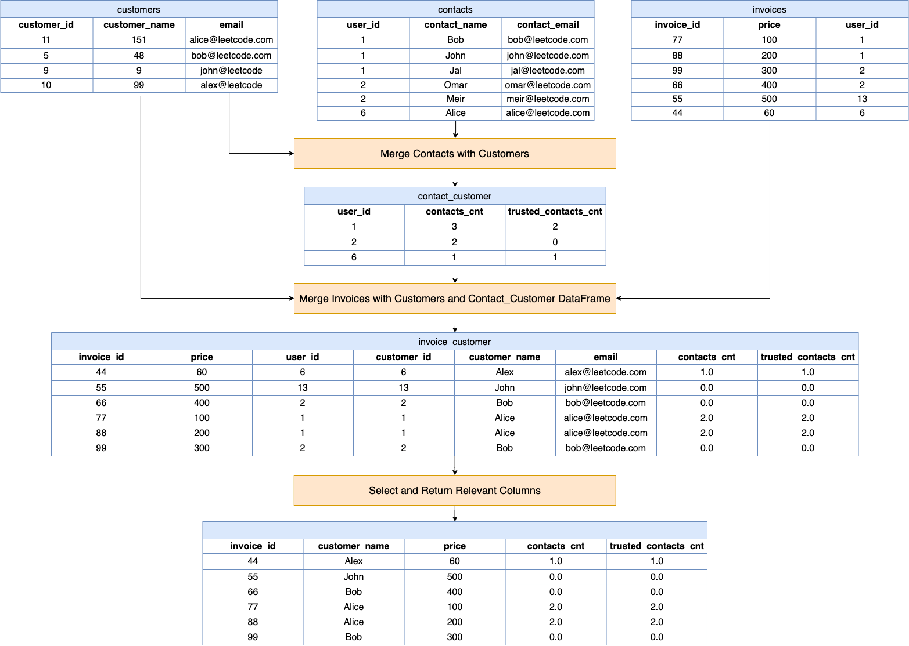

[TOC]

# Solution

---

## pandas

### Approach: DataFrame Merging And Aggregation For Invoice Summary

**Visualization of Approach:**



#### Intuition

Let's review the intuition behind each step given the following input DataFrames:

Customers DataFrame (`customers`):

<table>
  <tr><th>customer_id</th><th>customer_name</th><th>email</th></tr>
  <tr><td>1</td><td>Alice</td><td>alice@leetcode.com</td></tr>
  <tr><td>2</td><td>Bob</td><td>bob@leetcode.com</td></tr>
  <tr><td>13</td><td>John</td><td>john@leetcode.com</td></tr>
  <tr><td>6</td><td>Alex</td><td>alex@leetcode.com</td></tr>
</table>
<br>

Contacts DataFrame (`contacts`):

<table>
  <tr><th>user_id</th><th>contact_name</th><th>contact_email</th></tr>
  <tr><td>1</td><td>Bob</td><td>bob@leetcode.com</td></tr>
  <tr><td>1</td><td>John</td><td>john@leetcode.com</td></tr>
  <tr><td>1</td><td>Jal</td><td>jal@leetcode.com</td></tr>
  <tr><td>2</td><td>Omar</td><td>omar@leetcode.com</td></tr>
  <tr><td>2</td><td>Meir</td><td>meir@leetcode.com</td></tr>
  <tr><td>6</td><td>Alice</td><td>alice@leetcode.com</td></tr>
</table>
<br>

Invoices DataFrame (`invoices`):

<table>
  <tr><th>invoice_id</th><th>price</th><th>user_id</th></tr>
  <tr><td>77</td><td>100</td><td>1</td></tr>
  <tr><td>88</td><td>200</td><td>1</td></tr>
  <tr><td>99</td><td>300</td><td>2</td></tr>
  <tr><td>66</td><td>400</td><td>2</td></tr>
  <tr><td>55</td><td>500</td><td>13</td></tr>
  <tr><td>44</td><td>60</td><td>6</td></tr>
</table>
<br>

1. **Merge Contacts with Customers:**
   ```python
   contact_customer = (
        pd.merge(
            contacts, customers, left_on="contact_email", right_on="email", how="left"
        )
        .groupby("user_id")
        .agg(contacts_cnt=("user_id", "count"), trusted_contacts_cnt=("email", "count"))
        .reset_index()
    )
    ```
   - $\text{pd.merge}(contacts, customers, \text{left}_{on}="\text{contact}_{email}", \text{right}_{on}="email", how="left")$: This line merges the `contacts` DataFrame with the `customers` DataFrame. The merge is done based on the $\text{contact}_{email}$ from the `contacts` DataFrame and the `email` from the `customers` DataFrame. The `left` join ensures all records from `contacts` are included, even if there's no matching email in `customers`.
   - $.groupby("\text{user}_{id}")$: After merging, the data is grouped by $\text{user}_{id}$. This is because we want to count contacts and trusted contacts for each user (customer).
   - $.agg(\text{contacts}_{cnt}=("\text{user}_{id}", "count"), trusted_{contacts\_cnt}=("email", "count"))$: This aggregation counts the total number of contacts ($\text{contacts}_{cnt}$) and the number of trusted contacts (`trusted_contacts_cnt`, indicated by a non-null email after the merge) for each user.
   - $.\text{reset}_{index}()$: Resets the index of the DataFrame, turning $\text{user}_{id}$ back into a column.

 $\text{contact}_{customer}$:
 <table>
  <tr><th>user_id</th><th>contacts_cnt</th><th>trusted_contacts_cnt</th></tr>
  <tr><td>1</td><td>3</td><td>2</td></tr>
  <tr><td>2</td><td>2</td><td>0</td></tr>
  <tr><td>6</td><td>1</td><td>1</td></tr>
</table>
<br>

2. **Merge Invoices with Customers and Contact_Customer DataFrame:**

   ```python
   invoice_customer = (
        pd.merge(
            pd.merge(
                invoices,
                customers,
                left_on="user_id",
                right_on="customer_id",
                how="left",
            ),
            contact_customer,
            on="user_id",
            how="left",
        )
        .fillna(0)
        .sort_values("invoice_id")
    )
    ```
   - $\text{pd.merge}(invoices, customers, \text{left}_{on}="\text{user}_{id}", \text{right}_{on}="\text{customer}_{id}", how="left")$: This line first merges the `invoices` DataFrame with the `customers` DataFrame to link each invoice to its customer.
   - The resulting DataFrame is then merged with the $\text{contact}_{customer}$ DataFrame (which contains counts of contacts and trusted contacts) on $\text{user}_{id}$.
   - `.fillna(0)`: This replaces any NaN values with 0, which is important for invoices where there might not be any contacts or trusted contacts.
   - $.\text{sort}_{values}("\text{invoice}_{id}")$: Sorts the resulting DataFrame by $\text{invoice}_{id}$, ensuring the data is ordered.

 $\text{invoice}_{customer}$:
<table border="1">
  <tr>
    <th>invoice_id</th>
    <th>price</th>
    <th>user_id</th>
    <th>customer_id</th>
    <th>customer_name</th>
    <th>email</th>
    <th>contacts_cnt</th>
    <th>trusted_contacts_cnt</th>
  </tr>
  <tr>
    <td>44</td>
    <td>60</td>
    <td>6</td>
    <td>6</td>
    <td>Alex</td>
    <td>alex@leetcode.com</td>
    <td>1.0</td>
    <td>1.0</td>
  </tr>
  <tr>
    <td>55</td>
    <td>500</td>
    <td>13</td>
    <td>13</td>
    <td>John</td>
    <td>john@leetcode.com</td>
    <td>0.0</td>
    <td>0.0</td>
  </tr>
  <tr>
    <td>66</td>
    <td>400</td>
    <td>2</td>
    <td>2</td>
    <td>Bob</td>
    <td>bob@leetcode.com</td>
    <td>2.0</td>
    <td>0.0</td>
  </tr>
  <tr>
    <td>77</td>
    <td>100</td>
    <td>1</td>
    <td>1</td>
    <td>Alice</td>
    <td>alice@leetcode.com</td>
    <td>3.0</td>
    <td>2.0</td>
  </tr>
  <tr>
    <td>88</td>
    <td>200</td>
    <td>1</td>
    <td>1</td>
    <td>Alice</td>
    <td>alice@leetcode.com</td>
    <td>3.0</td>
    <td>2.0</td>
  </tr>
  <tr>
    <td>99</td>
    <td>300</td>
    <td>2</td>
    <td>2</td>
    <td>Bob</td>
    <td>bob@leetcode.com</td>
    <td>2.0</td>
    <td>0.0</td>
  </tr>
</table>
<br>

3. **Select and Return Relevant Columns:**

   ```python
   return invoice_customer[
        ["invoice_id", "customer_name", "price", "contacts_cnt", "trusted_contacts_cnt"]
    ]
   ```
   - The final step selects only the relevant columns: $["\text{invoice}_{id}", "\text{customer}_{name}", "price", "\text{contacts}_{cnt}", "trusted_{contacts\_cnt}"]$.
   - This produces a DataFrame that matches the desired output format, providing a summary for each invoice with the customer's name, invoice price, number of contacts, and number of trusted contacts.

 <table>
  <tr><th>invoice_id</th><th>customer_name</th><th>price</th><th>contacts_cnt</th><th>trusted_contacts_cnt</th></tr>
  <tr><td>44</td><td>Alex</td><td>60</td><td>1.0</td><td>1.0</td></tr>
  <tr><td>55</td><td>John</td><td>500</td><td>0.0</td><td>0.0</td></tr>
  <tr><td>66</td><td>Bob</td><td>400</td><td>2.0</td><td>0.0</td></tr>
  <tr><td>77</td><td>Alice</td><td>100</td><td>3.0</td><td>2.0</td></tr>
  <tr><td>88</td><td>Alice</td><td>200</td><td>3.0</td><td>2.0</td></tr>
  <tr><td>99</td><td>Bob</td><td>300</td><td>2.0</td><td>0.0</td></tr>
</table>
<br>

#### Implementation

```python
import pandas as pd

def count_trusted_contacts(
    customers: pd.DataFrame, contacts: pd.DataFrame, invoices: pd.DataFrame
) -> pd.DataFrame:
    # Merge contacts with customers
    contact_customer = (
        pd.merge(
            contacts, customers, left_on="contact_email", right_on="email", how="left"
        )
        .groupby("user_id")
        .agg(contacts_cnt=("user_id", "count"), trusted_contacts_cnt=("email", "count"))
        .reset_index()
    )

    # Merge invoices with customers and then with the contact_customer DataFrame
    invoice_customer = (
        pd.merge(
            pd.merge(
                invoices,
                customers,
                left_on="user_id",
                right_on="customer_id",
                how="left",
            ),
            contact_customer,
            on="user_id",
            how="left",
        )
        .fillna(0)
        .sort_values("invoice_id")
    )

    # Select and return the relevant columns
    return invoice_customer[
        ["invoice_id", "customer_name", "price", "contacts_cnt", "trusted_contacts_cnt"]
    ]

```

---

## Database

### Approach: Invoice Customer Contact Aggregation

#### Intuition

Here's a breakdown of the logic:

1. **SELECT Clause:**
   - $I.\text{invoice}_{id}$: Selects the ID of each invoice.
   - $Cust.\text{customer}_{name}$: Selects the name of the customer associated with each invoice.
   - `I.price`: Selects the price amount of each invoice.
   - $COUNT(DISTINCT C.\text{contact}_{name}) AS \text{contacts}_{cnt}$: Counts the number of unique contact names associated with the customer of each invoice. This gives the total number of contacts for each customer.
   - $COUNT(DISTINCT Nme.\text{customer}_{name}) AS trusted_{contacts\_cnt}$: Counts the number of unique customer names that match the contact names. This indicates how many of the customer's contacts are also customers themselves (i.e., "trusted" contacts).

2. **FROM and JOIN Clauses:**
   - `FROM Invoices I`: The query begins with the `Invoices` table as the base.
   - $LEFT JOIN Customers Cust ON I.\text{user}_{id} = Cust.\text{customer}_{id}$: This join links each invoice to its corresponding customer based on user ID, bringing in the customer's name.
   - $LEFT JOIN Contacts C ON C.\text{user}_{id} = Cust.\text{customer}_{id}$: This join adds contact information for each customer, based on the customer ID.
   - $LEFT JOIN Customers Nme ON Nme.\text{customer}_{name} = C.\text{contact}_{name}$: This join attempts to find contacts who are also customers, hence determining the "trusted" contacts.

3. **GROUP BY Clause:**
   - The query groups the results by $I.\text{invoice}_{id}$. This means the counts of contacts and trusted contacts, along with the customer name and invoice price, are all aggregated per invoice.

4. **LEFT JOINs:**
   - The use of `LEFT JOIN` ensures that all invoices are included in the results, even if there are no matching records in the `Customers` or `Contacts` tables. In other words, invoices without a corresponding customer or contacts will still appear in the result with null or zero in the respective fields.

#### Implementation

```mysql []
SELECT
  I.invoice_id,
  Cust.customer_name,
  I.price,
  COUNT(DISTINCT C.contact_name) AS contacts_cnt,
  COUNT(DISTINCT Nme.customer_name) AS trusted_contacts_cnt
FROM
  Invoices I
  LEFT JOIN Customers Cust ON I.user_id = Cust.customer_id
  LEFT JOIN Contacts C ON C.user_id = Cust.customer_id
  LEFT JOIN Customers Nme ON Nme.customer_name = C.contact_name
GROUP BY
  I.invoice_id

```