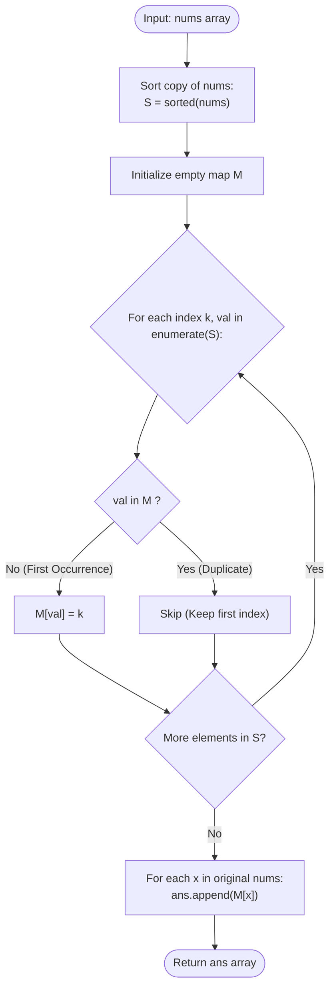

# Guided Example: How Many Numbers Are Smaller Than the Current Number

We trace the step-by-step execution of the optimal sorting and rank-mapping algorithm on a representative problem instance:

- **Input:** `nums = [8, 1, 2, 2, 3]`
- **Required output:** `[4, 0, 1, 1, 3]`

This instance is chosen because it features duplicate values (`2, 2`), out-of-order elements, and an extreme maximum value (`8`), illustrating how first-occurrence indexing correctly excludes equal elements from strict inequality counts.

---

## 1. Instance & Teaching Goal

Given an integer array `nums`, we must determine, for each element $nums[i]$, the number of elements $nums[j]$ ($j \ne i$) that are strictly smaller than $nums[i]$ ($nums[j] < nums[i]$).

For `nums = [8, 1, 2, 2, 3]`:
- For $8$: Numbers smaller than $8$ are $\{1, 2, 2, 3\}$ ($4$ numbers).
- For $1$: No numbers are smaller than $1$ ($0$ numbers).
- For $2$: Only $1$ is smaller than $2$ ($1$ number). Note that the other $2$ is equal, not smaller.
- For the second $2$: Again, only $1$ is smaller ($1$ number).
- For $3$: Numbers smaller than $3$ are $\{1, 2, 2\}$ ($3$ numbers).
- Output: `[4, 0, 1, 1, 3]`.

The primary teaching goal is to reduce quadratic pairwise counting ($\mathcal{O}(N^2)$) to $\mathcal{O}(N \log N)$ by sorting, observing that in a sorted array, the index of the **first occurrence** of any value equals the exact count of elements strictly smaller than it.

---

## 2. Conceptual Foundation & Invariants

Let $S$ be the sorted permutation of `nums` in non-decreasing order.
Because $S$ is sorted:
$$
S[0] \le S[1] \le \dots \le S[N-1]
$$
If a value $x$ first appears at index $k$ in $S$ ($S[k] = x$ and $S[k-1] < x$ for $k > 0$):
- All elements at indices $0, 1, \dots, k-1$ are strictly less than $x$.
- All elements at indices $k, k+1, \dots$ are greater than or equal to $x$.

Therefore, the count of elements strictly smaller than $x$ is precisely $k$:
$$
\text{smaller\_count}(x) = \min \{ k \mid S[k] = x \}
$$

```
Original nums:   [ 8,  1,  2,  2,  3 ]
Sorted array S:  [ 1,  2,  2,  3,  8 ]
Sorted index:      0   1   2   3   4

First occurrences:
  Value 1 -> first at index 0 -> count = 0
  Value 2 -> first at index 1 -> count = 1 (index 2 is duplicate, ignored)
  Value 3 -> first at index 3 -> count = 3
  Value 8 -> first at index 4 -> count = 4

Mapped output:   [ 4,  0,  1,  1,  3 ]
```

We track state using the following parameters:

| State Parameter | Description | Initial Value |
|---|---|---|
| Sorted Array ($S$) | Monotonically non-decreasing copy of `nums` | `[1, 2, 2, 3, 8]` |
| First-Index Map ($M$) | Hash map storing the lowest index for each distinct value | $\emptyset$ |
| Result Array | Output list matching original ordering | Initialized to length $N$ |

> **Invariant.** For any distinct value $v$, $M[v]$ records the smallest index at which $v$ appears in sorted array $S$. Because indices in $S$ are zero-based, $M[v]$ is strictly equal to the number of elements in $S$ that are strictly smaller than $v$.

---

## 3. Step-by-Step Worked Execution

### Step 1: Sorting the Input Array

Create a sorted copy $S$ of `nums = [8, 1, 2, 2, 3]`:
$$
S = [1, 2, 2, 3, 8]
$$

| Sorted Index ($k$) | Value ($S[k]$) | Comparison with Previous |
|---|---|---|
| $0$ | $1$ | Initial minimum |
| $1$ | $2$ | Strictly greater ($2 > 1$) |
| $2$ | $2$ | Equal (Duplicate) |
| $3$ | $3$ | Strictly greater ($3 > 2$) |
| $4$ | $8$ | Strictly greater ($8 > 3$) |

---

### Step 2: Building the First-Occurrence Map $M$

Iterate through $S$ from left to right. Insert a key-value pair $(S[k], k)$ into $M$ only if $S[k]$ has not been recorded previously:
1. $k = 0, S[0] = 1$: $1 \notin M \implies M[1] = 0$.
2. $k = 1, S[1] = 2$: $2 \notin M \implies M[2] = 1$.
3. $k = 2, S[2] = 2$: $2 \in M$ (already mapped to $1$). **Skip duplicate**.
4. $k = 3, S[3] = 3$: $3 \notin M \implies M[3] = 3$.
5. $k = 4, S[4] = 8$: $8 \notin M \implies M[8] = 4$.

Completed map: $M = \{1: 0, 2: 1, 3: 3, 8: 4\}$.

| Index ($k$) | Element ($S[k]$) | Presence in $M$? | Action Taken | Map State ($M$) |
|---|---|---|---|---|
| $0$ | $1$ | Absent | Insert $M[1] = 0$ | $\{1: 0\}$ |
| $1$ | $2$ | Absent | Insert $M[2] = 1$ | $\{1: 0, 2: 1\}$ |
| $2$ | $2$ | **Present** | Ignore (Preserve first index) | $\{1: 0, 2: 1\}$ |
| $3$ | $3$ | Absent | Insert $M[3] = 3$ | $\{1: 0, 2: 1, 3: 3\}$ |
| $4$ | $8$ | Absent | Insert $M[8] = 4$ | $\{1: 0, 2: 1, 3: 3, 8: 4\}$ |

---

### Step 3: Projecting Results in Original Input Order

Iterate through the original array `nums = [8, 1, 2, 2, 3]` and replace each value with $M[nums[i]]$:
- $i = 0$: $nums[0] = 8 \implies M[8] = 4$
- $i = 1$: $nums[1] = 1 \implies M[1] = 0$
- $i = 2$: $nums[2] = 2 \implies M[2] = 1$
- $i = 3$: $nums[3] = 2 \implies M[2] = 1$
- $i = 4$: $nums[4] = 3 \implies M[3] = 3$

Output array: `[4, 0, 1, 1, 3]`.

| Original Index ($i$) | Input Value ($nums[i]$) | Lookup $M[nums[i]]$ | Output Element |
|---|---|---|---|
| $0$ | $8$ | $M[8]$ | $4$ |
| $1$ | $1$ | $M[1]$ | $0$ |
| $2$ | $2$ | $M[2]$ | $1$ |
| $3$ | $2$ | $M[2]$ | $1$ |
| $4$ | $3$ | $M[3]$ | $3$ |

---

## 4. Complete Execution Trace

Summary of the transformation for all elements:

| Index ($i$) | Element ($nums[i]$) | Elements Strictly Smaller | Exact Count | Lookup Key | Output Value |
|---|---|---|---|---|---|
| $0$ | $8$ | $\{1, 2, 2, 3\}$ | $4$ | $M[8]$ | **$4$** |
| $1$ | $1$ | $\emptyset$ | $0$ | $M[1]$ | **$0$** |
| $2$ | $2$ | $\{1\}$ | $1$ | $M[2]$ | **$1$** |
| $3$ | $2$ | $\{1\}$ | $1$ | $M[2]$ | **$1$** |
| $4$ | $3$ | $\{1, 2, 2\}$ | $3$ | $M[3]$ | **$3$** |

---

## 5. Algorithmic Correctness & Complexity Derivation

### Strict Inequality and Duplicate Correctness

Let $S$ be sorted. The set of elements strictly smaller than $x$ is:
$$
A_{< x} = \{ S[j] \mid S[j] < x \}
$$
Since $S$ is non-decreasing, all elements smaller than $x$ must appear contiguously from index $0$ up to $k - 1$, where $k$ is the first index such that $S[k] = x$. The cardinality of this set is $|A_{< x}| = k$.
By only recording the first occurrence of each value in $M$, subsequent identical values never overwrite $k$. This guarantees that duplicate values receive identical and strictly correct counts without self-counting.

### Asymptotic Complexity

- **Comparison Sort Method:**
  - Sorting $N$ elements takes $\mathcal{O}(N \log N)$ time.
  - Scanning $S$ to build $M$ takes $\mathcal{O}(N)$ time.
  - Mapping original elements through $M$ takes $\mathcal{O}(N)$ time.
  - Total Time: $\mathcal{O}(N \log N)$.
- **Counting Sort / Prefix Sum Method:**
  - Since $0 \le nums[i] \le 100$, an array of size $101$ can count frequencies in $\mathcal{O}(N)$ time.
  - Running prefix sums take $\mathcal{O}(101) = \mathcal{O}(1)$ time.
  - Total Time: $\mathcal{O}(N)$.
- **Auxiliary Space Complexity:** $\mathcal{O}(N)$ to store the sorted array and hash map.

---

## 6. Traps & Edge Cases

- **Overwriting First Occurrence:** If the map assignment is executed unconditionally as $M[S[k]] = k$, the second $2$ (at index $2$) would overwrite $M[2] = 2$, falsely counting the first $2$ as smaller than the second. The check `if S[k] not in M` is critical.
- **All Elements Equal:** For `nums = [7, 7, 7, 7]`, $S = [7, 7, 7, 7]$. Only $M[7] = 0$ is recorded. Output is correctly `[0, 0, 0, 0]`.
- **Already Sorted Array:** The algorithm functions identically on sorted or reverse-sorted inputs without degeneration.
- **Minimum Value:** The minimum element in the array always receives count $0$ because no elements precede it in $S$.

---

## 7. Accessible Mermaid Diagram


