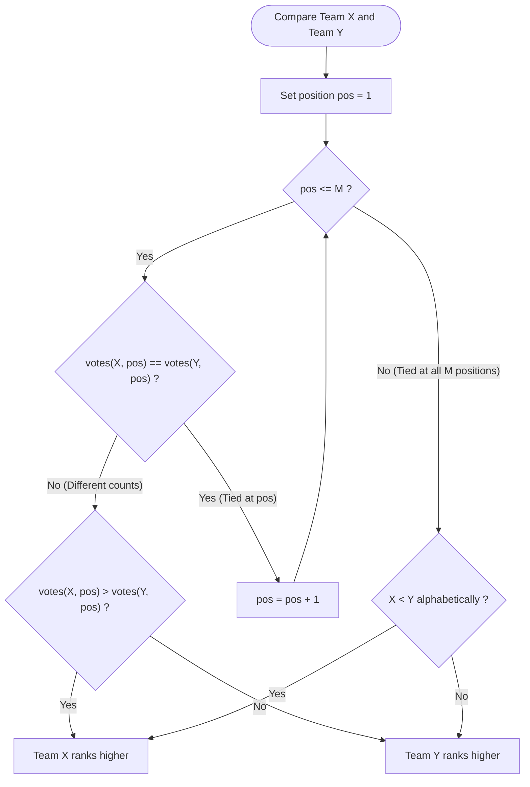

# Guided Example: Rank Teams by Votes

We trace the step-by-step execution of the optimal multi-dimensional positional vote tallying algorithm on a representative problem instance:

- **Input:** `votes = ["ABC", "ACB", "ABC", "ACB", "ACB"]`
- **Required output:** `"ACB"`

This instance is chosen because all five voters rank team `A` in first place, creating an immediate tie for second and third places between `B` and `C` that must be resolved by inspecting the second-place vote counts.

---

## 1. Instance & Teaching Goal

In an election with $M$ participating teams, each voter submits a ranked ballot listing all $M$ teams from first to last place. The winner is determined by:
1. Most first-place votes.
2. If tied, most second-place votes, continuing through position $M$.
3. If tied across all positions $1 \dots M$, break the tie alphabetically by team letter in ascending order (`'A'` before `'B'`).

For $5$ voters casting ballots over teams $\{A, B, C\}$:
- Ballot 1: `ABC` (1st: A, 2nd: B, 3rd: C)
- Ballot 2: `ACB` (1st: A, 2nd: C, 3rd: B)
- Ballot 3: `ABC` (1st: A, 2nd: B, 3rd: C)
- Ballot 4: `ACB` (1st: A, 2nd: C, 3rd: B)
- Ballot 5: `ACB` (1st: A, 2nd: C, 3rd: B)

Tallying each team's finishes:
- Team A: Five $1^{\text{st}}$-place votes, zero $2^{\text{nd}}$, zero $3^{\text{rd}}$ $\implies [5, 0, 0]$
- Team B: Zero $1^{\text{st}}$-place votes, two $2^{\text{nd}}$, three $3^{\text{rd}}$ $\implies [0, 2, 3]$
- Team C: Zero $1^{\text{st}}$-place votes, three $2^{\text{nd}}$, two $3^{\text{rd}}$ $\implies [0, 3, 2]$

Comparing B and C:
- Tied on $1^{\text{st}}$ place ($0 = 0$).
- Team C wins $2^{\text{nd}}$ place ($3 > 2$), placing C ahead of B.
- Final ranking: `"ACB"`.

The primary teaching goal is to model positional ranked voting as a multi-key lexicographic sorting problem where descending vote counts across ranks take strict precedence over ascending alphabetical characters.

---

## 2. Conceptual Foundation & Invariants

Let $M = |votes[0]|$ be the number of teams. Each team $T$ is assigned a positional tally vector $V(T) \in \mathbb{N}^M$:
$$
V(T) = [c_1(T), c_2(T), \dots, c_M(T)]
$$
where $c_p(T)$ is the number of voters who placed team $T$ at rank $p$.

We define a total order $\succ$ between teams $T_1$ and $T_2$:
$$
T_1 \succ T_2 \iff \begin{cases}
V(T_1) >_{\text{lex}} V(T_2), & \text{or} \\
V(T_1) = V(T_2) \land T_1 <_{\text{alpha}} T_2
\end{cases}
$$

```
Ballot Tallies:
  Team A: [ 5, 0, 0 ] -> Unique maximum at position 1 (5 > 0)
  Team B: [ 0, 2, 3 ]
  Team C: [ 0, 3, 2 ] -> Tied with B at pos 1, beats B at pos 2 (3 > 2)

Final Sorted Order: A (Rank 1) -> C (Rank 2) -> B (Rank 3) => "ACB"
```

We track state using the following parameters:

| State Parameter | Description | Initial Value |
|---|---|---|
| Participating Teams | Distinct team characters from $votes[0]$ | $\{A, B, C\}$ |
| Tally Matrix ($V$) | Map from team character to length-$M$ integer array | Initialized to all zeros |
| Comparison Tuple | Composite key $(-c_1, -c_2, \dots, -c_M, T)$ | Formed per team |

> **Invariant.** For any two teams $T_1$ and $T_2$, team $T_1$ ranks ahead of $T_2$ if and only if $T_1$ has more votes at the earliest position where their vote tallies differ. If their vote tallies are identical across all $M$ positions, $T_1$ precedes $T_2$ if and only if $T_1$ is alphabetically smaller.

---

## 3. Step-by-Step Worked Execution

### Step 1: Initialize Tally Vectors

Identify $M = 3$ teams from $votes[0] = \text{"ABC"}$.
Initialize count vectors:
- $V(A) = [0, 0, 0]$
- $V(B) = [0, 0, 0]$
- $V(C) = [0, 0, 0]$

| Team | Position 1 ($c_1$) | Position 2 ($c_2$) | Position 3 ($c_3$) |
|---|---|---|---|
| A | $0$ | $0$ | $0$ |
| B | $0$ | $0$ | $0$ |
| C | $0$ | $0$ | $0$ |

---

### Step 2: Accumulate Votes Across All Ballots

Process each ballot sequentially:
1. Ballot 1 `"ABC"`: $A \to c_1$, $B \to c_2$, $C \to c_3$.
2. Ballot 2 `"ACB"`: $A \to c_1$, $C \to c_2$, $B \to c_3$.
3. Ballot 3 `"ABC"`: $A \to c_1$, $B \to c_2$, $C \to c_3$.
4. Ballot 4 `"ACB"`: $A \to c_1$, $C \to c_2$, $B \to c_3$.
5. Ballot 5 `"ACB"`: $A \to c_1$, $C \to c_2$, $B \to c_3$.

Final Tallies:
- $V(A) = [5, 0, 0]$
- $V(B) = [0, 2, 3]$
- $V(C) = [0, 3, 2]$

| Ballot | 1st Place | 2nd Place | 3rd Place | Running Tallies ($V$) |
|---|---|---|---|---|
| Ballot 1 (`"ABC"`) | A | B | C | $A:[1,0,0], B:[0,1,0], C:[0,0,1]$ |
| Ballot 2 (`"ACB"`) | A | C | B | $A:[2,0,0], B:[0,1,1], C:[0,1,1]$ |
| Ballot 3 (`"ABC"`) | A | B | C | $A:[3,0,0], B:[0,2,1], C:[0,1,2]$ |
| Ballot 4 (`"ACB"`) | A | C | B | $A:[4,0,0], B:[0,2,2], C:[0,2,2]$ |
| Ballot 5 (`"ACB"`) | A | C | B | **$A:[5,0,0], B:[0,2,3], C:[0,3,2]$** |

---

### Step 3: Comparative Ranking

Compare teams using composite lexicographic keys:
- **Compare A with B and C:**
  - Position 1: $V(A)[0] = 5$, while $V(B)[0] = 0$ and $V(C)[0] = 0$.
  - Since $5 > 0$, Team A secures 1st place.
- **Compare B and C:**
  - Position 1: $V(B)[0] = 0, V(C)[0] = 0$ (Tie).
  - Position 2: $V(C)[1] = 3$, whereas $V(B)[1] = 2$.
  - Since $3 > 2$, Team C strictly beats Team B at Position 2.
  - Position 3 and alphabetical tie-breakers are not consulted.

Ranked order: $A \succ C \succ B$.
Output string: `"ACB"`.

| Comparison Pair | First Position ($c_1$) | Second Position ($c_2$) | Resolution | Decision |
|---|---|---|---|---|
| A vs C | $5 > 0$ | Not reached | Decided at $c_1$ | $A \succ C$ |
| A vs B | $5 > 0$ | Not reached | Decided at $c_1$ | $A \succ B$ |
| C vs B | $0 = 0$ (Tie) | $3 > 2$ | Decided at $c_2$ | **$C \succ B$** |

---

## 4. Complete Execution Trace

Summary of the final standing:

| Final Rank | Team | 1st Place Votes | 2nd Place Votes | 3rd Place Votes | Decisive Factor |
|---|---|---|---|---|---|
| **1st** | **A** | $5$ | $0$ | $0$ | Majority 1st place votes ($5$) |
| **2nd** | **C** | $0$ | $3$ | $2$ | Won 2nd place tie-break ($3 > 2$) |
| **3rd** | **B** | $0$ | $2$ | $3$ | Fewer 2nd place votes ($2 < 3$) |

Concatenated result: `"ACB"`.

---

## 5. Algorithmic Correctness & Complexity Derivation

### Total Ordering Guarantee

Lexicographic comparison over vectors $V(T) \in \mathbb{N}^M$ defines a total preorder. Appending the unique character $T$ as the final tie-breaking component converts the preorder into a strict total order:
$$
\text{Key}(T) = (-c_1(T), -c_2(T), \dots, -c_M(T), T)
$$
Because every team has a distinct character identifier, no two composite keys can ever be identical. Thus, any standard sorting algorithm sorting these keys in ascending order produces a unique, deterministic permutation of teams.

### Asymptotic Complexity

- Let $N$ be the number of ballots and $M$ be the number of teams ($M \le 26$).
- **Tally Construction:** Scanning $N$ ballots of length $M$ takes $\mathcal{O}(N \cdot M)$ time.
- **Sorting Teams:** Sorting $M$ teams using length-$(M + 1)$ composite keys takes $\mathcal{O}(M^2 \log M)$ comparisons.
- Since $M \le 26$, $M^2 \log M \le 26^2 \log_2(26) \approx 3{,}177$ operations, which is effectively constant.
- **Overall Time Complexity:** $\mathcal{O}(N \cdot M + M^2 \log M)$.
- **Auxiliary Space Complexity:** $\mathcal{O}(M^2)$ to store the vote counts for all $M$ teams across all $M$ positions.

---

## 6. Traps & Edge Cases

- **Mixed Sort Directions:** Vote counts must sort in **descending** order (higher counts win), whereas team letters must sort in **ascending** alphabetical order (`'A'` before `'B'`). Negating the vote counts (or using custom comparators) handles this cleanly.
- **Single Ballot ($N = 1$):** If only one voter exists, every team gets exactly $1$ vote at its position in that ballot, meaning the output must exactly mirror the single ballot string.
- **Complete Tie Across All Positions:** For `votes = ["Z", "Y", "X"]` where each letter gets equal votes, the alphabetical tie-breaker ensures output is `"XYZ"`.
- **All Teams Present:** The problem guarantees that every ballot contains all $M$ teams without omissions or additions.

---

## 7. Accessible Mermaid Diagram


