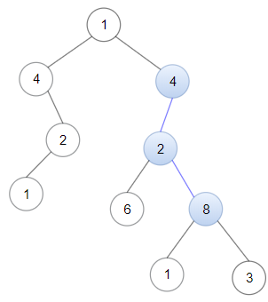
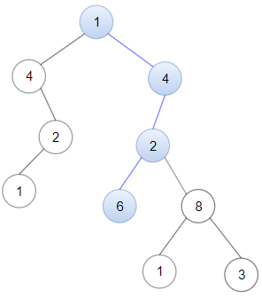

### 1. Description

Given a binary tree `root` and a linked list with `head` as the first node.

Return True if all the elements in the linked list starting from the `head` correspond to some *downward path* connected in the binary tree otherwise return False.

In this context downward path means a path that starts at some node and goes downwards.

### 2. Function Contract

- `n`: Input parameter.
- Returns expected result.

### 3. Examples

#### Example 1

**

**

- **Input:** $head = [4,2,8], root = [1,4,4,null,2,2,null,1,null,6,8,null,null,null,null,1,3]$
- **Output:** `true`
- **Explanation:** Nodes in blue form a subpath in the binary Tree.
#### Example 2

**

**

- **Input:** $head = [1,4,2,6], root = [1,4,4,null,2,2,null,1,null,6,8,null,null,null,null,1,3]$
- **Output:** `true`
#### Example 3

- **Input:** $head = [1,4,2,6,8], root = [1,4,4,null,2,2,null,1,null,6,8,null,null,null,null,1,3]$
- **Output:** `false`
- **Explanation:** There is no path in the binary tree that contains all the elements of the linked list from head.

### 4. Constraints

- The number of nodes in the tree will be in the range `[1, 2500]`.

- The number of nodes in the list will be in the range `[1, 100]`.

- $1 \le \text{Node.val} \le 100$ for each node in the linked list and binary tree.