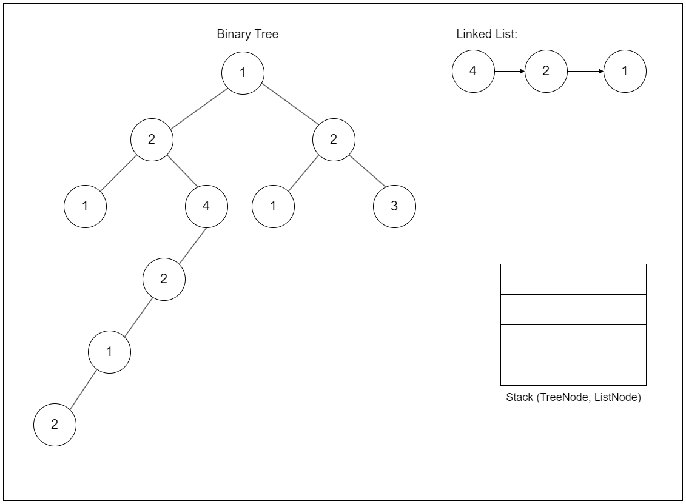
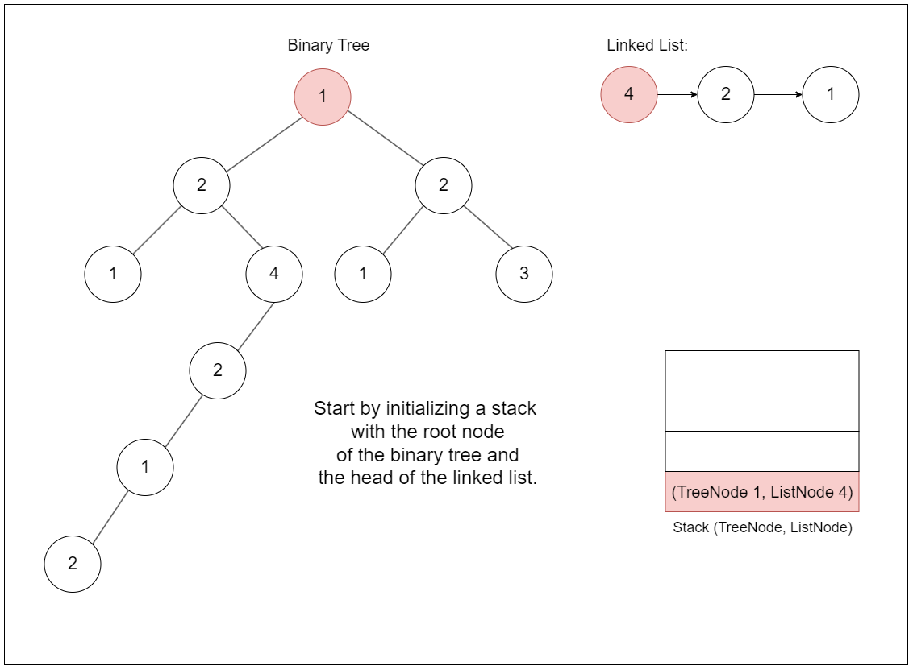
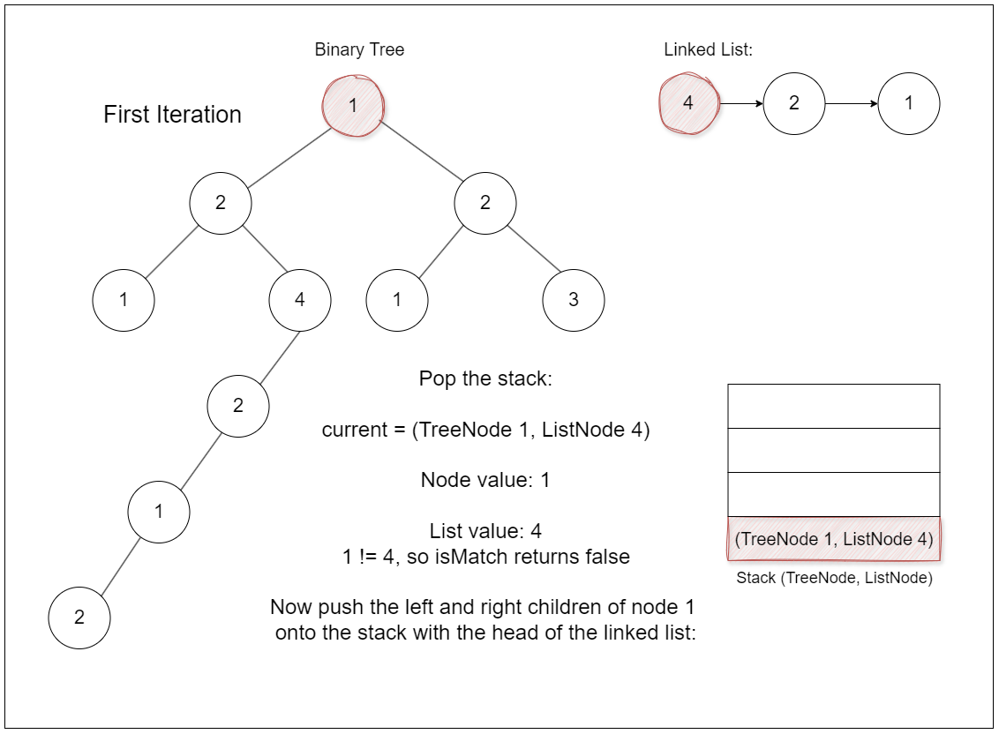
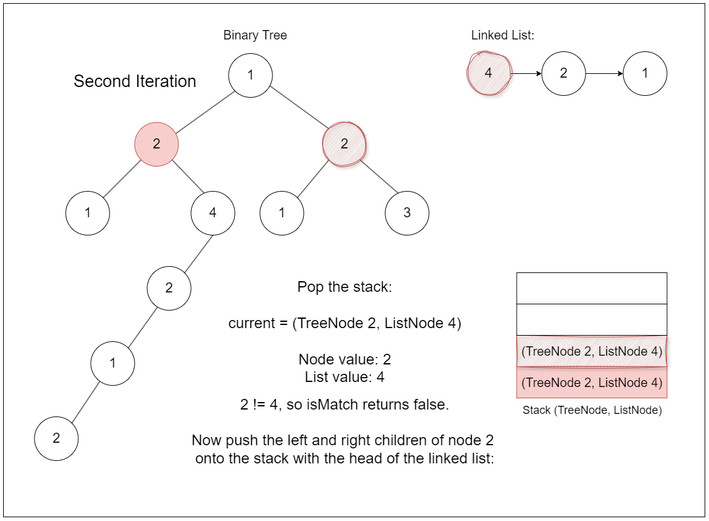
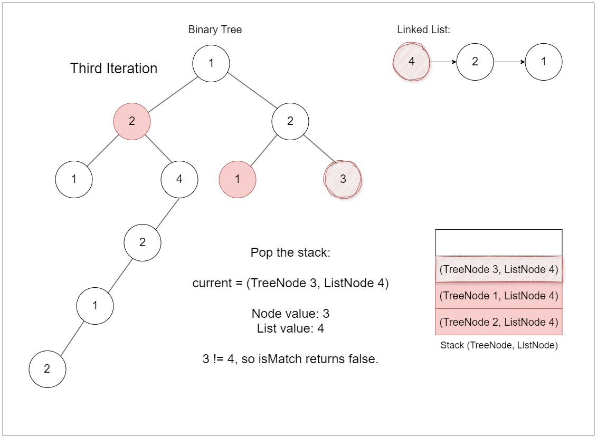
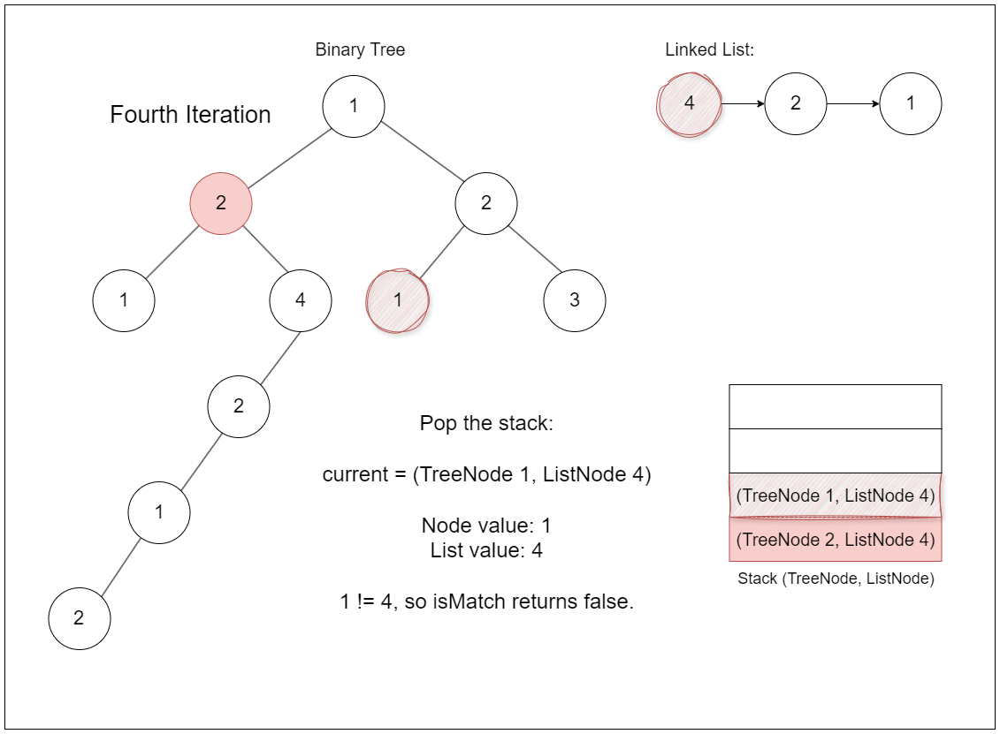
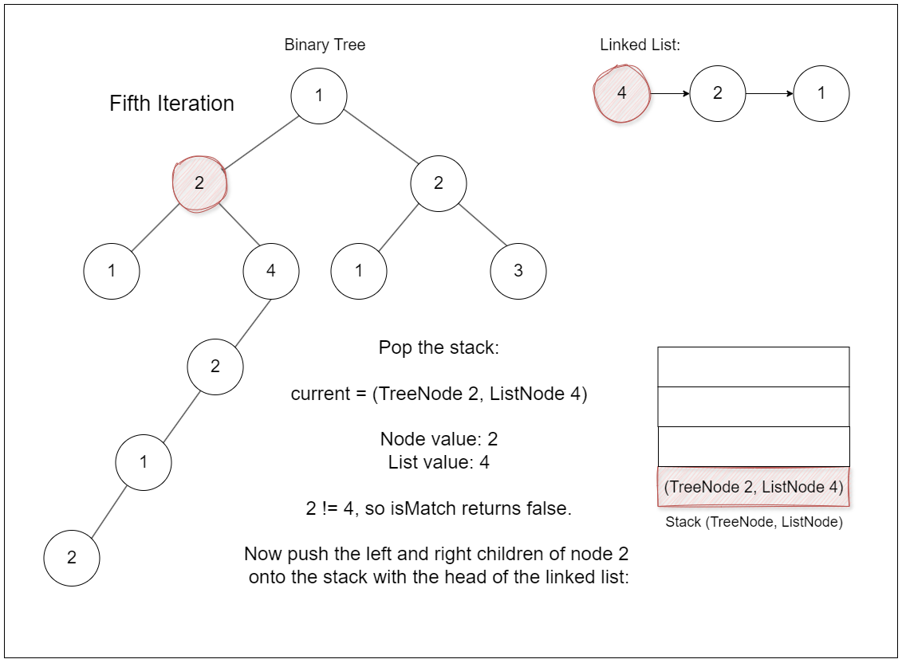
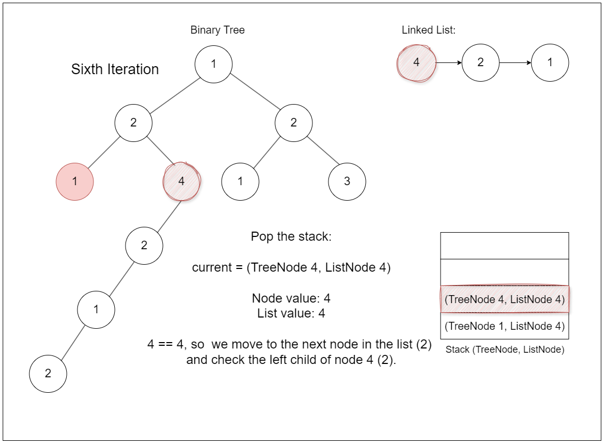
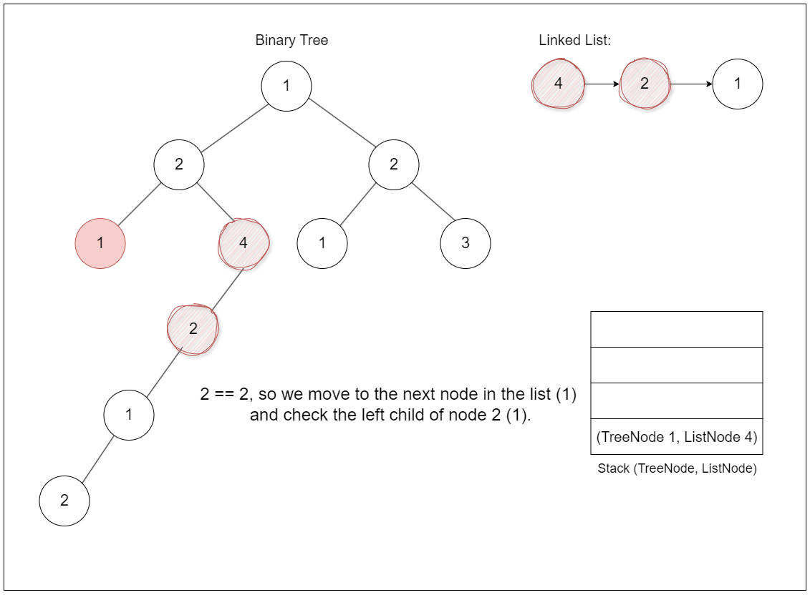
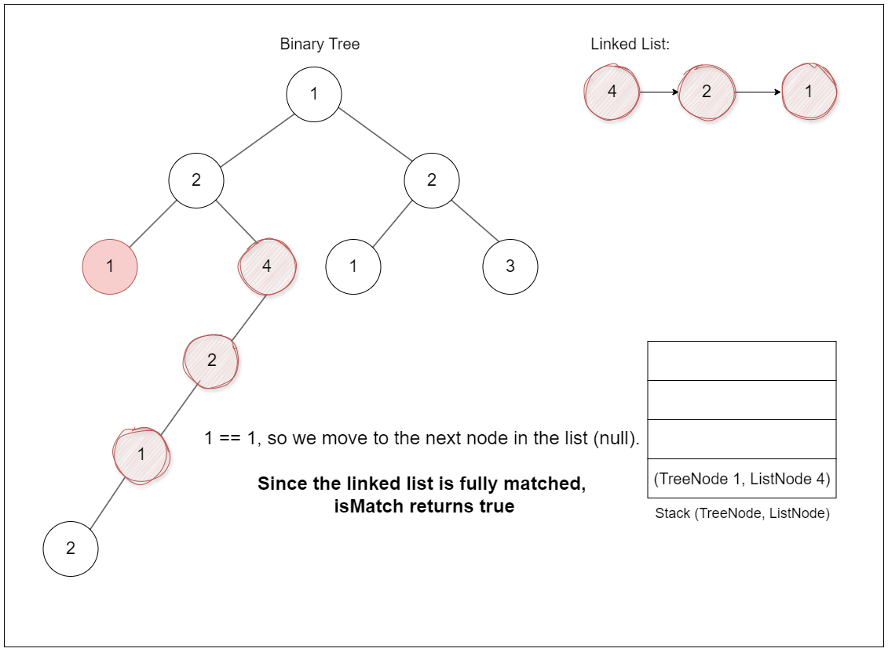

## Solution

---

### Overview

We are given a binary tree and a linked list. Our task is to determine if the linked list is represented by any downward path in the binary tree. A downward path in the binary tree is defined as a path that starts at any node and extends to its subsequent child nodes, going downward.

---

### Approach 1: DFS

#### Intuition

A direct approach is to explore every possible path in the tree using Depth-First Search (DFS). This method allows us to examine each path fully before moving to the next.

We begin at the root of the tree and compare its value to the head of the linked list. If they match, we continue by checking the left and right children of the tree node against the next node in the linked list. If the tree node's value does not match the linked list node, we stop exploring that path since it can't lead to a match. We then backtrack and try the next possible path.

#### Algorithm

- If `root` is null, return `false` (base case).

- Call `checkPath(root, head)` to start checking for the linked list path in the tree.

- `checkPath` function:
  - If `node` is null, return `false` (base case).
  - Call `dfs(node, head)` to check if a matching path starts from `node`.
- If `dfs` returns `true`, return `true` (a matching path is found).
  - Recursively call `checkPath` on both left and right subtrees with the same `head`.

- `dfs` function:
  - If `head` is null, return `true` (all nodes in the list have been matched).
  - If `node` is null, return `false` (reached end of the tree without matching all nodes).
  - If the value of `node` does not match `head`, return `false` (value mismatch).
  - Recursively call `dfs` on both left and right children of `node` with `head->next`.

- Return `true` if `checkPath` or `dfs` finds a matching path; otherwise, continue checking.

#### Implementation

```python
class Solution:
    def isSubPath(
        self, head: Optional[ListNode], root: Optional[TreeNode]
    ) -> bool:
        if root is None:
            return False
        return self._check_path(root, head)

    def _check_path(
        self, node: Optional[TreeNode], head: Optional[ListNode]
    ) -> bool:
        if node is None:
            return False
        if self._dfs(node, head):
            return True  # If a matching path is found

        # Recursively check left and right subtrees
        return self._check_path(node.left, head) or self._check_path(
            node.right, head
        )

    def _dfs(self, node: Optional[TreeNode], head: Optional[ListNode]) -> bool:
        if head is None:
            return True  # All nodes in the list matched
        if node is None:
            return False  # Reached end of tree without matching all nodes
        if node.val != head.val:
            return False  # Value mismatch
        return self._dfs(node.left, head.next) or self._dfs(
            node.right, head.next
        )
```

#### Complexity Analysis

Let $n$ be the number of nodes in the tree and $m$ be the length of the linked list.

- Time complexity: $O(n \times m)$

    In the worst case, we might need to check every node in the tree as a potential starting point for the linked list. For each node, we might need to traverse up to m nodes in the linked list.

- Space complexity: $O(n + m)$

    The space complexity remains the same as Approach 1 due to the recursive nature of the solution.

---

### Approach 2: Iterative Approach

#### Intuition

A common rule of thumb is that all approaches solvable via recursion can also be solved using a stack to mimic the call stack's nature. Unlike recursion, where each function call adds a new frame to the call stack, using a stack avoids the risk of stack overflow errors in cases where the depth of recursion is too large (e.g., in a very deep tree).

We start by putting the root of the tree onto the stack. This stack helps us explore the tree without recursion. We repeatedly take the top node from the stack and check if there is a path from this node that matches the linked list. If there is, we return true. If not, we add the node's left and right children to the stack for further checking.

To match the path, we use another stack to keep track of pairs of tree nodes and linked list nodes. We compare each pair, and if they match, we continue with the next node in the linked list and the children of the current tree node. If we find that the entire linked list matches a path in the tree, we return true.

If we finish checking all possible paths without finding a match, we return false.

The algorithm is visualized below:





















> Fun fact: Iterative approaches often provide more control over traversal, allowing you to access every path and create patterns that do not follow traditional recursion rules.

#### Algorithm

- Check if `root` is null:
  - If `root` is null, return `false` (base case).

- Initialize a stack `nodes` and push `root` onto the stack.

- While the stack `nodes` is not empty:
  - Pop the top `node` from the stack.
  - Call `isMatch(node, head)` to check if the linked list `head` matches a path starting from `node`.
- If `isMatch` returns `true`, return `true` (a matching path is found).
  - If `node` has a left child, push it onto the stack.
  - If `node` has a right child, push it onto the stack.

- If no matching path is found after checking all nodes, return `false`.

- `isMatch` function:
  - Initialize a stack `s` and push a pair `{node, lst}` onto it.

  - While the stack `s` is not empty:
- Pop the top pair `{currentNode, currentList}` from the stack.
- While both `currentNode` and `currentList` are not null:
      - If `currentNode->val` does not match `currentList->val`, break (no match).
      - Move to the next node in the linked list ($currentList = currentList->next$).
      - If `currentList` is not null:
- If `currentNode` has a left child, push `{currentNode->left, currentList}` onto the stack.
- If `currentNode` has a right child, push `{currentNode->right, currentList}` onto the stack.
- Break to continue with the next pair in the stack.
- If `currentList` becomes null, return `true` (all nodes in the list matched).

- Return `false` if no matching path is found after exploring all possibilities.

#### Implementation

```python
class Solution:
    def isSubPath(
        self, head: Optional[ListNode], root: Optional[TreeNode]
    ) -> bool:
        if not root:
            return False
        stack = [root]

        while stack:
            node = stack.pop()

            if self._is_match(node, head):
                return True
            # Push left and right children onto the stack
            if node.left:
                stack.append(node.left)
            if node.right:
                stack.append(node.right)
        return False

    def _is_match(
        self, node: Optional[TreeNode], lst: Optional[ListNode]
    ) -> bool:
        # Stack to keep track of (current_tree_node, current_list_node)
        stack = [(node, lst)]

        while stack:
            current_node, current_list = stack.pop()

            while current_node and current_list:
                if current_node.val != current_list.val:
                    break
                current_list = current_list.next

                # Continue to the next node in the tree, left or right
                if current_list:
                    if current_node.left:
                        stack.append((current_node.left, current_list))
                    if current_node.right:
                        stack.append((current_node.right, current_list))
                    break
            if not current_list:
                return True
        return False
```

#### Complexity Analysis

Let $n$ be the number of nodes in the tree and $m$ be the length of the linked list.

- Time complexity: $O(n \times m)$

    We potentially visit each node in the tree once. For each node, we might need to check up to `m` nodes in the linked list.

- Space complexity: $O(n)$

    The space is used by the stack, which in the worst case might contain all nodes of the tree. We don't need extra space for the linked list traversal as it's done iteratively.

---

### Approach 3: Knuth-Morris-Pratt (KMP) Algorithm

#### Intuition

Approach 3 is more advanced and requires an understanding of the Knuth-Morris-Pratt (KMP) string-matching algorithm. We suggest reviewing [28. Find the Index of the First Occurrence in a String - Easy Tagged](https://leetcode.com/problems/find-the-index-of-the-first-occurrence-in-a-string/description/) and solving it using the KMP algorithm before diving into this approach.

The previous approaches all involve searching the tree from the root and checking each path independently, which can be repetitive. By adjusting the idea behind the KMP algorithm, we can reduce this repetition and optimize the approach.

The KMP algorithm efficiently finds occurrences of a pattern (in this case, the linked list) within a text by using a prefix table, or failure function, to skip unnecessary comparisons.

The key to KMP is the prefix table, also known as the failure function. This table helps us understand how to skip certain comparisons based on what we’ve already matched.

We first build a table that indicates the longest proper prefix of the pattern that is also a suffix. This table tells us where to resume the search in the pattern after a mismatch. For example, consider the pattern `ABABCABAB`. The prefix table for this pattern helps us understand that if a mismatch occurs after `AB`, we don’t need to start from the beginning of the pattern but can skip to the next best position that aligns with what we’ve already matched.

As we search for the pattern in the text, if we encounter a mismatch, the prefix table tells us how far back we should go in the pattern to continue the search efficiently. Instead of starting the comparison from the beginning of the pattern again, we use the prefix table to skip over parts of the pattern that have already been matched. This reduces unnecessary comparisons.

Similarly, we construct the prefix table for the linked list by following the same principle of finding the longest prefix that is also a suffix. This helps in efficiently finding where to resume the search if a mismatch occurs while traversing paths in the tree.

We perform a DFS on the tree, treating each node's value as part of the text where we want to match our pattern (the linked list). As we traverse the tree, if a mismatch occurs, the prefix table tells us how much of the pattern we can skip, based on what we’ve already matched.

> Note: Running through a dry run of this approach will help you get a better grip on how it works. It’s a great way to see the logic in action with a few concrete examples and spot any issues.

#### Algorithm

- Build the pattern and prefix table from the linked list:
  - Initialize `pattern` with the value of the head node of the linked list.
  - Initialize `prefixTable` with `0` to store prefix lengths.
  - Iterate through the linked list to construct `pattern` and `prefixTable`:
- For each value, update the `patternIndex` to find matching prefixes using the `prefixTable`.
- Add the current value to `pattern` and update `prefixTable` accordingly.
- Move to the next node in the linked list.

- Perform DFS to search for the pattern in the tree:
  - Call `searchInTree` with the root of the tree, starting pattern index `0`, and the `pattern` and `prefixTable`.

- `searchInTree` function:
  - If `node` is null, return `false` (base case).

  - Update `patternIndex` to find the matching prefix:
- If the current node value does not match the pattern at `patternIndex`, use the `prefixTable` to backtrack to the correct index.
- Increment `patternIndex` if there is a match.

  - Check if the entire `pattern` has been matched ($patternIndex = \text{pattern.size}()$):
- If matched, return `true`.

  - Recursively search in both left and right subtrees of the current `node`:
- Return `true` if either subtree contains a matching path; otherwise, continue searching.

#### Implementation

```python
class Solution:
    def isSubPath(
        self, head: Optional[ListNode], root: Optional[TreeNode]
    ) -> bool:

        # Build the pattern and prefix table from the linked list
        pattern = [head.val]
        prefix_table = [0]
        pattern_index = 0
        head = head.next

        while head:
            while pattern_index > 0 and head.val != pattern[pattern_index]:
                pattern_index = prefix_table[pattern_index - 1]
            pattern_index += 1 if head.val == pattern[pattern_index] else 0
            pattern.append(head.val)
            prefix_table.append(pattern_index)
            head = head.next

        # Perform DFS to search for the pattern in the tree
        return self._search_in_tree(root, 0, pattern, prefix_table)

    def _search_in_tree(
        self,
        node: Optional[TreeNode],
        pattern_index: int,
        pattern: List[int],
        prefix_table: List[int],
    ) -> bool:
        if not node:
            return False

        while pattern_index > 0 and node.val != pattern[pattern_index]:
            pattern_index = prefix_table[pattern_index - 1]
        pattern_index += 1 if node.val == pattern[pattern_index] else 0

        # Check if the pattern is fully matched
        if pattern_index == len(pattern):
            return True

        # Recursively search left and right subtrees
        return self._search_in_tree(
            node.left, pattern_index, pattern, prefix_table
        ) or self._search_in_tree(
            node.right, pattern_index, pattern, prefix_table
        )
```

#### Complexity Analysis

Let $n$ be the number of nodes in the tree and $m$ be the length of the linked list.

- Time complexity: $O(2^{k - 1} \cdot m)$

    The complexity of building the `prefixTable` for the KMP pattern is $O(m)$. However, the primary bottleneck is in the `searchInTree` function, which performs a DFS on the binary tree with $n$ nodes.

    While traversing the tree, the algorithm repeatedly evaluates portions of the `pattern`, and due to the tree structure, a mismatch can trigger repetitive re-evaluation of the `prefixTable` across multiple nodes. In the worst case, this could result in up to $O(2^{k - 1} \cdot m)$ time complexity, where $m = 2k - 1$, as each failed match can lead to exponential time growth due to repeated pattern comparisons.

* Space complexity: $O(n + m)$

    We need $O(m)$ space for the pattern and prefix table. The recursive call stack in the worst case (skewed tree) can take up to $O(n)$ space.

---