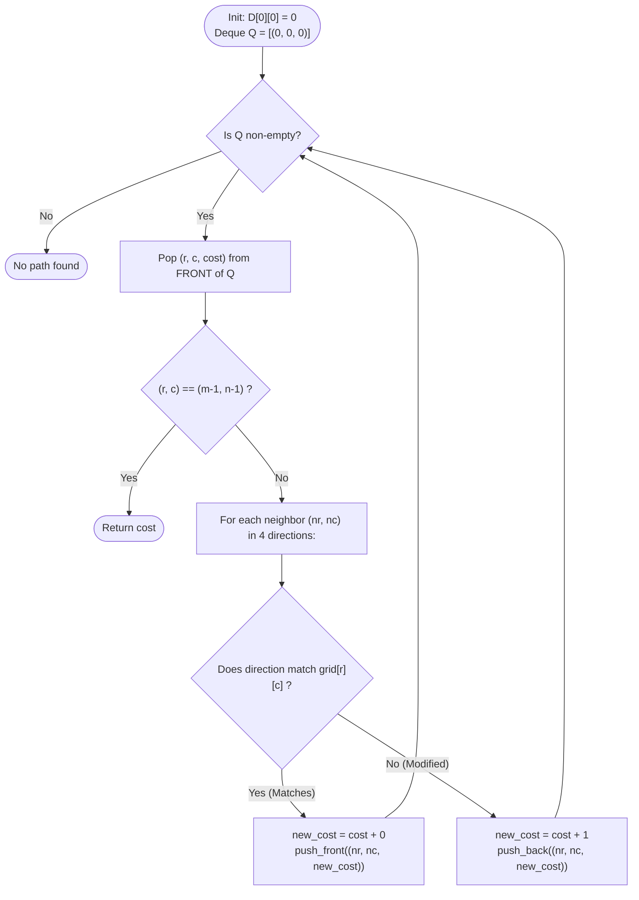

# Guided Example: Minimum Cost to Make at Least One Valid Path in a Grid

We trace the step-by-step execution of the optimal 0-1 Breadth-First Search (0-1 BFS) algorithm on a representative problem instance:

- **Input:**
  ```json
  {
    "grid": [
      [1, 1, 1],
      [2, 2, 2],
      [1, 1, 1]
    ]
  }
  ```
- **Required output:** `2`

This instance is chosen because each row is locked into horizontal movement (Row 0 points entirely Right, Row 1 points entirely Left, Row 2 points entirely Right), forcing the search to explore cost-$0$ paths horizontally and expend cost-$1$ redirections vertically to reach the bottom-right destination $(2, 2)$.

---

## 1. Instance & Teaching Goal

We are given an $m \times n$ grid where each cell $(r, c)$ contains an directional arrow:
- $1$: Right $(r, c + 1)$
- $2$: Left $(r, c - 1)$
- $3$: Down $(r + 1, c)$
- $4$: Up $(r - 1, c)$

A path begins at $(0, 0)$ and must reach $(m - 1, n - 1)$. If a step follows the existing arrow on the cell, the transition cost is $0$. Modifying the arrow to point in any other valid direction incurs a cost of $1$. We seek the minimum total modification cost.

For the $3 \times 3$ grid:
```
Row 0:  (0,0)[->]  (0,1)[->]  (0,2)[->]  -> Follow arrows: cost 0 to reach (0, 2)
Row 1:  (1,0)[<-]  (1,1)[<-]  (1,2)[<-]  -> Redirect (0, 2) Down to (1, 2): cost +1
Row 2:  (2,0)[->]  (2,1)[->]  (2,2)[->]  -> Redirect (1, 2) Down to (2, 2): cost +1
```

Total cost: $0 + 1 + 1 = 2$.

The primary teaching goal is to formulate directional grid pathfinding as a shortest-path problem on a directed graph with edge weights in $\{0, 1\}$, and apply 0-1 BFS using a double-ended queue (deque) to achieve linear time $\mathcal{O}(m \cdot n)$.

---

## 2. Conceptual Foundation & Invariants

Let each grid cell $(r, c)$ represent a graph vertex. From $(r, c)$, directed edges connect to all four in-bounds orthogonal neighbors $(r', c')$:
$$
w((r, c) \to (r', c')) = \begin{cases}
0 & \text{if the step matches the arrow } grid[r][c] \\
1 & \text{if the arrow must be changed to point to } (r', c')
\end{cases}
$$

Because edge weights are strictly $0$ or $1$, Dijkstra's priority queue can be replaced by a deque $Q$:
- **Cost-0 Edge:** Pushed to the **front** of $Q$ (`push_front`), remaining in the current distance tier.
- **Cost-1 Edge:** Pushed to the **back** of $Q$ (`push_back`), scheduled for the next distance tier.

```
0-1 BFS Deque Organization:
  [ FRONT: cost = d, cost = d | BACK: cost = d + 1, cost = d + 1 ]
   ^                          ^
   Processed immediately     Processed after current tier
```

We track state using the following parameters:

| State Parameter | Description | Initial Value |
|---|---|---|
| Distance Matrix ($D$) | Minimal cost to reach each cell from $(0, 0)$ | $D[0][0] = 0$, others $\infty$ |
| Deque ($Q$) | Double-ended queue holding $(r, c, \text{cost})$ tuples | `[(0, 0, 0)]` |
| Direction Mapping | Delta offsets for directions $1, 2, 3, 4$ | $[(0,1), (0,-1), (1,0), (-1,0)]$ |

> **Invariant.** At any moment, vertices in $Q$ have distances that differ by at most $1$ ($\{d, d + 1\}$). Vertices extracted from the front of $Q$ have their shortest paths permanently resolved. Relaxations along cost-$0$ edges are processed immediately before any cost-$1$ edges are evaluated.

---

## 3. Step-by-Step Worked Execution

### Step 1: Distance Layer $d = 0$ (Horizontal Exploration)

Initialize $D[0][0] = 0, Q = [(0, 0, 0)]$.

1. **Pop $(0, 0)$ at cost $0$:**
   - Direction on cell: $1$ (Right $\to (0, 1)$).
   - Right move $(0, 1)$: Cost $0$ (matches sign). $D[0][1] = 0$, `push_front((0, 1, 0))`.
   - Down move $(1, 0)$: Cost $1$. $D[1][0] = 1$, `push_back((1, 0, 1))`.
2. **Pop $(0, 1)$ at cost $0$:**
   - Direction on cell: $1$ (Right $\to (0, 2)$).
   - Right move $(0, 2)$: Cost $0$ (matches sign). $D[0][2] = 0$, `push_front((0, 2, 0))`.
   - Down move $(1, 1)$: Cost $1$. $D[1][1] = 1$, `push_back((1, 1, 1))`.
3. **Pop $(0, 2)$ at cost $0$:**
   - Direction on cell: $1$ (Right $\to$ out of bounds).
   - Left move $(0, 1)$: Already visited at cost $0$.
   - Down move $(1, 2)$: Cost $1$. $D[1][2] = 1$, `push_back((1, 2, 1))`.

Distance layer $d = 0$ is exhausted.
Deque contains only cost-$1$ candidates: `[(1, 0, 1), (1, 1, 1), (1, 2, 1)]`.

| Extracted Cell | Cost | Move Explored | Edge Weight | Action | Resulting Deque |
|---|---|---|---|---|---|
| $(0, 0)$ | $0$ | Right to $(0, 1)$ | $0$ | `push_front` | `[(0, 1, 0), (1, 0, 1)]` |
| $(0, 1)$ | $0$ | Right to $(0, 2)$ | $0$ | `push_front` | `[(0, 2, 0), (1, 0, 1), (1, 1, 1)]` |
| $(0, 2)$ | $0$ | Down to $(1, 2)$ | $1$ | `push_back` | `[(1, 0, 1), (1, 1, 1), (1, 2, 1)]` |

---

### Step 2: Distance Layer $d = 1$ (Redirecting to Row 1)

1. **Pop $(1, 0)$ at cost $1$:**
   - Direction on cell: $2$ (Left $\to$ out of bounds).
   - Down move $(2, 0)$: Cost $1 \implies$ total cost $2$. $D[2][0] = 2$, `push_back((2, 0, 2))`.
2. **Pop $(1, 1)$ at cost $1$:**
   - Direction on cell: $2$ (Left $\to (1, 0)$).
   - Left move $(1, 0)$: Already visited at cost $1$.
3. **Pop $(1, 2)$ at cost $1$:**
   - Direction on cell: $2$ (Left $\to (1, 1)$).
   - Down move $(2, 2)$ (Destination!): Cost $1 \implies$ total cost $2$.
   - Update $D[2][2] = 2$, `push_back((2, 2, 2))`.

| Extracted Cell | Cost | Move Explored | Edge Weight | Action | Resulting Deque |
|---|---|---|---|---|---|
| $(1, 0)$ | $1$ | Down to $(2, 0)$ | $1$ | `push_back` | Cost-2 items added |
| $(1, 1)$ | $1$ | Left to $(1, 0)$ | $0$ | Already relaxed | Skipped |
| $(1, 2)$ | $1$ | Down to $(2, 2)$ | $1$ | `push_back` | Destination enqueued at cost 2 |

---

### Step 3: Distance Layer $d = 2$ (Reaching Destination)

Pop $(2, 2)$ at cost $2$:
- Current cell matches destination: $(r, c) = (m - 1, n - 1) = (2, 2)$.
- Shortest path cost is confirmed as $2$.
- Terminate search and return $2$.

| Parameter | Observed State | Termination Check | Output |
|---|---|---|---|
| Popped Cell | $(2, 2)$ | Target $(m-1, n-1)$ reached | **`2`** |

---

## 4. Complete Execution Trace

Summary of the minimal cost trajectory:

| Traversal Order | Cell $(r, c)$ | Original Arrow | Step Direction | Edge Cost | Cumulative Cost | Invariant Status |
|---|---|---|---|---|---|---|
| 1 | $(0, 0)$ | Right ($1$) | Right | $0$ | $0$ | Follows arrow |
| 2 | $(0, 1)$ | Right ($1$) | Right | $0$ | $0$ | Follows arrow |
| 3 | $(0, 2)$ | Right ($1$) | Down | **$1$** | $1$ | Redirect arrow |
| 4 | $(1, 2)$ | Left ($2$) | Down | **$1$** | **$2$** | Redirect arrow |
| 5 | $(2, 2)$ | Right ($1$) | Target | — | **$2$** | Destination reached |

---

## 5. Algorithmic Correctness & Complexity Derivation

### Deque Monotonicity and 0-1 BFS Soundness

In a standard BFS, all edges have weight $1$, so a simple FIFO queue guarantees nodes are explored in monotonically non-decreasing distance.
In 0-1 BFS:
1. When popping a vertex at distance $d$, traversing a $0$-weight edge yields a neighbor at distance $d + 0 = d$. Inserting this neighbor at the front of the deque ensures it is evaluated before any vertices at distance $d + 1$.
2. Traversing a $1$-weight edge yields a neighbor at distance $d + 1$. Inserting at the back ensures it is evaluated strictly after all distance-$d$ vertices.

Thus, the distance of extracted vertices is monotonically non-decreasing, guaranteeing that the first time a cell is popped from the front of the deque, its assigned distance is provably optimal.

### Asymptotic Complexity

- **Time Complexity:** $\mathcal{O}(m \cdot n)$. Each of the $m \times n$ cells is enqueued and dequeued at most once. For each cell, exactly $4$ orthogonal directions are evaluated, each taking $\mathcal{O}(1)$ time. Total time is strictly linear in the number of grid cells.
- **Auxiliary Space Complexity:** $\mathcal{O}(m \cdot n)$ to store the 2D distance matrix $D$ and the deque $Q$.

---

## 6. Traps & Edge Cases

- **Using Standard Priority Queue (Dijkstra):** While Dijkstra is functionally correct, using a binary heap incurs $\mathcal{O}(mn \log(mn))$ time. 0-1 BFS achieves optimal $\mathcal{O}(mn)$ time.
- **Direction Value Offsets:** The direction integers are $1$-indexed: $1 \to \text{Right}, 2 \to \text{Left}, 3 \to \text{Down}, 4 \to \text{Up}$. Mapping must match the exact numerical codes given in the problem statement.
- **Single-Cell Grid ($1 \times 1$):** When $m = n = 1$, $(0, 0)$ is already the destination, returning $0$ immediately without any operations.
- **Re-visitation Pruning:** When extracting $(r, c, \text{cost})$, if $\text{cost} > D[r][c]$, the state is stale and should be discarded immediately.

---

## 7. Accessible Mermaid Diagram


