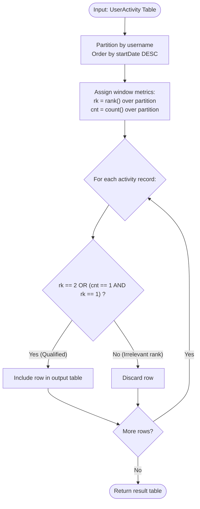

# Guided Example: Get the Second Most Recent Activity

We trace the step-by-step execution of the relational window ranking and conditional fallback algorithm on a representative database instance:

- **Input Table:**
  `UserActivity` containing $4$ records across $2$ distinct users (`Alice`, `Bob`):
  ```
  Alice | Travel  | 2020-02-12 | 2020-02-20
  Alice | Dancing | 2020-02-21 | 2020-02-23
  Alice | Travel  | 2020-02-24 | 2020-02-28
  Bob   | Travel  | 2020-02-11 | 2020-02-18
  ```
- **Required Output:**
  ```
  username | activity | startDate  | endDate
  Alice    | Dancing  | 2020-02-21 | 2020-02-23
  Bob      | Travel   | 2020-02-11 | 2020-02-18
  ```

This instance is chosen because it explicitly exercises both the primary rule (Alice has three activities and her second most recent is selected) and the boundary fallback rule (Bob has only one activity, which must be returned despite not being a second activity).

---

## 1. Instance & Teaching Goal

We are given a database table `UserActivity` with columns `username`, `activity`, `startDate`, and `endDate`. Each user participates in non-overlapping activities over time.
Our goal is to display the **second most recent** activity of every user. If a user has performed only one activity in total, we must display that single activity instead.

For our input data:
- Alice has $3$ activities ordered chronologically descending by `startDate`:
  1. Travel (`2020-02-24` to `2020-02-28`) — Rank 1 (Most Recent)
  2. Dancing (`2020-02-21` to `2020-02-23`) — Rank 2 (Second Most Recent)
  3. Travel (`2020-02-12` to `2020-02-20`) — Rank 3 (Oldest)
  For Alice, we select the Rank 2 record: Dancing.
- Bob has only $1$ activity:
  1. Travel (`2020-02-11` to `2020-02-18`) — Rank 1, Total Count = 1.
  Since Bob has no second activity, we fall back to his only activity: Travel.

The primary learning goal is to model partitioned chronological ordering using analytic window functions, defining a unified predicate that seamlessly handles both multi-activity users and single-activity users.

---

## 2. Conceptual Foundation & Invariants

Let $R$ denote the `UserActivity` table. We partition the relation by `username` and evaluate two analytic window properties for every row:
1. **Chronological Rank ($rk$):** The dense rank of the activity ordered by `startDate` descending:
   $$
   rk = \text{rank}() \text{ over (partition by username order by startDate desc)}
   $$
2. **Activity Cardinality ($cnt$):** The total number of activities performed by that user:
   $$
   cnt = \text{count}() \text{ over (partition by username)}
   $$

The selection predicate evaluates:
$$
\text{Condition}(rk, cnt) = (rk = 2) \lor (cnt = 1 \land rk = 1)
$$

```
Alice's Partition (cnt = 3):
  Rank 1: 2020-02-24 (Travel)  -> rk=1 != 2 and cnt != 1 -> Discard
  Rank 2: 2020-02-21 (Dancing) -> rk=2                  -> RETAIN!
  Rank 3: 2020-02-12 (Travel)  -> rk=3 != 2 and cnt != 1 -> Discard

Bob's Partition (cnt = 1):
  Rank 1: 2020-02-11 (Travel)  -> rk=1 and cnt=1        -> RETAIN! (Fallback)
```

We track state using the following parameters:

| State Parameter | Description | Initial Value |
|---|---|---|
| User Partition ($u$) | Independent evaluation group per `username` | Alice, Bob |
| Recency Rank ($rk$) | Ordinal rank where $1$ is newest start date | Evaluated per partition |
| Partition Total ($cnt$) | Total number of activity intervals for user $u$ | Count of user records |
| Filtered Relation | Subset of tuples satisfying selection predicate | Emitted to output |

> **Invariant.** For every distinct user $u$, exactly one activity row is admitted to the result: if user $u$ has at least two activities ($cnt \ge 2$), the unique activity with $rk = 2$ is chosen; if user $u$ has exactly one activity ($cnt = 1$), the unique activity with $rk = 1$ is chosen.

---

## 3. Step-by-Step Worked Execution

### Step 1: Partitioning and Window Attribute Computation

Group rows by `username` and sort within each group by `startDate` descending:

1. **Partition `Alice`:**
   - Row 1: Travel, `2020-02-24` $\implies rk = 1, cnt = 3$
   - Row 2: Dancing, `2020-02-21` $\implies rk = 2, cnt = 3$
   - Row 3: Travel, `2020-02-12` $\implies rk = 3, cnt = 3$
2. **Partition `Bob`:**
   - Row 4: Travel, `2020-02-11` $\implies rk = 1, cnt = 1$

| `username` | `activity` | `startDate` | `endDate` | Rank ($rk$) | Count ($cnt$) |
|---|---|---|---|---|---|
| Alice | Travel | `2020-02-24` | `2020-02-28` | $1$ | $3$ |
| Alice | Dancing | `2020-02-21` | `2020-02-23` | $2$ | $3$ |
| Alice | Travel | `2020-02-12` | `2020-02-20` | $3$ | $3$ |
| Bob | Travel | `2020-02-11` | `2020-02-18` | $1$ | $1$ |

---

### Step 2: Evaluating the Selection Predicate for Alice

Evaluate $\text{Condition}(rk, cnt)$ across Alice's rows ($cnt = 3$):
- **Row 1 (Travel, $rk = 1$):**
  - Is $rk = 2$? False.
  - Is $cnt = 1$? False ($cnt = 3$).
  - Decision: Exclude.
- **Row 2 (Dancing, $rk = 2$):**
  - Is $rk = 2$? **True**.
  - Decision: **Retain in output**.
- **Row 3 (Travel, $rk = 3$):**
  - Is $rk = 2$? False.
  - Is $cnt = 1$? False.
  - Decision: Exclude.

Alice's output tuple is `["Alice", "Dancing", "2020-02-21", "2020-02-23"]`.

| Candidate Row | $rk$ | $cnt$ | Predicate: $rk=2 \lor (cnt=1 \land rk=1)$ | Output Action |
|---|---|---|---|---|
| Travel (`2020-02-24`) | $1$ | $3$ | False | Discarded |
| **Dancing (`2020-02-21`)** | **$2$** | **$3$** | **True ($rk = 2$)** | **Selected** |
| Travel (`2020-02-12`) | $3$ | $3$ | False | Discarded |

---

### Step 3: Evaluating the Selection Predicate for Bob

Evaluate $\text{Condition}(rk, cnt)$ across Bob's rows ($cnt = 1$):
- **Row 4 (Travel, $rk = 1$):**
  - Is $rk = 2$? False (Bob has no second activity).
  - Is $cnt = 1 \land rk = 1$? **True** ($cnt = 1$ and $rk = 1$).
  - Decision: **Retain in output via single-activity fallback**.

Bob's output tuple is `["Bob", "Travel", "2020-02-11", "2020-02-18"]`.

| Candidate Row | $rk$ | $cnt$ | Predicate: $rk=2 \lor (cnt=1 \land rk=1)$ | Output Action |
|---|---|---|---|---|
| **Travel (`2020-02-11`)** | **$1$** | **$1$** | **True ($cnt = 1 \land rk = 1$)** | **Selected (Fallback)** |

---

## 4. Complete Execution Trace

Summary of all candidate rows and final resolution:

| `username` | `activity` | Date Range | Window Rank ($rk$) | Partition Size ($cnt$) | Qualification Reason | Selected? |
|---|---|---|---|---|---|---|
| Alice | Travel | Feb 24 – Feb 28 | $1$ | $3$ | Most recent (needs second) | No |
| **Alice** | **Dancing** | **Feb 21 – Feb 23** | **$2$** | **$3$** | **Second most recent activity** | **Yes** |
| Alice | Travel | Feb 12 – Feb 20 | $3$ | $3$ | Oldest activity | No |
| **Bob** | **Travel** | **Feb 11 – Feb 18** | **$1$** | **$1$** | **Single activity fallback** | **Yes** |

---

## 5. Algorithmic Correctness & Complexity Derivation

### Uniqueness and Non-Overlapping Invariance

The problem statement guarantees that no user participates in overlapping activities simultaneously. Therefore, within any user partition, all `startDate` values are strictly distinct.
This implies:
1. Dense ranking by `startDate DESC` produces a strictly unique rank $rk \in \{1, 2, \dots, cnt\}$ for every activity of that user.
2. If $cnt \ge 2$, exactly one row has $rk = 2$, and no row has $cnt = 1$, ensuring exactly one row is chosen.
3. If $cnt = 1$, no row has $rk = 2$, and exactly one row has $cnt = 1 \land rk = 1$, ensuring exactly one row is chosen.

Thus, every user is represented exactly once in the final result.

### Asymptotic Complexity

- **Time Complexity:** $\mathcal{O}(N \log N)$ where $N$ is the number of rows in `UserActivity`. Partitioning by `username` and sorting activities within each partition by date takes $\mathcal{O}(N \log N)$ time. The subsequent filter and projection require a single pass $\mathcal{O}(N)$ over the partitioned stream.
- **Auxiliary Space Complexity:** $\mathcal{O}(N)$ to store window rank and count annotations.

---

## 6. Traps & Edge Cases

- **Users with Exactly Two Activities:** If a user has two activities ($cnt = 2$), the older activity has $rk = 2$ and is correctly selected, while the fallback condition $cnt = 1$ remains inactive.
- **Omitting Single-Activity Users:** A query filtering solely on $rk = 2$ fails on users like Bob who only have one activity. The compound predicate or a conditional coalescing mechanism is essential.
- **Date Sorting Direction:** Activities must sort in **descending** order of `startDate` so that the latest activity receives rank $1$ and the second most recent receives rank $2$. Ascending sort would select the second oldest activity.
- **Result Ordering:** Output rows may be returned in any order.

---

## 7. Accessible Mermaid Diagram


