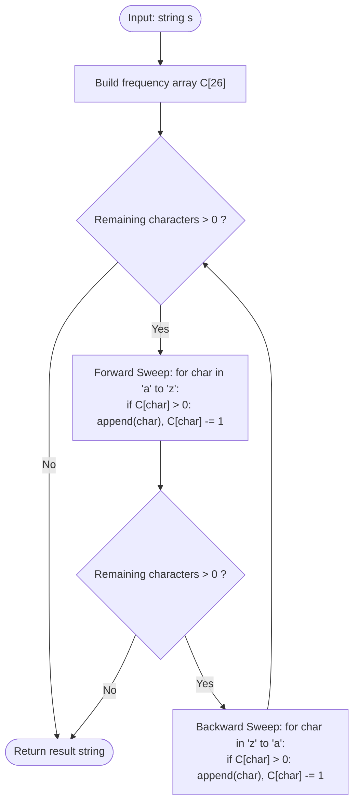

# Guided Example: Increasing Decreasing String

We trace the step-by-step execution of the optimal bidirectional frequency sweeping algorithm on a representative problem instance:

- **Input:** `s = "aaaabbbbcccc"`
- **Required output:** `"abccbaabccba"`

This instance is chosen because each of the three distinct characters has an identical frequency of $4$, producing multiple full bidirectional cycles and demonstrating how equal characters can appear consecutively across the turnaround boundary between increasing and decreasing phases.

---

## 1. Instance & Teaching Goal

Given a string `s`, we must reorder its characters using a repeated six-step procedure:
1. Pick the smallest remaining character and append it.
2. Pick the smallest remaining character strictly greater than the last appended character and append it. Repeat until no greater character exists (Forward Increasing Sweep).
3. Pick the largest remaining character and append it.
4. Pick the largest remaining character strictly smaller than the last appended character and append it. Repeat until no smaller character exists (Backward Decreasing Sweep).
5. Repeat until all characters in `s` have been used.

For `s = "aaaabbbbcccc"` (length $12$, counts: `'a': 4, 'b': 4, 'c': 4`):
- Cycle 1 Forward (increasing): picks `'a'`, `'b'`, `'c'` $\to$ `"abc"` (remaining: $3$ each).
- Cycle 1 Backward (decreasing): picks `'c'`, `'b'`, `'a'` $\to$ `"abccba"` (remaining: $2$ each).
- Cycle 2 Forward (increasing): picks `'a'`, `'b'`, `'c'` $\to$ `"abccbaabc"` (remaining: $1$ each).
- Cycle 2 Backward (decreasing): picks `'c'`, `'b'`, `'a'` $\to$ `"abccbaabccba"` (remaining: $0$ each).
- Total characters gathered: $12$. Process terminates.

The primary learning goal is to replace repeated string searches with static array sweeps across the $26$-letter alphabet, showing that visiting frequencies from `'a'` to `'z'` and then `'z'` to `'a'` naturally enforces the "strictly greater" and "strictly smaller" selection rules.

---

## 2. Conceptual Foundation & Invariants

Let $C \in \mathbb{N}^{26}$ be the character frequency array of `s`.
Because there are only $26$ lowercase English letters:
1. An increasing phase is simulated by iterating index $i$ from $0$ to $25$ (`'a'` to `'z'`). If $C[i] > 0$, we append character $i$ and decrement $C[i] \gets C[i] - 1$. Since $i$ increases strictly monotonically, every emitted character is strictly greater than the preceding one in this phase.
2. A decreasing phase is simulated symmetrically by iterating index $i$ from $25$ down to $0$ (`'z'` to `'a'`). If $C[i] > 0$, we append character $i$ and decrement $C[i] \gets C[i] - 1$. Every emitted character is strictly smaller than the preceding one in this phase.

```
Alphabet Trajectory:
Forward:   a ---> b ---> c
                         | (Turnaround allows adjacent 'c')
Backward:  a <--- b <--- c
           |
Forward:   a ---> b ---> c
                         |
Backward:  a <--- b <--- c
```

We track state using the following parameters:

| State Parameter | Description | Initial Value |
|---|---|---|
| Frequency Array ($C$) | Unused counts of characters `'a'` through `'z'` | $C[\text{'a'}]=4, C[\text{'b'}]=4, C[\text{'c'}]=4$ |
| Result Buffer ($\text{ans}$) | Accumulated output string | `""` |
| Phase Direction | Forward (`'a'` to `'z'`) vs Backward (`'z'` to `'a'`) | Starts Forward |
| Remaining Characters | Total elements left to place ($\sum C[i]$) | $12$ |

> **Invariant.** Within any forward phase, characters are appended in strictly ascending alphabetical order. Within any backward phase, characters are appended in strictly descending alphabetical order. Each character occurrence in `s` is placed exactly once.

---

## 3. Step-by-Step Worked Execution

### Step 0: Frequency Vector Initialization

Count occurrences across lowercase English letters:
- $C[\text{'a'}] = 4$
- $C[\text{'b'}] = 4$
- $C[\text{'c'}] = 4$
- All other letters: $0$
- Output buffer: `ans = ""`

| Character | Initial Count |
|---|---|
| `'a'` | $4$ |
| `'b'` | $4$ |
| `'c'` | $4$ |
| `'d'` through `'z'` | $0$ |

---

### Step 1: Cycle 1 — Forward Sweep (`'a'` to `'z'`)

Iterate ascending through alphabet:
- At `'a'`: $C[\text{'a'}] = 4 > 0 \implies$ append `'a'`, $C[\text{'a'}] \gets 3$.
- At `'b'`: $C[\text{'b'}] = 4 > 0 \implies$ append `'b'`, $C[\text{'b'}] \gets 3$.
- At `'c'`: $C[\text{'c'}] = 4 > 0 \implies$ append `'c'`, $C[\text{'c'}] \gets 3$.
- Letters `'d'` through `'z'`: all zero, skipped.
- Buffer after phase: `"abc"`. Remaining characters: $9$.

| Emitted Char | Phase | Updated Count | Current Buffer |
|---|---|---|---|
| `'a'` | Forward 1 | $C[\text{'a'}] = 3$ | `"a"` |
| `'b'` | Forward 1 | $C[\text{'b'}] = 3$ | `"ab"` |
| `'c'` | Forward 1 | $C[\text{'c'}] = 3$ | `"abc"` |

---

### Step 2: Cycle 1 — Backward Sweep (`'z'` to `'a'`)

Iterate descending through alphabet:
- Letters `'z'` down to `'d'`: all zero, skipped.
- At `'c'`: $C[\text{'c'}] = 3 > 0 \implies$ append `'c'`, $C[\text{'c'}] \gets 2$.
- At `'b'`: $C[\text{'b'}] = 3 > 0 \implies$ append `'b'`, $C[\text{'b'}] \gets 2$.
- At `'a'`: $C[\text{'a'}] = 3 > 0 \implies$ append `'a'`, $C[\text{'a'}] \gets 2$.
- Buffer after phase: `"abccba"`. Remaining characters: $6$.

| Emitted Char | Phase | Updated Count | Current Buffer |
|---|---|---|---|
| `'c'` | Backward 1 | $C[\text{'c'}] = 2$ | `"abcc"` |
| `'b'` | Backward 1 | $C[\text{'b'}] = 2$ | `"abccb"` |
| `'a'` | Backward 1 | $C[\text{'a'}] = 2$ | `"abccba"` |

---

### Step 3: Cycle 2 — Forward and Backward Sweeps

Repeat the full cycle on remaining frequencies ($C[\text{'a'}]=2, C[\text{'b'}]=2, C[\text{'c'}]=2$):

1. **Forward Sweep 2:**
   - Appends `'a'`, `'b'`, `'c'`.
   - Remaining counts: $C[\text{'a'}]=1, C[\text{'b'}]=1, C[\text{'c'}]=1$.
   - Buffer: `"abccbaabc"`.
2. **Backward Sweep 2:**
   - Appends `'c'`, `'b'`, `'a'`.
   - Remaining counts: $C[\text{'a'}]=0, C[\text{'b'}]=0, C[\text{'c'}]=0$.
   - Buffer: `"abccbaabccba"`.

Total characters placed: $12 = |s|$. All counts zero. Execution terminates.

| Sweep Phase | Characters Appended | Buffer State | Remaining |
|---|---|---|---|
| Forward 2 | `'a', 'b', 'c'` | `"abccbaabc"` | $3$ |
| Backward 2 | `'c', 'b', 'a'` | **`"abccbaabccba"`** | **$0$** |

---

## 4. Complete Execution Trace

Summary of all sweeps until exhaustion:

| Sweep Index | Direction | Range Scanned | Chars Emitted | Buffer After Sweep | Remaining Total |
|---|---|---|---|---|---|
| 1 | Forward | `'a' \to 'z'` | `abc` | `"abc"` | $9$ |
| 2 | Backward | `'z' \to 'a'` | `cba` | `"abccba"` | $6$ |
| 3 | Forward | `'a' \to 'z'` | `abc` | `"abccbaabc"` | $3$ |
| 4 | Backward | `'z' \to 'a'` | `cba` | **`"abccbaabccba"`** | **$0$** |

---

## 5. Algorithmic Correctness & Complexity Derivation

### Monotonic Phase Guarantee

1. In the forward pass, scanning letter codes $0, 1, \dots, 25$ ensures that any chosen character $c_{k}$ appears strictly after $c_{k-1}$ in the alphabet, guaranteeing $c_{k} > c_{k-1}$.
2. In the backward pass, scanning letter codes $25, 24, \dots, 0$ ensures $c_{k} < c_{k-1}$.
3. Because each letter position is visited at most once per pass, no letter can be duplicated within the same pass.
4. Consecutive duplicate letters can occur only at turnaround points (e.g. forward ends on `'c'` and backward begins on `'c'`), which is fully compliant with the problem rules.

### Asymptotic Complexity

- Let $N = |s|$ and $|\Sigma| = 26$.
- Building the frequency array $C$ requires $\mathcal{O}(N)$ time.
- In each full cycle (one forward and one backward sweep), at least $1$ character is consumed as long as $N > 0$. The maximum number of sweeps is $2 \times \max_{c}(C[c]) \le 2N$.
- Each sweep checks $26$ fixed character buckets. Total sweep time is $\mathcal{O}(26 \cdot \text{cycles}) = \mathcal{O}(N)$.
- **Total Time Complexity:** $\mathcal{O}(N)$.
- **Auxiliary Space Complexity:** $\mathcal{O}(|\Sigma|) = \mathcal{O}(1)$ for the $26$ frequency buckets.

---

## 6. Traps & Edge Cases

- **Turnaround Duplication:** Notice `"abccba"` has two adjacent `'c'` characters. This is not a violation: the first `'c'` concludes the forward sweep, and the second `'c'` begins the backward sweep.
- **Uneven Frequencies:** For strings with non-uniform counts (such as `"leetcode"`), letters with higher counts survive into later sweeps while exhausted letters are seamlessly bypassed when their count hits $0$.
- **All Identical Characters:** For `s = "aaaa"`, each sweep (forward or backward) picks only one `'a'`. Four alternating sweeps each take one `'a'`, returning `"aaaa"`.
- **Pre-sorted Strings:** Input already sorted in alphabetical order behaves identically under the frequency array formulation.

---

## 7. Accessible Mermaid Diagram


