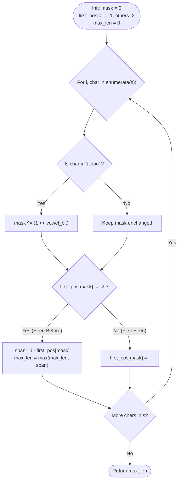

# Guided Example: Find the Longest Substring Containing Vowels in Even Counts

We trace the step-by-step execution of the optimal prefix parity bitmask algorithm on a representative problem instance:

- **Input:** `s = "eleetminicoworoep"`
- **Required output:** `13`
- **Optimal Substring:** `"leetminicowor"` ($s[1 \dots 13]$)

This instance is chosen because it features alternating vowel occurrences, multiple distinct vowels (`'e'`, `'i'`, `'o'`), and an identical non-zero parity mask at indices $0$ and $13$, demonstrating how earlier prefix states cancel to produce an all-even interior substring.

---

## 1. Instance & Teaching Goal

Given a string `s`, we must find the maximum length of a contiguous substring containing each of the five vowels (`'a'`, `'e'`, `'i'`, `'o'`, `'u'`) an even number of times ($0, 2, 4, \dots$). Consonant frequencies are unrestricted.

For `s = "eleetminicoworoep"` (length $17$):
- The longest valid substring spans index $1$ to index $13$: `"leetminicowor"` of length $13 - 1 + 1 = 13$.
- In `"leetminicowor"`:
  - `'a'` appears $0$ times (even)
  - `'e'` appears $2$ times (even)
  - `'i'` appears $2$ times (even)
  - `'o'` appears $2$ times (even)
  - `'u'` appears $0$ times (even)
- Every vowel appears with even frequency.

The primary teaching goal is to reduce multi-counter parity tracking to a 5-bit binary mask, proving that a substring $s[j + 1 \dots i]$ has all-even vowel counts if and only if the prefix parity mask at index $i$ exactly matches the prefix parity mask at index $j$.

---

## 2. Conceptual Foundation & Invariants

Because we only care whether vowel counts are even or odd, each vowel's state is a single bit in $\mathbb{Z}_2$:
- Bit $0$: `'a'` ($1 \ll 0 = 1$)
- Bit $1$: `'e'` ($1 \ll 1 = 2$)
- Bit $2$: `'i'` ($1 \ll 2 = 4$)
- Bit $3$: `'o'` ($1 \ll 3 = 8$)
- Bit $4$: `'u'` ($1 \ll 4 = 16$)

Let $M[i]$ denote the 5-bit parity mask of prefix $s[0 \dots i]$. When reading character $s[i]$:
- If $s[i]$ is vowel $v$, $M[i] = M[i - 1] \oplus (1 \ll \text{bit}(v))$.
- If $s[i]$ is a consonant, $M[i] = M[i - 1]$.

For any substring $s[j + 1 \dots i]$:
$$
\text{vowel\_parity}(s[j + 1 \dots i]) = M[i] \oplus M[j]
$$
Every vowel count in $s[j + 1 \dots i]$ is even if and only if $M[i] \oplus M[j] = 0$, which is equivalent to:
$$
M[i] = M[j]
$$

```
Index:    0   1   2   3   4   5   6   7   8   9  10  11  12  13  14  15  16
Chars:    e   l   e   e   t   m   i   n   i   c   o   w   o   r   o   e   p
Mask M:   2   2   0   2   2   2   6   6   2   2  10  10   2   2  10   8   8

Matching state: M[0] = 2 and M[13] = 2
Subarray from index 0+1 to 13: s[1..13] = "leetminicowor" (length = 13 - 0 = 13)
```

To maximize length $i - j$, we store only the **earliest seen occurrence** of each mask in an array `first_pos[32]`. We initialize `first_pos[0] = -1` (representing the empty prefix before the string begins) and all other entries to $-2$ (unseen).

| State Parameter | Description | Initial Value |
|---|---|---|
| Running Mask ($M$) | 5-bit vowel parity integer in $[0, 31]$ | $0$ (`00000_2`) |
| Earliest Index Map | First index where each mask was observed | `first_pos[0] = -1`, others $-2$ |
| Global Maximum | Maximum length of a valid substring found | $0$ |

> **Invariant.** For any mask $m \in [0, 31]$, `first_pos[m]` stores the strictly earliest prefix index that produced parity configuration $m$. For any subsequent index $i$ where $M[i] = m$, the substring $s[\text{first\_pos}[m] + 1 \dots i]$ is guaranteed to have all-even vowel counts, and no earlier starting point can produce a longer valid substring ending at $i$.

---

## 3. Step-by-Step Worked Execution

### Step 1: Initialization and First Characters ($i = 0 \dots 3$)

- Initialize: $M = 0$, `first_pos[0] = -1`, $\text{max\_len} = 0$.
- **$i = 0$, $s[0] = \text{'e'}$:**
  - Vowel `'e'` flips bit $1$: $M = 0 \oplus 2 = 2$ (`00010_2`).
  - $M = 2$ is unseen. Record `first_pos[2] = 0`.
- **$i = 1$, $s[1] = \text{'l'}$:**
  - Consonant: $M = 2$ remains unchanged.
  - $M = 2$ seen at $0$. Valid substring $s[1 \dots 1]$: length $1 - 0 = 1$. Max $\gets 1$.
- **$i = 2$, $s[2] = \text{'e'}$:**
  - Vowel `'e'` flips bit $1$: $M = 2 \oplus 2 = 0$ (`00000_2`).
  - $M = 0$ seen at $-1$. Valid substring $s[0 \dots 2] = \text{"ele"}$: length $2 - (-1) = 3$. Max $\gets 3$.
- **$i = 3$, $s[3] = \text{'e'}$:**
  - Vowel `'e'` flips bit $1$: $M = 0 \oplus 2 = 2$.
  - $M = 2$ seen at $0$. Valid substring $s[1 \dots 3] = \text{"lee"}$: length $3 - 0 = 3$. Max remains $3$.

| Index ($i$) | Character | Vowel? | Bit Flipped | Running Mask ($M$) | Seen At | Valid Substring Length | $\text{max\_len}$ |
|---|---|---|---|---|---|---|---|
| Init | — | — | — | $0$ (`00000_2`) | $-1$ | — | $0$ |
| $0$ | `'e'` | Yes | Bit $1$ ($2$) | $2$ (`00010_2`) | First seen ($0$) | — | $0$ |
| $1$ | `'l'` | No | None | $2$ (`00010_2`) | $0$ | $1 - 0 = 1$ | $1$ |
| $2$ | `'e'` | Yes | Bit $1$ ($2$) | $0$ (`00000_2`) | $-1$ | $2 - (-1) = 3$ | $3$ |
| $3$ | `'e'` | Yes | Bit $1$ ($2$) | $2$ (`00010_2`) | $0$ | $3 - 0 = 3$ | $3$ |

---

### Step 2: Processing Intermediate Segment ($i = 4 \dots 9$)

- $i = 4, \text{'t'}$, $i = 5, \text{'m'}$: Consonants. $M = 2$. Seen at $0$. Length $5 - 0 = 5 \implies \text{max\_len} \gets 5$.
- $i = 6, \text{'i'}$: Vowel `'i'` flips bit $2$ ($4$): $M = 2 \oplus 4 = 6$ (`00110_2`). Unseen $\implies \text{first\_pos}[6] = 6$.
- $i = 7, \text{'n'}$: Consonant: $M = 6$. Seen at $6 \implies 7 - 6 = 1$.
- $i = 8, \text{'i'}$: Vowel `'i'` flips bit $2$ ($4$): $M = 6 \oplus 4 = 2$.
  - $M = 2$ seen at $0$. Valid substring $s[1 \dots 8] = \text{"leetmini"}$: length $8 - 0 = 8 \implies \text{max\_len} \gets 8$.
- $i = 9, \text{'c'}$: Consonant: $M = 2$. Seen at $0 \implies 9 - 0 = 9 \implies \text{max\_len} \gets 9$.

| Index ($i$) | Character | Running Mask ($M$) | Action on First Position Map | Substring Length | Running Max |
|---|---|---|---|---|---|
| $4$ | `'t'` | $2$ (`00010_2`) | Match index $0$ | $4 - 0 = 4$ | $5$ |
| $5$ | `'m'` | $2$ (`00010_2`) | Match index $0$ | $5 - 0 = 5$ | **$5$** |
| $6$ | `'i'` | $6$ (`00110_2`) | First seen at $6$ | — | $5$ |
| $7$ | `'n'` | $6$ (`00110_2`) | Match index $6$ | $7 - 6 = 1$ | $5$ |
| $8$ | `'i'` | $2$ (`00010_2`) | Match index $0$ | $8 - 0 = 8$ | **$8$** |
| $9$ | `'c'` | $2$ (`00010_2`) | Match index $0$ | $9 - 0 = 9$ | **$9$** |

---

### Step 3: Reaching the Maximal Substring at $i = 13$

- $i = 10, \text{'o'}$: Vowel `'o'` flips bit $3$ ($8$): $M = 2 \oplus 8 = 10$ (`01010_2`). Unseen $\implies \text{first\_pos}[10] = 10$.
- $i = 11, \text{'w'}$: Consonant: $M = 10$. Seen at $10 \implies 11 - 10 = 1$.
- $i = 12, \text{'o'}$: Vowel `'o'` flips bit $3$ ($8$): $M = 10 \oplus 8 = 2$.
  - $M = 2$ seen at $0 \implies 12 - 0 = 12 \implies \text{max\_len} \gets 12$.
- $i = 13, \text{'r'}$: Consonant: $M = 2$.
  - $M = 2$ seen at $0$. Valid substring $s[1 \dots 13] = \text{"leetminicowor"}$.
  - Length: $13 - 0 = 13$.
  - Update: $\text{max\_len} \gets \max(12, 13) = 13$.

Subsequent indices:
- $i = 14, \text{'o'} \implies M = 10$ (seen at $10 \implies 14 - 10 = 4$).
- $i = 15, \text{'e'} \implies M = 10 \oplus 2 = 8$ (unseen $\implies \text{first\_pos}[8] = 15$).
- $i = 16, \text{'p'} \implies M = 8$ (seen at $15 \implies 16 - 15 = 1$).

Global maximum remains $13$.

| Index ($i$) | Character | Running Mask ($M$) | Earliest Match | Evaluated Span | Current Span Length | Global Max |
|---|---|---|---|---|---|---|
| $10$ | `'o'` | $10$ (`01010_2`) | First at $10$ | — | — | $9$ |
| $11$ | `'w'` | $10$ (`01010_2`) | $10$ | $s[11 \dots 11]$ | $1$ | $9$ |
| $12$ | `'o'` | $2$ (`00010_2`) | $0$ | $s[1 \dots 12]$ | $12$ | $12$ |
| **$13$** | **`'r'`** | **$2$ (`00010_2`)** | **$0$** | **$s[1 \dots 13]$** | **$13 - 0 = 13$** | **$13$** |
| $14$ | `'o'` | $10$ (`01010_2`) | $10$ | $s[11 \dots 14]$ | $4$ | $13$ |
| $15$ | `'e'` | $8$ (`01000_2`) | First at $15$ | — | — | $13$ |
| $16$ | `'p'` | $8$ (`01000_2`) | $15$ | $s[16 \dots 16]$ | $1$ | **$13$** |

---

## 4. Complete Execution Trace

Summary of the longest valid substrings discovered across state transitions:

| Mask Value | Meaning (Odd Parity Vowels) | Earliest Index Recorded | Latest Index Matched | Substring Identified | Substring Length |
|---|---|---|---|---|---|
| $0$ | None (All vowels even) | $-1$ | $2$ | $s[0 \dots 2] = \text{"ele"}$ | $3$ |
| **$2$** | **Vowel `'e'` only** | **$0$** | **$13$** | **$s[1 \dots 13] = \text{"leetminicowor"}$** | **$13$** |
| $6$ | Vowels `'e'` and `'i'` | $6$ | $7$ | $s[7 \dots 7] = \text{"n"}$ | $1$ |
| $10$ | Vowels `'e'` and `'o'` | $10$ | $14$ | $s[11 \dots 14] = \text{"woro"}$ | $4$ |
| $8$ | Vowel `'o'` only | $15$ | $16$ | $s[16 \dots 16] = \text{"p"}$ | $1$ |

Maximum length achieved: **$13$**.

---

## 5. Algorithmic Correctness & Complexity Derivation

### Parity Invariance via XOR Sums

For each vowel $v$, let $c_v(i)$ be the count of occurrences of $v$ in prefix $s[0 \dots i]$. The parity of $v$ in $s[j + 1 \dots i]$ is:
$$
(c_v(i) - c_v(j)) \pmod 2 = (c_v(i) \pmod 2) \oplus (c_v(j) \pmod 2)
$$
This parity is $0$ (even) for all $5$ vowels simultaneously if and only if $M[i] \oplus M[j] = 0 \implies M[i] = M[j]$.

By recording the minimal index $j$ for each mask in `first_pos`, every query $i - j$ calculates the maximum possible substring length ending at index $i$. Scanning all $i \in [0, N - 1]$ exhaustively checks all valid right endpoints, guaranteeing global optimality.

### Asymptotic Complexity

- **Time Complexity:** $\mathcal{O}(N)$. The string of length $N$ is scanned once. At each character, bitwise operations and array lookups take $\mathcal{O}(1)$ time.
- **Auxiliary Space Complexity:** $\mathcal{O}(1)$. The state space is bounded by $2^5 = 32$ possible mask values. The `first_pos` array requires only $32$ integers.

---

## 6. Traps & Edge Cases

- **Sentinel Initialization:** Forgetting to set `first_pos[0] = -1` causes valid prefixes starting at index $0$ (where all vowels are even from the very start) to be missed or calculated with incorrect lengths.
- **Overwriting Earliest Positions:** `first_pos[m]` must **never** be updated when mask $m$ is seen again. Overwriting with the newer index would shrink the measured substring span.
- **Strings with No Vowels:** If the string contains only consonants (e.g. `"bcbcbc"`), $M$ remains $0$ throughout. At index $N - 1$, length is $(N - 1) - (-1) = N$, correctly returning the entire string.
- **Vowel Bit Allocation:** Any bijective assignment of the $5$ vowels to $5$ bit positions is valid.

---

## 7. Accessible Mermaid Diagram


