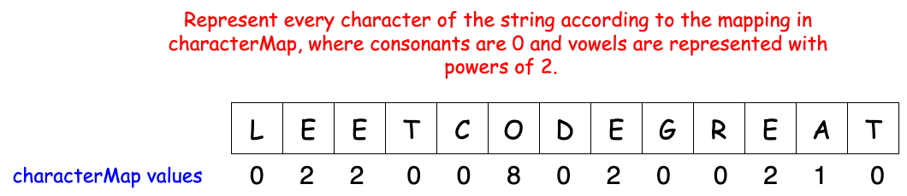
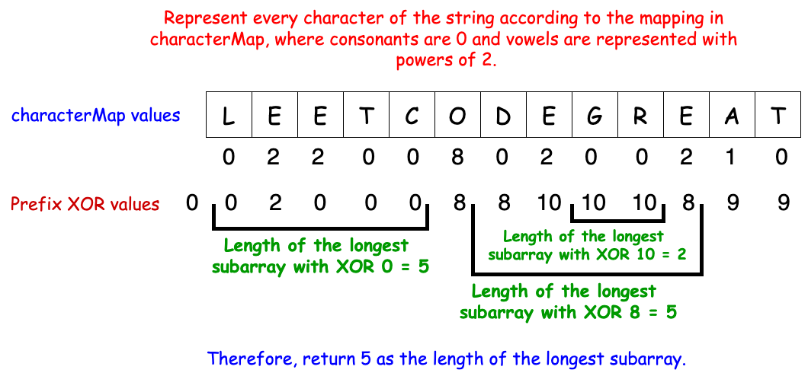

[TOC]

## Solution

---

### Approach: Bitmasking

#### Intuition

Given a string `s`, we need to find the length of the longest substring in which any vowel present must appear an even number of times. A brute force approach would involve iterating through every substring and counting vowels, but this would result in a Time Limit Exceeded (TLE). Instead, we need to think of a more efficient solution, aiming for a linear or log-linear time complexity.

Observe that we don't need to know the exact count of the vowels to solve this problem; we only need to know the parity of each vowel (whether it appears an even or odd number of times). The parity of each vowel can be stored in a boolean or bit, where `0` means even and `1` means odd. We need five bits to track the parity of all five vowels (a, e, i, o, u), resulting in $2^{5}$ = 32 possible states.

We can assign the first bit to `a`, the second to `e`, and so on. The state of the vowels can be represented as a binary string. For instance, `00000` means all vowels have even counts, while `10000` means only `a` has an odd count.
By converting these binary states to integers, we can assign values to the vowels: $a = 1$, $e = 2$, $i = 4$, $o = 8$, and $u = 16$. If both `a` and `i` have odd counts, their total value would be $1 + 4 = 5$. A total value of `0` means all vowels have even counts.



To find substrings with even vowels, we can use the XOR operator to update and track the parity of the vowels. If a vowel appears an even number of times, the result of XOR will be 0; if it appears an odd number of times, the result will be 1.

We compute a running XOR for each vowel as we traverse the string. To check for substrings with even vowels, we consider two cases:

1. If the current XOR value is `00000` (i.e., all vowels have even counts), the substring from the start of the string to the current position contains even vowels.
2. If the current XOR value has occurred before, the substring between the first occurrence of that XOR value and the current position also contains even vowels.



#### Algorithm

1. Initialize an integer variable `prefixXOR` and set it to 0.
2. Initialize a character array $\text{characterMap}[26]$ where specific vowel characters `('a', 'e', 'i', 'o', 'u')` have unique mask values `(1, 2, 4, 8, 16)`.
3. Initialize an array `mp` of size 32, where all elements are set to -1. This will store the index of the first occurrence of each `prefixXOR` value.
4. Initialize an integer variable `longestSubstring` and set it to `0`.
5. Iterate through each character in the string `s`:
- Update `prefixXOR` by XORing it with the mask value of the current character (from `characterMap`).
- If the current `prefixXOR` value is not found in `mp` and `prefixXOR` is not 0:
- Store the current index in `mp` at the position corresponding to `prefixXOR`.
- Update `longestSubstring` by comparing it with the difference between the current index and $\text{mp}[prefixXOR]$.
6. Return `longestSubstring` as the final result.

#### Implementation

```python
class Solution:
    def findTheLongestSubstring(self, s: str) -> int:
        prefixXOR = 0
        characterMap = [0] * 26
        characterMap[ord("a") - ord("a")] = 1
        characterMap[ord("e") - ord("a")] = 2
        characterMap[ord("i") - ord("a")] = 4
        characterMap[ord("o") - ord("a")] = 8
        characterMap[ord("u") - ord("a")] = 16
        mp = [-1] * 32
        longestSubstring = 0
        for i in range(len(s)):
            prefixXOR ^= characterMap[ord(s[i]) - ord("a")]
            if mp[prefixXOR] == -1 and prefixXOR != 0:
                mp[prefixXOR] = i
            longestSubstring = max(longestSubstring, i - mp[prefixXOR])
        return longestSubstring
```

#### Complexity Analysis

Let $m$ be the size of the given `s` string.

- Time complexity: $O(n)$

    We iterate through the string `s` exactly once. Apart from this, all operations are constant time. Therefore, the total time complexity is given by $O(max(m,n))$.

- Space complexity: $O(1)$

   Apart from the `characterMap` and `mp` array, no additional space is used to solve the problem. Therefore, the space complexity is given by $O(26) +$\mathcal{O}(32)$≈ O(1)$.

---