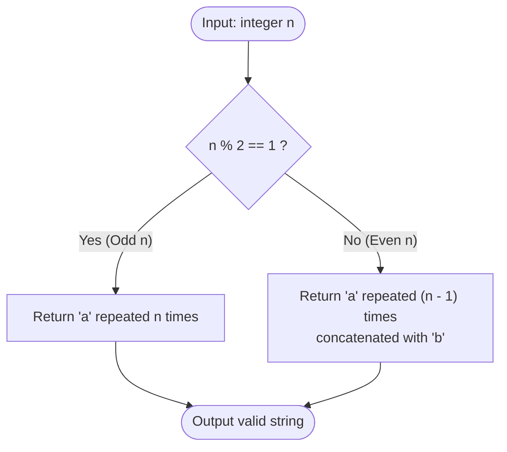

# Guided Example: Generate a String With Characters That Have Odd Counts

We trace the step-by-step execution of the optimal constructive parity-partitioning algorithm on a representative problem instance:

- **Input:** `n = 4`
- **Required output:** `"aaab"`

This instance is chosen because $n$ is even, demonstrating the necessity of partitioning the length into two distinct odd integer components ($(n - 1) + 1$) rather than using a single character.

---

## 1. Instance & Teaching Goal

Given an integer $n$, we must construct any string of length $n$ consisting of lowercase English letters such that **every distinct character** present in the string appears an odd number of times ($1, 3, 5, \dots$).

For $n = 4$:
- If we construct `"aaaa"`, the sole character `'a'` appears $4$ times. Since $4$ is even, this violates the constraint.
- If we partition $4 = 3 + 1$:
  - `'a'` appears $3$ times (odd).
  - `'b'` appears $1$ time (odd).
  - Combined string: `"aaab"`.
  - Length: $3 + 1 = 4$.
  - Both character frequencies are odd, fully satisfying the requirement.

The primary teaching goal is to formulate string construction via algebraic parity decomposition, proving that at most two distinct letters are sufficient for any positive integer $n$.

---

## 2. Conceptual Foundation & Invariants

Let $n \in \mathbb{Z}^+$. We examine the parity of $n$:
1. **Odd Case ($n \equiv 1 \pmod 2$):**
   A single distinct letter repeated $n$ times has frequency $n$. Since $n$ is odd, the string:
   $$
   S = \underbrace{\text{'a'} \dots \text{'a'}}_{n \text{ times}}
   $$
   contains only `'a'` with frequency $n$, which is odd.
2. **Even Case ($n \equiv 0 \pmod 2$):**
   We partition $n$ into the sum of two odd integers:
   $$
   n = (n - 1) + 1
   $$
   Because $n$ is even, $n - 1$ is guaranteed to be odd, and $1$ is odd. The string:
   $$
   S = \underbrace{\text{'a'} \dots \text{'a'}}_{n - 1 \text{ times}} + \text{'b'}
   $$
   contains `'a'` with odd frequency $n - 1$, and `'b'` with odd frequency $1$.

```
Parity Decomposition:
If n is odd:   [ a a a ... a ] (length n, frequency n is ODD)
If n is even:  [ a a a ... a ] [ b ] (length n - 1 is ODD, length 1 is ODD)
```

We track state using the following parameters:

| State Parameter | Description | Initial Value |
|---|---|---|
| Target Length ($n$) | Total number of characters to generate | $4$ |
| Parity ($n \pmod 2$) | Remainder modulo $2$ determining branch | $4 \pmod 2 = 0$ (Even) |
| Character 1 (`'a'`) Count | Frequency assigned to primary character | $n - 1 = 3$ |
| Character 2 (`'b'`) Count | Frequency assigned to secondary character | $1$ |

> **Invariant.** For any positive integer $n$, the constructed string has length exactly $n$, uses at most two distinct characters, and every distinct character present has an odd frequency $\ge 1$.

---

## 3. Step-by-Step Worked Execution

### Step 1: Evaluate Parity of $n$

- Input length: $n = 4$.
- Compute parity: $n \pmod 2 = 4 \pmod 2 = 0$.
- Parity classification: $n$ is **even**.
- Strategy selection: Apply two-character split $(n - 1) + 1$.

| Parameter | Value | Condition | Selected Action |
|---|---|---|---|
| Target Length ($n$) | $4$ | $n \pmod 2 = 0$ | Partition $n = (n - 1) + 1$ |

---

### Step 2: Determine Character Multiplicities

Calculate frequencies for primary and secondary characters:
- Frequency of `'a'`: $n - 1 = 4 - 1 = 3$.
  - Parity check: $3 \pmod 2 = 1$ (Odd). Valid.
- Frequency of `'b'`: $1$.
  - Parity check: $1 \pmod 2 = 1$ (Odd). Valid.
- Total length check: $3 + 1 = 4 = n$. Valid.

| Character | Target Multiplicity | Value | Parity Test | Status |
|---|---|---|---|---|
| `'a'` | $n - 1$ | $3$ | $3 \pmod 2 = 1$ (Odd) | Valid |
| `'b'` | $1$ | $1$ | $1 \pmod 2 = 1$ (Odd) | Valid |
| **Sum** | $(n - 1) + 1$ | **$4$** | **Matches $n$** | **Valid** |

---

### Step 3: Assemble Output String

Concatenate the determined components:
1. Repeat `'a'` three times: `"aaa"`.
2. Append `'b'` once: `"aaab"`.
3. Verify character set: only `'a'` and `'b'` appear.
4. Final string: `"aaab"`.

| Step | Operation | Resulting Substring |
|---|---|---|
| 1 | Repeat `'a'` $(n - 1)$ times | `"aaa"` |
| 2 | Append `'b'` $1$ time | `"aaab"` |
| **Final** | Length $4$, odd frequencies | **`"aaab"`** |

---

## 4. Complete Execution Trace

Summary of constructions across various values of $n$:

| Target Length ($n$) | Parity | Construction Strategy | Resulting String | Frequencies | All Odd? |
|---|---|---|---|---|---|
| $1$ | Odd | `'a' * 1` | `"a"` | `a: 1` | Yes |
| $2$ | Even | `'a' * 1 + 'b'` | `"ab"` | `a: 1, b: 1` | Yes |
| $3$ | Odd | `'a' * 3` | `"aaa"` | `a: 3` | Yes |
| **$4$** | **Even** | **`'a' * 3 + 'b'`** | **`"aaab"`** | **`a: 3, b: 1`** | **Yes** |
| $7$ | Odd | `'a' * 7` | `"aaaaaaa"` | `a: 7` | Yes |
| $8$ | Even | `'a' * 7 + 'b'` | `"aaaaaaab"` | `a: 7, b: 1` | Yes |

---

## 5. Algorithmic Correctness & Complexity Derivation

### Algebraic Partition Proof

The problem constraints specify that each character in the string must occur an odd number of times.
- Case 1 ($n$ is odd): The string $S = \text{'a'}^n$ contains only the character `'a'`. The frequency of `'a'` is $n$, which is odd. No other characters exist.
- Case 2 ($n$ is even): The string $S = \text{'a'}^{n-1}\text{'b'}^1$ contains two distinct characters: `'a'` with frequency $n - 1$, and `'b'` with frequency $1$. Since $n$ is even, $n - 1 = 2k - 1$ for some integer $k \ge 1$, which is odd. The frequency $1$ is odd.
The total length is $(n - 1) + 1 = n$.

In both cases, every character used has an odd frequency, and total length is $n$.

### Asymptotic Complexity

- **Time Complexity:** $\mathcal{O}(n)$. Generating a string of length $n$ requires writing $n$ characters into memory.
- **Auxiliary Space Complexity:** $\mathcal{O}(1)$. The algorithm requires no extra data structures beyond the output buffer.

---

## 6. Traps & Edge Cases

- **Smallest Input $n = 1$:** Since $1$ is odd, the formula yields `'a' * 1 = "a"`, correctly avoiding an empty or negative repeat.
- **Smallest Even Input $n = 2$:** Yields `'a' * 1 + 'b' = "ab"`, both with frequency $1$.
- **Attempting to Distribute Over 26 Letters:** Trying to partition $n$ across many alphabet letters introduces unnecessary complex modular arithmetic; two letters are always sufficient.
- **Valid Character Restriction:** The characters must be lowercase English letters; using `'a'` and `'b'` strictly obeys this constraint.

---

## 7. Accessible Mermaid Diagram


