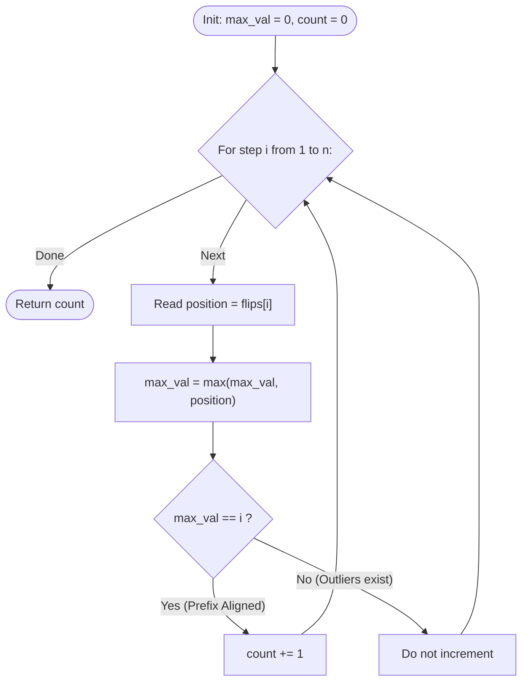

# Guided Example: Number of Times Binary String Is Prefix-Aligned

We trace the step-by-step execution of the optimal running-maximum invariant algorithm on a representative problem instance:

- **Input:** `flips = [3, 2, 4, 1, 5]`
- **Required output:** `2`

This instance is chosen because early flips occur out of sequence with gaps ($3, 2, 4$), preventing prefix alignment until step $4$ (when position $1$ fills the missing gap) and step $5$ (when the entire string becomes ones).

---

## 1. Instance & Teaching Goal

We start with a 1-indexed binary string of length $n$ initialized to all zeros: `"00000"`. In each step $i \in \{1, \dots, n\}$, we flip the bit at index $flips[i]$ from $0$ to $1$.
A binary string is **prefix-aligned** after step $i$ if all bits from position $1$ to $i$ are $1$ and all remaining bits from $i + 1$ to $n$ are $0$. We must count how many times during the $n$ operations the string achieves prefix alignment.

For `flips = [3, 2, 4, 1, 5]`:
- Step 1: Flip index $3 \implies$ `"00100"` (Positions $1..1$ are not all ones $\implies$ Not aligned)
- Step 2: Flip index $2 \implies$ `"01100"` (Positions $1..2$ are not all ones $\implies$ Not aligned)
- Step 3: Flip index $4 \implies$ `"01110"` (Positions $1..3$ are not all ones $\implies$ Not aligned)
- Step 4: Flip index $1 \implies$ `"11110"` (Positions $1..4$ are all ones $\implies$ **Aligned Moment 1**)
- Step 5: Flip index $5 \implies$ `"11111"` (Positions $1..5$ are all ones $\implies$ **Aligned Moment 2**)
- Total prefix-aligned moments: $2$.

The primary teaching goal is to recognize that physical string simulation can be bypassed entirely: because $flips$ is a permutation of $\{1, \dots, n\}$, the string is prefix-aligned at step $i$ if and only if the maximum flipped index up to step $i$ equals $i$.

---

## 2. Conceptual Foundation & Invariants

At step $i$ (1-indexed), exactly $i$ distinct bit positions have been flipped from $0$ to $1$.
Let $M_i = \max_{k=1}^i flips[k]$ be the maximum index flipped so far.

By the Pigeonhole Principle on permutations:
1. Since $i$ distinct positive integers have been flipped, the largest of these integers must be at least $i$ ($M_i \ge i$).
2. If $M_i > i$, then at least one bit outside the prefix $[1 \dots i]$ has been flipped. Consequently, not all $i$ ones can lie in $[1 \dots i]$, meaning the string cannot be prefix-aligned.
3. If $M_i = i$, all $i$ flipped indices are $\le i$. Because all $i$ indices are distinct positive integers in $\{1, \dots, i\}$, they must cover the set $\{1, 2, \dots, i\}$ completely. Therefore, every bit from $1$ to $i$ is $1$, and all subsequent bits remain $0$.

$$
\text{Prefix-Aligned at step } i \iff M_i = i
$$

```
Step 1: max = 3 != 1  -> [ . . 1 . . ]  (Gap at 1, 2)
Step 2: max = 3 != 2  -> [ . 1 1 . . ]  (Gap at 1)
Step 3: max = 4 != 3  -> [ . 1 1 1 . ]  (Gap at 1)
Step 4: max = 4 == 4  -> [ 1 1 1 1 . ]  (ALIGNED: 1..4 all ones)
Step 5: max = 5 == 5  -> [ 1 1 1 1 1 ]  (ALIGNED: 1..5 all ones)
```

We track state using the following parameters:

| State Parameter | Description | Initial Value |
|---|---|---|
| Step Counter ($i$) | Number of bits flipped so far (1-indexed) | $1$ |
| Flipped Index ($x$) | Position $flips[i]$ updated in current step | Scanned sequentially |
| Running Maximum ($M$) | $\max(M, x)$ across prefix of operations | $0$ |
| Aligned Count | Total number of steps where $M = i$ | $0$ |

> **Invariant.** After step $i$, exactly $i$ distinct bits are set to $1$. The condition $M_i = i$ is necessary and sufficient for the ones to occupy positions $1$ through $i$ contiguously without any gaps or external outliers.

---

## 3. Step-by-Step Worked Execution

### Step 1: Flipping Index $3$

- Step number: $i = 1$.
- Flipped position: $x = 3$.
- Update running maximum: $M = \max(0, 3) = 3$.
- Check alignment condition: Is $M = i$? Here $3 = 1$ is **False**.
- String state: `"00100"`.
- Aligned counter: $0$.

| Step ($i$) | Flipped ($x$) | Running Max ($M$) | Condition: $M == i$ | Status | Aligned Count |
|---|---|---|---|---|---|
| $1$ | $3$ | $3$ | $3 == 1$ (False) | Not aligned | $0$ |

---

### Step 2: Flipping Index $2$

- Step number: $i = 2$.
- Flipped position: $x = 2$.
- Update running maximum: $M = \max(3, 2) = 3$.
- Check alignment condition: Is $M = i$? Here $3 = 2$ is **False**.
- String state: `"01100"`.
- Aligned counter: $0$.

| Step ($i$) | Flipped ($x$) | Running Max ($M$) | Condition: $M == i$ | Status | Aligned Count |
|---|---|---|---|---|---|
| $2$ | $2$ | $3$ | $3 == 2$ (False) | Not aligned | $0$ |

---

### Step 3: Flipping Index $4$

- Step number: $i = 3$.
- Flipped position: $x = 4$.
- Update running maximum: $M = \max(3, 4) = 4$.
- Check alignment condition: Is $M = i$? Here $4 = 3$ is **False**.
- String state: `"01110"`.
- Aligned counter: $0$.

| Step ($i$) | Flipped ($x$) | Running Max ($M$) | Condition: $M == i$ | Status | Aligned Count |
|---|---|---|---|---|---|
| $3$ | $4$ | $4$ | $4 == 3$ (False) | Not aligned | $0$ |

---

### Step 4: Flipping Index $1$ (First Alignment)

- Step number: $i = 4$.
- Flipped position: $x = 1$.
- Update running maximum: $M = \max(4, 1) = 4$.
- Check alignment condition: Is $M = i$? Here $4 = 4$ is **True**!
- String state: `"11110"` (Bits $1, 2, 3, 4$ are all ones; bit $5$ is zero).
- Increment aligned counter: $0 + 1 = 1$.

| Step ($i$) | Flipped ($x$) | Running Max ($M$) | Condition: $M == i$ | Status | Aligned Count |
|---|---|---|---|---|---|
| $4$ | $1$ | $4$ | $4 == 4$ (**True**) | **Prefix Aligned** | **$1$** |

---

### Step 5: Flipping Index $5$ (Second Alignment)

- Step number: $i = 5$.
- Flipped position: $x = 5$.
- Update running maximum: $M = \max(4, 5) = 5$.
- Check alignment condition: Is $M = i$? Here $5 = 5$ is **True**!
- String state: `"11111"` (All bits are ones).
- Increment aligned counter: $1 + 1 = 2$.
- Final answer: $2$.

| Step ($i$) | Flipped ($x$) | Running Max ($M$) | Condition: $M == i$ | Status | Aligned Count |
|---|---|---|---|---|---|
| $5$ | $5$ | $5$ | $5 == 5$ (**True**) | **Prefix Aligned** | **$2$** |

---

## 4. Complete Execution Trace

Summary of all operations and alignment decisions:

| Step ($i$) | Flips ($flips[i]$) | Binary Representation | Active Maximum ($M$) | $M == i$? | Alignment Event | Cumulative Count |
|---|---|---|---|---|---|---|
| $1$ | $3$ | `"00100"` | $3$ | False | None | $0$ |
| $2$ | $2$ | `"01100"` | $3$ | False | None | $0$ |
| $3$ | $4$ | `"01110"` | $4$ | False | None | $0$ |
| **$4$** | **$1$** | **`"11110"`** | **$4$** | **True** | **Event 1 (Bits 1..4)** | **$1$** |
| **$5$** | **$5$** | **`"11111"`** | **$5$** | **True** | **Event 2 (Bits 1..5)** | **$2$** |

---

## 5. Algorithmic Correctness & Complexity Derivation

### Equivalence Proof

Let $S_i = \{ flips[1], flips[2], \dots, flips[i] \}$ be the set of indices flipped by step $i$.
Because $flips$ is a permutation of $\{1, \dots, n\}$, $|S_i| = i$.
- If $M_i = \max(S_i) = i$, then for all $x \in S_i$, $1 \le x \le i$.
- The only subset of $\{1, \dots, n\}$ of size $i$ whose elements are all $\le i$ is the set $\{1, 2, \dots, i\}$.
- Therefore, $S_i = \{1, 2, \dots, i\}$, which is the exact definition of a prefix-aligned string of length $i$.

Conversely, if the string is prefix-aligned, $S_i = \{1, \dots, i\}$, so $\max(S_i) = i$.
This proves equivalence.

### Asymptotic Complexity

- **Time Complexity:** $\mathcal{O}(n)$. The array of length $n$ is traversed once. At each step, updating the scalar maximum and performing an equality comparison takes $\mathcal{O}(1)$ time.
- **Auxiliary Space Complexity:** $\mathcal{O}(1)$. The algorithm requires only two scalar integer registers ($M$ and the result counter), avoiding memory allocation.

---

## 6. Traps & Edge Cases

- **One-Based vs Zero-Based Indexing:** Both the problem's bit positions and step counts are 1-indexed. Enumerating from $i = 1$ to $n$ directly matches array values without manual offsets.
- **Permutation Invariance:** The proof relies strictly on $flips$ being a permutation without duplicate elements.
- **Strictly Ascending Flips:** If $flips = [1, 2, 3, \dots, n]$, every step satisfies $M_i = i$, correctly returning $n$.
- **Strictly Descending Flips:** If $flips = [n, n - 1, \dots, 1]$, $M_i = n$ for all steps, so $M_i = i$ holds only at step $n$, correctly returning $1$.

---

## 7. Accessible Mermaid Diagram


