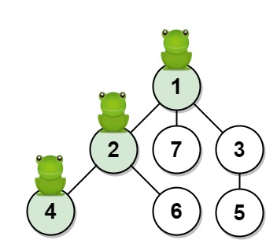
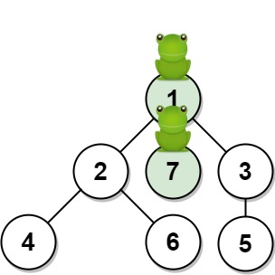

### 1. Description

Given an undirected tree consisting of `n` vertices numbered from `1` to `n`. A frog starts jumping from **vertex 1**. In one second, the frog jumps from its current vertex to another **unvisited** vertex if they are directly connected. The frog can not jump back to a visited vertex. In case the frog can jump to several vertices, it jumps randomly to one of them with the same probability. Otherwise, when the frog can not jump to any unvisited vertex, it jumps forever on the same vertex.

The edges of the undirected tree are given in the array `edges`, where $\text{edges}[i] = [a_{i}, b_{i}]$ means that exists an edge connecting the vertices $a_{i}$ and $b_{i}$.

*Return the probability that after `t` seconds the frog is on the vertex `target`. *Answers within $10^{-5}$ of the actual answer will be accepted.

### 2. Function Contract

- `n`: Input parameter.
- Returns expected result.

### 3. Examples

#### Example 1

- **Input:** $n = 7, edges = [[1,2],[1,3],[1,7],[2,4],[2,6],[3,5]], t = 2, target = 4$
- **Output:** `0.16666666666666666`
- **Explanation:** The figure above shows the given graph. The frog starts at vertex 1, jumping with 1/3 probability to the vertex 2 after **second 1** and then jumping with 1/2 probability to vertex 4 after **second 2**. Thus the probability for the frog is on the vertex 4 after 2 seconds is 1/3 * 1/2 = 1/6 = 0.16666666666666666.
#### Example 2

**

**

- **Input:** $n = 7, edges = [[1,2],[1,3],[1,7],[2,4],[2,6],[3,5]], t = 1, target = 7$
- **Output:** `0.3333333333333333`
- **Explanation:** The figure above shows the given graph. The frog starts at vertex 1, jumping with 1/3 = 0.3333333333333333 probability to the vertex 7 after **second 1**.

### 4. Constraints

- $1 \le n \le 100$

- $\text{edges.length} = n - 1$

- $\text{edges}[i].length = 2$

- $1 \le a_{i}, b_{i} \le n$

- $1 \le t \le 50$

- $1 \le target \le n$