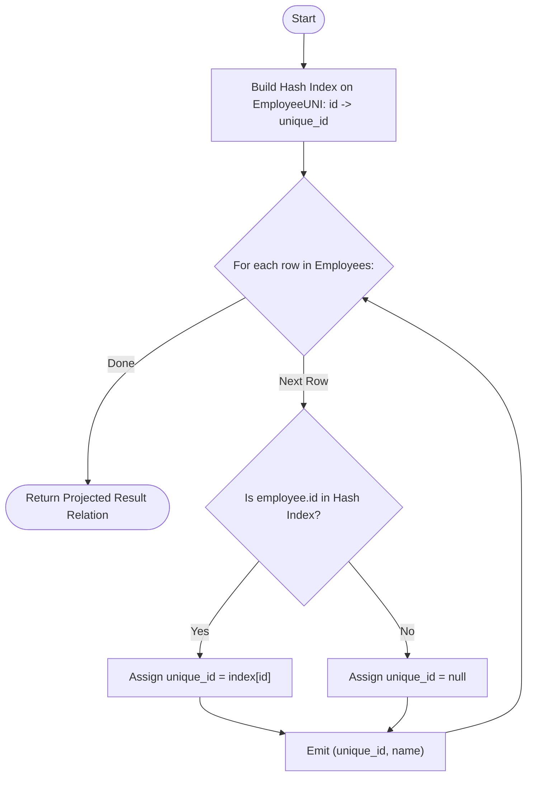

# Guided Example: Replace Employee ID With The Unique Identifier

We trace the step-by-step execution of the relational left outer join strategy on a representative database instance:

- **Input Tables:**
  - `Employees`:
    - `(1, "Alice")`
    - `(7, "Bob")`
    - `(11, "Meir")`
    - `(90, "Winston")`
    - `(3, "Jonathan")`
  - `EmployeeUNI`:
    - `(3, 1)`
    - `(11, 2)`
    - `(90, 3)`
- **Required Output:**
  - `(null, "Alice")`
  - `(1, "Jonathan")`
  - `(null, "Bob")`
  - `(2, "Meir")`
  - `(3, "Winston")`

This instance is chosen because it features employees with active unique identifiers alongside employees without registered identifiers, illustrating the preservation mechanics of relational left outer joins.

---

## 1. Instance & Teaching Goal

We are given two relational entities:
1. `Employees` with columns `id` (primary key) and `name`.
2. `EmployeeUNI` with columns `id` and `unique_id` (composite primary key `(id, unique_id)`).

Our objective is to display each employee's `unique_id` and corresponding `name`. If an employee lacks an entry in `EmployeeUNI`, the corresponding `unique_id` must be emitted as `null`.

Among the $5$ employee records:
- Alice ($1$) and Bob ($7$) have no matching identifier records in `EmployeeUNI`.
- Meir ($11$), Winston ($90$), and Jonathan ($3$) map to unique identifiers $2, 3$, and $1$ respectively.
- The output relation must preserve all $5$ employee names, pairing them with their matched unique identifier or a null placeholder.

The primary teaching goal is to model optional attribute attribution as a relational left outer join ($\bowtie_{\text{left}}$), contrasting its tuple preservation guarantees with inner joins that drop unmatched entities.

---

## 2. Conceptual Foundation & Invariants

In relational algebra, combining two relations while strictly preserving all tuples from the primary relation regardless of whether a join match exists is formalized by the left outer join operator:

$$
\mathcal{R} = \Pi_{\text{unique\_id}, \text{name}} \left( \text{Employees} \bowtie_{\text{left}, \text{Employees.id} = \text{EmployeeUNI.id}} \text{EmployeeUNI} \right)
$$

For each tuple $e \in \text{Employees}$:
1. If there exists $u \in \text{EmployeeUNI}$ such that $e[\text{id}] = u[\text{id}]$, emit tuple $\langle u[\text{unique\_id}], e[\text{name}] \rangle$.
2. If no such tuple exists in `EmployeeUNI`, emit tuple $\langle \text{null}, e[\text{name}] \rangle$.

```
Employees (Primary)         EmployeeUNI (Lookup)       Output Tuple
--------------------        --------------------       -------------------
(1,  "Alice")     ---+----> [No Match in UNI]     -->  (null, "Alice")
(7,  "Bob")       ---+----> [No Match in UNI]     -->  (null, "Bob")
(11, "Meir")      ---+----> Matches id 11: (11, 2) --> (2,    "Meir")
(90, "Winston")   ---+----> Matches id 90: (90, 3) --> (3,    "Winston")
(3,  "Jonathan")  ---+----> Matches id 3:  (3, 1)  --> (1,    "Jonathan")
```

We define relational tracking parameters for the join resolution:

| Parameter | Relational Representation | Purpose |
|---|---|---|
| Left Entity ($e$) | Tuple in $\text{Employees}$ | Base record whose name must be preserved |
| Key Probe ($e[\text{id}]$) | Primary key scalar | Looked up in index of $\text{EmployeeUNI}$ |
| Lookup Match | Tuple in $\text{EmployeeUNI}$ or $\emptyset$ | Supplies `unique_id` if present |
| Projected Result ($\mathcal{R}$) | Output relation | Accumulated tuples $\langle \text{unique\_id}, \text{name} \rangle$ |

> **Invariant.** For every tuple in $\text{Employees}$, exactly one output tuple is generated containing its `name`, augmented with the associated `unique_id` if found in `EmployeeUNI` and `null` otherwise.

---

## 3. Step-by-Step Worked Execution

### Step 1: Build Hash Lookup on Right Relation

An in-memory hash table is constructed over the lookup table `EmployeeUNI`, mapping each lookup `id` to its `unique_id`:

$$
\mathcal{M}_{\text{UNI}} = \{ 3 \mapsto 1, 11 \mapsto 2, 90 \mapsto 3 \}
$$

| Lookup Key (`id`) | Associated `unique_id` | Hash Entry Status |
|---|---|---|
| $3$ | $1$ | Stored in index |
| $11$ | $2$ | Stored in index |
| $90$ | $3$ | Stored in index |

---

### Step 2: Sequential Probe of Preserved Employees

We scan each employee tuple from $\text{Employees}$ and query the hash map $\mathcal{M}_{\text{UNI}}$:

1. **Employee (1, "Alice"):**
   - Probe key $1$ in $\mathcal{M}_{\text{UNI}}$: Absent.
   - Assign null for `unique_id`.
   - Emitted tuple: $\langle \text{null}, \text{"Alice"} \rangle$.

2. **Employee (7, "Bob"):**
   - Probe key $7$ in $\mathcal{M}_{\text{UNI}}$: Absent.
   - Assign null for `unique_id`.
   - Emitted tuple: $\langle \text{null}, \text{"Bob"} \rangle$.

3. **Employee (11, "Meir"):**
   - Probe key $11$ in $\mathcal{M}_{\text{UNI}}$: Found with value $2$.
   - Emitted tuple: $\langle 2, \text{"Meir"} \rangle$.

4. **Employee (90, "Winston"):**
   - Probe key $90$ in $\mathcal{M}_{\text{UNI}}$: Found with value $3$.
   - Emitted tuple: $\langle 3, \text{"Winston"} \rangle$.

5. **Employee (3, "Jonathan"):**
   - Probe key $3$ in $\mathcal{M}_{\text{UNI}}$: Found with value $1$.
   - Emitted tuple: $\langle 1, \text{"Jonathan"} \rangle$.

| Employee ID | Name | Lookup in $\mathcal{M}_{\text{UNI}}$ | Output `unique_id` | Projected Tuple |
|---|---|---|---|---|
| $1$ | Alice | Not found | `null` | `(null, "Alice")` |
| $7$ | Bob | Not found | `null` | `(null, "Bob")` |
| $11$ | Meir | Found ($2$) | $2$ | `(2, "Meir")` |
| $90$ | Winston | Found ($3$) | $3$ | `(3, "Winston")` |
| $3$ | Jonathan | Found ($1$) | $1$ | `(1, "Jonathan")` |

---

## 4. Complete Execution Trace

| Processing Order | Source Record | Join Key Match | Resolution Type | Emitted Tuple |
|---|---|---|---|---|
| Row 1 | `(1, "Alice")` | No match | Outer null extension | `(null, "Alice")` |
| Row 2 | `(7, "Bob")` | No match | Outer null extension | `(null, "Bob")` |
| Row 3 | `(11, "Meir")` | Matched $11 \mapsto 2$ | Attribute augmentation | `(2, "Meir")` |
| Row 4 | `(90, "Winston")` | Matched $90 \mapsto 3$ | Attribute augmentation | `(3, "Winston")` |
| Row 5 | `(3, "Jonathan")` | Matched $3 \mapsto 1$ | Attribute augmentation | `(1, "Jonathan")` |

---

## 5. Algorithmic Correctness & Complexity Derivation

### Relational Equivalence

The problem specification requires all employees to be retained while enriching records with optional external attributes.
- An inner equi-join $\text{Employees} \bowtie \text{EmployeeUNI}$ drops tuples from $\text{Employees}$ that lack a matching key, incorrectly omitting Alice and Bob.
- A right outer join $\text{Employees} \bowtie_{\text{right}} \text{EmployeeUNI}$ would preserve identifiers that may not correspond to any valid employee.
- The left outer join $\text{Employees} \bowtie_{\text{left}} \text{EmployeeUNI}$ strictly preserves every tuple of the base employee table and substitutes null for missing right-side values, matching the exact requirement.

### Asymptotic Complexity

- **Time Complexity:** $\mathcal{O}(|\text{Employees}| + |\text{EmployeeUNI}|)$. Building the hash table of the lookup relation requires a single pass of size $|\text{EmployeeUNI}|$. Probing the table takes $\mathcal{O}(1)$ average time per employee record across $|\text{Employees}|$ rows.
- **Auxiliary Space Complexity:** $\mathcal{O}(|\text{EmployeeUNI}|)$. Storing the hash lookup directory requires memory proportional to the number of distinct unique identifier mappings.

---

## 6. Traps & Edge Cases

- **Inner Join Fallacy:** Using an inner join discards employees without unique identifiers, violating the core specification.
- **Null Value Distinctions:** Unmatched values must resolve to relational null representations rather than string literals like `"None"` or empty values.
- **Unreferenced Identifiers:** If `EmployeeUNI` contains keys not present in `Employees`, they must not be projected because the employee entity is the preserving relation.
- **Arbitrary Ordering:** Unless an explicit order clause is specified by the relational engine, result tuples may be emitted in any valid order.

---

## 7. Accessible Mermaid Diagram


